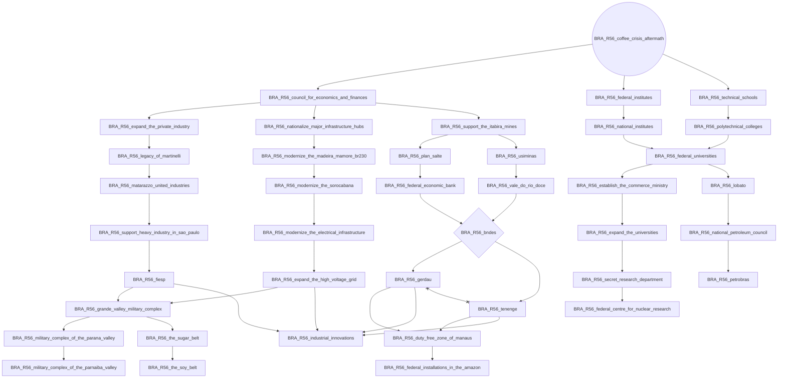
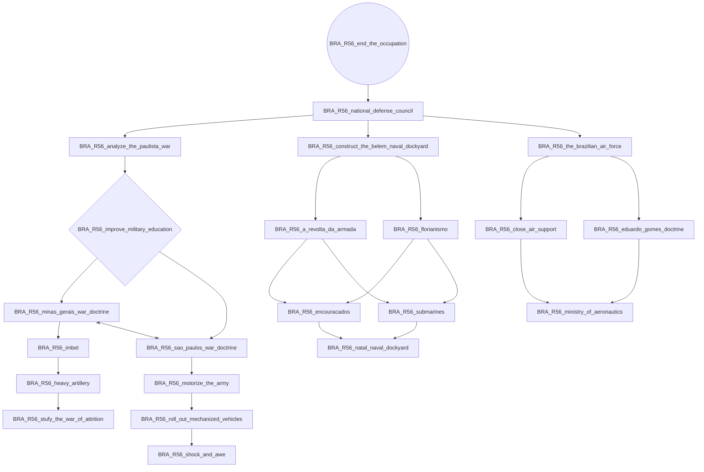
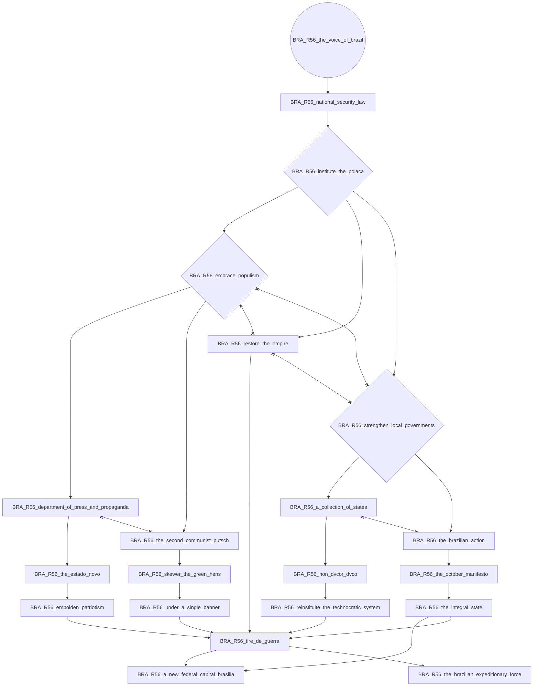
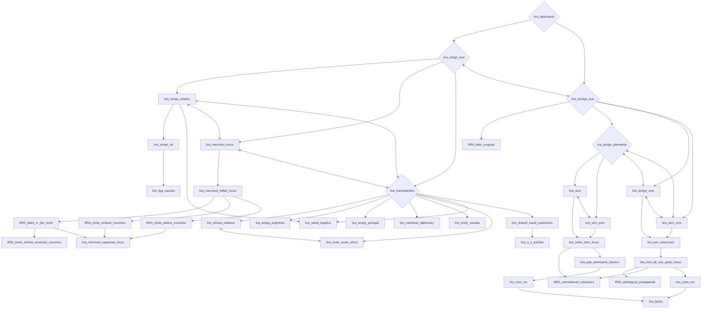

# BRA_R56_coffee_crisis_aftermath

```mermaid
flowchart TD
    n1{"BRA_R56_bndes"}
    n2(("BRA_R56_coffee_crisis_aftermath"))
    n3["BRA_R56_council_for_economics_and_finances"]
    n4["BRA_R56_duty_free_zone_of_manaus"]
    n5["BRA_R56_establish_the_commerce_ministry"]
    n6["BRA_R56_expand_the_high_voltage_grid"]
    n7["BRA_R56_expand_the_private_industry"]
    n8["BRA_R56_expand_the_universities"]
    n9["BRA_R56_federal_centre_for_nuclear_research"]
    n10["BRA_R56_federal_economic_bank"]
    n11["BRA_R56_federal_installations_in_the_amazon"]
    n12["BRA_R56_federal_institutes"]
    n13["BRA_R56_federal_universities"]
    n14["BRA_R56_fiesp"]
    n15["BRA_R56_gerdau"]
    n16["BRA_R56_grande_valley_military_complex"]
    n17["BRA_R56_industrial_innovations"]
    n18["BRA_R56_legacy_of_martinelli"]
    n19["BRA_R56_lobato"]
    n20["BRA_R56_matarazzo_united_industries"]
    n21["BRA_R56_military_complex_of_the_parana_valley"]
    n22["BRA_R56_military_complex_of_the_parnaiba_valley"]
    n23["BRA_R56_modernize_the_electrical_infrastructure"]
    n24["BRA_R56_modernize_the_madeira_mamore_br230"]
    n25["BRA_R56_modernize_the_sorocabana"]
    n26["BRA_R56_national_institutes"]
    n27["BRA_R56_national_petroleum_council"]
    n28["BRA_R56_nationalize_major_infrastructure_hubs"]
    n29["BRA_R56_petrobras"]
    n30["BRA_R56_plan_salte"]
    n31["BRA_R56_polytechnical_colleges"]
    n32["BRA_R56_secret_research_department"]
    n33["BRA_R56_support_heavy_industry_in_sao_paulo"]
    n34["BRA_R56_support_the_itabira_mines"]
    n35["BRA_R56_technical_schools"]
    n36["BRA_R56_tenenge"]
    n37["BRA_R56_the_soy_belt"]
    n38["BRA_R56_the_sugar_belt"]
    n39["BRA_R56_usiminas"]
    n40["BRA_R56_vale_do_rio_doce"]
    n40 --> n1
    n10 --> n1
    n2 --> n3
    n36 --> n4
    n15 --> n4
    n13 --> n5
    n23 --> n6
    n3 --> n7
    n5 --> n8
    n32 --> n9
    n30 --> n10
    n4 --> n11
    n2 --> n12
    n26 --> n13
    n31 --> n13
    n33 --> n14
    n1 --> n15
    n6 --> n16
    n14 --> n16
    n36 --> n17
    n15 --> n17
    n14 --> n17
    n6 --> n17
    n7 --> n18
    n13 --> n19
    n18 --> n20
    n16 --> n21
    n21 --> n22
    n25 --> n23
    n28 --> n24
    n24 --> n25
    n12 --> n26
    n19 --> n27
    n3 --> n28
    n27 --> n29
    n34 --> n30
    n35 --> n31
    n8 --> n32
    n20 --> n33
    n3 --> n34
    n2 --> n35
    n1 --> n36
    n38 --> n37
    n16 --> n38
    n34 --> n39
    n39 --> n40
    n15 x--x n36
```

# BRA_R56_end_the_occupation

```mermaid
flowchart TD
    n41["BRA_R56_a_revolta_da_armada"]
    n42["BRA_R56_analyze_the_paulista_war"]
    n43["BRA_R56_close_air_support"]
    n44["BRA_R56_construct_the_belem_naval_dockyard"]
    n45["BRA_R56_eduardo_gomes_doctrine"]
    n46["BRA_R56_encouracados"]
    n47(("BRA_R56_end_the_occupation"))
    n48["BRA_R56_florianismo"]
    n49["BRA_R56_heavy_artillery"]
    n50["BRA_R56_imbel"]
    n51{"BRA_R56_improve_military_education"}
    n52["BRA_R56_minas_gerais_war_doctrine"]
    n53["BRA_R56_ministry_of_aeronautics"]
    n54["BRA_R56_motorize_the_army"]
    n55["BRA_R56_natal_naval_dockyard"]
    n56["BRA_R56_national_defense_council"]
    n57["BRA_R56_roll_out_mechanized_vehicles"]
    n58["BRA_R56_sao_paulos_war_doctrine"]
    n59["BRA_R56_shock_and_awe"]
    n60["BRA_R56_stufy_the_war_of_attrition"]
    n61["BRA_R56_submarines"]
    n62["BRA_R56_the_brazilian_air_force"]
    n44 --> n41
    n56 --> n42
    n62 --> n43
    n56 --> n44
    n62 --> n45
    n41 --> n46
    n48 --> n46
    n44 --> n48
    n50 --> n49
    n52 --> n50
    n42 --> n51
    n51 --> n52
    n45 --> n53
    n43 --> n53
    n58 --> n54
    n46 --> n55
    n61 --> n55
    n47 --> n56
    n54 --> n57
    n51 --> n58
    n57 --> n59
    n49 --> n60
    n41 --> n61
    n48 --> n61
    n56 --> n62
    n52 x--x n58
```

# BRA_R56_the_voice_of_brazil

```mermaid
flowchart TD
    n63["BRA_R56_a_collection_of_states"]
    n64["BRA_R56_a_new_federal_capital_brasilia"]
    n65["BRA_R56_department_of_press_and_propaganda"]
    n66["BRA_R56_embolden_patriotism"]
    n67{"BRA_R56_embrace_populism"}
    n68{"BRA_R56_institute_the_polaca"}
    n69["BRA_R56_national_security_law"]
    n70["BRA_R56_non_dvcor_dvco"]
    n71["BRA_R56_reinstituite_the_technocratic_system"]
    n72["BRA_R56_restore_the_empire"]
    n73["BRA_R56_skewer_the_green_hens"]
    n74{"BRA_R56_strengthen_local_governments"}
    n75["BRA_R56_the_brazilian_action"]
    n76["BRA_R56_the_brazilian_expeditionary_force"]
    n77["BRA_R56_the_estado_novo"]
    n78["BRA_R56_the_integral_state"]
    n79["BRA_R56_the_october_manifesto"]
    n80["BRA_R56_the_second_communist_putsch"]
    n81(("BRA_R56_the_voice_of_brazil"))
    n82["BRA_R56_tire_de_guerra"]
    n83["BRA_R56_under_a_single_banner"]
    n74 --> n63
    n82 --> n64
    n78 --> n64
    n67 --> n65
    n77 --> n66
    n68 --> n67
    n69 --> n68
    n81 --> n69
    n63 --> n70
    n70 --> n71
    n68 --> n72
    n80 --> n73
    n68 --> n74
    n74 --> n75
    n82 --> n76
    n65 --> n77
    n79 --> n78
    n75 --> n79
    n67 --> n80
    n66 --> n82
    n71 --> n82
    n72 --> n82
    n78 --> n82
    n83 --> n82
    n73 --> n83
    n63 x--x n75
    n65 x--x n80
    n67 x--x n72
    n67 x--x n74
    n72 x--x n74
```

# bra_diplomacia

```mermaid
flowchart TD
    n84["BRA_allies_in_the_north"]
    n85["BRA_ideological_propaganda"]
    n86["BRA_international_volunteers"]
    n87["BRA_invite_andean_countries"]
    n88["BRA_invite_central_american_countries"]
    n89["BRA_invite_platine_countries"]
    n90["BRA_take_uruguay"]
    n91["bra_a_s_warfare"]
    n92["bra_african_initiative"]
    n93{"bra_amigo_alemanha"}
    n94["bra_amigo_aliados"]
    n95["bra_amigo_argentina"]
    n96{"bra_amigo_eua"}
    n97["bra_amigo_portugal"]
    n98["bra_amigo_uk"]
    n99["bra_amigo_urss"]
    n100["bra_basta"]
    n101["bra_carribean_diplomacy"]
    n102["bra_cuba_rev"]
    n103{"bra_diplomacia"}
    n104["bra_eixo"]
    n105["bra_foro_de_sao_paulo_focus"]
    n106{"bra_inimigo_eua"}
    n107["bra_invite_canada"]
    n108["bra_invite_south_africa"]
    n109["bra_liga_nacoes"]
    n110["bra_mercosul_expansao_focus"]
    n111["bra_mercosul_focus"]
    n112["bra_mercosul_militar_focus"]
    n113["bra_mex_rev"]
    n114["bra_naval_logistics"]
    n115["bra_pan_americano"]
    n116["bra_pan_americano_fascism"]
    n117["bra_sem_eixo"]
    n118["bra_sem_urss"]
    n119["bra_shared_naval_experience"]
    n120["bra_strike_dem_focus"]
    n121{"bra_transatlantico"}
    n112 --> n84
    n105 --> n85
    n105 --> n86
    n120 --> n86
    n112 --> n87
    n84 --> n88
    n112 --> n89
    n106 --> n90
    n119 --> n91
    n121 --> n92
    n106 --> n93
    n96 --> n94
    n121 --> n95
    n103 --> n96
    n121 --> n97
    n94 --> n98
    n106 --> n99
    n113 --> n100
    n102 --> n100
    n121 --> n101
    n105 --> n102
    n93 --> n104
    n115 --> n105
    n103 --> n106
    n121 --> n107
    n121 --> n108
    n98 --> n109
    n89 --> n110
    n87 --> n110
    n84 --> n110
    n96 --> n111
    n111 --> n112
    n116 --> n113
    n121 --> n114
    n94 --> n114
    n118 --> n115
    n99 --> n115
    n120 --> n116
    n93 --> n117
    n106 --> n118
    n121 --> n119
    n117 --> n120
    n104 --> n120
    n96 --> n121
    n92 x--x n108
    n93 x--x n99
    n93 x--x n118
    n94 x--x n111
    n94 x--x n121
    n96 x--x n106
    n99 x--x n118
    n104 x--x n117
    n111 x--x n121
```
