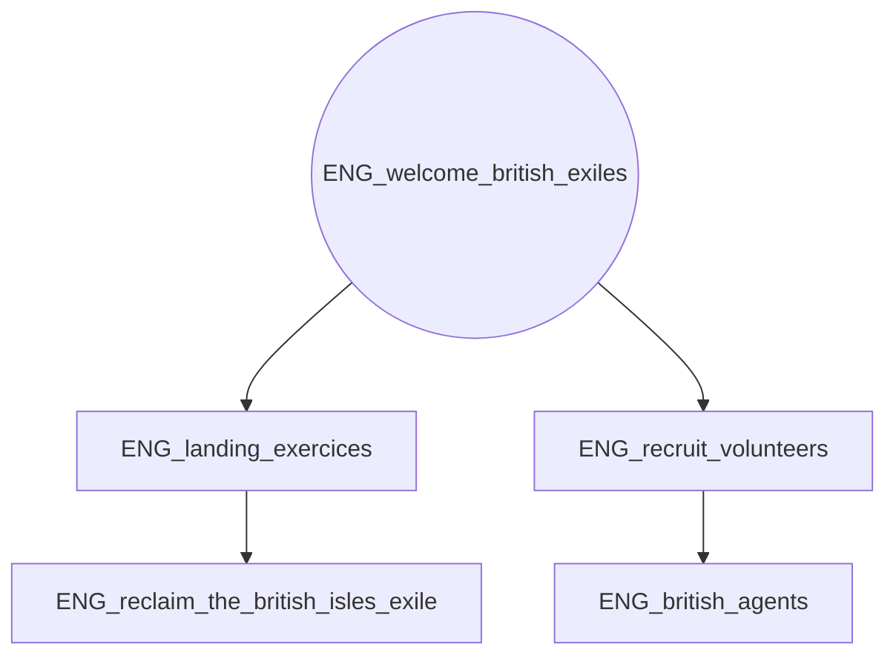

# ENG_welcome_british_exiles

```mermaid
flowchart TD
    n1["ENG_british_agents"]
    n2["ENG_landing_exercices"]
    n3["ENG_reclaim_the_british_isles_exile"]
    n4["ENG_recruit_volunteers"]
    n5(("ENG_welcome_british_exiles"))
    n4 --> n1
    n5 --> n2
    n2 --> n3
    n5 --> n4
```
