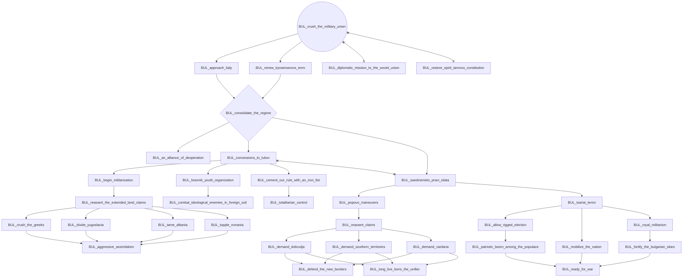
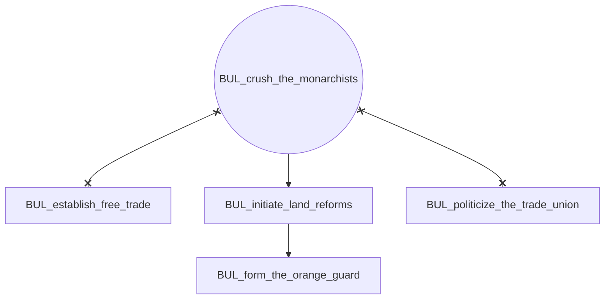
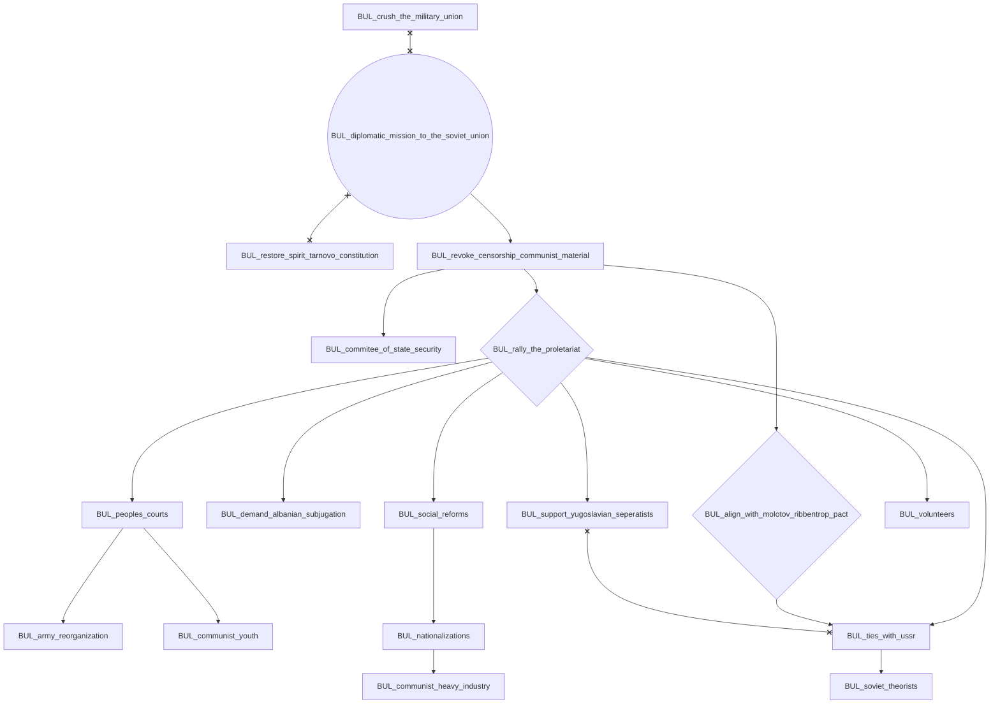
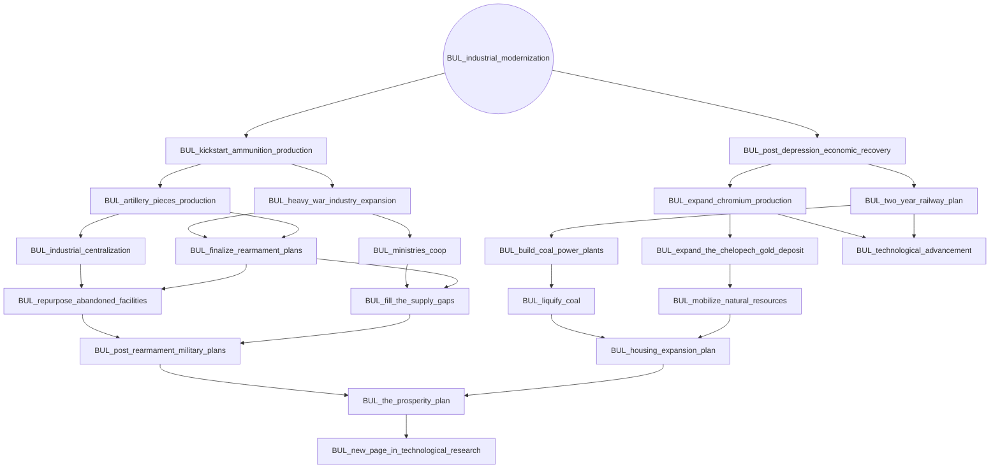
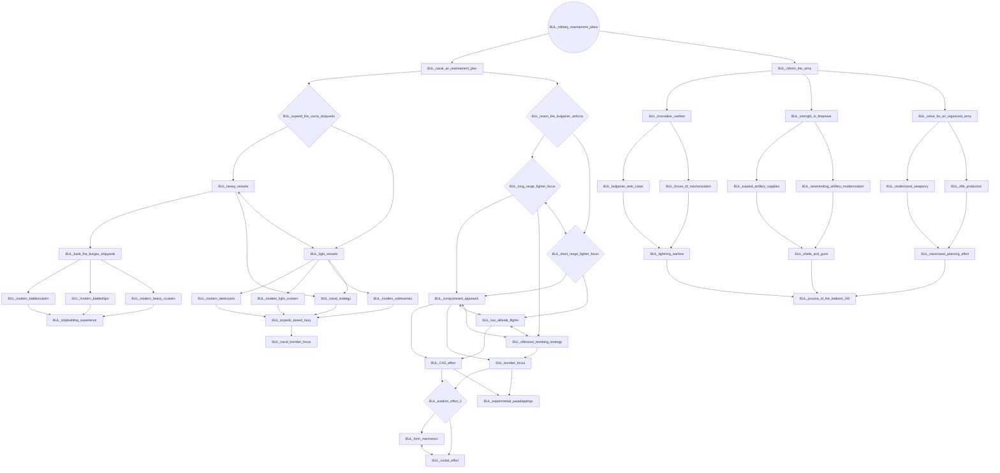
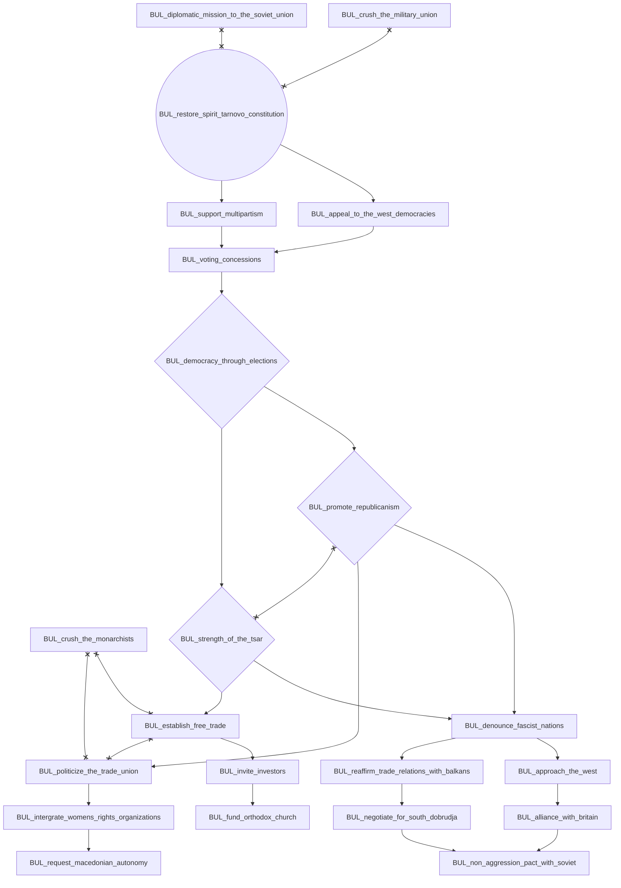

# BUL_crush_the_military_union

# BUL_crush_the_monarchists

# BUL_diplomatic_mission_to_the_soviet_union

# BUL_industrial_modernization

# BUL_military_rearmament_plans

# BUL_restore_spirit_tarnovo_constitution

