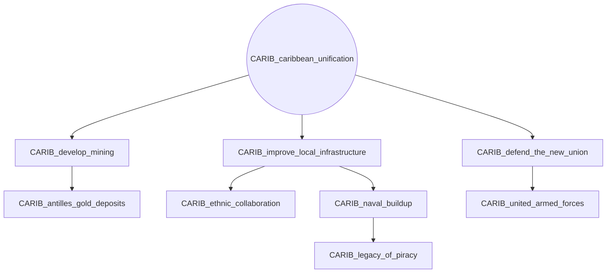

# CARIB_caribbean_unification

```mermaid
flowchart TD
    n1["CARIB_antilles_gold_deposits"]
    n2(("CARIB_caribbean_unification"))
    n3["CARIB_defend_the_new_union"]
    n4["CARIB_develop_mining"]
    n5["CARIB_ethnic_collaboration"]
    n6["CARIB_improve_local_infrastructure"]
    n7["CARIB_legacy_of_piracy"]
    n8["CARIB_naval_buildup"]
    n9["CARIB_united_armed_forces"]
    n4 --> n1
    n2 --> n3
    n2 --> n4
    n6 --> n5
    n2 --> n6
    n8 --> n7
    n6 --> n8
    n3 --> n9
```
