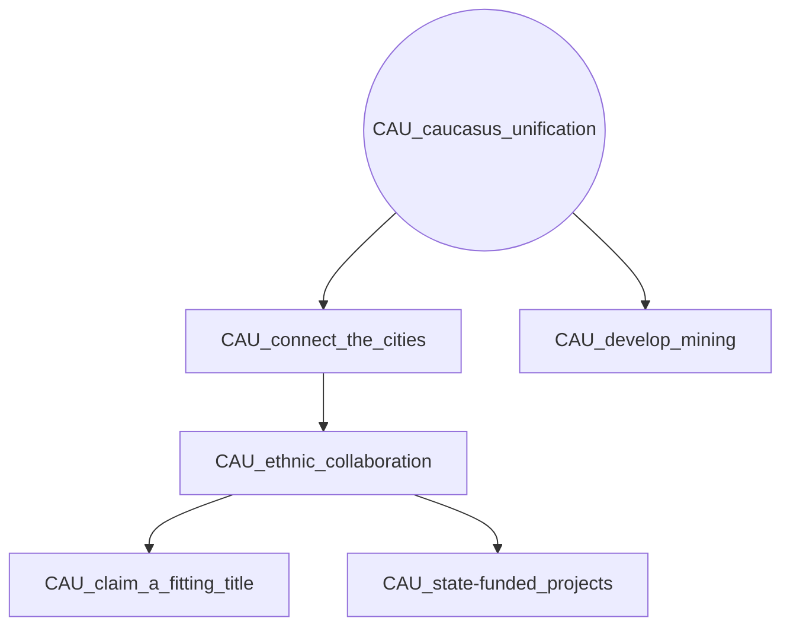

# CAU_caucasus_unification

```mermaid
flowchart TD
    n1(("CAU_caucasus_unification"))
    n2["CAU_claim_a_fitting_title"]
    n3["CAU_connect_the_cities"]
    n4["CAU_develop_mining"]
    n5["CAU_ethnic_collaboration"]
    n6["CAU_state-funded_projects"]
    n5 --> n2
    n1 --> n3
    n1 --> n4
    n3 --> n5
    n5 --> n6
```
