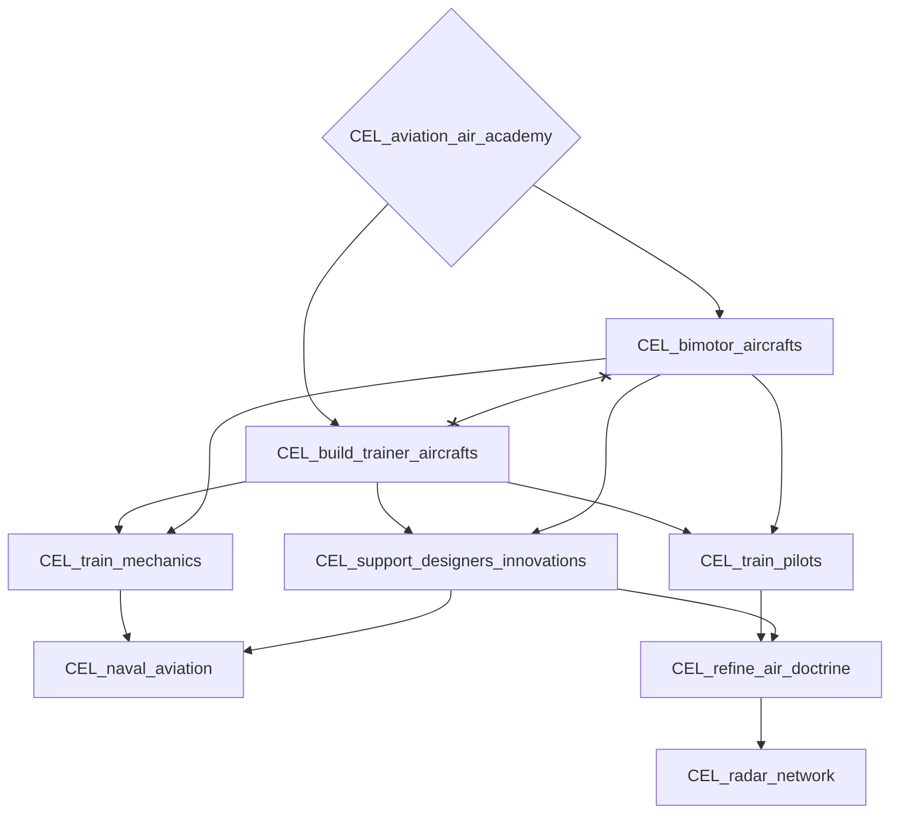
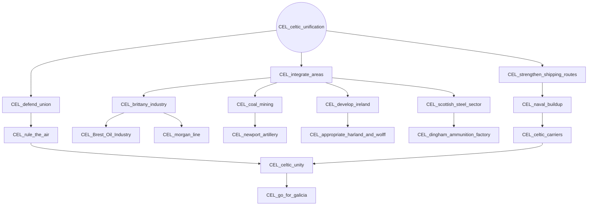
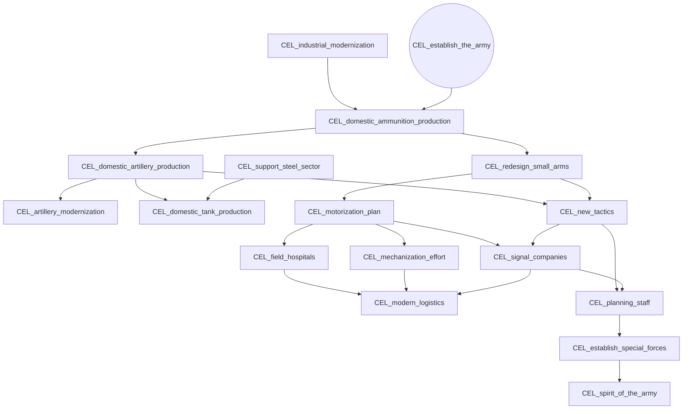
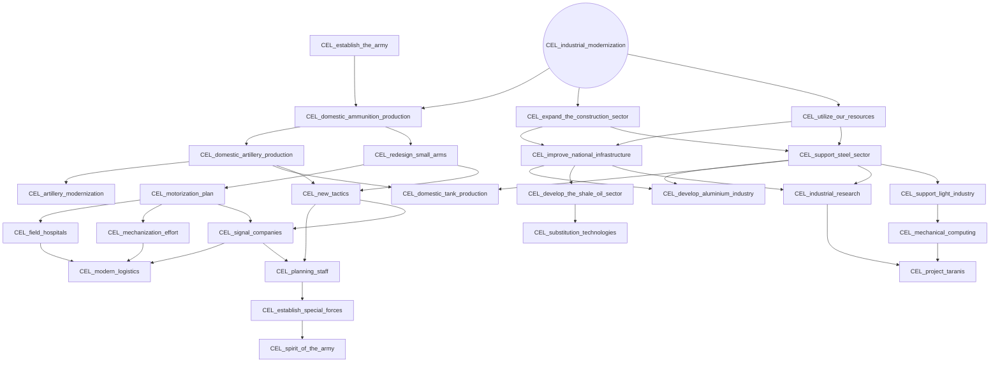
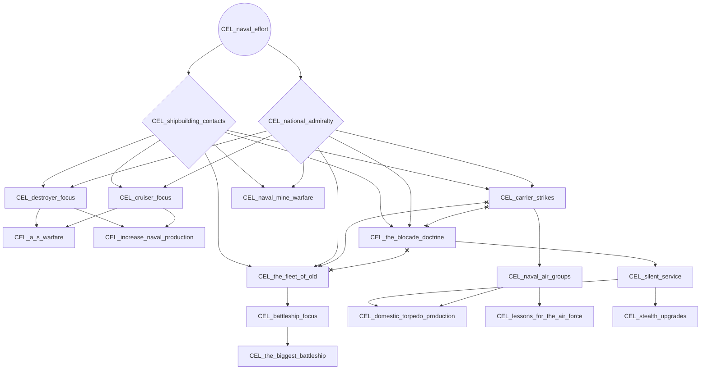

# CEL_aviation_air_academy

```mermaid
flowchart TD
    n1{"CEL_aviation_air_academy"}
    n2["CEL_bimotor_aircrafts"]
    n3["CEL_build_trainer_aircrafts"]
    n4["CEL_naval_aviation"]
    n5["CEL_radar_network"]
    n6["CEL_refine_air_doctrine"]
    n7["CEL_support_designers_innovations"]
    n8["CEL_train_mechanics"]
    n9["CEL_train_pilots"]
    n1 --> n2
    n1 --> n3
    n8 --> n4
    n7 --> n4
    n6 --> n5
    n9 --> n6
    n7 --> n6
    n3 --> n7
    n2 --> n7
    n3 --> n8
    n2 --> n8
    n3 --> n9
    n2 --> n9
    n2 x--x n3
```

# CEL_celtic_unification

```mermaid
flowchart TD
    n10["CEL_Brest_Oil_Industry"]
    n11["CEL_appropriate_harland_and_wolff"]
    n12["CEL_brittany_industry"]
    n13["CEL_celtic_carriers"]
    n14(("CEL_celtic_unification"))
    n15["CEL_celtic_unity"]
    n16["CEL_coal_mining"]
    n17["CEL_defend_union"]
    n18["CEL_develop_ireland"]
    n19["CEL_dingham_ammunition_factory"]
    n20["CEL_go_for_galicia"]
    n21["CEL_integrate_areas"]
    n22["CEL_morgan_line"]
    n23["CEL_naval_buildup"]
    n24["CEL_newport_artillery"]
    n25["CEL_rule_the_air"]
    n26["CEL_scottish_steel_sector"]
    n27["CEL_strengthen_shipping_routes"]
    n12 --> n10
    n18 --> n11
    n21 --> n12
    n23 --> n13
    n25 --> n15
    n13 --> n15
    n21 --> n16
    n14 --> n17
    n21 --> n18
    n26 --> n19
    n15 --> n20
    n14 --> n21
    n12 --> n22
    n27 --> n23
    n16 --> n24
    n17 --> n25
    n21 --> n26
    n14 --> n27
```

# CEL_establish_the_army

```mermaid
flowchart TD
    n28["CEL_artillery_modernization"]
    n29["CEL_domestic_ammunition_production"]
    n30["CEL_domestic_artillery_production"]
    n31["CEL_domestic_tank_production"]
    n32["CEL_establish_special_forces"]
    n33(("CEL_establish_the_army"))
    n34["CEL_field_hospitals"]
    n35["CEL_industrial_modernization"]
    n36["CEL_mechanization_effort"]
    n37["CEL_modern_logistics"]
    n38["CEL_motorization_plan"]
    n39["CEL_new_tactics"]
    n40["CEL_planning_staff"]
    n41["CEL_redesign_small_arms"]
    n42["CEL_signal_companies"]
    n43["CEL_spirit_of_the_army"]
    n44["CEL_support_steel_sector"]
    n30 --> n28
    n35 --> n29
    n33 --> n29
    n29 --> n30
    n30 --> n31
    n44 --> n31
    n40 --> n32
    n38 --> n34
    n38 --> n36
    n34 --> n37
    n36 --> n37
    n42 --> n37
    n41 --> n38
    n30 --> n39
    n41 --> n39
    n39 --> n40
    n42 --> n40
    n29 --> n41
    n38 --> n42
    n39 --> n42
    n32 --> n43
```

# CEL_industrial_modernization

```mermaid
flowchart TD
    n28["CEL_artillery_modernization"]
    n45["CEL_develop_aluminium_industry"]
    n46["CEL_develop_the_shale_oil_sector"]
    n29["CEL_domestic_ammunition_production"]
    n30["CEL_domestic_artillery_production"]
    n31["CEL_domestic_tank_production"]
    n32["CEL_establish_special_forces"]
    n33["CEL_establish_the_army"]
    n47["CEL_expand_the_construction_sector"]
    n34["CEL_field_hospitals"]
    n48["CEL_improve_national_infrastructure"]
    n35(("CEL_industrial_modernization"))
    n49["CEL_industrial_research"]
    n50["CEL_mechanical_computing"]
    n36["CEL_mechanization_effort"]
    n37["CEL_modern_logistics"]
    n38["CEL_motorization_plan"]
    n39["CEL_new_tactics"]
    n40["CEL_planning_staff"]
    n51["CEL_project_taranis"]
    n41["CEL_redesign_small_arms"]
    n42["CEL_signal_companies"]
    n43["CEL_spirit_of_the_army"]
    n52["CEL_substitution_technologies"]
    n53["CEL_support_light_industry"]
    n44["CEL_support_steel_sector"]
    n54["CEL_utilize_our_resources"]
    n30 --> n28
    n44 --> n45
    n48 --> n45
    n48 --> n46
    n35 --> n29
    n33 --> n29
    n29 --> n30
    n30 --> n31
    n44 --> n31
    n40 --> n32
    n35 --> n47
    n38 --> n34
    n54 --> n48
    n47 --> n48
    n48 --> n49
    n44 --> n49
    n53 --> n50
    n38 --> n36
    n34 --> n37
    n36 --> n37
    n42 --> n37
    n41 --> n38
    n30 --> n39
    n41 --> n39
    n39 --> n40
    n42 --> n40
    n50 --> n51
    n49 --> n51
    n29 --> n41
    n38 --> n42
    n39 --> n42
    n32 --> n43
    n46 --> n52
    n44 --> n53
    n54 --> n44
    n47 --> n44
    n35 --> n54
```

# CEL_naval_effort

```mermaid
flowchart TD
    n55["CEL_a_s_warfare"]
    n56["CEL_battleship_focus"]
    n57["CEL_carrier_strikes"]
    n58["CEL_cruiser_focus"]
    n59["CEL_destroyer_focus"]
    n60["CEL_domestic_torpedo_production"]
    n61["CEL_increase_naval_production"]
    n62["CEL_lessons_for_the_air_force"]
    n63{"CEL_national_admiralty"}
    n64["CEL_naval_air_groups"]
    n65(("CEL_naval_effort"))
    n66["CEL_naval_mine_warfare"]
    n67{"CEL_shipbuilding_contacts"}
    n68["CEL_silent_service"]
    n69["CEL_stealth_upgrades"]
    n70["CEL_the_biggest_battleship"]
    n71["CEL_the_blocade_doctrine"]
    n72["CEL_the_fleet_of_old"]
    n59 --> n55
    n58 --> n55
    n72 --> n56
    n67 --> n57
    n63 --> n57
    n67 --> n58
    n63 --> n58
    n67 --> n59
    n63 --> n59
    n68 --> n60
    n64 --> n60
    n59 --> n61
    n58 --> n61
    n64 --> n62
    n65 --> n63
    n57 --> n64
    n67 --> n66
    n63 --> n66
    n65 --> n67
    n71 --> n68
    n68 --> n69
    n56 --> n70
    n67 --> n71
    n63 --> n71
    n67 --> n72
    n63 --> n72
    n57 x--x n71
    n57 x--x n72
    n71 x--x n72
```
