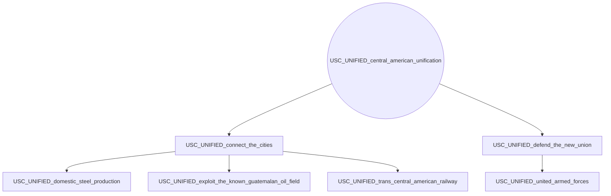

# USC_UNIFIED_central_american_unification

```mermaid
flowchart TD
    n1(("USC_UNIFIED_central_american_unification"))
    n2["USC_UNIFIED_connect_the_cities"]
    n3["USC_UNIFIED_defend_the_new_union"]
    n4["USC_UNIFIED_domestic_steel_production"]
    n5["USC_UNIFIED_exploit_the_known_guatemalan_oil_field"]
    n6["USC_UNIFIED_trans_central_american_railway"]
    n7["USC_UNIFIED_united_armed_forces"]
    n1 --> n2
    n1 --> n3
    n2 --> n4
    n2 --> n5
    n2 --> n6
    n3 --> n7
```
