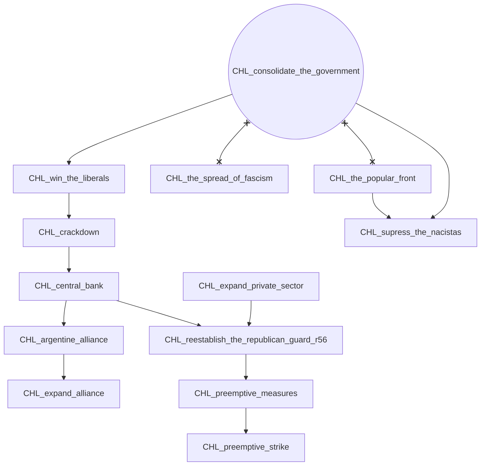
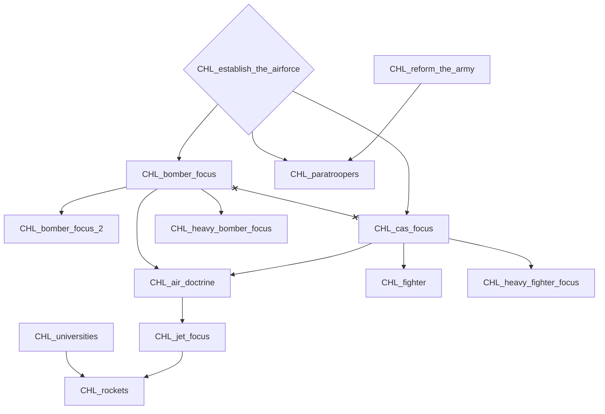
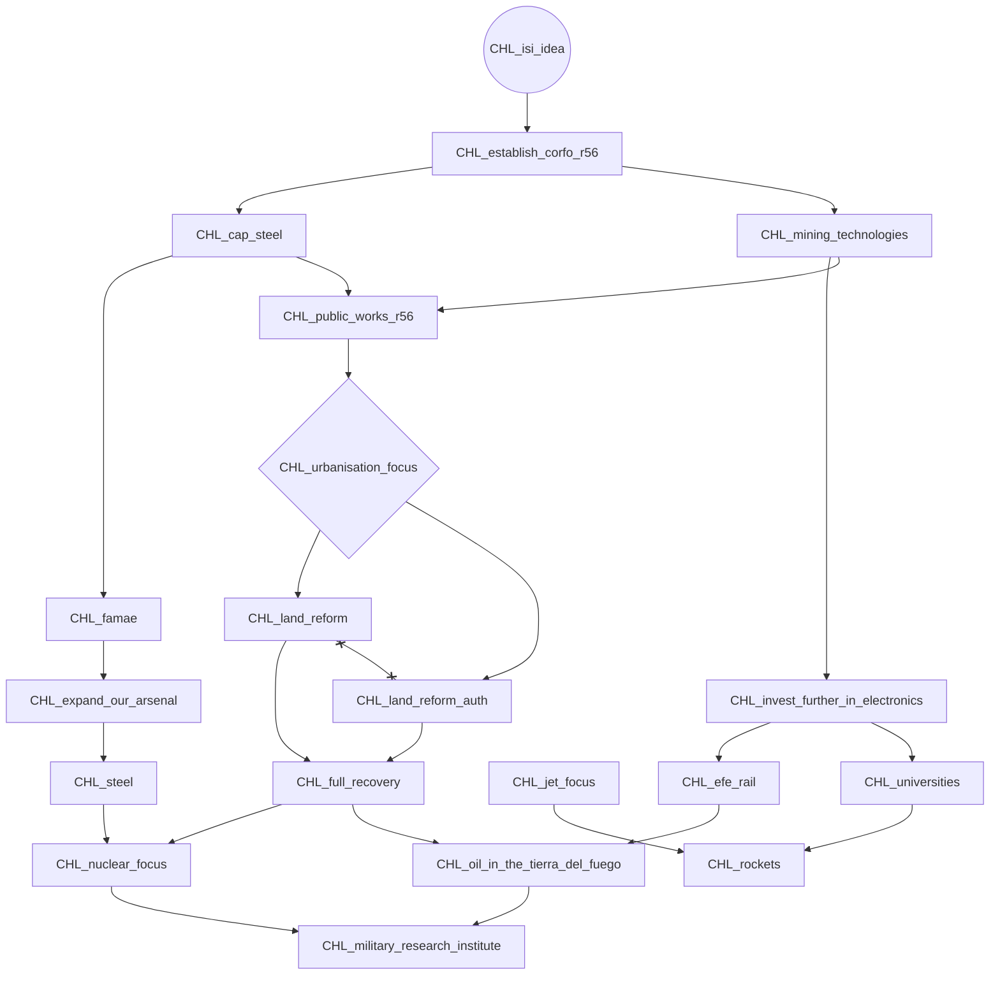
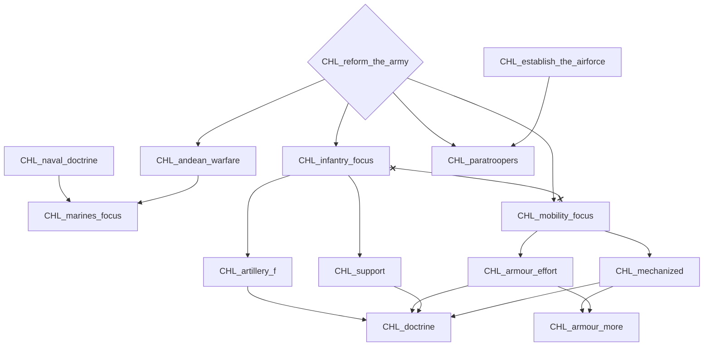
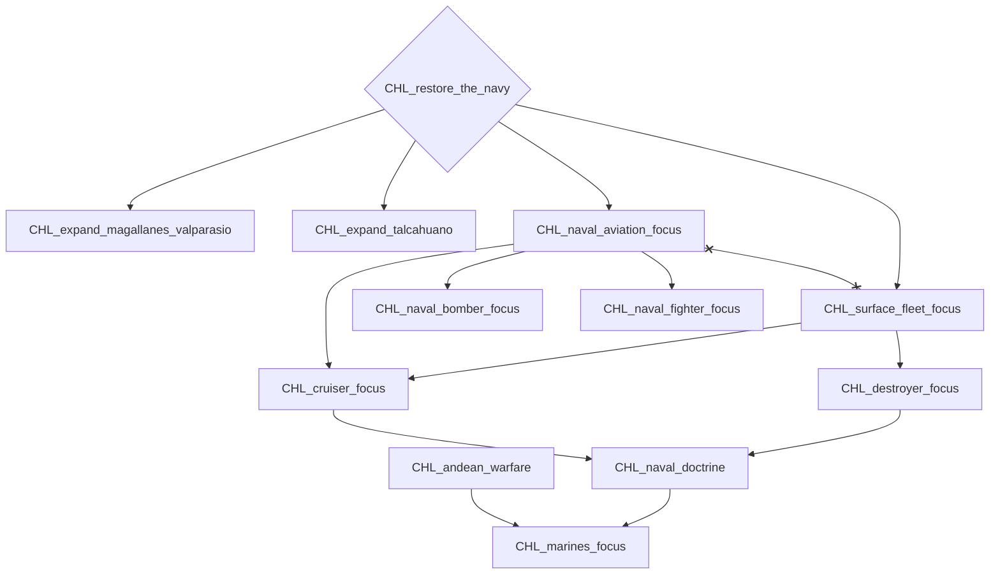
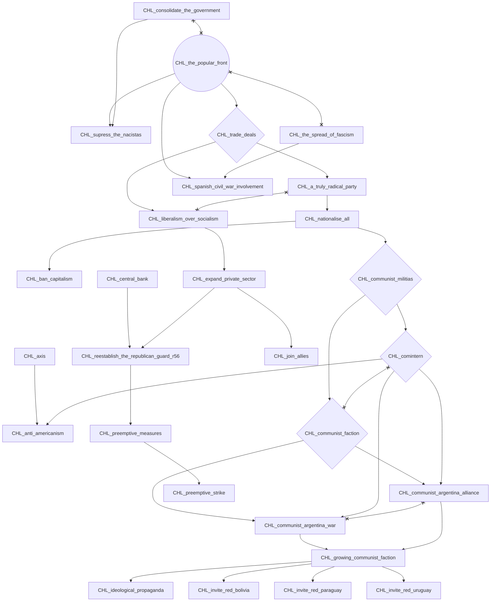
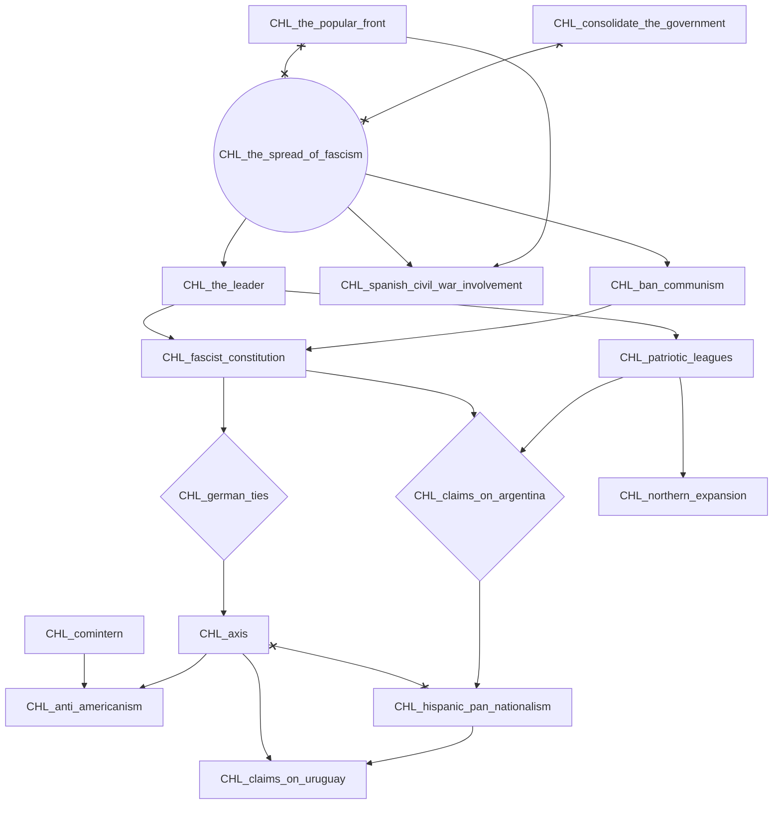

# CHL_consolidate_the_government

```mermaid
flowchart TD
    n1["CHL_argentine_alliance"]
    n2["CHL_central_bank"]
    n3(("CHL_consolidate_the_government"))
    n4["CHL_crackdown"]
    n5["CHL_expand_alliance"]
    n6["CHL_expand_private_sector"]
    n7["CHL_preemptive_measures"]
    n8["CHL_preemptive_strike"]
    n9["CHL_reestablish_the_republican_guard_r56"]
    n10["CHL_supress_the_nacistas"]
    n11["CHL_the_popular_front"]
    n12["CHL_the_spread_of_fascism"]
    n13["CHL_win_the_liberals"]
    n2 --> n1
    n4 --> n2
    n13 --> n4
    n1 --> n5
    n9 --> n7
    n7 --> n8
    n2 --> n9
    n6 --> n9
    n11 --> n10
    n3 --> n10
    n3 --> n13
    n3 x--x n11
    n3 x--x n12
```

# CHL_establish_the_airforce

```mermaid
flowchart TD
    n14["CHL_air_doctrine"]
    n15["CHL_bomber_focus"]
    n16["CHL_bomber_focus_2"]
    n17["CHL_cas_focus"]
    n18{"CHL_establish_the_airforce"}
    n19["CHL_fighter"]
    n20["CHL_heavy_bomber_focus"]
    n21["CHL_heavy_fighter_focus"]
    n22["CHL_jet_focus"]
    n23["CHL_paratroopers"]
    n24["CHL_reform_the_army"]
    n25["CHL_rockets"]
    n26["CHL_universities"]
    n17 --> n14
    n15 --> n14
    n18 --> n15
    n15 --> n16
    n18 --> n17
    n17 --> n19
    n15 --> n20
    n17 --> n21
    n14 --> n22
    n24 --> n23
    n18 --> n23
    n22 --> n25
    n26 --> n25
    n15 x--x n17
```

# CHL_isi_idea

```mermaid
flowchart TD
    n27["CHL_cap_steel"]
    n28["CHL_efe_rail"]
    n29["CHL_establish_corfo_r56"]
    n30["CHL_expand_our_arsenal"]
    n31["CHL_famae"]
    n32["CHL_full_recovery"]
    n33["CHL_invest_further_in_electronics"]
    n34(("CHL_isi_idea"))
    n22["CHL_jet_focus"]
    n35["CHL_land_reform"]
    n36["CHL_land_reform_auth"]
    n37["CHL_military_research_institute"]
    n38["CHL_mining_technologies"]
    n39["CHL_nuclear_focus"]
    n40["CHL_oil_in_the_tierra_del_fuego"]
    n41["CHL_public_works_r56"]
    n25["CHL_rockets"]
    n42["CHL_steel"]
    n26["CHL_universities"]
    n43{"CHL_urbanisation_focus"}
    n29 --> n27
    n33 --> n28
    n34 --> n29
    n31 --> n30
    n27 --> n31
    n35 --> n32
    n36 --> n32
    n38 --> n33
    n43 --> n35
    n43 --> n36
    n39 --> n37
    n40 --> n37
    n29 --> n38
    n32 --> n39
    n42 --> n39
    n28 --> n40
    n32 --> n40
    n38 --> n41
    n27 --> n41
    n22 --> n25
    n26 --> n25
    n30 --> n42
    n33 --> n26
    n41 --> n43
    n35 x--x n36
```

# CHL_reform_the_army

```mermaid
flowchart TD
    n44["CHL_andean_warfare"]
    n45["CHL_armour_effort"]
    n46["CHL_armour_more"]
    n47["CHL_artillery_f"]
    n48["CHL_doctrine"]
    n18["CHL_establish_the_airforce"]
    n49["CHL_infantry_focus"]
    n50["CHL_marines_focus"]
    n51["CHL_mechanized"]
    n52["CHL_mobility_focus"]
    n53["CHL_naval_doctrine"]
    n23["CHL_paratroopers"]
    n24{"CHL_reform_the_army"}
    n54["CHL_support"]
    n24 --> n44
    n52 --> n45
    n51 --> n46
    n45 --> n46
    n49 --> n47
    n47 --> n48
    n45 --> n48
    n54 --> n48
    n51 --> n48
    n24 --> n49
    n53 --> n50
    n44 --> n50
    n52 --> n51
    n24 --> n52
    n24 --> n23
    n18 --> n23
    n49 --> n54
    n49 x--x n52
```

# CHL_restore_the_navy

```mermaid
flowchart TD
    n44["CHL_andean_warfare"]
    n55["CHL_cruiser_focus"]
    n56["CHL_destroyer_focus"]
    n57["CHL_expand_magallanes_valparasio"]
    n58["CHL_expand_talcahuano"]
    n50["CHL_marines_focus"]
    n59["CHL_naval_aviation_focus"]
    n60["CHL_naval_bomber_focus"]
    n53["CHL_naval_doctrine"]
    n61["CHL_naval_fighter_focus"]
    n62{"CHL_restore_the_navy"}
    n63["CHL_surface_fleet_focus"]
    n63 --> n55
    n59 --> n55
    n63 --> n56
    n62 --> n57
    n62 --> n58
    n53 --> n50
    n44 --> n50
    n62 --> n59
    n59 --> n60
    n56 --> n53
    n55 --> n53
    n59 --> n61
    n62 --> n63
    n59 x--x n63
```

# CHL_the_popular_front

```mermaid
flowchart TD
    n64["CHL_a_truly_radical_party"]
    n65["CHL_anti_americanism"]
    n66["CHL_axis"]
    n67["CHL_ban_capitalism"]
    n2["CHL_central_bank"]
    n68{"CHL_comintern"}
    n69["CHL_communist_argentina_alliance"]
    n70["CHL_communist_argentina_war"]
    n71{"CHL_communist_faction"}
    n72{"CHL_communist_militias"}
    n3["CHL_consolidate_the_government"]
    n6["CHL_expand_private_sector"]
    n73["CHL_growing_communist_faction"]
    n74["CHL_ideological_propaganda"]
    n75["CHL_invite_red_bolivia"]
    n76["CHL_invite_red_paraguay"]
    n77["CHL_invite_red_uruguay"]
    n78["CHL_join_allies"]
    n79["CHL_liberalism_over_socialism"]
    n80["CHL_nationalise_all"]
    n7["CHL_preemptive_measures"]
    n8["CHL_preemptive_strike"]
    n9["CHL_reestablish_the_republican_guard_r56"]
    n81["CHL_spanish_civil_war_involvement"]
    n10["CHL_supress_the_nacistas"]
    n11(("CHL_the_popular_front"))
    n12["CHL_the_spread_of_fascism"]
    n82{"CHL_trade_deals"}
    n82 --> n64
    n66 --> n65
    n68 --> n65
    n80 --> n67
    n72 --> n68
    n71 --> n69
    n68 --> n69
    n71 --> n70
    n68 --> n70
    n72 --> n71
    n80 --> n72
    n79 --> n6
    n70 --> n73
    n69 --> n73
    n73 --> n74
    n73 --> n75
    n73 --> n76
    n73 --> n77
    n6 --> n78
    n82 --> n79
    n64 --> n80
    n9 --> n7
    n7 --> n8
    n2 --> n9
    n6 --> n9
    n11 --> n81
    n12 --> n81
    n11 --> n10
    n3 --> n10
    n11 --> n82
    n64 x--x n79
    n68 x--x n71
    n69 x--x n70
    n3 x--x n11
    n11 x--x n12
```

# CHL_the_spread_of_fascism

```mermaid
flowchart TD
    n65["CHL_anti_americanism"]
    n66["CHL_axis"]
    n83["CHL_ban_communism"]
    n84{"CHL_claims_on_argentina"}
    n85["CHL_claims_on_uruguay"]
    n68["CHL_comintern"]
    n3["CHL_consolidate_the_government"]
    n86["CHL_fascist_constitution"]
    n87{"CHL_german_ties"}
    n88["CHL_hispanic_pan_nationalism"]
    n89["CHL_northern_expansion"]
    n90["CHL_patriotic_leagues"]
    n81["CHL_spanish_civil_war_involvement"]
    n91["CHL_the_leader"]
    n11["CHL_the_popular_front"]
    n12(("CHL_the_spread_of_fascism"))
    n66 --> n65
    n68 --> n65
    n87 --> n66
    n12 --> n83
    n90 --> n84
    n86 --> n84
    n88 --> n85
    n66 --> n85
    n83 --> n86
    n91 --> n86
    n86 --> n87
    n84 --> n88
    n90 --> n89
    n91 --> n90
    n11 --> n81
    n12 --> n81
    n12 --> n91
    n66 x--x n88
    n3 x--x n12
    n11 x--x n12
```
