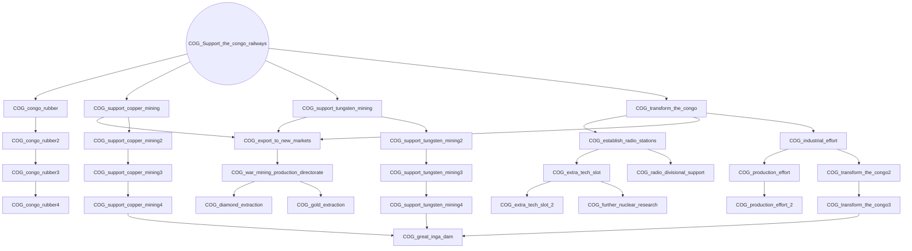
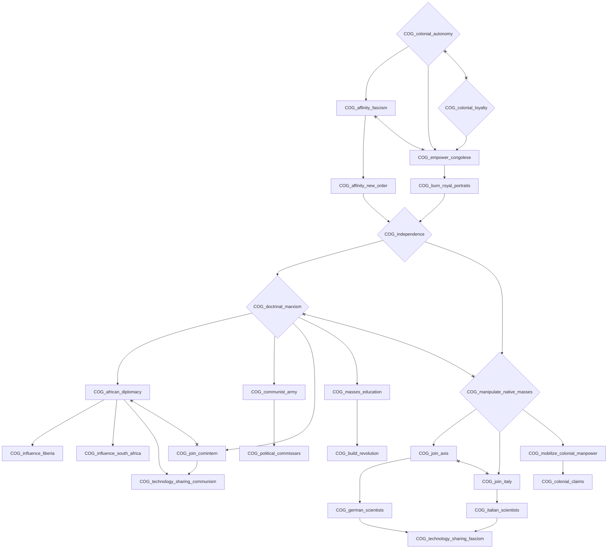
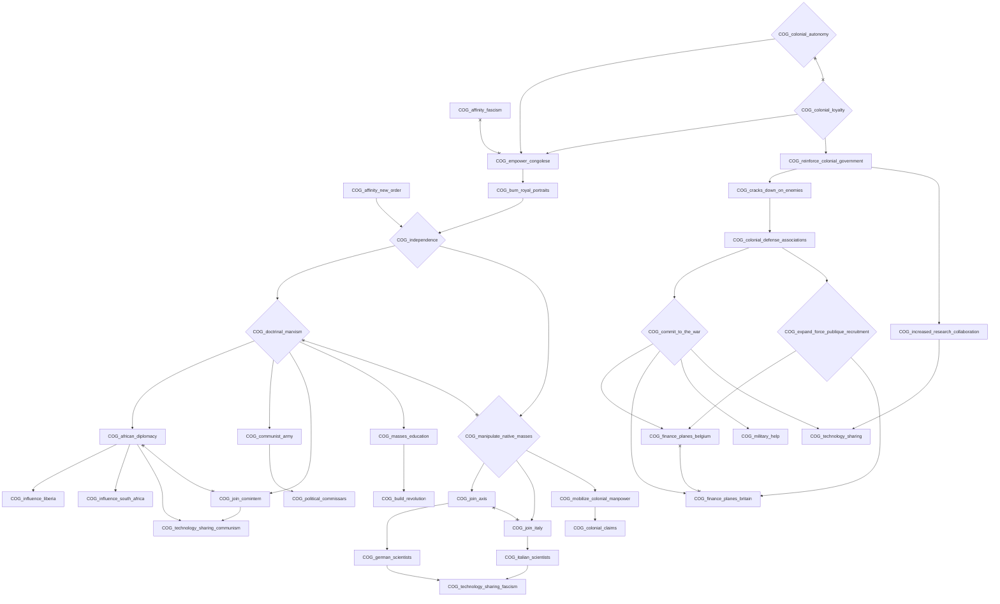
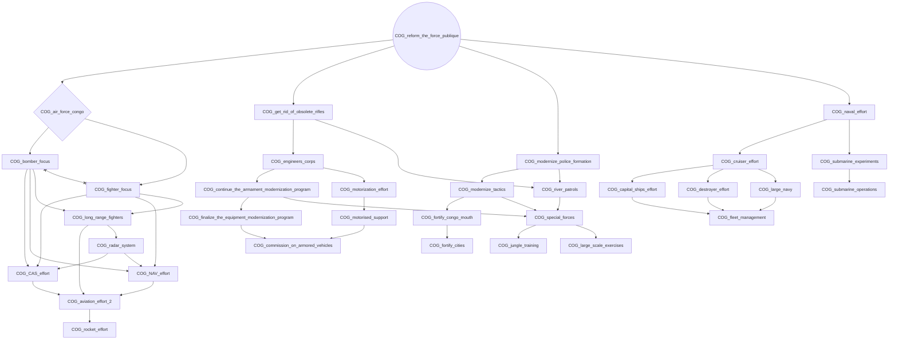

# COG_Support_the_congo_railways

```mermaid
flowchart TD
    n1(("COG_Support_the_congo_railways"))
    n2["COG_congo_rubber"]
    n3["COG_congo_rubber2"]
    n4["COG_congo_rubber3"]
    n5["COG_congo_rubber4"]
    n6["COG_diamond_extraction"]
    n7["COG_establish_radio_stations"]
    n8["COG_export_to_new_markets"]
    n9["COG_extra_tech_slot"]
    n10["COG_extra_tech_slot_2"]
    n11["COG_further_nuclear_research"]
    n12["COG_gold_extraction"]
    n13["COG_great_inga_dam"]
    n14["COG_industrial_effort"]
    n15["COG_production_effort"]
    n16["COG_production_effort_2"]
    n17["COG_radio_divisional_support"]
    n18["COG_support_copper_mining"]
    n19["COG_support_copper_mining2"]
    n20["COG_support_copper_mining3"]
    n21["COG_support_copper_mining4"]
    n22["COG_support_tungsten_mining"]
    n23["COG_support_tungsten_mining2"]
    n24["COG_support_tungsten_mining3"]
    n25["COG_support_tungsten_mining4"]
    n26["COG_transform_the_congo"]
    n27["COG_transform_the_congo2"]
    n28["COG_transform_the_congo3"]
    n29["COG_war_mining_production_directorate"]
    n1 --> n2
    n2 --> n3
    n3 --> n4
    n4 --> n5
    n29 --> n6
    n26 --> n7
    n26 --> n8
    n18 --> n8
    n22 --> n8
    n7 --> n9
    n9 --> n10
    n9 --> n11
    n29 --> n12
    n21 --> n13
    n25 --> n13
    n28 --> n13
    n26 --> n14
    n14 --> n15
    n15 --> n16
    n7 --> n17
    n1 --> n18
    n18 --> n19
    n19 --> n20
    n20 --> n21
    n1 --> n22
    n22 --> n23
    n23 --> n24
    n24 --> n25
    n1 --> n26
    n14 --> n27
    n27 --> n28
    n8 --> n29
```

# COG_colonial_autonomy

```mermaid
flowchart TD
    n30["COG_affinity_fascism"]
    n31["COG_affinity_new_order"]
    n32["COG_african_diplomacy"]
    n33["COG_build_revolution"]
    n34["COG_burn_royal_portraits"]
    n35{"COG_colonial_autonomy"}
    n36["COG_colonial_claims"]
    n37{"COG_colonial_loyalty"}
    n38["COG_communist_army"]
    n39{"COG_doctrinal_marxism"}
    n40["COG_empower_congolese"]
    n41["COG_german_scientists"]
    n42{"COG_independence"}
    n43["COG_influence_liberia"]
    n44["COG_influence_south_africa"]
    n45["COG_italian_scientists"]
    n46["COG_join_axis"]
    n47["COG_join_comintern"]
    n48["COG_join_italy"]
    n49{"COG_manipulate_native_masses"}
    n50["COG_masses_education"]
    n51["COG_mobilize_colonial_manpower"]
    n52["COG_political_commissars"]
    n53["COG_technology_sharing_communism"]
    n54["COG_technology_sharing_fascism"]
    n35 --> n30
    n30 --> n31
    n39 --> n32
    n50 --> n33
    n40 --> n34
    n51 --> n36
    n39 --> n38
    n42 --> n39
    n35 --> n40
    n37 --> n40
    n46 --> n41
    n31 --> n42
    n34 --> n42
    n32 --> n43
    n32 --> n44
    n48 --> n45
    n49 --> n46
    n39 --> n47
    n49 --> n48
    n42 --> n49
    n39 --> n50
    n49 --> n51
    n38 --> n52
    n32 --> n53
    n47 --> n53
    n45 --> n54
    n41 --> n54
    n30 x--x n40
    n32 x--x n47
    n35 x--x n37
    n39 x--x n49
    n46 x--x n48
```

# COG_colonial_loyalty

```mermaid
flowchart TD
    n30["COG_affinity_fascism"]
    n31["COG_affinity_new_order"]
    n32["COG_african_diplomacy"]
    n33["COG_build_revolution"]
    n34["COG_burn_royal_portraits"]
    n35{"COG_colonial_autonomy"}
    n36["COG_colonial_claims"]
    n55["COG_colonial_defense_associations"]
    n37{"COG_colonial_loyalty"}
    n56{"COG_commit_to_the_war"}
    n38["COG_communist_army"]
    n57["COG_cracks_down_on_enemies"]
    n39{"COG_doctrinal_marxism"}
    n40["COG_empower_congolese"]
    n58{"COG_expand_force_publique_recruitment"}
    n59["COG_finance_planes_belgium"]
    n60["COG_finance_planes_britain"]
    n41["COG_german_scientists"]
    n61["COG_increased_research_collaboration"]
    n42{"COG_independence"}
    n43["COG_influence_liberia"]
    n44["COG_influence_south_africa"]
    n45["COG_italian_scientists"]
    n46["COG_join_axis"]
    n47["COG_join_comintern"]
    n48["COG_join_italy"]
    n49{"COG_manipulate_native_masses"}
    n50["COG_masses_education"]
    n62["COG_military_help"]
    n51["COG_mobilize_colonial_manpower"]
    n52["COG_political_commissars"]
    n63["COG_reinforce_colonial_government"]
    n64["COG_technology_sharing"]
    n53["COG_technology_sharing_communism"]
    n54["COG_technology_sharing_fascism"]
    n39 --> n32
    n50 --> n33
    n40 --> n34
    n51 --> n36
    n57 --> n55
    n55 --> n56
    n39 --> n38
    n63 --> n57
    n42 --> n39
    n35 --> n40
    n37 --> n40
    n55 --> n58
    n58 --> n59
    n56 --> n59
    n58 --> n60
    n56 --> n60
    n46 --> n41
    n63 --> n61
    n31 --> n42
    n34 --> n42
    n32 --> n43
    n32 --> n44
    n48 --> n45
    n49 --> n46
    n39 --> n47
    n49 --> n48
    n42 --> n49
    n39 --> n50
    n56 --> n62
    n49 --> n51
    n38 --> n52
    n37 --> n63
    n56 --> n64
    n61 --> n64
    n32 --> n53
    n47 --> n53
    n45 --> n54
    n41 --> n54
    n30 x--x n40
    n32 x--x n47
    n35 x--x n37
    n39 x--x n49
    n59 x--x n60
    n46 x--x n48
```

# COG_reform_the_force_publique

```mermaid
flowchart TD
    n65["COG_CAS_effort"]
    n66["COG_NAV_effort"]
    n67{"COG_air_force_congo"}
    n68["COG_aviation_effort_2"]
    n69["COG_bomber_focus"]
    n70["COG_capital_ships_effort"]
    n71["COG_commission_on_armored_vehicles"]
    n72["COG_continue_the_armament_modernization_program"]
    n73["COG_cruiser_effort"]
    n74["COG_destroyer_effort"]
    n75["COG_engineers_corps"]
    n76["COG_fighter_focus"]
    n77["COG_finalize_the_equipment_modernization_program"]
    n78["COG_fleet_management"]
    n79["COG_fortify_cities"]
    n80["COG_fortify_congo_mouth"]
    n81["COG_get_rid_of_obsolete_rifles"]
    n82["COG_jungle_training"]
    n83["COG_large_navy"]
    n84["COG_large_scale_exercises"]
    n85["COG_long_range_fighters"]
    n86["COG_modernize_police_formation"]
    n87["COG_modernize_tactics"]
    n88["COG_motorised_support"]
    n89["COG_motorization_effort"]
    n90["COG_naval_effort"]
    n91["COG_radar_system"]
    n92(("COG_reform_the_force_publique"))
    n93["COG_river_patrols"]
    n94["COG_rocket_effort"]
    n95["COG_special_forces"]
    n96["COG_submarine_experiments"]
    n97["COG_submarine_operations"]
    n76 --> n65
    n69 --> n65
    n91 --> n65
    n76 --> n66
    n69 --> n66
    n91 --> n66
    n92 --> n67
    n85 --> n68
    n65 --> n68
    n66 --> n68
    n67 --> n69
    n73 --> n70
    n88 --> n71
    n77 --> n71
    n75 --> n72
    n90 --> n73
    n73 --> n74
    n81 --> n75
    n67 --> n76
    n72 --> n77
    n70 --> n78
    n74 --> n78
    n83 --> n78
    n80 --> n79
    n87 --> n80
    n92 --> n81
    n95 --> n82
    n73 --> n83
    n95 --> n84
    n69 --> n85
    n76 --> n85
    n92 --> n86
    n86 --> n87
    n89 --> n88
    n75 --> n89
    n92 --> n90
    n85 --> n91
    n86 --> n93
    n81 --> n93
    n68 --> n94
    n87 --> n95
    n93 --> n95
    n72 --> n95
    n90 --> n96
    n96 --> n97
    n69 x--x n76
```
