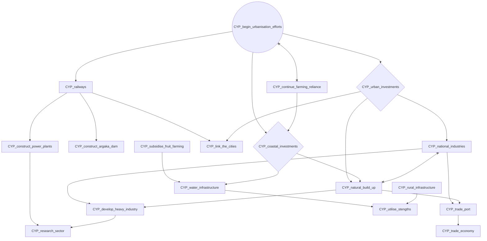
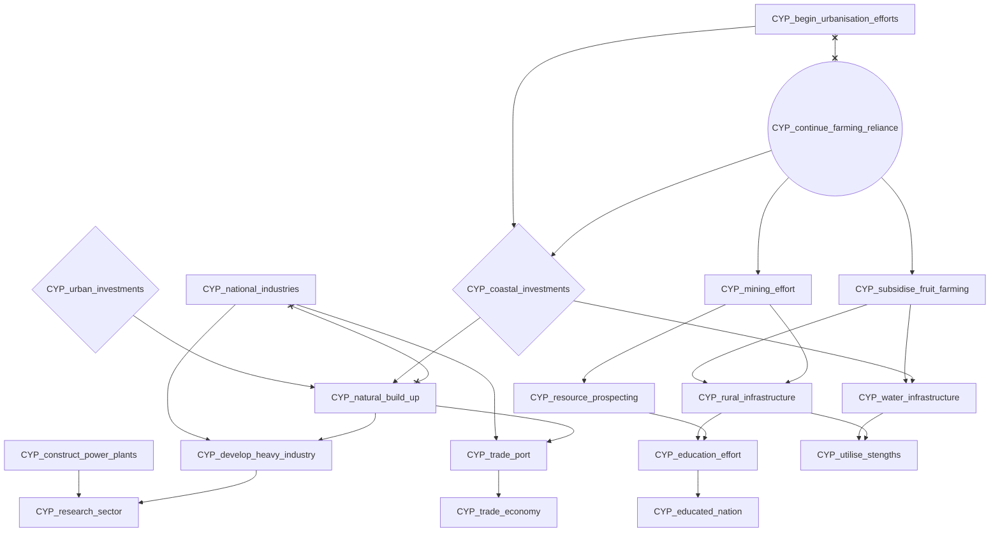
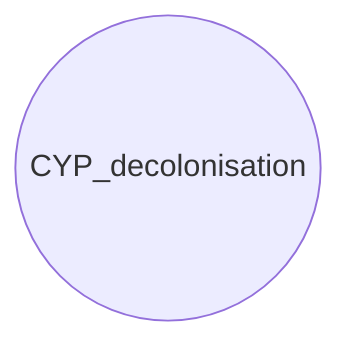
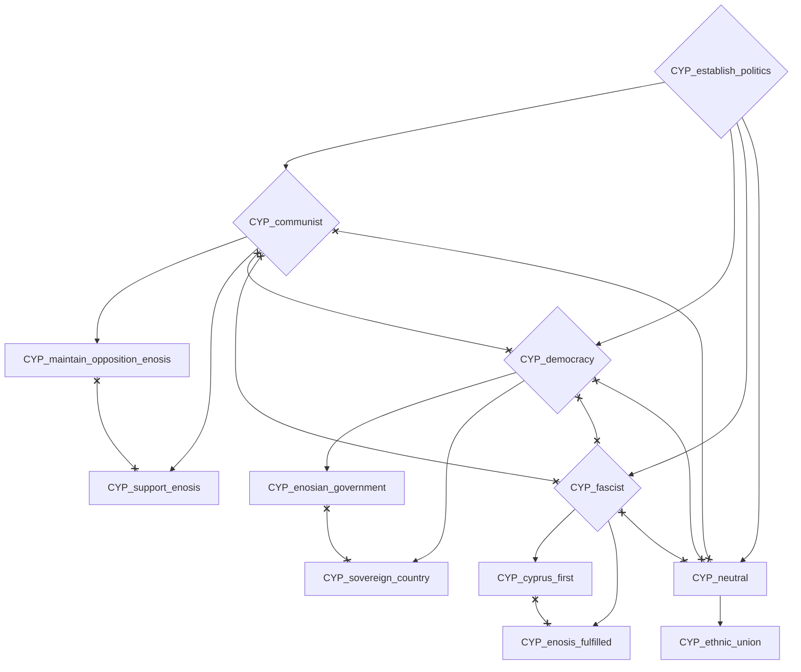
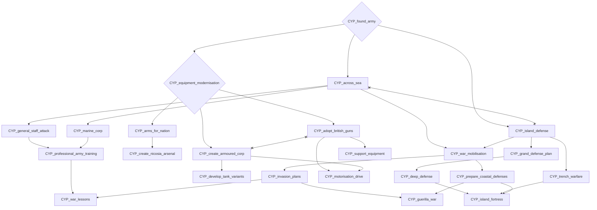

# CYP_begin_urbanisation_efforts

```mermaid
flowchart TD
    n1(("CYP_begin_urbanisation_efforts"))
    n2{"CYP_coastal_investments"}
    n3["CYP_construct_argaka_dam"]
    n4["CYP_construct_power_plants"]
    n5["CYP_continue_farming_reliance"]
    n6["CYP_develop_heavy_industry"]
    n7["CYP_link_the_cities"]
    n8["CYP_national_industries"]
    n9["CYP_natural_build_up"]
    n10["CYP_railways"]
    n11["CYP_research_sector"]
    n12["CYP_rural_infrastructure"]
    n13["CYP_subsidise_fruit_farming"]
    n14["CYP_trade_economy"]
    n15["CYP_trade_port"]
    n16{"CYP_urban_investments"}
    n17["CYP_utilise_stengths"]
    n18["CYP_water_infrastructure"]
    n1 --> n2
    n5 --> n2
    n10 --> n3
    n10 --> n4
    n8 --> n6
    n9 --> n6
    n10 --> n7
    n16 --> n7
    n16 --> n8
    n16 --> n9
    n2 --> n9
    n1 --> n10
    n4 --> n11
    n6 --> n11
    n15 --> n14
    n8 --> n15
    n9 --> n15
    n1 --> n16
    n18 --> n17
    n12 --> n17
    n13 --> n18
    n2 --> n18
    n1 x--x n5
    n8 x--x n9
```

# CYP_continue_farming_reliance

```mermaid
flowchart TD
    n1["CYP_begin_urbanisation_efforts"]
    n2{"CYP_coastal_investments"}
    n4["CYP_construct_power_plants"]
    n5(("CYP_continue_farming_reliance"))
    n6["CYP_develop_heavy_industry"]
    n19["CYP_educated_nation"]
    n20["CYP_education_effort"]
    n21["CYP_mining_effort"]
    n8["CYP_national_industries"]
    n9["CYP_natural_build_up"]
    n11["CYP_research_sector"]
    n22["CYP_resource_prospecting"]
    n12["CYP_rural_infrastructure"]
    n13["CYP_subsidise_fruit_farming"]
    n14["CYP_trade_economy"]
    n15["CYP_trade_port"]
    n16{"CYP_urban_investments"}
    n17["CYP_utilise_stengths"]
    n18["CYP_water_infrastructure"]
    n1 --> n2
    n5 --> n2
    n8 --> n6
    n9 --> n6
    n20 --> n19
    n12 --> n20
    n22 --> n20
    n5 --> n21
    n16 --> n9
    n2 --> n9
    n4 --> n11
    n6 --> n11
    n21 --> n22
    n13 --> n12
    n21 --> n12
    n5 --> n13
    n15 --> n14
    n8 --> n15
    n9 --> n15
    n18 --> n17
    n12 --> n17
    n13 --> n18
    n2 --> n18
    n1 x--x n5
    n8 x--x n9
```

# CYP_decolonisation

```mermaid
flowchart TD
    n23(("CYP_decolonisation"))
```

# CYP_establish_politics

```mermaid
flowchart TD
    n24{"CYP_communist"}
    n25["CYP_cyprus_first"]
    n26{"CYP_democracy"}
    n27["CYP_enosian_government"]
    n28["CYP_enosis_fulfilled"]
    n29{"CYP_establish_politics"}
    n30["CYP_ethnic_union"]
    n31{"CYP_fascist"}
    n32["CYP_maintain_opposition_enosis"]
    n33["CYP_neutral"]
    n34["CYP_sovereign_country"]
    n35["CYP_support_enosis"]
    n29 --> n24
    n31 --> n25
    n29 --> n26
    n26 --> n27
    n31 --> n28
    n33 --> n30
    n29 --> n31
    n24 --> n32
    n29 --> n33
    n26 --> n34
    n24 --> n35
    n24 x--x n26
    n24 x--x n31
    n24 x--x n33
    n25 x--x n28
    n26 x--x n31
    n26 x--x n33
    n27 x--x n34
    n31 x--x n33
    n32 x--x n35
```

# CYP_found_army

```mermaid
flowchart TD
    n36["CYP_across_sea"]
    n37["CYP_adopt_british_guns"]
    n38["CYP_arms_for_nation"]
    n39["CYP_create_armoured_corp"]
    n40["CYP_create_nicosia_arsenal"]
    n41["CYP_deep_defense"]
    n42["CYP_develop_tank_variants"]
    n43{"CYP_equipment_modernisation"}
    n44{"CYP_found_army"}
    n45["CYP_general_staff_attack"]
    n46["CYP_grand_defense_plan"]
    n47["CYP_guerilla_war"]
    n48["CYP_invasion_plans"]
    n49["CYP_island_defense"]
    n50["CYP_island_fortress"]
    n51["CYP_marine_corp"]
    n52["CYP_motorisation_drive"]
    n53["CYP_prepare_coastal_defenses"]
    n54["CYP_professional_army_training"]
    n55["CYP_support_equipment"]
    n56["CYP_trench_warfare"]
    n57["CYP_war_lessons"]
    n58["CYP_war_mobilisation"]
    n44 --> n36
    n43 --> n37
    n43 --> n38
    n43 --> n39
    n38 --> n40
    n46 --> n41
    n39 --> n42
    n44 --> n43
    n36 --> n45
    n49 --> n46
    n48 --> n47
    n53 --> n47
    n58 --> n48
    n44 --> n49
    n41 --> n50
    n56 --> n50
    n53 --> n50
    n36 --> n51
    n37 --> n52
    n39 --> n52
    n58 --> n53
    n45 --> n54
    n51 --> n54
    n37 --> n55
    n49 --> n56
    n54 --> n57
    n48 --> n57
    n36 --> n58
    n49 --> n58
    n36 x--x n49
    n37 x--x n39
```
