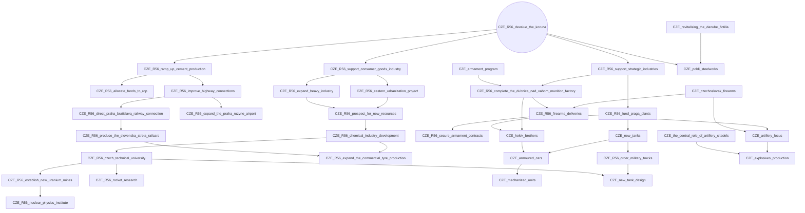
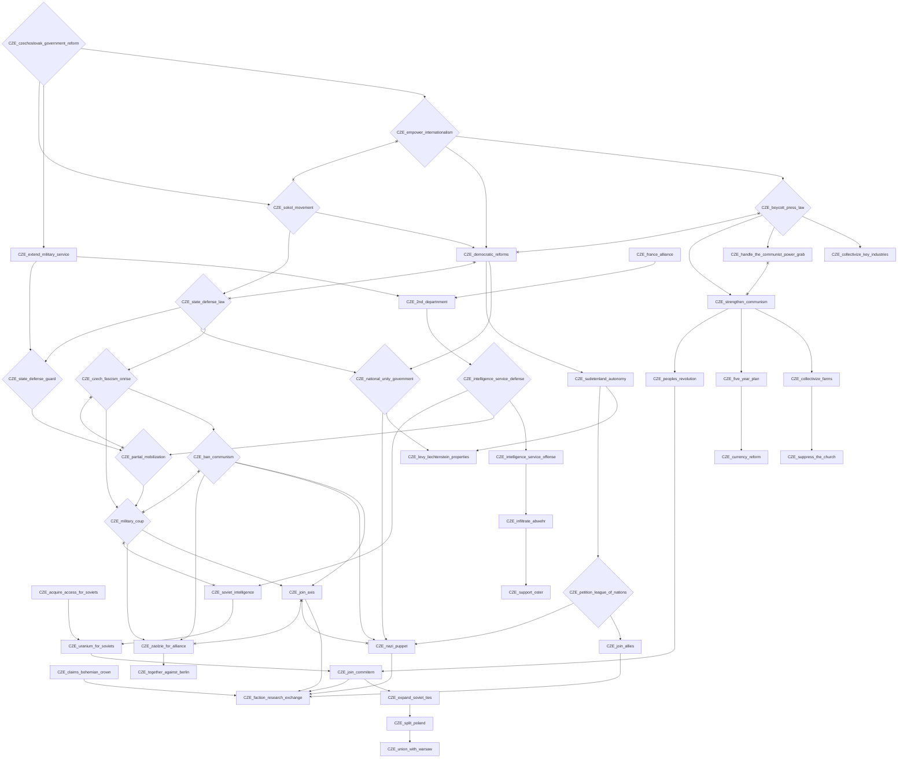
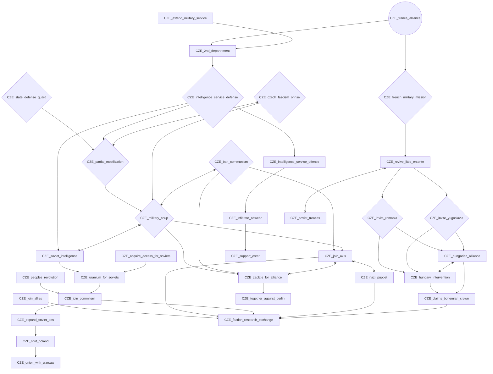
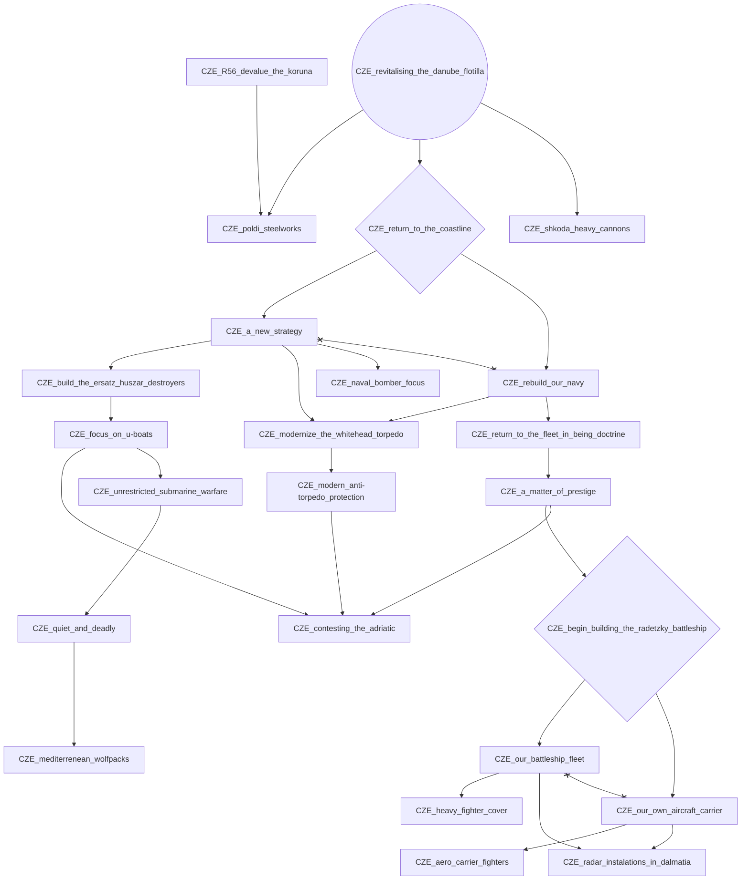

# CZE_R56_devalue_the_koruna

```mermaid
flowchart TD
    n1["CZE_R56_allocate_funds_to_rop"]
    n2["CZE_R56_chemical_industry_development"]
    n3["CZE_R56_complete_the_dubnica_nad_vahom_munition_factory"]
    n4["CZE_R56_czech_technical_university"]
    n5(("CZE_R56_devalue_the_koruna"))
    n6["CZE_R56_direct_praha_bratislava_railway_connection"]
    n7["CZE_R56_eastern_urbanization_project"]
    n8["CZE_R56_establish_new_uranium_mines"]
    n9["CZE_R56_expand_heavy_industry"]
    n10["CZE_R56_expand_the_commercial_tyre_production"]
    n11["CZE_R56_expand_the_praha_ruzyne_airport"]
    n12["CZE_R56_firearms_deliveries"]
    n13["CZE_R56_fund_praga_plants"]
    n14["CZE_R56_improve_highway_connections"]
    n15["CZE_R56_nuclear_physics_institute"]
    n16["CZE_R56_order_military_trucks"]
    n17["CZE_R56_produce_the_slovenska_strela_railcars"]
    n18["CZE_R56_prospect_for_new_resources"]
    n19["CZE_R56_ramp_up_cement_production"]
    n20["CZE_R56_rocket_research"]
    n21["CZE_R56_secure_armament_contracts"]
    n22["CZE_R56_support_consumer_goods_industry"]
    n23["CZE_R56_support_strategic_industries"]
    n24["CZE_armament_program"]
    n25["CZE_armoured_cars"]
    n26["CZE_artillery_focus"]
    n27["CZE_czechoslovak_firearms"]
    n28["CZE_explosives_production"]
    n29["CZE_holek_brothers"]
    n30["CZE_mechanized_units"]
    n31["CZE_new_tank_design"]
    n32["CZE_new_tanks"]
    n33["CZE_poldi_steelworks"]
    n34["CZE_revitalising_the_danube_flotilla"]
    n35["CZE_the_central_role_of_artillery_citadels"]
    n19 --> n1
    n18 --> n2
    n23 --> n3
    n24 --> n3
    n2 --> n4
    n14 --> n6
    n22 --> n7
    n4 --> n8
    n22 --> n9
    n2 --> n10
    n17 --> n10
    n14 --> n11
    n27 --> n12
    n3 --> n12
    n23 --> n13
    n19 --> n14
    n8 --> n15
    n32 --> n16
    n6 --> n17
    n7 --> n18
    n9 --> n18
    n5 --> n19
    n4 --> n20
    n12 --> n21
    n5 --> n22
    n5 --> n23
    n32 --> n25
    n29 --> n25
    n12 --> n26
    n27 --> n26
    n26 --> n28
    n35 --> n28
    n3 --> n29
    n12 --> n29
    n25 --> n30
    n16 --> n31
    n4 --> n31
    n13 --> n32
    n34 --> n33
    n5 --> n33
```

# CZE_czechoslovak_government_reform

```mermaid
flowchart TD
    n36["CZE_2nd_departnment"]
    n37["CZE_acquire_access_for_soviets"]
    n38{"CZE_ban_communism"}
    n39{"CZE_boycott_press_law"}
    n40["CZE_claims_bohemian_crown"]
    n41["CZE_collectivize_farms"]
    n42["CZE_collectivize_key_industries"]
    n43["CZE_currency_reform"]
    n44{"CZE_czech_fascism_onrise"}
    n45{"CZE_czechoslovak_government_reform"}
    n46["CZE_democratic_reforms"]
    n47{"CZE_empower_internationalism"}
    n48["CZE_expand_soviet_ties"]
    n49["CZE_extend_military_service"]
    n50["CZE_faction_research_exchange"]
    n51["CZE_five_year_plan"]
    n52["CZE_france_alliance"]
    n53["CZE_handle_the_communist_power_grab"]
    n54["CZE_infiltrate_abwehr"]
    n55{"CZE_intelligence_service_defense"}
    n56["CZE_intelligence_service_offense"]
    n57["CZE_join_allies"]
    n58["CZE_join_axis"]
    n59["CZE_join_commitern"]
    n60["CZE_levy_liechtenstein_properties"]
    n61{"CZE_military_coup"}
    n62{"CZE_national_unity_government"}
    n63["CZE_nazi_puppet"]
    n64{"CZE_partial_mobilization"}
    n65["CZE_peoples_revolution"]
    n66{"CZE_petition_league_of_nations"}
    n67{"CZE_sokol_movement"}
    n68["CZE_soviet_intelligence"]
    n69["CZE_split_poland"]
    n70{"CZE_state_defense_guard"}
    n71{"CZE_state_defense_law"}
    n72["CZE_strengthen_communism"]
    n73["CZE_sudetenland_autonomy"]
    n74["CZE_support_oster"]
    n75["CZE_suppress_the_church"]
    n76["CZE_together_against_berlin"]
    n77["CZE_union_with_warsaw"]
    n78["CZE_uranium_for_soviets"]
    n79["CZE_zaolzie_for_alliance"]
    n52 --> n36
    n49 --> n36
    n44 --> n38
    n47 --> n39
    n72 --> n41
    n39 --> n42
    n51 --> n43
    n71 --> n44
    n47 --> n46
    n67 --> n46
    n45 --> n47
    n59 --> n48
    n45 --> n49
    n57 --> n50
    n58 --> n50
    n59 --> n50
    n63 --> n50
    n40 --> n50
    n72 --> n51
    n39 --> n53
    n56 --> n54
    n36 --> n55
    n55 --> n56
    n66 --> n57
    n38 --> n58
    n61 --> n58
    n65 --> n59
    n78 --> n59
    n62 --> n60
    n73 --> n60
    n64 --> n61
    n44 --> n61
    n71 --> n62
    n46 --> n62
    n62 --> n63
    n38 --> n63
    n66 --> n63
    n70 --> n64
    n55 --> n64
    n72 --> n65
    n73 --> n66
    n45 --> n67
    n55 --> n68
    n48 --> n69
    n71 --> n70
    n49 --> n70
    n67 --> n71
    n39 --> n72
    n46 --> n73
    n54 --> n74
    n41 --> n75
    n79 --> n76
    n69 --> n77
    n68 --> n78
    n37 --> n78
    n61 --> n79
    n38 --> n79
    n38 x--x n61
    n39 x--x n46
    n44 x--x n64
    n46 x--x n71
    n47 x--x n67
    n53 x--x n72
    n58 x--x n63
    n58 x--x n79
    n61 x--x n68
```

# CZE_france_alliance

```mermaid
flowchart TD
    n36["CZE_2nd_departnment"]
    n37["CZE_acquire_access_for_soviets"]
    n38{"CZE_ban_communism"}
    n40["CZE_claims_bohemian_crown"]
    n44{"CZE_czech_fascism_onrise"}
    n48["CZE_expand_soviet_ties"]
    n49["CZE_extend_military_service"]
    n50["CZE_faction_research_exchange"]
    n52(("CZE_france_alliance"))
    n80{"CZE_french_military_mission"}
    n81["CZE_hungarian_alliance"]
    n82["CZE_hungary_intervention"]
    n54["CZE_infiltrate_abwehr"]
    n55{"CZE_intelligence_service_defense"}
    n56["CZE_intelligence_service_offense"]
    n83{"CZE_invite_romania"}
    n84{"CZE_invite_yugoslavia"}
    n57["CZE_join_allies"]
    n58["CZE_join_axis"]
    n59["CZE_join_commitern"]
    n61{"CZE_military_coup"}
    n63["CZE_nazi_puppet"]
    n64{"CZE_partial_mobilization"}
    n65["CZE_peoples_revolution"]
    n85["CZE_revive_little_entente"]
    n68["CZE_soviet_intelligence"]
    n86["CZE_soviet_treaties"]
    n69["CZE_split_poland"]
    n70{"CZE_state_defense_guard"}
    n74["CZE_support_oster"]
    n76["CZE_together_against_berlin"]
    n77["CZE_union_with_warsaw"]
    n78["CZE_uranium_for_soviets"]
    n79["CZE_zaolzie_for_alliance"]
    n52 --> n36
    n49 --> n36
    n82 --> n40
    n81 --> n40
    n59 --> n48
    n57 --> n50
    n58 --> n50
    n59 --> n50
    n63 --> n50
    n40 --> n50
    n52 --> n80
    n83 --> n81
    n84 --> n81
    n83 --> n82
    n84 --> n82
    n56 --> n54
    n36 --> n55
    n55 --> n56
    n85 --> n83
    n85 --> n84
    n38 --> n58
    n61 --> n58
    n65 --> n59
    n78 --> n59
    n64 --> n61
    n44 --> n61
    n70 --> n64
    n55 --> n64
    n80 --> n85
    n55 --> n68
    n48 --> n69
    n54 --> n74
    n79 --> n76
    n69 --> n77
    n68 --> n78
    n37 --> n78
    n61 --> n79
    n38 --> n79
    n38 x--x n61
    n44 x--x n64
    n81 x--x n82
    n58 x--x n63
    n58 x--x n79
    n61 x--x n68
    n85 x--x n86
```

# CZE_ministry_of_defense

```mermaid
flowchart TD
    n87["CZE_R56_air_is_our_sea"]
    n3["CZE_R56_complete_the_dubnica_nad_vahom_munition_factory"]
    n88["CZE_R56_expand_aircraft_production"]
    n89["CZE_R56_finish_the_masaryk_military_hospital"]
    n12["CZE_R56_firearms_deliveries"]
    n90["CZE_R56_heavy_fighter_experiments"]
    n91["CZE_R56_new_bomber_prototypes"]
    n21["CZE_R56_secure_armament_contracts"]
    n23["CZE_R56_support_strategic_industries"]
    n37["CZE_acquire_access_for_soviets"]
    n92["CZE_advanced_aircraft_prototypes"]
    n93["CZE_air_modernization"]
    n94["CZE_an_armoured_army"]
    n95["CZE_an_impregnable_wall"]
    n24["CZE_armament_program"]
    n25["CZE_armoured_cars"]
    n26["CZE_artillery_focus"]
    n96["CZE_border_brigades"]
    n97["CZE_cas_focus"]
    n40["CZE_claims_bohemian_crown"]
    n98["CZE_complete_the_shift_towards_static_defence"]
    n99["CZE_construct_additional_defence_lines"]
    n100["CZE_czechoslovak_airforce"]
    n27["CZE_czechoslovak_firearms"]
    n101["CZE_engineer_corps"]
    n48["CZE_expand_soviet_ties"]
    n28["CZE_explosives_production"]
    n102["CZE_extend_military_service_army"]
    n50["CZE_faction_research_exchange"]
    n103["CZE_fund_further_monoplane_experiments"]
    n29["CZE_holek_brothers"]
    n104["CZE_indirect_combat"]
    n105["CZE_integrate_aspects_of_mobile_defence"]
    n106["CZE_jet_engine_research"]
    n57["CZE_join_allies"]
    n58["CZE_join_axis"]
    n59["CZE_join_commitern"]
    n107["CZE_legacy_of_legions"]
    n30["CZE_mechanized_units"]
    n108{"CZE_military_education"}
    n109{"CZE_military_maneuvers"}
    n110["CZE_military_science_institute"]
    n111(("CZE_ministry_of_defense"))
    n112["CZE_mobile_army"]
    n113["CZE_mobile_artillery"]
    n63["CZE_nazi_puppet"]
    n114["CZE_new_doctrines"]
    n32["CZE_new_tanks"]
    n115["CZE_paradesant_brigade"]
    n65["CZE_peoples_revolution"]
    n116["CZE_pilot_training"]
    n117["CZE_prepare_new_plan"]
    n118["CZE_reform_the_rop"]
    n119["CZE_reorganize_general_staff"]
    n120["CZE_repurpose_the_rop"]
    n121["CZE_return_to_mobile_defence"]
    n85["CZE_revive_little_entente"]
    n68["CZE_soviet_intelligence"]
    n86["CZE_soviet_treaties"]
    n69["CZE_split_poland"]
    n35["CZE_the_central_role_of_artillery_citadels"]
    n122["CZE_the_legacy_of_kaiserjagers"]
    n123["CZE_the_new_sturmbaons"]
    n77["CZE_union_with_warsaw"]
    n78["CZE_uranium_for_soviets"]
    n124["CZE_walter_engines"]
    n108 --> n87
    n23 --> n3
    n24 --> n3
    n100 --> n88
    n116 --> n88
    n111 --> n89
    n27 --> n12
    n3 --> n12
    n103 --> n90
    n124 --> n91
    n12 --> n21
    n86 --> n37
    n90 --> n92
    n91 --> n92
    n91 --> n93
    n90 --> n93
    n113 --> n94
    n122 --> n94
    n118 --> n95
    n99 --> n95
    n111 --> n24
    n32 --> n25
    n29 --> n25
    n12 --> n26
    n27 --> n26
    n98 --> n96
    n121 --> n96
    n104 --> n97
    n88 --> n97
    n109 --> n98
    n105 --> n99
    n87 --> n100
    n24 --> n27
    n96 --> n101
    n59 --> n48
    n26 --> n28
    n35 --> n28
    n98 --> n102
    n57 --> n50
    n58 --> n50
    n59 --> n50
    n63 --> n50
    n40 --> n50
    n124 --> n103
    n88 --> n103
    n3 --> n29
    n12 --> n29
    n112 --> n104
    n98 --> n105
    n92 --> n106
    n65 --> n59
    n78 --> n59
    n111 --> n107
    n25 --> n30
    n111 --> n108
    n107 --> n109
    n119 --> n109
    n108 --> n109
    n108 --> n110
    n121 --> n112
    n120 --> n113
    n96 --> n114
    n91 --> n115
    n90 --> n115
    n87 --> n116
    n96 --> n117
    n105 --> n118
    n111 --> n119
    n104 --> n120
    n109 --> n121
    n108 --> n86
    n48 --> n69
    n98 --> n35
    n123 --> n122
    n96 --> n123
    n112 --> n123
    n69 --> n77
    n68 --> n78
    n37 --> n78
    n100 --> n124
    n98 x--x n121
    n85 x--x n86
```

# CZE_revitalising_the_danube_flotilla

```mermaid
flowchart TD
    n5["CZE_R56_devalue_the_koruna"]
    n125["CZE_a_matter_of_prestige"]
    n126["CZE_a_new_strategy"]
    n127["CZE_aero_carrier_fighters"]
    n128{"CZE_begin_building_the_radetzky_battleship"}
    n129["CZE_build_the_ersatz_huszar_destroyers"]
    n130["CZE_contesting_the_adriatic"]
    n131["CZE_focus_on_u-boats"]
    n132["CZE_heavy_fighter_cover"]
    n133["CZE_mediterrenean_wolfpacks"]
    n134["CZE_modern_anti-torpedo_protection"]
    n135["CZE_modernize_the_whitehead_torpedo"]
    n136["CZE_naval_bomber_focus"]
    n137["CZE_our_battleship_fleet"]
    n138["CZE_our_own_aircraft_carrier"]
    n33["CZE_poldi_steelworks"]
    n139["CZE_quiet_and_deadly"]
    n140["CZE_radar_instalations_in_dalmatia"]
    n141["CZE_rebuild_our_navy"]
    n142{"CZE_return_to_the_coastline"}
    n143["CZE_return_to_the_fleet_in_being_doctrine"]
    n34(("CZE_revitalising_the_danube_flotilla"))
    n144["CZE_shkoda_heavy_cannons"]
    n145["CZE_unrestricted_submarine_warfare"]
    n143 --> n125
    n142 --> n126
    n138 --> n127
    n125 --> n128
    n126 --> n129
    n134 --> n130
    n131 --> n130
    n125 --> n130
    n129 --> n131
    n137 --> n132
    n139 --> n133
    n135 --> n134
    n126 --> n135
    n141 --> n135
    n126 --> n136
    n128 --> n137
    n128 --> n138
    n34 --> n33
    n5 --> n33
    n145 --> n139
    n138 --> n140
    n137 --> n140
    n142 --> n141
    n34 --> n142
    n141 --> n143
    n34 --> n144
    n131 --> n145
    n126 x--x n141
    n137 x--x n138
```
