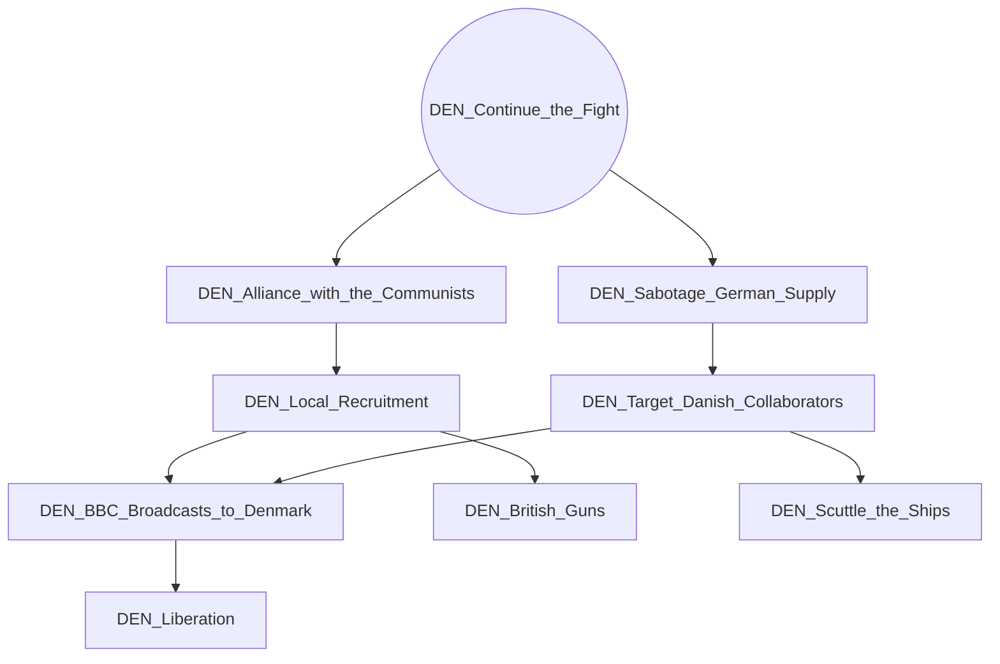
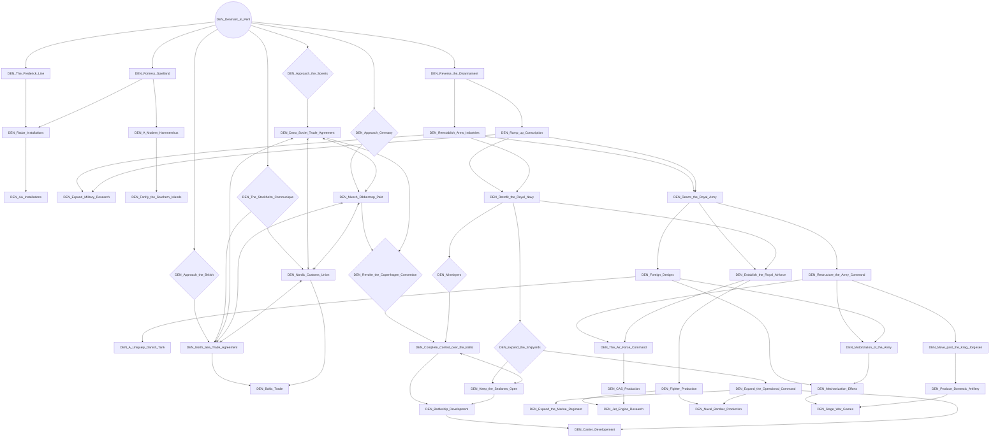
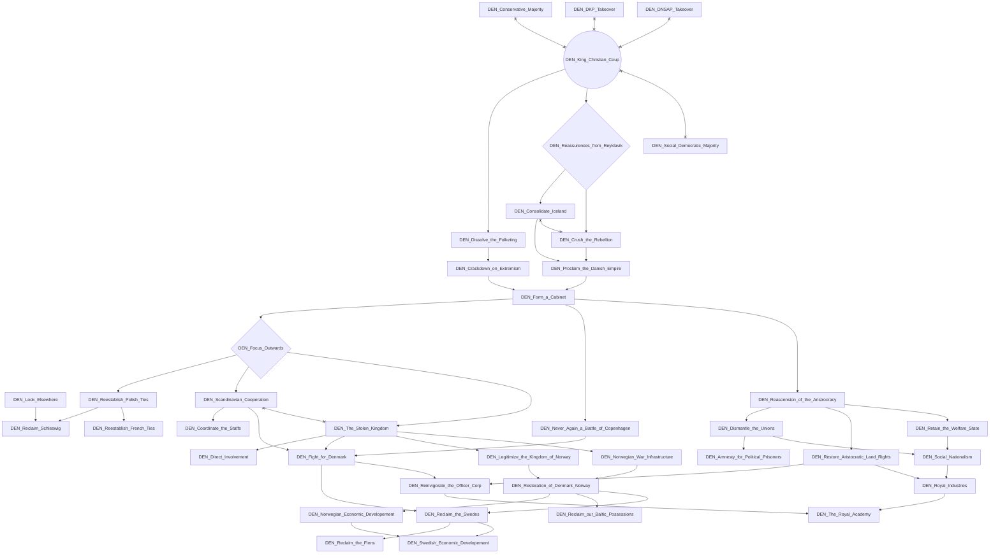

# DEN_Changing_Times

```mermaid
flowchart TD
    n1["DEN_Abolish_the_Monarchy"]
    n2["DEN_Abolish_the_Unions"]
    n3["DEN_Agrarian_Reform"]
    n4["DEN_Align_the_Unions"]
    n5["DEN_Alliegence_to_Moscow"]
    n6["DEN_Ally_the_Peasents"]
    n7["DEN_An_Appeal_to_the_Proletariat"]
    n8{"DEN_Appeal_for_German_Funding"}
    n9["DEN_Armed_Neutrality"]
    n10["DEN_Bolster_Danish_Corporations"]
    n11{"DEN_Bolster_Labour_Rights"}
    n12{"DEN_Bolster_the_SA"}
    n13["DEN_Break_the_Fasces"]
    n14["DEN_Business_Ties"]
    n15["DEN_CIA_Contacts"]
    n16{"DEN_Changing_Times"}
    n17["DEN_Channel_Economic_Frustrations"]
    n18["DEN_Collectivization_of_Agriculture"]
    n19{"DEN_Comintern_Support"}
    n20["DEN_Conservative_Majority"]
    n21["DEN_Consolidate_Media_Institutions"]
    n22["DEN_Contacts_to_the_KPD"]
    n23["DEN_Control_the_Banking_Institutions"]
    n24["DEN_Crackdown_on_Political_Violence"]
    n25{"DEN_Cross_the_Skagerrak"}
    n26["DEN_Cut_off_the_Lions_Head"]
    n27{"DEN_DKP_Takeover"}
    n28["DEN_DNSAP_Takeover"]
    n29["DEN_Danish_Autarky"]
    n30["DEN_Danish_Folksradrepublik"]
    n31["DEN_Dano_German_Propaganda"]
    n32["DEN_Defy_Russia"]
    n33["DEN_Deregulate_Banking"]
    n34["DEN_Devalue_the_Krone"]
    n35{"DEN_Encourage_Artisan_Production"}
    n36["DEN_Encourage_Collective_Bargaining"]
    n37["DEN_Encourage_Foreign_Investment"]
    n38["DEN_Establish_the_Nordic_Council"]
    n39["DEN_Expand_Agricultural_Subsidies"]
    n40["DEN_Expand_Maersk_Shipping"]
    n41["DEN_Expand_the_Copenhagen_University"]
    n42["DEN_Exploit_the_Conquered_Lands"]
    n43["DEN_Fighter_Cooperation"]
    n44{"DEN_Forced_Heavy_Industrialization"}
    n45{"DEN_Fuel_Nationalism"}
    n46["DEN_Galvanise_the_German_Minority"]
    n47["DEN_German_Economic_Collaboration"]
    n48["DEN_Icelandic_path_to_Socialism"]
    n49{"DEN_Increase_Attacks_on_the_Communists"}
    n50{"DEN_Increase_Rural_Developement"}
    n51["DEN_Increased_Protectionism"]
    n52["DEN_Initiate_Economic_Reforms"]
    n53["DEN_International_Theorists"]
    n54["DEN_International_Volunteers"]
    n55{"DEN_Introduce_Land_Reform"}
    n56{"DEN_Invite_German_Advisors"}
    n57["DEN_Invite_Gosplan_Planners"]
    n58{"DEN_Invite_Italian_Advisors"}
    n59["DEN_Invite_Select_Communist_Ministers"]
    n60["DEN_Invite_the_Wehrwirtschaftsfuhrer"]
    n61["DEN_Join_the_Axis"]
    n62["DEN_King_Christian_Coup"]
    n63["DEN_Look_Elsewhere"]
    n64["DEN_Look_towards_the_West"]
    n65["DEN_Maintain_Rural_Relations"]
    n66["DEN_Militarization_of_Society"]
    n67{"DEN_Nationalization_of_Key_Industries"}
    n68{"DEN_Organize_Nationwide_Strikes"}
    n69["DEN_Overthrow_the_Faux_Revolution"]
    n70["DEN_Pan_Scandinavianism"]
    n71["DEN_Popular_Front_against_Fascism"]
    n72{"DEN_Press_the_Schleswig_Claim"}
    n73["DEN_Primacy_of_the_Peasentry"]
    n74["DEN_Productivity_First"]
    n75["DEN_Propaganda_Campaigns"]
    n76["DEN_Public_Investments"]
    n77["DEN_Puncture_the_Heart_of_Fascism"]
    n78{"DEN_Rail_Investments"}
    n79["DEN_Rapid_Urbanisation"]
    n80["DEN_Rapidly_Increase_Arms_Production"]
    n81["DEN_Rebirth_of_the_North_Sea_Empire"]
    n82["DEN_Reciprocal_Containment"]
    n83["DEN_Reclaim_Schleswig"]
    n84["DEN_Reclaim_our_Hibernian_Vassals"]
    n85["DEN_Reestablish_Polish_Ties"]
    n86["DEN_Reestablish_the_Danelaw_Confederacy"]
    n87["DEN_Regional_Economic_Development"]
    n88["DEN_Research_Efforts"]
    n89{"DEN_Return_to_England"}
    n90["DEN_Safehaven_for_the_Scientists"]
    n91["DEN_Scandinavian_Connections"]
    n92["DEN_Scandinavian_Intervention"]
    n93["DEN_Scandinavian_Plan"]
    n94["DEN_Secure_Iceland"]
    n95{"DEN_Secure_Industrialists_Support"}
    n96{"DEN_Secure_the_Military"}
    n97["DEN_Shatter_the_Hammer"]
    n98["DEN_Social_Democratic_Majority"]
    n99["DEN_Soviet_Economic_Aid"]
    n100["DEN_Soviet_Military_Aid"]
    n101{"DEN_Steel_Investments"}
    n102["DEN_Strengthen_the_Labour_Unions"]
    n103["DEN_Study_the_NEP"]
    n104["DEN_Tactical_Nationalizations"]
    n105["DEN_Tax_Reform"]
    n106{"DEN_The_Hammer_and_the_Sickle"}
    n107["DEN_Unified_Defence_Plan"]
    n108["DEN_Unify_the_Socialist_Movement"]
    n23 --> n1
    n59 --> n1
    n33 --> n2
    n97 --> n2
    n37 --> n3
    n30 --> n4
    n36 --> n4
    n27 --> n5
    n19 --> n5
    n17 --> n6
    n16 --> n7
    n12 --> n8
    n95 --> n8
    n78 --> n9
    n101 --> n9
    n29 --> n10
    n102 --> n11
    n34 --> n11
    n46 --> n12
    n27 --> n13
    n37 --> n14
    n27 --> n15
    n7 --> n17
    n35 --> n18
    n44 --> n18
    n67 --> n18
    n75 --> n19
    n50 --> n20
    n97 --> n21
    n2 --> n21
    n27 --> n22
    n4 --> n23
    n76 --> n24
    n37 --> n24
    n66 --> n25
    n77 --> n26
    n68 --> n27
    n8 --> n28
    n72 --> n28
    n49 --> n28
    n63 --> n29
    n13 --> n30
    n22 --> n30
    n61 --> n31
    n27 --> n32
    n20 --> n33
    n102 --> n34
    n55 --> n35
    n67 --> n35
    n98 --> n36
    n20 --> n37
    n91 --> n38
    n9 --> n38
    n16 --> n39
    n14 --> n40
    n34 --> n41
    n51 --> n41
    n17 --> n41
    n95 --> n41
    n39 --> n41
    n29 --> n42
    n64 --> n43
    n61 --> n43
    n67 --> n44
    n52 --> n45
    n46 --> n45
    n16 --> n46
    n61 --> n47
    n32 --> n48
    n5 --> n48
    n95 --> n49
    n12 --> n49
    n51 --> n50
    n52 --> n51
    n16 --> n52
    n54 --> n53
    n32 --> n54
    n30 --> n55
    n96 --> n56
    n8 --> n56
    n99 --> n57
    n87 --> n57
    n79 --> n57
    n96 --> n58
    n36 --> n59
    n76 --> n59
    n47 --> n60
    n31 --> n60
    n56 --> n61
    n58 --> n61
    n58 --> n63
    n78 --> n64
    n101 --> n64
    n35 --> n65
    n44 --> n65
    n106 --> n65
    n56 --> n66
    n58 --> n66
    n30 --> n67
    n17 --> n68
    n108 --> n68
    n53 --> n69
    n77 --> n69
    n48 --> n70
    n102 --> n71
    n7 --> n71
    n45 --> n72
    n95 --> n72
    n65 --> n73
    n105 --> n74
    n2 --> n74
    n108 --> n75
    n98 --> n76
    n93 --> n77
    n4 --> n78
    n3 --> n78
    n24 --> n78
    n44 --> n79
    n18 --> n79
    n9 --> n80
    n89 --> n81
    n25 --> n81
    n64 --> n82
    n85 --> n83
    n63 --> n83
    n89 --> n84
    n89 --> n86
    n93 --> n87
    n66 --> n88
    n25 --> n89
    n24 --> n90
    n101 --> n91
    n78 --> n91
    n91 --> n92
    n100 --> n93
    n70 --> n93
    n28 --> n94
    n46 --> n95
    n28 --> n96
    n28 --> n97
    n11 --> n98
    n100 --> n99
    n44 --> n99
    n5 --> n100
    n4 --> n101
    n3 --> n101
    n24 --> n101
    n16 --> n102
    n35 --> n103
    n18 --> n103
    n59 --> n104
    n33 --> n105
    n14 --> n105
    n6 --> n106
    n91 --> n107
    n64 --> n107
    n7 --> n108
    n5 x--x n32
    n7 x--x n102
    n8 x--x n72
    n9 x--x n64
    n9 x--x n91
    n18 x--x n65
    n20 x--x n27
    n20 x--x n28
    n20 x--x n62
    n20 x--x n98
    n27 x--x n28
    n27 x--x n62
    n27 x--x n98
    n28 x--x n62
    n28 x--x n98
    n35 x--x n44
    n46 x--x n52
    n56 x--x n58
    n61 x--x n63
    n62 x--x n98
    n64 x--x n91
    n81 x--x n86
```

# DEN_Continue_the_Fight

```mermaid
flowchart TD
    n109["DEN_Alliance_with_the_Communists"]
    n110["DEN_BBC_Broadcasts_to_Denmark"]
    n111["DEN_British_Guns"]
    n112(("DEN_Continue_the_Fight"))
    n113["DEN_Liberation"]
    n114["DEN_Local_Recruitment"]
    n115["DEN_Sabotage_German_Supply"]
    n116["DEN_Scuttle_the_Ships"]
    n117["DEN_Target_Danish_Collaborators"]
    n112 --> n109
    n114 --> n110
    n117 --> n110
    n114 --> n111
    n110 --> n113
    n109 --> n114
    n112 --> n115
    n117 --> n116
    n115 --> n117
```

# DEN_Denmark_in_Peril

```mermaid
flowchart TD
    n118["DEN_AA_Installations"]
    n119["DEN_A_Modern_Hammershus"]
    n120["DEN_A_Uniquely_Danish_Tank"]
    n121{"DEN_Approach_Germany"}
    n122{"DEN_Approach_the_British"}
    n123{"DEN_Approach_the_Soviets"}
    n124["DEN_Baltic_Trade"]
    n125["DEN_Battleship_Development"]
    n126["DEN_CAS_Production"]
    n127["DEN_Carrier_Developement"]
    n128["DEN_Complete_Control_over_the_Baltic"]
    n129["DEN_Dano_Soviet_Trade_Agreement"]
    n130(("DEN_Denmark_in_Peril"))
    n131["DEN_Establish_the_Royal_Airforce"]
    n132["DEN_Expand_Military_Research"]
    n133["DEN_Expand_the_Marine_Regiment"]
    n134["DEN_Expand_the_Operational_Command"]
    n135{"DEN_Expand_the_Shipyards"}
    n136["DEN_Fighter_Production"]
    n137["DEN_Foreign_Designs"]
    n138["DEN_Fortify_the_Southern_Islands"]
    n139["DEN_Fortress_Sjaelland"]
    n140["DEN_Jet_Engine_Research"]
    n141["DEN_Keep_the_Sealanes_Open"]
    n142["DEN_Mechanization_Efforts"]
    n143{"DEN_Minelayers"}
    n144["DEN_Motorization_of_the_Army"]
    n145["DEN_Move_past_the_Krag_Jorgesen"]
    n146["DEN_Munch_Ribbentrop_Pakt"]
    n147["DEN_Naval_Bomber_Production"]
    n148["DEN_Nordic_Customs_Union"]
    n149["DEN_North_Sea_Trade_Agreement"]
    n150["DEN_Produce_Domestic_Artillery"]
    n151["DEN_Radar_Installations"]
    n152["DEN_Ramp_up_Conscription"]
    n153["DEN_Rearm_the_Royal_Army"]
    n154["DEN_Reestablish_Arms_Industries"]
    n155["DEN_Restructure_the_Army_Command"]
    n156["DEN_Retrofit_the_Royal_Navy"]
    n157["DEN_Reverse_the_Disarmament"]
    n158{"DEN_Revoke_the_Copenhagen_Convention"}
    n159["DEN_Stage_War_Games"]
    n160["DEN_The_Air_Force_Command"]
    n161["DEN_The_Frederick_Line"]
    n162{"DEN_The_Stockholm_Communique"}
    n151 --> n118
    n139 --> n119
    n137 --> n120
    n130 --> n121
    n130 --> n122
    n130 --> n123
    n149 --> n124
    n148 --> n124
    n128 --> n125
    n141 --> n125
    n160 --> n126
    n125 --> n127
    n134 --> n127
    n158 --> n128
    n143 --> n128
    n123 --> n129
    n153 --> n131
    n156 --> n131
    n154 --> n132
    n152 --> n132
    n134 --> n133
    n135 --> n134
    n156 --> n135
    n131 --> n136
    n153 --> n137
    n119 --> n138
    n130 --> n139
    n136 --> n140
    n126 --> n140
    n135 --> n141
    n137 --> n142
    n144 --> n142
    n156 --> n143
    n155 --> n144
    n137 --> n144
    n155 --> n145
    n121 --> n146
    n136 --> n147
    n134 --> n147
    n162 --> n148
    n122 --> n149
    n162 --> n149
    n145 --> n150
    n161 --> n151
    n139 --> n151
    n157 --> n152
    n154 --> n153
    n152 --> n153
    n157 --> n154
    n153 --> n155
    n152 --> n156
    n154 --> n156
    n130 --> n157
    n146 --> n158
    n129 --> n158
    n142 --> n159
    n150 --> n159
    n155 --> n160
    n131 --> n160
    n130 --> n161
    n130 --> n162
    n128 x--x n141
    n129 x--x n146
    n129 x--x n148
    n129 x--x n149
    n146 x--x n148
    n146 x--x n149
    n148 x--x n149
```

# DEN_King_Christian_Coup

```mermaid
flowchart TD
    n163["DEN_Amnesty_for_Political_Prisoners"]
    n20["DEN_Conservative_Majority"]
    n164["DEN_Consolidate_Iceland"]
    n165["DEN_Coordinate_the_Staffs"]
    n166["DEN_Crackdown_on_Extremism"]
    n167["DEN_Crush_the_Rebellion"]
    n27["DEN_DKP_Takeover"]
    n28["DEN_DNSAP_Takeover"]
    n168["DEN_Direct_Involvement"]
    n169["DEN_Dismantle_the_Unions"]
    n170["DEN_Dissolve_the_Folketing"]
    n171["DEN_Fight_for_Denmark"]
    n172{"DEN_Focus_Outwards"}
    n173["DEN_Form_a_Cabinet"]
    n62(("DEN_King_Christian_Coup"))
    n174["DEN_Legitimize_the_Kingdom_of_Norway"]
    n63["DEN_Look_Elsewhere"]
    n175["DEN_Never_Again_a_Battle_of_Copenhagen"]
    n176["DEN_Norwegian_Economic_Developement"]
    n177["DEN_Norwegian_War_Infrastructure"]
    n178["DEN_Proclaim_the_Danish_Empire"]
    n179["DEN_Reascension_of_the_Aristrocracy"]
    n180{"DEN_Reassurences_from_Reyklavik"}
    n83["DEN_Reclaim_Schleswig"]
    n181["DEN_Reclaim_our_Baltic_Possessions"]
    n182["DEN_Reclaim_the_Finns"]
    n183["DEN_Reclaim_the_Swedes"]
    n184["DEN_Reestablish_French_Ties"]
    n85["DEN_Reestablish_Polish_Ties"]
    n185["DEN_Reinvigorate_the_Officer_Corp"]
    n186["DEN_Restoration_of_Denmark_Norway"]
    n187["DEN_Restore_Aristocratic_Land_Rights"]
    n188["DEN_Retain_the_Welfare_State"]
    n189["DEN_Royal_Industries"]
    n190["DEN_Scandinavian_Cooperation"]
    n98["DEN_Social_Democratic_Majority"]
    n191["DEN_Social_Nationalism"]
    n192["DEN_Swedish_Economic_Developement"]
    n193["DEN_The_Royal_Academy"]
    n194["DEN_The_Stolen_Kingdom"]
    n169 --> n163
    n180 --> n164
    n190 --> n165
    n170 --> n166
    n180 --> n167
    n194 --> n168
    n179 --> n169
    n62 --> n170
    n175 --> n171
    n190 --> n171
    n194 --> n171
    n173 --> n172
    n178 --> n173
    n166 --> n173
    n194 --> n174
    n173 --> n175
    n186 --> n176
    n194 --> n177
    n164 --> n178
    n167 --> n178
    n173 --> n179
    n62 --> n180
    n85 --> n83
    n63 --> n83
    n186 --> n181
    n183 --> n182
    n186 --> n183
    n171 --> n183
    n85 --> n184
    n172 --> n85
    n187 --> n185
    n171 --> n185
    n174 --> n186
    n177 --> n186
    n179 --> n187
    n179 --> n188
    n191 --> n189
    n187 --> n189
    n172 --> n190
    n188 --> n191
    n169 --> n191
    n183 --> n192
    n176 --> n192
    n185 --> n193
    n189 --> n193
    n172 --> n194
    n20 x--x n62
    n164 x--x n167
    n27 x--x n62
    n28 x--x n62
    n62 x--x n98
    n190 x--x n194
```
