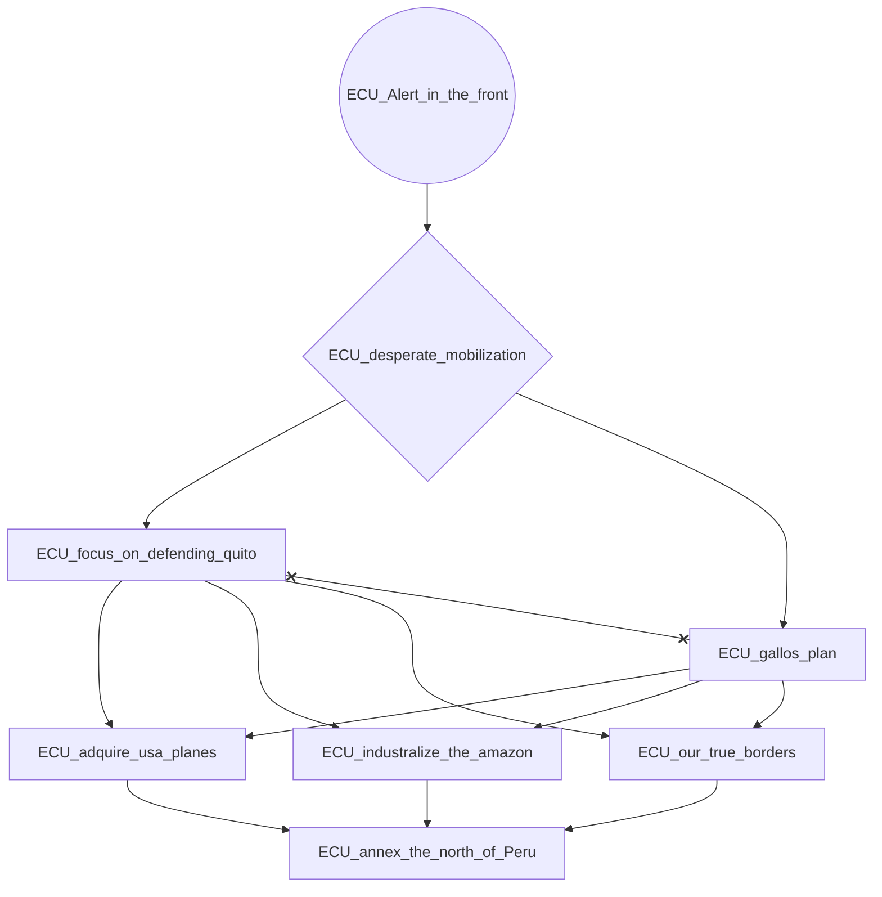

# ECU_Alert_in_the_front

```mermaid
flowchart TD
    n1(("ECU_Alert_in_the_front"))
    n2["ECU_adquire_usa_planes"]
    n3["ECU_annex_the_north_of_Peru"]
    n4{"ECU_desperate_mobilization"}
    n5["ECU_focus_on_defending_quito"]
    n6["ECU_gallos_plan"]
    n7["ECU_industralize_the_amazon"]
    n8["ECU_our_true_borders"]
    n5 --> n2
    n6 --> n2
    n7 --> n3
    n8 --> n3
    n2 --> n3
    n1 --> n4
    n4 --> n5
    n4 --> n6
    n5 --> n7
    n6 --> n7
    n5 --> n8
    n6 --> n8
    n5 x--x n6
```
