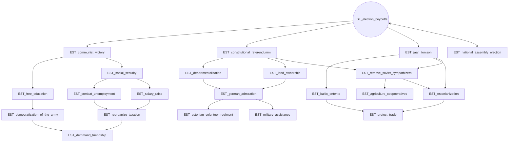
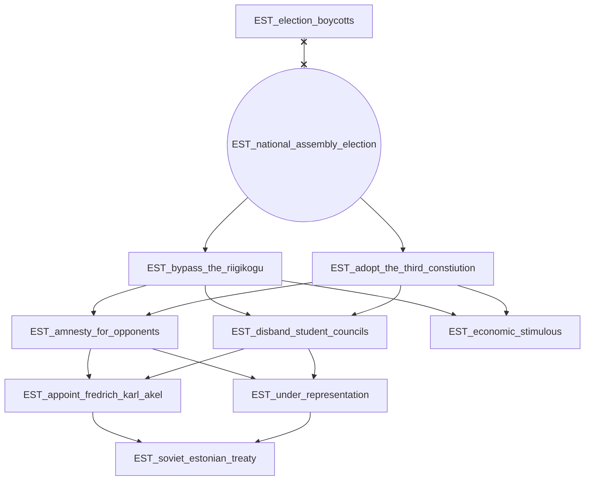

# EST_election_boycotts

```mermaid
flowchart TD
    n1["EST_agriculture_coopoeratives"]
    n2["EST_baltic_entente"]
    n3["EST_combat_unemployment"]
    n4["EST_communist_victory"]
    n5["EST_constitutional_referendumm"]
    n6["EST_demmand_friendship"]
    n7["EST_democratization_of_the_army"]
    n8["EST_departmentalization"]
    n9(("EST_election_boycotts"))
    n10["EST_estonian_volunteer_regiment"]
    n11["EST_estonianization"]
    n12["EST_free_education"]
    n13["EST_german_admiration"]
    n14["EST_jaan_tonison"]
    n15["EST_land_ownership"]
    n16["EST_military_assistance"]
    n17["EST_national_assembly_election"]
    n18["EST_protect_trade"]
    n19["EST_remove_soviet_sympathizers"]
    n20["EST_reorganize_taxation"]
    n21["EST_salary_raise"]
    n22["EST_social_security"]
    n19 --> n1
    n14 --> n2
    n22 --> n3
    n9 --> n4
    n9 --> n5
    n7 --> n6
    n20 --> n6
    n12 --> n7
    n5 --> n8
    n13 --> n10
    n19 --> n11
    n14 --> n11
    n4 --> n12
    n8 --> n13
    n15 --> n13
    n9 --> n14
    n5 --> n15
    n13 --> n16
    n11 --> n18
    n2 --> n18
    n14 --> n19
    n5 --> n19
    n21 --> n20
    n3 --> n20
    n22 --> n21
    n4 --> n22
    n9 x--x n17
```

# EST_national_assembly_election

```mermaid
flowchart TD
    n23["EST_adopt_the_third_constiution"]
    n24["EST_amnesty_for_opponents"]
    n25["EST_appoint_fredrich_karl_akel"]
    n26["EST_bypass_the_riigikogu"]
    n27["EST_disband_student_councils"]
    n28["EST_economic_stimulous"]
    n9["EST_election_boycotts"]
    n17(("EST_national_assembly_election"))
    n29["EST_soviet_estonian_treaty"]
    n30["EST_under_representation"]
    n17 --> n23
    n26 --> n24
    n23 --> n24
    n24 --> n25
    n27 --> n25
    n17 --> n26
    n26 --> n27
    n23 --> n27
    n26 --> n28
    n23 --> n28
    n25 --> n29
    n30 --> n29
    n24 --> n30
    n27 --> n30
    n9 x--x n17
```
