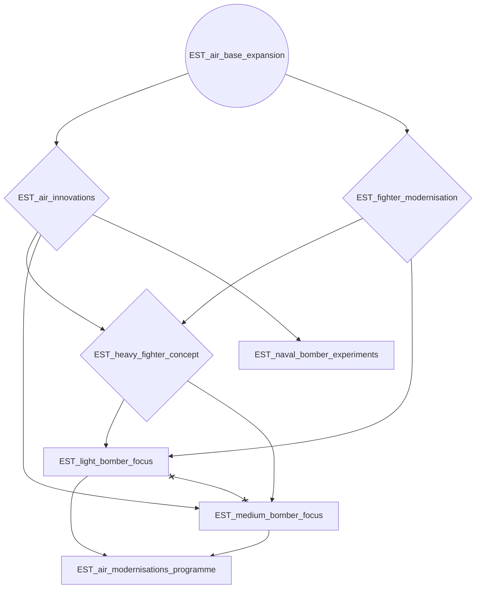
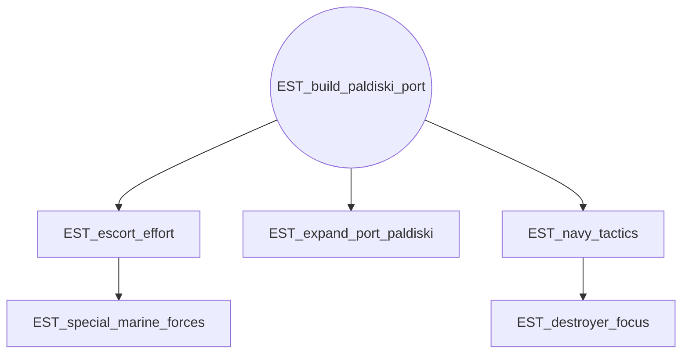
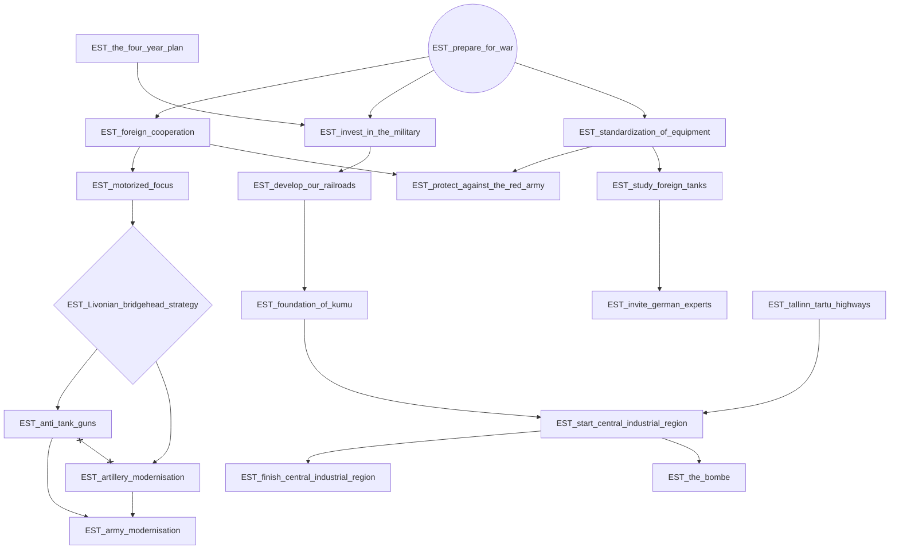
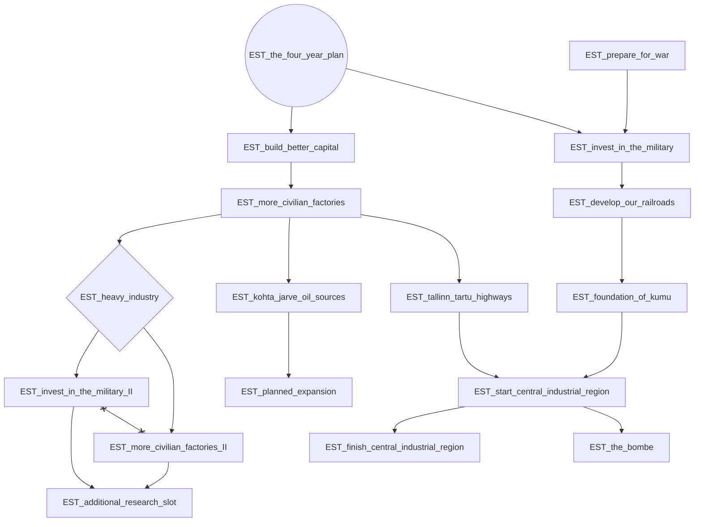

# EST_air_base_expansion

```mermaid
flowchart TD
    n1(("EST_air_base_expansion"))
    n2{"EST_air_innovations"}
    n3["EST_air_modernisations_programme"]
    n4{"EST_fighter_modernisation"}
    n5{"EST_heavy_fighter_concept"}
    n6["EST_light_bomber_focus"]
    n7["EST_medium_bomber_focus"]
    n8["EST_naval_bomber_experiments"]
    n1 --> n2
    n6 --> n3
    n7 --> n3
    n1 --> n4
    n2 --> n5
    n4 --> n5
    n5 --> n6
    n4 --> n6
    n5 --> n7
    n2 --> n7
    n2 --> n8
    n6 x--x n7
```

# EST_build_paldiski_port

```mermaid
flowchart TD
    n9(("EST_build_paldiski_port"))
    n10["EST_destroyer_focus"]
    n11["EST_escort_effort"]
    n12["EST_expand_port_paldiski"]
    n13["EST_navy_tactics"]
    n14["EST_special_marine_forces"]
    n13 --> n10
    n9 --> n11
    n9 --> n12
    n9 --> n13
    n11 --> n14
```

# EST_prepare_for_war

```mermaid
flowchart TD
    n15{"EST_Livonian_bridgehead_strategy"}
    n16["EST_anti_tank_guns"]
    n17["EST_army_modernisation"]
    n18["EST_artillery_modernisation"]
    n19["EST_develop_our_railroads"]
    n20["EST_finish_central_industrial_region"]
    n21["EST_foreign_cooperation"]
    n22["EST_foundation_of_kumu"]
    n23["EST_invest_in_the_military"]
    n24["EST_invite_german_experts"]
    n25["EST_motorized_focus"]
    n26(("EST_prepare_for_war"))
    n27["EST_protect_against_the_red_army"]
    n28["EST_standardization_of_equipment"]
    n29["EST_start_central_industrial_region"]
    n30["EST_study_foreign_tanks"]
    n31["EST_tallinn_tartu_highways"]
    n32["EST_the_bombe"]
    n33["EST_the_four_year_plan"]
    n25 --> n15
    n15 --> n16
    n16 --> n17
    n18 --> n17
    n15 --> n18
    n23 --> n19
    n29 --> n20
    n26 --> n21
    n19 --> n22
    n33 --> n23
    n26 --> n23
    n30 --> n24
    n21 --> n25
    n21 --> n27
    n28 --> n27
    n26 --> n28
    n31 --> n29
    n22 --> n29
    n28 --> n30
    n29 --> n32
    n16 x--x n18
```

# EST_the_four_year_plan

```mermaid
flowchart TD
    n34["EST_additional_research_slot"]
    n35["EST_build_better_capital"]
    n19["EST_develop_our_railroads"]
    n20["EST_finish_central_industrial_region"]
    n22["EST_foundation_of_kumu"]
    n36{"EST_heavy_industry"}
    n23["EST_invest_in_the_military"]
    n37["EST_invest_in_the_military_II"]
    n38["EST_kohta_jarve_oil_sources"]
    n39["EST_more_civilian_factories"]
    n40["EST_more_civilian_factories_II"]
    n41["EST_planned_expansion"]
    n26["EST_prepare_for_war"]
    n29["EST_start_central_industrial_region"]
    n31["EST_tallinn_tartu_highways"]
    n32["EST_the_bombe"]
    n33(("EST_the_four_year_plan"))
    n40 --> n34
    n37 --> n34
    n33 --> n35
    n23 --> n19
    n29 --> n20
    n19 --> n22
    n39 --> n36
    n33 --> n23
    n26 --> n23
    n36 --> n37
    n39 --> n38
    n35 --> n39
    n36 --> n40
    n38 --> n41
    n31 --> n29
    n22 --> n29
    n39 --> n31
    n29 --> n32
    n37 x--x n40
```
