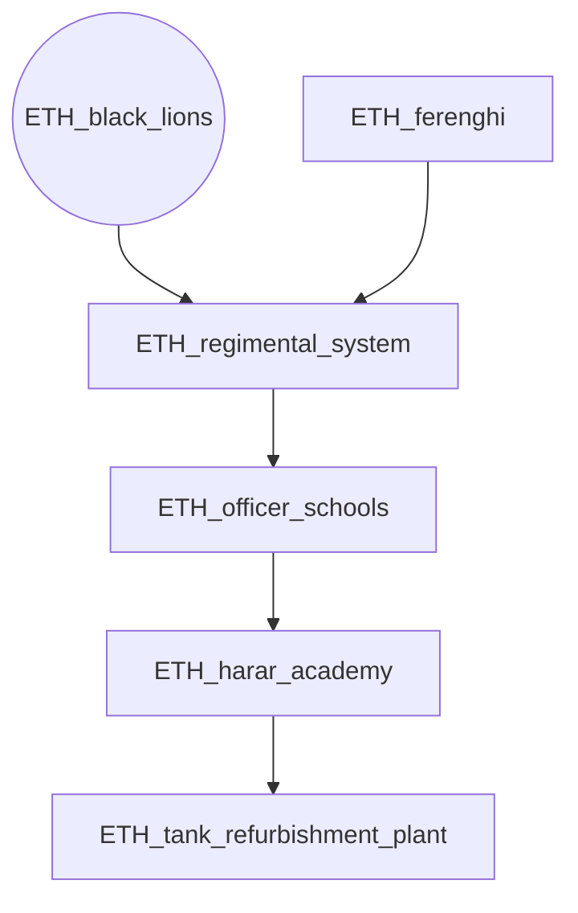
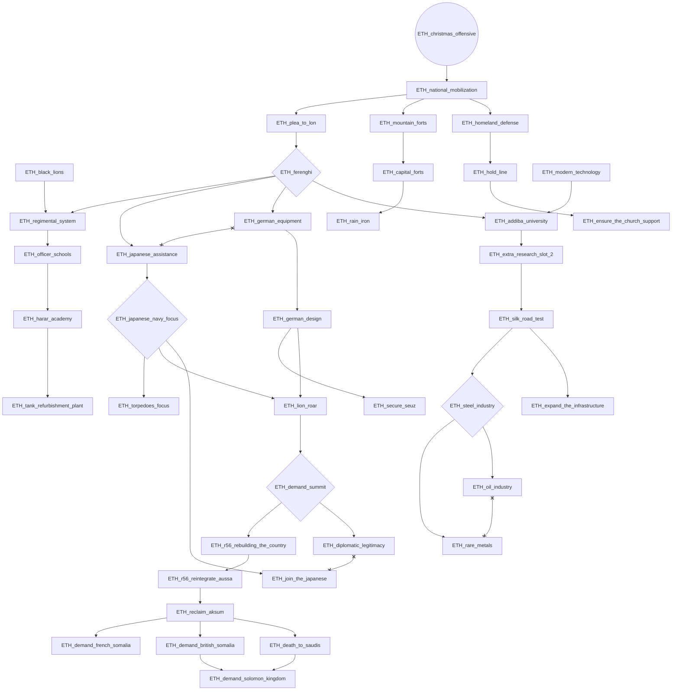
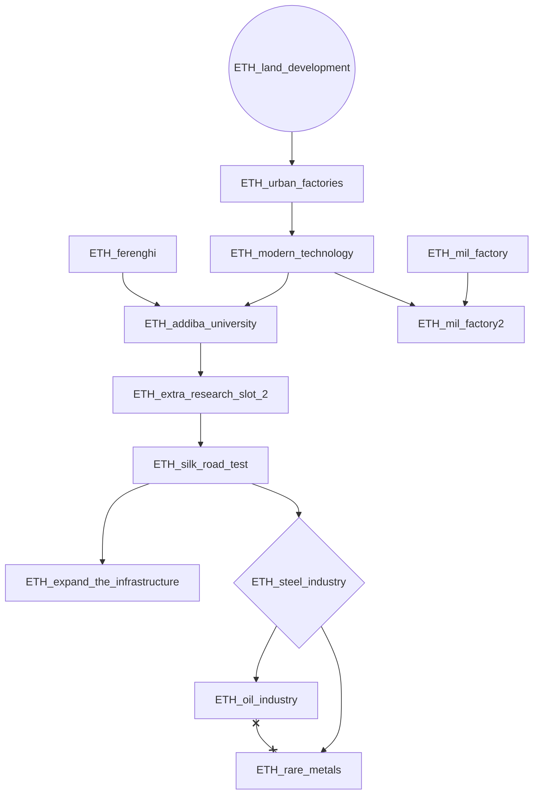
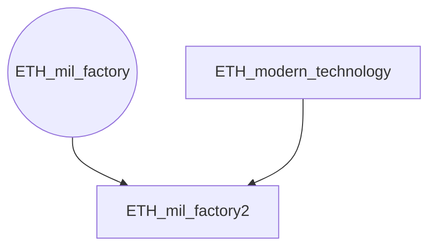
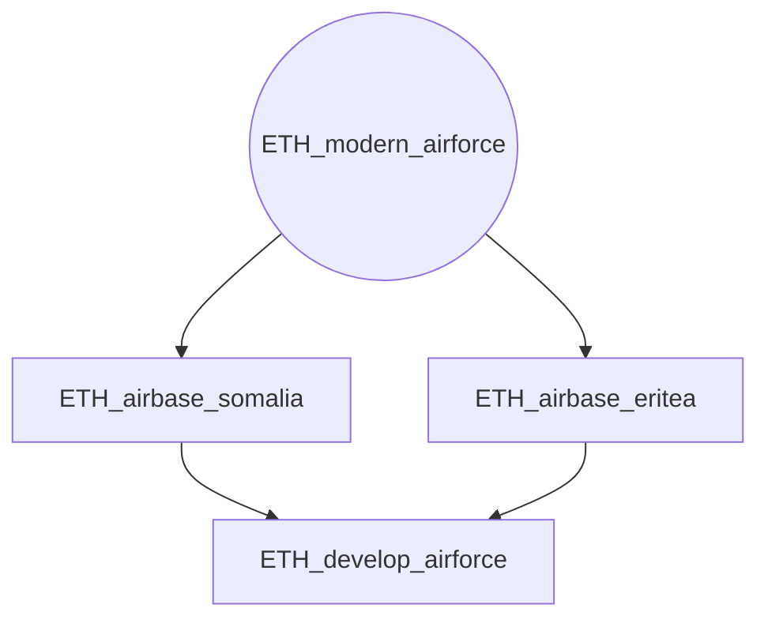
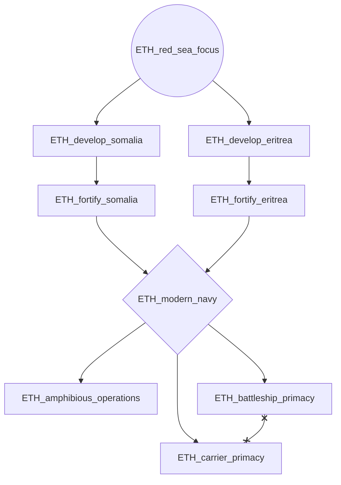

# ETH_black_lions

```mermaid
flowchart TD
    n1(("ETH_black_lions"))
    n2["ETH_ferenghi"]
    n3["ETH_harar_academy"]
    n4["ETH_officer_schools"]
    n5["ETH_regimental_system"]
    n6["ETH_tank_refurbishment_plant"]
    n4 --> n3
    n5 --> n4
    n1 --> n5
    n2 --> n5
    n3 --> n6
```

# ETH_christmas_offensive

```mermaid
flowchart TD
    n7["ETH_addiba_university"]
    n1["ETH_black_lions"]
    n8["ETH_capital_forts"]
    n9(("ETH_christmas_offensive"))
    n10["ETH_death_to_saudis"]
    n11["ETH_demand_british_somalia"]
    n12["ETH_demand_french_somalia"]
    n13["ETH_demand_solomon_kingdom"]
    n14{"ETH_demand_summit"}
    n15["ETH_diplomatic_legitimacy"]
    n16["ETH_ensure_the_church_support"]
    n17["ETH_expand_the_infrastructure"]
    n18["ETH_extra_research_slot_2"]
    n2{"ETH_ferenghi"}
    n19["ETH_german_design"]
    n20["ETH_german_equipment"]
    n3["ETH_harar_academy"]
    n21["ETH_hold_line"]
    n22["ETH_homeland_defense"]
    n23["ETH_japanese_assistance"]
    n24{"ETH_japanese_navy_focus"}
    n25["ETH_join_the_japanese"]
    n26["ETH_lion_roar"]
    n27["ETH_modern_technology"]
    n28["ETH_mountain_forts"]
    n29["ETH_national_mobilization"]
    n4["ETH_officer_schools"]
    n30["ETH_oil_industry"]
    n31["ETH_plea_to_lon"]
    n32["ETH_r56_rebuilding_the_country"]
    n33["ETH_r56_reintegrate_aussa"]
    n34["ETH_rain_iron"]
    n35["ETH_rare_metals"]
    n36["ETH_reclaim_aksum"]
    n5["ETH_regimental_system"]
    n37["ETH_secure_seuz"]
    n38["ETH_silk_road_test"]
    n39{"ETH_steel_industry"}
    n6["ETH_tank_refurbishment_plant"]
    n40["ETH_torpedoes_focus"]
    n27 --> n7
    n2 --> n7
    n28 --> n8
    n36 --> n10
    n36 --> n11
    n36 --> n12
    n10 --> n13
    n11 --> n13
    n26 --> n14
    n14 --> n15
    n21 --> n16
    n38 --> n17
    n7 --> n18
    n31 --> n2
    n20 --> n19
    n2 --> n20
    n4 --> n3
    n22 --> n21
    n29 --> n22
    n2 --> n23
    n23 --> n24
    n24 --> n25
    n24 --> n26
    n19 --> n26
    n29 --> n28
    n9 --> n29
    n5 --> n4
    n39 --> n30
    n29 --> n31
    n14 --> n32
    n32 --> n33
    n8 --> n34
    n39 --> n35
    n33 --> n36
    n1 --> n5
    n2 --> n5
    n19 --> n37
    n18 --> n38
    n38 --> n39
    n3 --> n6
    n24 --> n40
    n15 x--x n25
    n20 x--x n23
    n30 x--x n35
```

# ETH_land_development

```mermaid
flowchart TD
    n7["ETH_addiba_university"]
    n17["ETH_expand_the_infrastructure"]
    n18["ETH_extra_research_slot_2"]
    n2["ETH_ferenghi"]
    n41(("ETH_land_development"))
    n42["ETH_mil_factory"]
    n43["ETH_mil_factory2"]
    n27["ETH_modern_technology"]
    n30["ETH_oil_industry"]
    n35["ETH_rare_metals"]
    n38["ETH_silk_road_test"]
    n39{"ETH_steel_industry"}
    n44["ETH_urban_factories"]
    n27 --> n7
    n2 --> n7
    n38 --> n17
    n7 --> n18
    n42 --> n43
    n27 --> n43
    n44 --> n27
    n39 --> n30
    n39 --> n35
    n18 --> n38
    n38 --> n39
    n41 --> n44
    n30 x--x n35
```

# ETH_mil_factory

```mermaid
flowchart TD
    n42(("ETH_mil_factory"))
    n43["ETH_mil_factory2"]
    n27["ETH_modern_technology"]
    n42 --> n43
    n27 --> n43
```

# ETH_modern_airforce

```mermaid
flowchart TD
    n45["ETH_airbase_eritea"]
    n46["ETH_airbase_somalia"]
    n47["ETH_develop_airforce"]
    n48(("ETH_modern_airforce"))
    n48 --> n45
    n48 --> n46
    n46 --> n47
    n45 --> n47
```

# ETH_red_sea_focus

```mermaid
flowchart TD
    n49["ETH_amphibious_operations"]
    n50["ETH_battleship_primacy"]
    n51["ETH_carrier_primacy"]
    n52["ETH_develop_eritrea"]
    n53["ETH_develop_somalia"]
    n54["ETH_fortify_eritrea"]
    n55["ETH_fortify_somalia"]
    n56{"ETH_modern_navy"}
    n57(("ETH_red_sea_focus"))
    n56 --> n49
    n56 --> n50
    n56 --> n51
    n57 --> n52
    n57 --> n53
    n52 --> n54
    n53 --> n55
    n55 --> n56
    n54 --> n56
    n50 x--x n51
```
