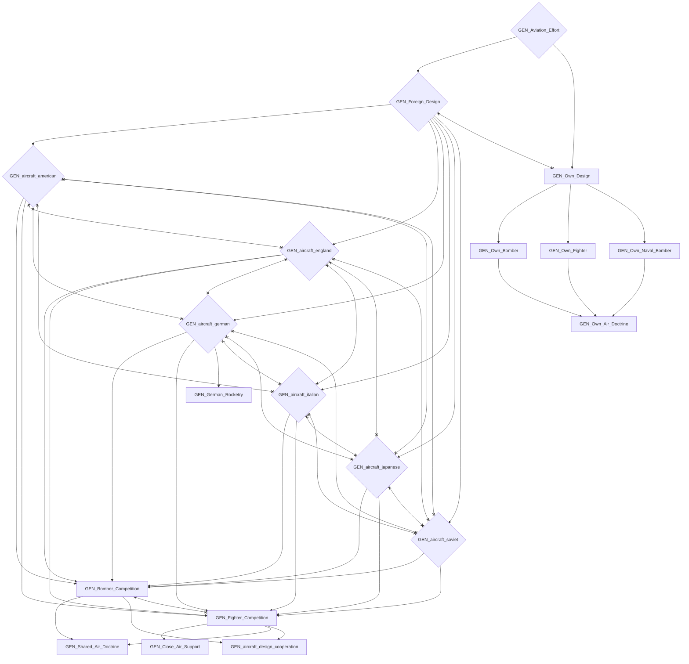
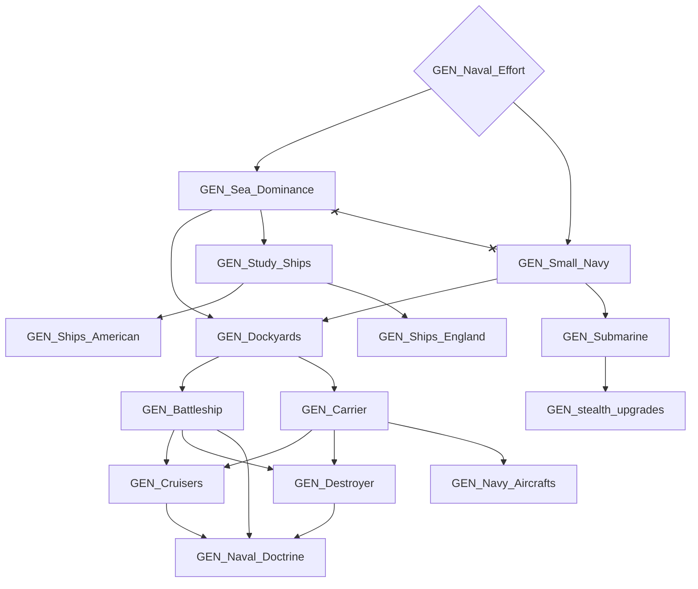
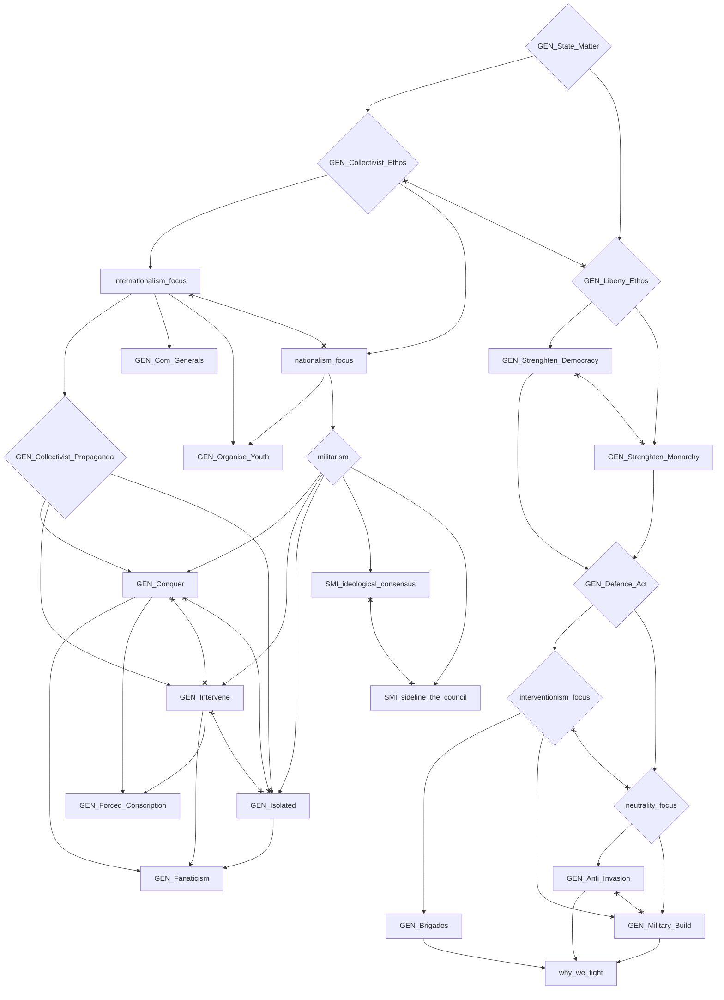
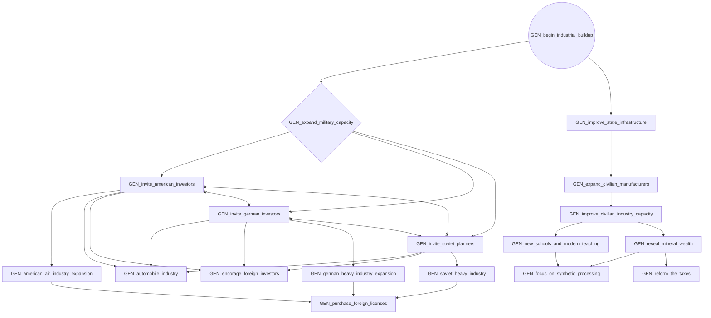
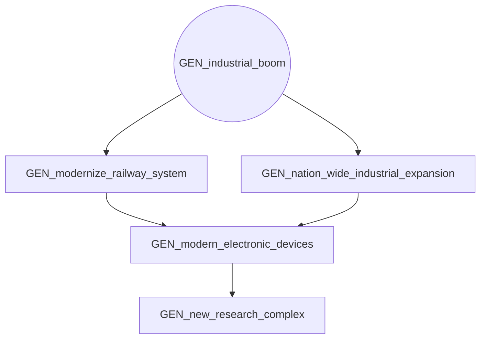

# GEN_Aviation_Effort

```mermaid
flowchart TD
    n1{"GEN_Aviation_Effort"}
    n2["GEN_Bomber_Competition"]
    n3["GEN_Close_Air_Support"]
    n4["GEN_Fighter_Competition"]
    n5{"GEN_Foreign_Design"}
    n6["GEN_German_Rocketry"]
    n7["GEN_Own_Air_Doctrine"]
    n8["GEN_Own_Bomber"]
    n9["GEN_Own_Design"]
    n10["GEN_Own_Fighter"]
    n11["GEN_Own_Naval_Bomber"]
    n12["GEN_Shared_Air_Doctrine"]
    n13{"GEN_aircraft_american"}
    n14["GEN_aircraft_design_cooperation"]
    n15{"GEN_aircraft_england"}
    n16{"GEN_aircraft_german"}
    n17{"GEN_aircraft_italian"}
    n18{"GEN_aircraft_japanese"}
    n19{"GEN_aircraft_soviet"}
    n16 --> n2
    n15 --> n2
    n13 --> n2
    n19 --> n2
    n17 --> n2
    n18 --> n2
    n4 --> n3
    n16 --> n4
    n15 --> n4
    n13 --> n4
    n19 --> n4
    n17 --> n4
    n18 --> n4
    n1 --> n5
    n16 --> n6
    n10 --> n7
    n8 --> n7
    n11 --> n7
    n9 --> n8
    n1 --> n9
    n9 --> n10
    n9 --> n11
    n4 --> n12
    n2 --> n12
    n5 --> n13
    n4 --> n14
    n2 --> n14
    n5 --> n15
    n5 --> n16
    n5 --> n17
    n5 --> n18
    n5 --> n19
    n2 x--x n4
    n5 x--x n9
    n13 x--x n15
    n13 x--x n16
    n13 x--x n17
    n13 x--x n18
    n13 x--x n19
    n15 x--x n16
    n15 x--x n17
    n15 x--x n18
    n15 x--x n19
    n16 x--x n17
    n16 x--x n18
    n16 x--x n19
    n17 x--x n18
    n17 x--x n19
    n18 x--x n19
```

# GEN_Naval_Effort

```mermaid
flowchart TD
    n20["GEN_Battleship"]
    n21["GEN_Carrier"]
    n22["GEN_Cruisers"]
    n23["GEN_Destroyer"]
    n24["GEN_Dockyards"]
    n25["GEN_Naval_Doctrine"]
    n26{"GEN_Naval_Effort"}
    n27["GEN_Navy_Aircrafts"]
    n28["GEN_Sea_Dominance"]
    n29["GEN_Ships_American"]
    n30["GEN_Ships_England"]
    n31["GEN_Small_Navy"]
    n32["GEN_Study_Ships"]
    n33["GEN_Submarine"]
    n34["GEN_stealth_upgrades"]
    n24 --> n20
    n24 --> n21
    n20 --> n22
    n21 --> n22
    n20 --> n23
    n21 --> n23
    n31 --> n24
    n28 --> n24
    n22 --> n25
    n23 --> n25
    n20 --> n25
    n21 --> n27
    n26 --> n28
    n32 --> n29
    n32 --> n30
    n26 --> n31
    n28 --> n32
    n31 --> n33
    n33 --> n34
    n28 x--x n31
```

# GEN_State_Matter

```mermaid
flowchart TD
    n35["GEN_Anti_Invasion"]
    n36["GEN_Brigades"]
    n37{"GEN_Collectivist_Ethos"}
    n38{"GEN_Collectivist_Propaganda"}
    n39["GEN_Com_Generals"]
    n40["GEN_Conquer"]
    n41{"GEN_Defence_Act"}
    n42["GEN_Fanaticism"]
    n43["GEN_Forced_Conscription"]
    n44["GEN_Intervene"]
    n45["GEN_Isolated"]
    n46{"GEN_Liberty_Ethos"}
    n47["GEN_Military_Build"]
    n48["GEN_Organise_Youth"]
    n49{"GEN_State_Matter"}
    n50["GEN_Strenghten_Democracy"]
    n51["GEN_Strenghten_Monarchy"]
    n52["SMI_ideological_consensus"]
    n53["SMI_sideline_the_council"]
    n54["internationalism_focus"]
    n55{"interventionism_focus"}
    n56{"militarism"}
    n57["nationalism_focus"]
    n58{"neutrality_focus"}
    n59["why_we_fight"]
    n58 --> n35
    n55 --> n36
    n49 --> n37
    n54 --> n38
    n54 --> n39
    n56 --> n40
    n38 --> n40
    n51 --> n41
    n50 --> n41
    n45 --> n42
    n44 --> n42
    n40 --> n42
    n40 --> n43
    n44 --> n43
    n56 --> n44
    n38 --> n44
    n56 --> n45
    n38 --> n45
    n49 --> n46
    n58 --> n47
    n55 --> n47
    n57 --> n48
    n54 --> n48
    n46 --> n50
    n46 --> n51
    n56 --> n52
    n56 --> n53
    n37 --> n54
    n41 --> n55
    n57 --> n56
    n37 --> n57
    n41 --> n58
    n35 --> n59
    n47 --> n59
    n36 --> n59
    n35 x--x n47
    n37 x--x n46
    n40 x--x n44
    n40 x--x n45
    n44 x--x n45
    n50 x--x n51
    n52 x--x n53
    n54 x--x n57
    n55 x--x n58
```

# GEN_begin_industrial_buildup

```mermaid
flowchart TD
    n60["GEN_american_air_industry_expansion"]
    n61["GEN_automobile_industry"]
    n62(("GEN_begin_industrial_buildup"))
    n63["GEN_encorage_foreign_investors"]
    n64["GEN_expand_civilian_manufacturers"]
    n65{"GEN_expand_military_capacity"}
    n66["GEN_focus_on_synthetic_processing"]
    n67["GEN_german_heavy_industry_expansion"]
    n68["GEN_improve_civilian_industry_capacity"]
    n69["GEN_improve_state_infrastructure"]
    n70["GEN_invite_american_investors"]
    n71["GEN_invite_german_investors"]
    n72["GEN_invite_soviet_planners"]
    n73["GEN_new_schools_and_modern_teaching"]
    n74["GEN_purchase_foreign_licenses"]
    n75["GEN_reform_the_taxes"]
    n76["GEN_reveal_mineral_wealth"]
    n77["GEN_soviet_heavy_industry"]
    n70 --> n60
    n70 --> n61
    n71 --> n61
    n72 --> n61
    n70 --> n63
    n71 --> n63
    n72 --> n63
    n69 --> n64
    n62 --> n65
    n76 --> n66
    n73 --> n66
    n71 --> n67
    n64 --> n68
    n62 --> n69
    n65 --> n70
    n65 --> n71
    n65 --> n72
    n68 --> n73
    n60 --> n74
    n67 --> n74
    n77 --> n74
    n76 --> n75
    n68 --> n76
    n72 --> n77
    n70 x--x n71
    n70 x--x n72
    n71 x--x n72
```

# GEN_industrial_boom

```mermaid
flowchart TD
    n78(("GEN_industrial_boom"))
    n79["GEN_modern_electronic_devices"]
    n80["GEN_modernize_railway_system"]
    n81["GEN_nation_wide_industrial_expansion"]
    n82["GEN_new_research_complex"]
    n80 --> n79
    n81 --> n79
    n78 --> n80
    n78 --> n81
    n79 --> n82
```
