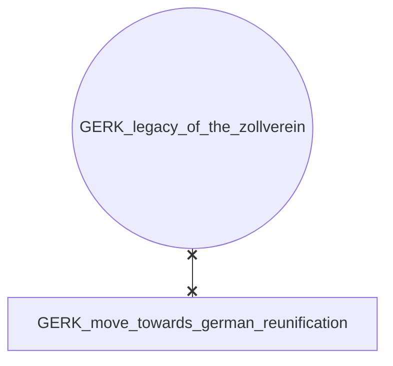
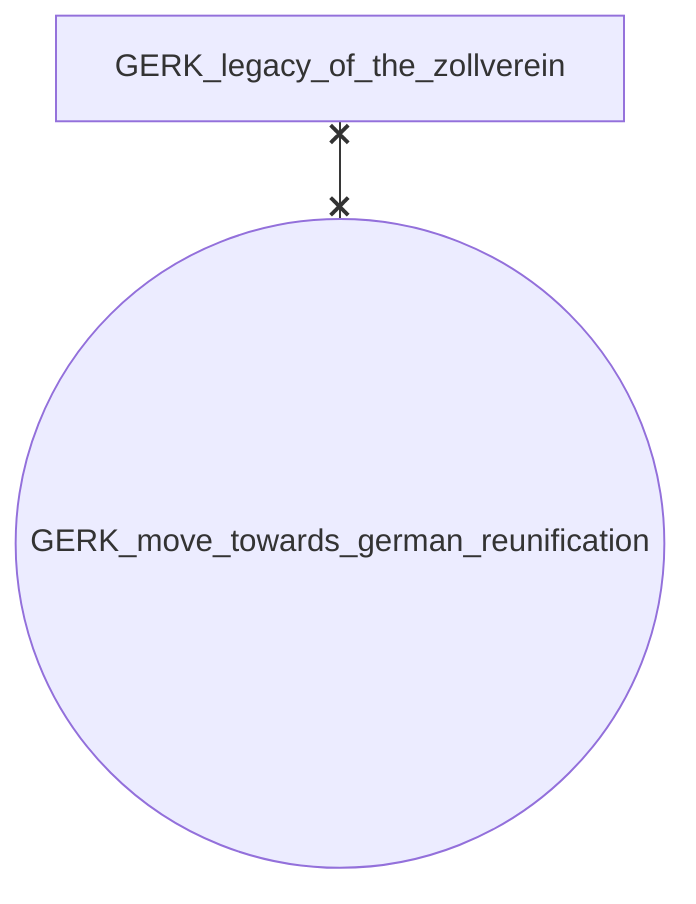
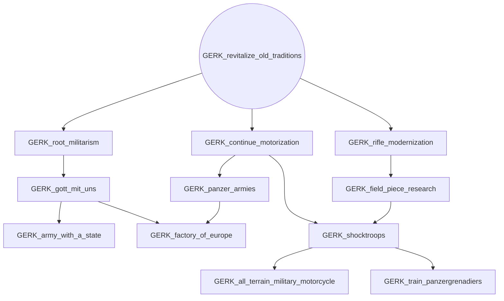

# GERK_legacy_of_the_zollverein

```mermaid
flowchart TD
    n1(("GERK_legacy_of_the_zollverein"))
    n2["GERK_move_towards_german_reunification"]
    n1 x--x n2
```

# GERK_move_towards_german_reunification

```mermaid
flowchart TD
    n1["GERK_legacy_of_the_zollverein"]
    n2(("GERK_move_towards_german_reunification"))
    n1 x--x n2
```

# GERK_revitalize_old_traditions

```mermaid
flowchart TD
    n3["GERK_all_terrain_military_motorcycle"]
    n4["GERK_army_with_a_state"]
    n5["GERK_continue_motorization"]
    n6["GERK_factory_of_europe"]
    n7["GERK_field_piece_research"]
    n8["GERK_gott_mit_uns"]
    n9["GERK_panzer_armies"]
    n10(("GERK_revitalize_old_traditions"))
    n11["GERK_rifle_modernization"]
    n12["GERK_root_militarism"]
    n13["GERK_shocktroops"]
    n14["GERK_train_panzergrenadiers"]
    n13 --> n3
    n8 --> n4
    n10 --> n5
    n9 --> n6
    n8 --> n6
    n11 --> n7
    n12 --> n8
    n5 --> n9
    n10 --> n11
    n10 --> n12
    n7 --> n13
    n5 --> n13
    n13 --> n14
```
