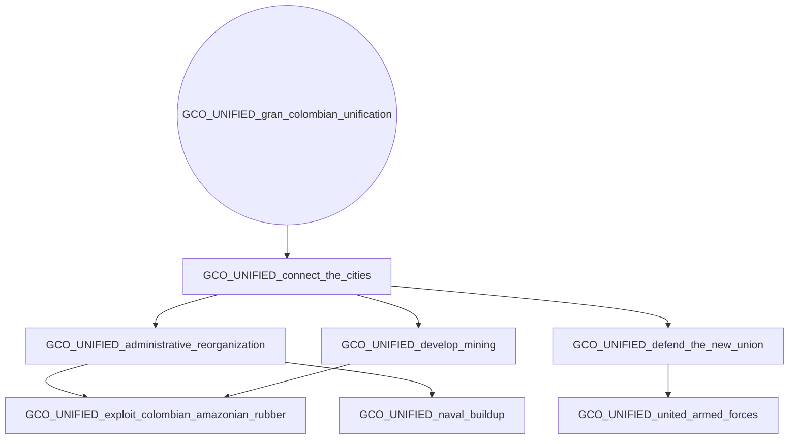

# GCO_UNIFIED_gran_colombian_unification

```mermaid
flowchart TD
    n1["GCO_UNIFIED_administrative_reorganization"]
    n2["GCO_UNIFIED_connect_the_cities"]
    n3["GCO_UNIFIED_defend_the_new_union"]
    n4["GCO_UNIFIED_develop_mining"]
    n5["GCO_UNIFIED_exploit_colombian_amazonian_rubber"]
    n6(("GCO_UNIFIED_gran_colombian_unification"))
    n7["GCO_UNIFIED_naval_buildup"]
    n8["GCO_UNIFIED_united_armed_forces"]
    n2 --> n1
    n6 --> n2
    n2 --> n3
    n2 --> n4
    n1 --> n5
    n4 --> n5
    n1 --> n7
    n3 --> n8
```
