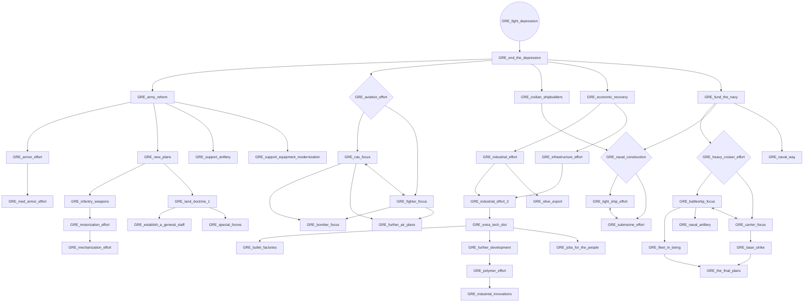

# GRE_fight_depression

```mermaid
flowchart TD
    n1["GRE_armor_effort"]
    n2["GRE_army_reform"]
    n3{"GRE_aviation_effort"}
    n4["GRE_base_strike"]
    n5["GRE_battleship_focus"]
    n6["GRE_bomber_focus"]
    n7["GRE_bullet_factories"]
    n8["GRE_carrier_focus"]
    n9["GRE_cas_focus"]
    n10["GRE_civilian_shipbuilders"]
    n11["GRE_economic_recovery"]
    n12["GRE_end_the_depression"]
    n13["GRE_establish_a_general_staff"]
    n14["GRE_extra_tech_slot"]
    n15(("GRE_fight_depression"))
    n16["GRE_fighter_focus"]
    n17["GRE_fleet_in_being"]
    n18["GRE_fund_the_navy"]
    n19["GRE_further_air_plans"]
    n20["GRE_further_development"]
    n21{"GRE_heavy_cruiser_effort"}
    n22["GRE_industrial_effort"]
    n23["GRE_industrial_effort_2"]
    n24["GRE_industrial_innovations"]
    n25["GRE_infantry_weapons"]
    n26["GRE_infrastructure_effort"]
    n27["GRE_jobs_for_the_people"]
    n28["GRE_land_doctrine_1"]
    n29["GRE_light_ship_effort"]
    n30["GRE_mechanization_effort"]
    n31["GRE_med_armor_effort"]
    n32["GRE_motorization_effort"]
    n33["GRE_naval_artillery"]
    n34{"GRE_naval_construction"}
    n35["GRE_naval_way"]
    n36["GRE_new_plans"]
    n37["GRE_olive_export"]
    n38["GRE_polymer_effort"]
    n39["GRE_special_forces"]
    n40["GRE_submarine_effort"]
    n41["GRE_support_artillery"]
    n42["GRE_support_equipment_modernization"]
    n43["GRE_the_final_plans"]
    n2 --> n1
    n12 --> n2
    n12 --> n3
    n8 --> n4
    n21 --> n5
    n16 --> n6
    n9 --> n6
    n14 --> n7
    n21 --> n8
    n3 --> n9
    n12 --> n10
    n12 --> n11
    n15 --> n12
    n28 --> n13
    n23 --> n14
    n3 --> n16
    n5 --> n17
    n12 --> n18
    n16 --> n19
    n9 --> n19
    n14 --> n20
    n18 --> n21
    n11 --> n22
    n22 --> n23
    n26 --> n23
    n38 --> n24
    n36 --> n25
    n11 --> n26
    n14 --> n27
    n36 --> n28
    n34 --> n29
    n32 --> n30
    n1 --> n31
    n25 --> n32
    n5 --> n33
    n18 --> n34
    n10 --> n34
    n18 --> n35
    n2 --> n36
    n22 --> n37
    n20 --> n38
    n28 --> n39
    n34 --> n40
    n2 --> n41
    n2 --> n42
    n4 --> n43
    n17 --> n43
    n5 x--x n8
    n9 x--x n16
    n29 x--x n40
```

# GRE_political_awakening

```mermaid
flowchart TD
    n44["GRE_Reinforce_the_hierarchy"]
    n45["GRE_a_stong_kingdom"]
    n46["GRE_abandon_the_west"]
    n47["GRE_absolute_monarchy"]
    n48["GRE_aftermath_of_the_victory_of_the_people"]
    n49["GRE_agrarian_protests"]
    n50["GRE_aid_the_pcr"]
    n51{"GRE_alliances"}
    n52["GRE_allied_membership"]
    n53["GRE_ally_the_balkans"]
    n54["GRE_ask_for_cyprus"]
    n55["GRE_befriend_britain"]
    n56["GRE_befriend_france"]
    n57{"GRE_befriend_germany"}
    n58{"GRE_befriend_italy"}
    n59["GRE_befriend_sov"]
    n60["GRE_begin_internal_reforms"]
    n61["GRE_begin_reconstruction"]
    n62["GRE_british_allignment"]
    n63["GRE_british_innovetions"]
    n64["GRE_buy_sov_guns"]
    n65["GRE_city_defenses"]
    n66["GRE_control_the_stocks"]
    n67["GRE_create_EON"]
    n68["GRE_create_a_new_economic_plan"]
    n69["GRE_create_the_IKA"]
    n70["GRE_create_the_civil_guard"]
    n71["GRE_crush_kke"]
    n72["GRE_deal_with_klaras"]
    n73["GRE_demand_dodecanese"]
    n74["GRE_demand_east_thrace"]
    n75["GRE_democratic_approach"]
    n76["GRE_democratic_economic_policy"]
    n77["GRE_denounce_metaxism"]
    n78["GRE_devout_to_the_monarchy"]
    n79["GRE_diplomatic_actions"]
    n80{"GRE_divided_nation"}
    n81["GRE_dodecanese_for_membership"]
    n82["GRE_dominant_ideology"]
    n83["GRE_dont_tread_the_empire"]
    n84["GRE_embrace_metaxism"]
    n85["GRE_enforce_nationalization"]
    n86["GRE_enosis"]
    n87["GRE_ensure_stability"]
    n88["GRE_establish_the_royal_armory"]
    n89{"GRE_expansionism"}
    n90["GRE_fate_of_the_royal_family"]
    n91["GRE_foreign_investments"]
    n92["GRE_form_new_government"]
    n93["GRE_found_opla"]
    n94["GRE_french_innovations"]
    n95["GRE_glorify_race"]
    n96["GRE_honor_byzantium"]
    n97["GRE_improve_roads"]
    n98["GRE_internal_affairs"]
    n99["GRE_international_socialist_volunteers"]
    n100["GRE_invite_albania"]
    n101["GRE_invite_bulgaria"]
    n102["GRE_invite_yugoslavia"]
    n103["GRE_italian_war"]
    n104["GRE_join_balkan_entente"]
    n105["GRE_join_comintern"]
    n106["GRE_join_the_axis"]
    n107["GRE_join_the_balkanic_revolution"]
    n108["GRE_joint_economic_cooperation_with_the_ussr"]
    n109["GRE_king_general"]
    n110["GRE_king_george_line"]
    n111["GRE_liberate_the_straits"]
    n112{"GRE_marxs_dream"}
    n113["GRE_megali_idea"]
    n114["GRE_metaxa_militarism"]
    n115["GRE_metaxas_bullet_industry"]
    n116["GRE_metaxas_industry"]
    n117["GRE_metaxas_line"]
    n118["GRE_metaxas_line_expanded"]
    n119["GRE_metaxas_unions"]
    n120["GRE_military_reforms"]
    n121["GRE_military_teachings"]
    n122["GRE_monarchist_fervour"]
    n123["GRE_national_security_concerns"]
    n124["GRE_national_union"]
    n125["GRE_no_allignment"]
    n126(("GRE_political_awakening"))
    n127["GRE_political_opposition"]
    n128{"GRE_prepare_expansion"}
    n129{"GRE_promote_peace_in_the_balkans"}
    n130["GRE_protect_albania"]
    n131["GRE_protect_northern_minorities"]
    n132["GRE_purchase_cyprus"]
    n133["GRE_purge_remaining_fascist_remnants"]
    n134{"GRE_purge_republicans"}
    n135["GRE_reclaim_cyprus"]
    n136["GRE_reclaim_dodecanese"]
    n137["GRE_recruitment_focus"]
    n138["GRE_reform_agricultural_economy"]
    n139["GRE_reinforce_4th_of_august_regime"]
    n140{"GRE_reinforce_royal_dictatorship"}
    n141["GRE_restaff_the_army_command"]
    n142["GRE_rival_germany"]
    n143["GRE_rival_italy"]
    n144["GRE_royal_guards"]
    n145["GRE_royal_roads"]
    n146["GRE_share_power"]
    n147["GRE_strategic_interests"]
    n148["GRE_subjugate_albania"]
    n149["GRE_subjugate_bulgaria"]
    n150["GRE_subjugate_yugoslavia"]
    n151["GRE_surprise_attack_italy"]
    n152["GRE_third_hellenic_civilization_r56"]
    n153["GRE_utopian_paradise"]
    n154["GRE_welfare_state"]
    n155{"GRE_world_stage"}
    n133 --> n44
    n96 --> n45
    n132 --> n45
    n135 --> n45
    n146 --> n45
    n47 --> n45
    n155 --> n46
    n134 --> n47
    n80 --> n48
    n123 --> n49
    n53 --> n50
    n107 --> n50
    n59 --> n50
    n147 --> n51
    n143 --> n52
    n55 --> n52
    n112 --> n53
    n52 --> n54
    n56 --> n55
    n79 --> n56
    n51 --> n57
    n51 --> n58
    n112 --> n59
    n48 --> n60
    n139 --> n61
    n140 --> n62
    n55 --> n63
    n59 --> n64
    n120 --> n65
    n138 --> n66
    n84 --> n67
    n60 --> n68
    n97 --> n69
    n116 --> n69
    n99 --> n70
    n123 --> n71
    n141 --> n72
    n128 --> n73
    n128 --> n74
    n80 --> n75
    n87 --> n76
    n77 --> n76
    n98 --> n77
    n140 --> n78
    n75 --> n79
    n126 --> n80
    n58 --> n81
    n127 --> n82
    n155 --> n83
    n139 --> n84
    n66 --> n85
    n89 --> n86
    n98 --> n87
    n140 --> n88
    n147 --> n89
    n60 --> n90
    n76 --> n91
    n59 --> n92
    n72 --> n93
    n56 --> n94
    n124 --> n95
    n109 --> n96
    n61 --> n97
    n75 --> n98
    n72 --> n99
    n53 --> n100
    n53 --> n101
    n100 --> n102
    n101 --> n102
    n121 --> n103
    n129 --> n104
    n92 --> n105
    n64 --> n105
    n57 --> n106
    n112 --> n107
    n105 --> n108
    n140 --> n109
    n125 --> n110
    n62 --> n110
    n53 --> n111
    n107 --> n111
    n59 --> n111
    n85 --> n112
    n72 --> n112
    n44 --> n112
    n89 --> n113
    n117 --> n114
    n121 --> n114
    n61 --> n115
    n61 --> n116
    n67 --> n117
    n117 --> n118
    n61 --> n119
    n91 --> n120
    n154 --> n120
    n67 --> n121
    n139 --> n122
    n80 --> n123
    n80 --> n124
    n140 --> n125
    n139 --> n127
    n140 --> n128
    n155 --> n129
    n155 --> n130
    n90 --> n131
    n128 --> n132
    n131 --> n133
    n78 --> n134
    n128 --> n135
    n89 --> n136
    n124 --> n137
    n68 --> n138
    n71 --> n139
    n49 --> n139
    n80 --> n140
    n60 --> n141
    n79 --> n142
    n142 --> n143
    n128 --> n144
    n140 --> n145
    n134 --> n146
    n124 --> n147
    n53 --> n148
    n107 --> n148
    n53 --> n149
    n107 --> n149
    n148 --> n150
    n149 --> n150
    n120 --> n151
    n69 --> n152
    n117 --> n152
    n46 --> n152
    n83 --> n152
    n104 --> n152
    n150 --> n153
    n76 --> n154
    n84 --> n155
    n46 x--x n83
    n46 x--x n104
    n47 x--x n146
    n48 x--x n75
    n48 x--x n123
    n48 x--x n124
    n48 x--x n140
    n53 x--x n59
    n53 x--x n107
    n58 x--x n136
    n59 x--x n107
    n62 x--x n125
    n75 x--x n123
    n75 x--x n124
    n75 x--x n140
    n81 x--x n106
    n83 x--x n104
    n123 x--x n124
    n123 x--x n140
    n124 x--x n140
    n132 x--x n135
```
