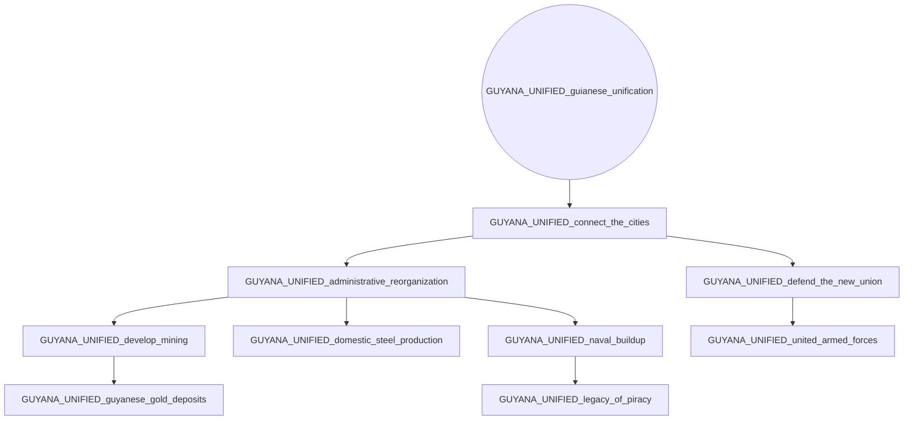

# GUYANA_UNIFIED_guianese_unification

```mermaid
flowchart TD
    n1["GUYANA_UNIFIED_administrative_reorganization"]
    n2["GUYANA_UNIFIED_connect_the_cities"]
    n3["GUYANA_UNIFIED_defend_the_new_union"]
    n4["GUYANA_UNIFIED_develop_mining"]
    n5["GUYANA_UNIFIED_domestic_steel_production"]
    n6(("GUYANA_UNIFIED_guianese_unification"))
    n7["GUYANA_UNIFIED_guyanese_gold_deposits"]
    n8["GUYANA_UNIFIED_legacy_of_piracy"]
    n9["GUYANA_UNIFIED_naval_buildup"]
    n10["GUYANA_UNIFIED_united_armed_forces"]
    n2 --> n1
    n6 --> n2
    n2 --> n3
    n1 --> n4
    n1 --> n5
    n4 --> n7
    n9 --> n8
    n1 --> n9
    n3 --> n10
```
