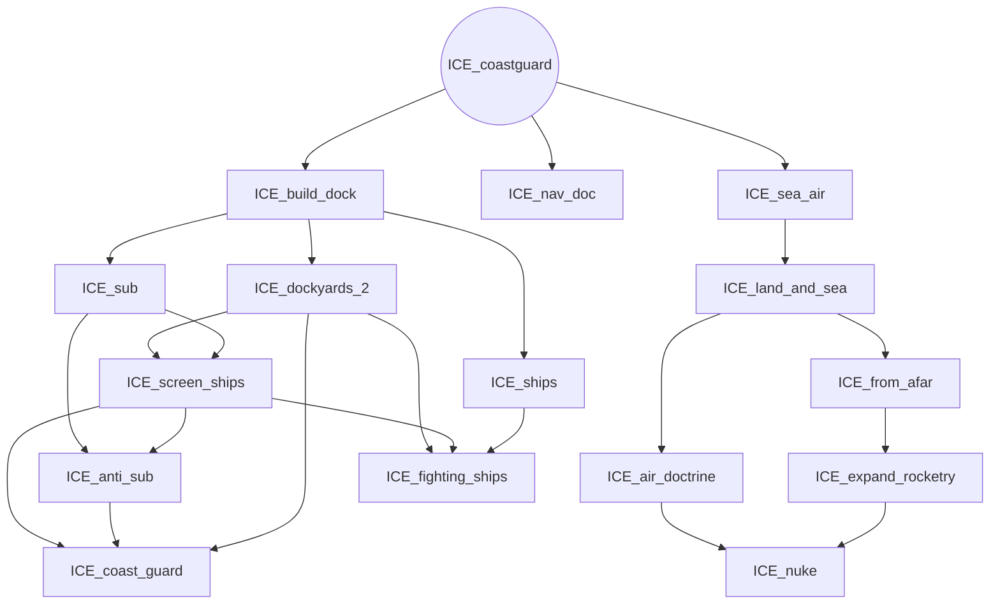
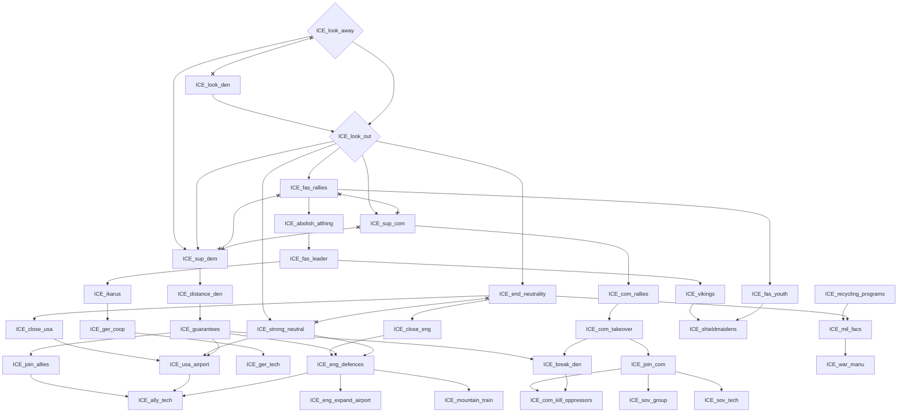
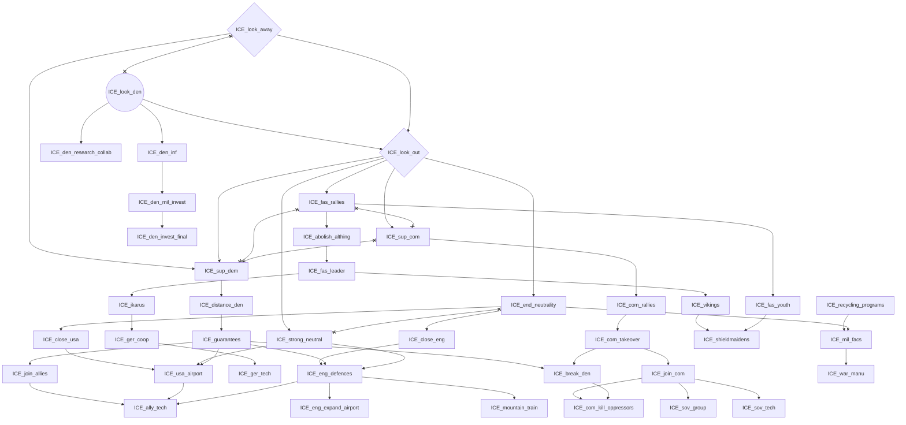
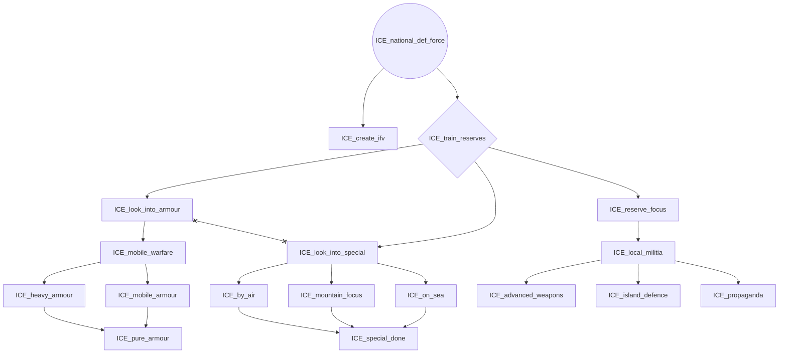
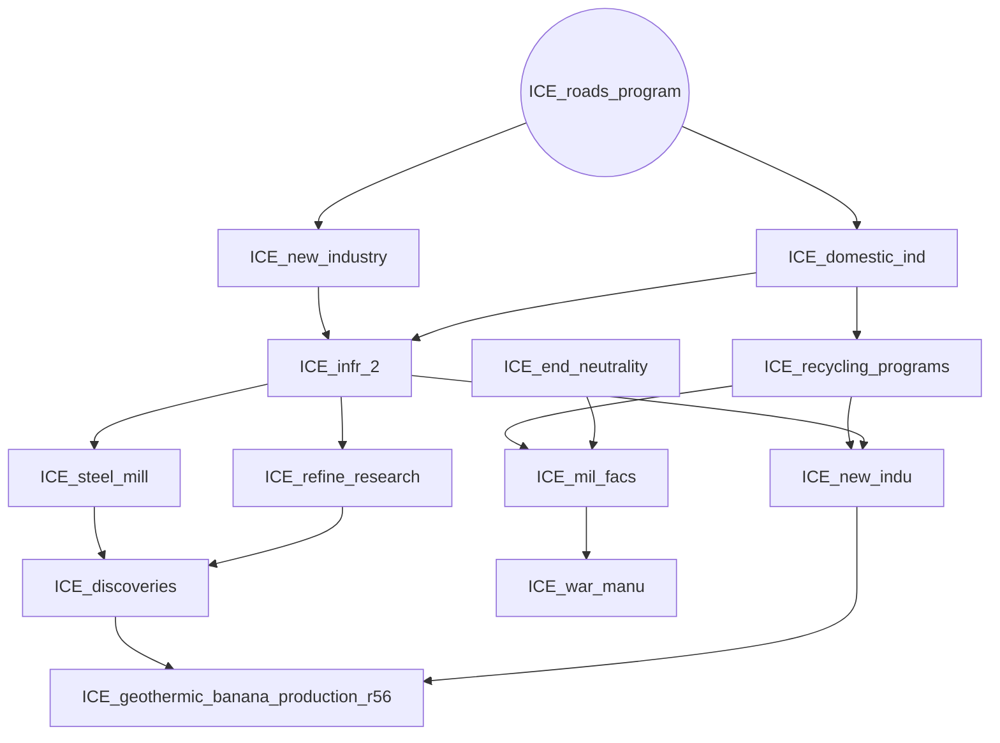

# ICE_coastguard

```mermaid
flowchart TD
    n1["ICE_air_doctrine"]
    n2["ICE_anti_sub"]
    n3["ICE_build_dock"]
    n4["ICE_coast_guard"]
    n5(("ICE_coastguard"))
    n6["ICE_dockyards_2"]
    n7["ICE_expand_rocketry"]
    n8["ICE_fighting_ships"]
    n9["ICE_from_afar"]
    n10["ICE_land_and_sea"]
    n11["ICE_nav_doc"]
    n12["ICE_nuke"]
    n13["ICE_screen_ships"]
    n14["ICE_sea_air"]
    n15["ICE_ships"]
    n16["ICE_sub"]
    n10 --> n1
    n16 --> n2
    n13 --> n2
    n5 --> n3
    n13 --> n4
    n2 --> n4
    n6 --> n4
    n3 --> n6
    n9 --> n7
    n6 --> n8
    n13 --> n8
    n15 --> n8
    n10 --> n9
    n14 --> n10
    n5 --> n11
    n1 --> n12
    n7 --> n12
    n6 --> n13
    n16 --> n13
    n5 --> n14
    n3 --> n15
    n3 --> n16
```

# ICE_look_away

```mermaid
flowchart TD
    n17["ICE_abolish_althing"]
    n18["ICE_ally_tech"]
    n19["ICE_break_den"]
    n20["ICE_close_eng"]
    n21["ICE_close_usa"]
    n22["ICE_com_kill_oppressors"]
    n23["ICE_com_rallies"]
    n24["ICE_com_takeover"]
    n25["ICE_distance_den"]
    n26["ICE_end_neutrality"]
    n27["ICE_eng_defences"]
    n28["ICE_eng_expand_airport"]
    n29["ICE_fas_leader"]
    n30["ICE_fas_rallies"]
    n31["ICE_fas_youth"]
    n32["ICE_ger_coop"]
    n33["ICE_ger_tech"]
    n34["ICE_guarantees"]
    n35["ICE_ikarus"]
    n36["ICE_join_allies"]
    n37["ICE_join_com"]
    n38{"ICE_look_away"}
    n39["ICE_look_den"]
    n40{"ICE_look_out"}
    n41["ICE_mil_facs"]
    n42["ICE_mountain_train"]
    n43["ICE_recycling_programs"]
    n44["ICE_shieldmaidens"]
    n45["ICE_sov_group"]
    n46["ICE_sov_tech"]
    n47["ICE_strong_neutral"]
    n48["ICE_sup_com"]
    n49["ICE_sup_dem"]
    n50["ICE_usa_airport"]
    n51["ICE_vikings"]
    n52["ICE_war_manu"]
    n30 --> n17
    n36 --> n18
    n50 --> n18
    n27 --> n18
    n34 --> n19
    n24 --> n19
    n26 --> n20
    n26 --> n21
    n37 --> n22
    n19 --> n22
    n48 --> n23
    n23 --> n24
    n49 --> n25
    n40 --> n26
    n20 --> n27
    n34 --> n27
    n47 --> n27
    n27 --> n28
    n17 --> n29
    n40 --> n30
    n30 --> n31
    n35 --> n32
    n32 --> n33
    n25 --> n34
    n29 --> n35
    n34 --> n36
    n24 --> n37
    n39 --> n40
    n38 --> n40
    n43 --> n41
    n26 --> n41
    n27 --> n42
    n51 --> n44
    n31 --> n44
    n37 --> n45
    n37 --> n46
    n40 --> n47
    n40 --> n48
    n38 --> n49
    n40 --> n49
    n21 --> n50
    n47 --> n50
    n34 --> n50
    n29 --> n51
    n41 --> n52
    n26 x--x n47
    n30 x--x n48
    n30 x--x n49
    n38 x--x n39
    n48 x--x n49
```

# ICE_look_den

```mermaid
flowchart TD
    n17["ICE_abolish_althing"]
    n18["ICE_ally_tech"]
    n19["ICE_break_den"]
    n20["ICE_close_eng"]
    n21["ICE_close_usa"]
    n22["ICE_com_kill_oppressors"]
    n23["ICE_com_rallies"]
    n24["ICE_com_takeover"]
    n53["ICE_den_inf"]
    n54["ICE_den_invest_final"]
    n55["ICE_den_mil_invest"]
    n56["ICE_den_research_collab"]
    n25["ICE_distance_den"]
    n26["ICE_end_neutrality"]
    n27["ICE_eng_defences"]
    n28["ICE_eng_expand_airport"]
    n29["ICE_fas_leader"]
    n30["ICE_fas_rallies"]
    n31["ICE_fas_youth"]
    n32["ICE_ger_coop"]
    n33["ICE_ger_tech"]
    n34["ICE_guarantees"]
    n35["ICE_ikarus"]
    n36["ICE_join_allies"]
    n37["ICE_join_com"]
    n38{"ICE_look_away"}
    n39(("ICE_look_den"))
    n40{"ICE_look_out"}
    n41["ICE_mil_facs"]
    n42["ICE_mountain_train"]
    n43["ICE_recycling_programs"]
    n44["ICE_shieldmaidens"]
    n45["ICE_sov_group"]
    n46["ICE_sov_tech"]
    n47["ICE_strong_neutral"]
    n48["ICE_sup_com"]
    n49["ICE_sup_dem"]
    n50["ICE_usa_airport"]
    n51["ICE_vikings"]
    n52["ICE_war_manu"]
    n30 --> n17
    n36 --> n18
    n50 --> n18
    n27 --> n18
    n34 --> n19
    n24 --> n19
    n26 --> n20
    n26 --> n21
    n37 --> n22
    n19 --> n22
    n48 --> n23
    n23 --> n24
    n39 --> n53
    n55 --> n54
    n53 --> n55
    n39 --> n56
    n49 --> n25
    n40 --> n26
    n20 --> n27
    n34 --> n27
    n47 --> n27
    n27 --> n28
    n17 --> n29
    n40 --> n30
    n30 --> n31
    n35 --> n32
    n32 --> n33
    n25 --> n34
    n29 --> n35
    n34 --> n36
    n24 --> n37
    n39 --> n40
    n38 --> n40
    n43 --> n41
    n26 --> n41
    n27 --> n42
    n51 --> n44
    n31 --> n44
    n37 --> n45
    n37 --> n46
    n40 --> n47
    n40 --> n48
    n38 --> n49
    n40 --> n49
    n21 --> n50
    n47 --> n50
    n34 --> n50
    n29 --> n51
    n41 --> n52
    n26 x--x n47
    n30 x--x n48
    n30 x--x n49
    n38 x--x n39
    n48 x--x n49
```

# ICE_national_def_force

```mermaid
flowchart TD
    n57["ICE_advanced_weapons"]
    n58["ICE_by_air"]
    n59["ICE_create_ifv"]
    n60["ICE_heavy_armour"]
    n61["ICE_island_defence"]
    n62["ICE_local_militia"]
    n63["ICE_look_into_armour"]
    n64["ICE_look_into_special"]
    n65["ICE_mobile_armour"]
    n66["ICE_mobile_warfare"]
    n67["ICE_mountain_focus"]
    n68(("ICE_national_def_force"))
    n69["ICE_on_sea"]
    n70["ICE_propaganda"]
    n71["ICE_pure_armour"]
    n72["ICE_reserve_focus"]
    n73["ICE_special_done"]
    n74{"ICE_train_reserves"}
    n62 --> n57
    n64 --> n58
    n68 --> n59
    n66 --> n60
    n62 --> n61
    n72 --> n62
    n74 --> n63
    n74 --> n64
    n66 --> n65
    n63 --> n66
    n64 --> n67
    n64 --> n69
    n62 --> n70
    n65 --> n71
    n60 --> n71
    n74 --> n72
    n67 --> n73
    n69 --> n73
    n58 --> n73
    n68 --> n74
    n63 x--x n64
```

# ICE_roads_program

```mermaid
flowchart TD
    n75["ICE_discoveries"]
    n76["ICE_domestic_ind"]
    n26["ICE_end_neutrality"]
    n77["ICE_geothermic_banana_production_r56"]
    n78["ICE_infr_2"]
    n41["ICE_mil_facs"]
    n79["ICE_new_indu"]
    n80["ICE_new_industry"]
    n43["ICE_recycling_programs"]
    n81["ICE_refine_research"]
    n82(("ICE_roads_program"))
    n83["ICE_steel_mill"]
    n52["ICE_war_manu"]
    n83 --> n75
    n81 --> n75
    n82 --> n76
    n75 --> n77
    n79 --> n77
    n80 --> n78
    n76 --> n78
    n43 --> n41
    n26 --> n41
    n43 --> n79
    n78 --> n79
    n82 --> n80
    n76 --> n43
    n78 --> n81
    n78 --> n83
    n41 --> n52
```
