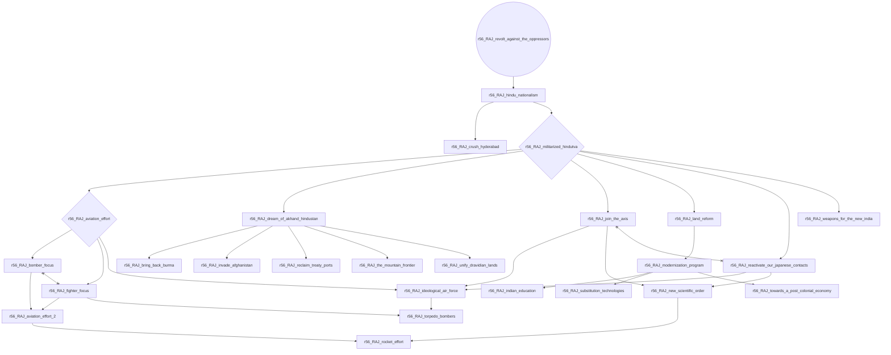

# r56_RAJ_revolt_against_the_oppressors

```mermaid
flowchart TD
    n1{"r56_RAJ_aviation_effort"}
    n2["r56_RAJ_aviation_effort_2"]
    n3["r56_RAJ_bomber_focus"]
    n4["r56_RAJ_bring_back_burma"]
    n5["r56_RAJ_crush_hyderabad"]
    n6["r56_RAJ_dream_of_akhand_hindustan"]
    n7["r56_RAJ_fighter_focus"]
    n8["r56_RAJ_hindu_nationalism"]
    n9["r56_RAJ_ideological_air_force"]
    n10["r56_RAJ_indian_education"]
    n11["r56_RAJ_invade_afghanistan"]
    n12["r56_RAJ_join_the_axis"]
    n13["r56_RAJ_land_reform"]
    n14{"r56_RAJ_militarized_hindutva"}
    n15["r56_RAJ_modernization_program"]
    n16["r56_RAJ_new_scientific_order"]
    n17["r56_RAJ_reactivate_our_japanese_contacts"]
    n18["r56_RAJ_reclaim_treaty_ports"]
    n19(("r56_RAJ_revolt_against_the_oppressors"))
    n20["r56_RAJ_rocket_effort"]
    n21["r56_RAJ_substitution_technologies"]
    n22["r56_RAJ_the_mountain_frontier"]
    n23["r56_RAJ_torpedo_bombers"]
    n24["r56_RAJ_towards_a_post_colonial_economy"]
    n25["r56_RAJ_unify_dravidian_lands"]
    n26["r56_RAJ_weapons_for_the_new_india"]
    n14 --> n1
    n3 --> n2
    n7 --> n2
    n1 --> n3
    n6 --> n4
    n8 --> n5
    n14 --> n6
    n1 --> n7
    n19 --> n8
    n17 --> n9
    n12 --> n9
    n1 --> n9
    n15 --> n10
    n6 --> n11
    n14 --> n12
    n14 --> n13
    n8 --> n14
    n13 --> n15
    n17 --> n16
    n12 --> n16
    n14 --> n17
    n6 --> n18
    n2 --> n20
    n16 --> n20
    n15 --> n21
    n6 --> n22
    n7 --> n23
    n9 --> n23
    n15 --> n24
    n6 --> n25
    n14 --> n26
    n3 x--x n7
    n12 x--x n17
```
