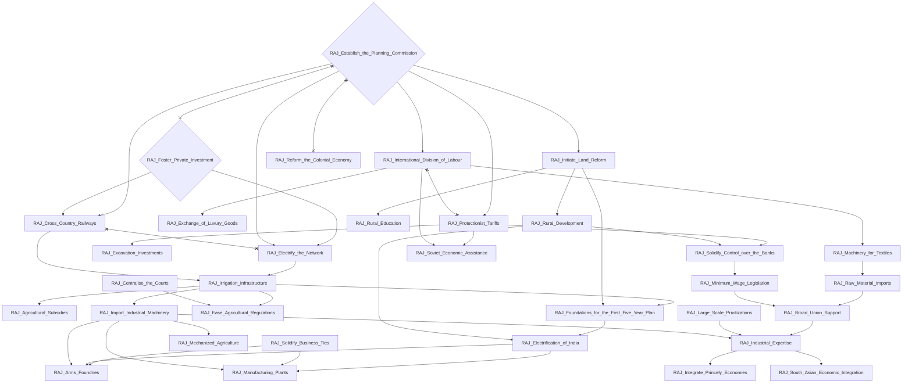
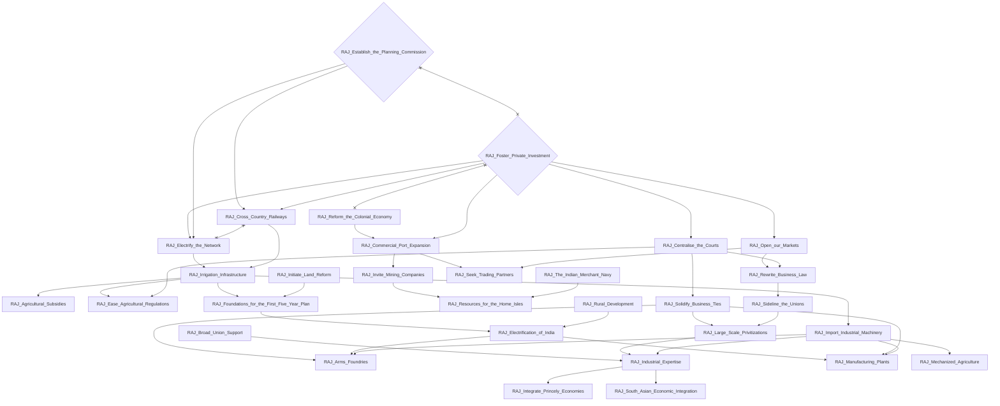
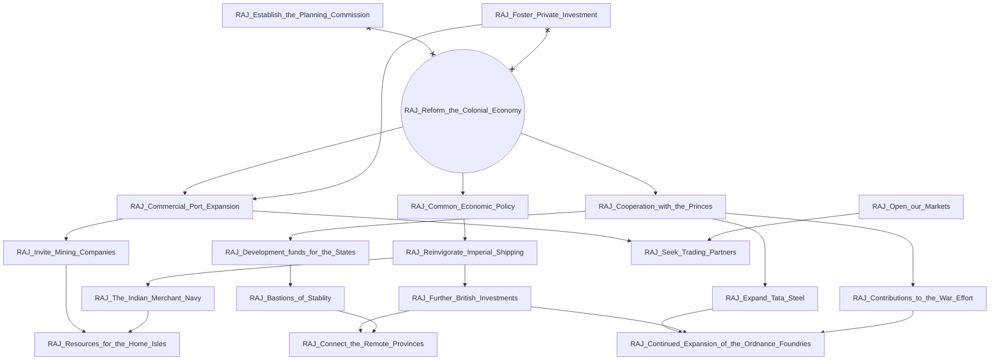
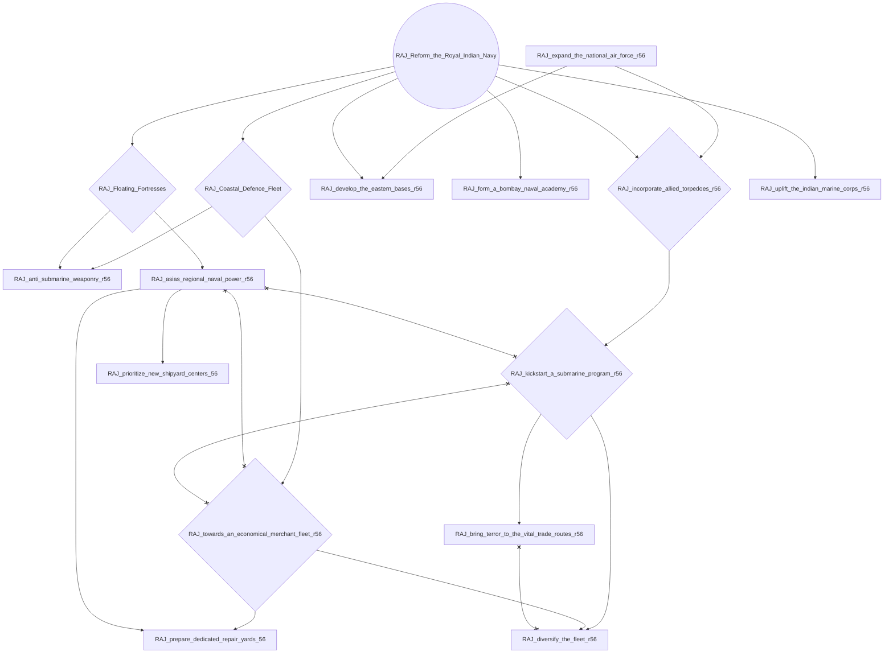
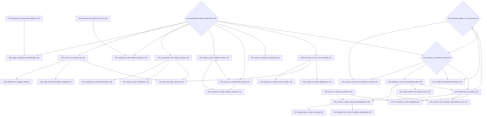
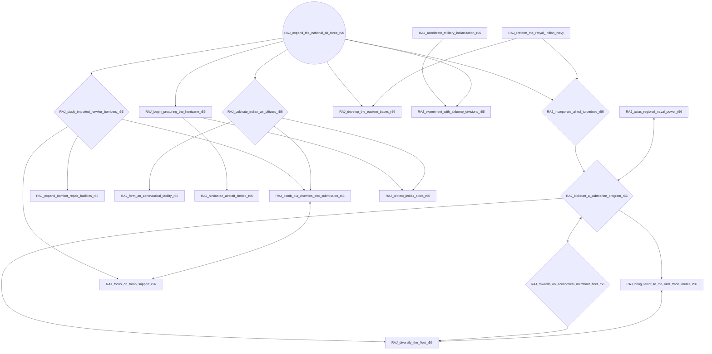
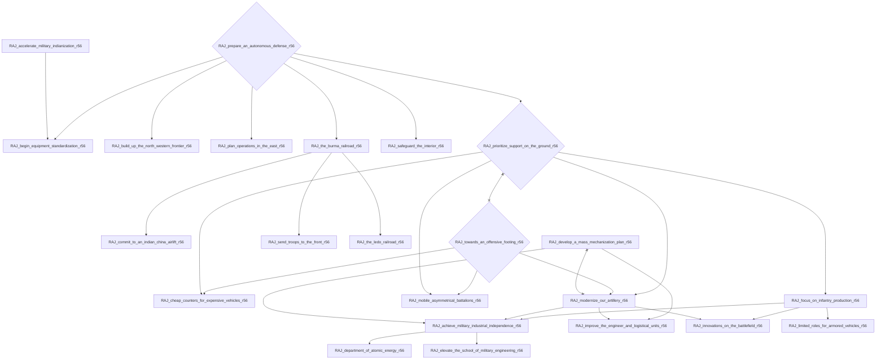

# RAJ_Establish_the_Planning_Commission

# RAJ_Foster_Private_Investment

# RAJ_Reform_the_Colonial_Economy

# RAJ_Reform_the_Royal_Indian_Navy

# RAJ_accelerate_military_indianization_r56

# RAJ_expand_the_national_air_force_r56

# RAJ_prepare_an_autonomous_defense_r56

