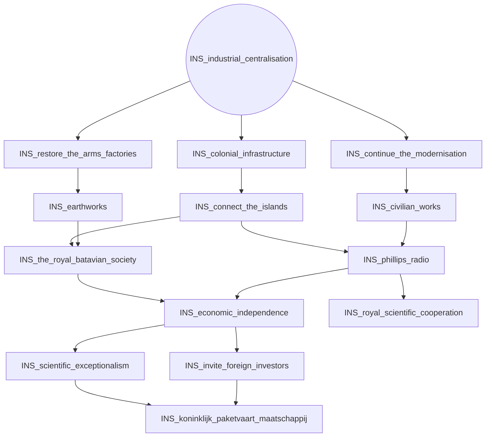
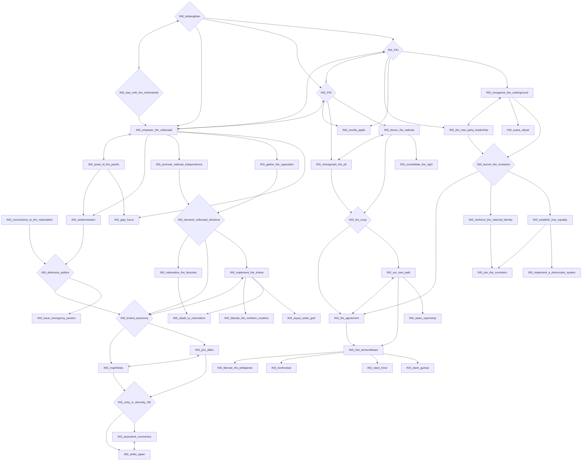
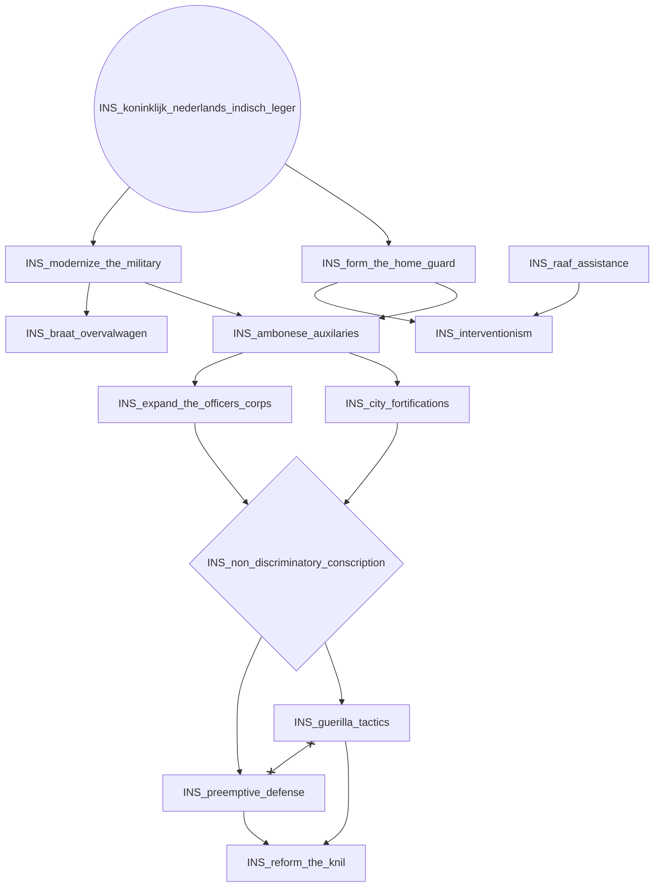
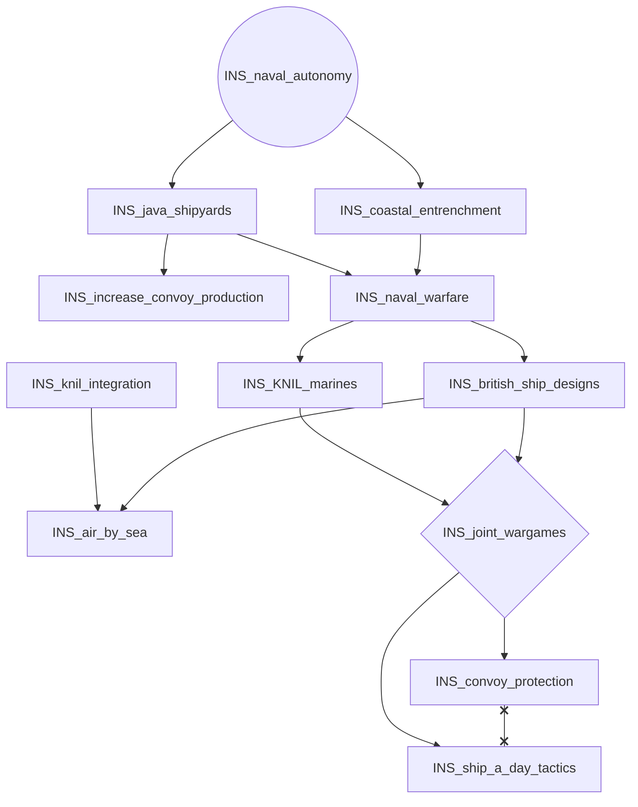
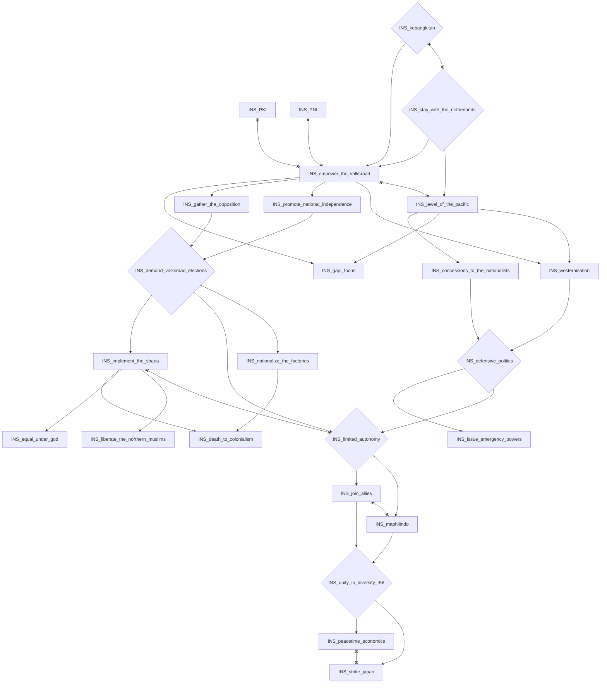
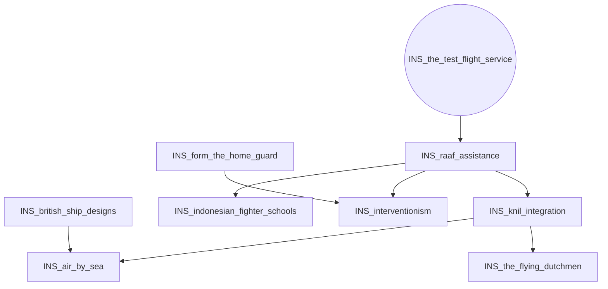

# INS_industrial_centralisation

```mermaid
flowchart TD
    n1["INS_civilian_works"]
    n2["INS_colonial_infrastructure"]
    n3["INS_connect_the_islands"]
    n4["INS_continue_the_modernisation"]
    n5["INS_earthworks"]
    n6["INS_economic_independence"]
    n7(("INS_industrial_centralisation"))
    n8["INS_invite_foreign_investors"]
    n9["INS_koninklijk_paketvaart_maatschappij"]
    n10["INS_phillips_radio"]
    n11["INS_restore_the_arms_factories"]
    n12["INS_royal_scientific_cooperation"]
    n13["INS_scientific_exceptionalism"]
    n14["INS_the_royal_batavian_society"]
    n4 --> n1
    n7 --> n2
    n2 --> n3
    n7 --> n4
    n11 --> n5
    n10 --> n6
    n14 --> n6
    n6 --> n8
    n8 --> n9
    n13 --> n9
    n1 --> n10
    n3 --> n10
    n7 --> n11
    n10 --> n12
    n6 --> n13
    n5 --> n14
    n3 --> n14
```

# INS_kebangkitan

```mermaid
flowchart TD
    n15{"INS_PKI"}
    n16{"INS_PNI"}
    n17["INS_asian_superiority"]
    n18["INS_claim_guinea"]
    n19["INS_claim_timor"]
    n20["INS_concessions_to_the_nationalists"]
    n21["INS_consolidate_the_right"]
    n22["INS_death_to_colonialism"]
    n23{"INS_defensive_politics"}
    n24{"INS_demand_volksraad_elections"}
    n25["INS_empower_the_volksraad"]
    n26["INS_equal_under_god"]
    n27["INS_establish_true_equality"]
    n28["INS_favour_the_radicals"]
    n29["INS_gapi_focus"]
    n30["INS_gather_the_opposition"]
    n31["INS_hari_kemerdekaan"]
    n32["INS_implement_a_democratic_system"]
    n33["INS_implement_the_sharia"]
    n34["INS_issue_emergency_powers"]
    n35["INS_jewel_of_the_pacific"]
    n36["INS_join_allies"]
    n37["INS_join_the_comintern"]
    n38{"INS_kebangkitan"}
    n39["INS_konfrontasi"]
    n40{"INS_launch_the_revolution"}
    n41["INS_liberate_the_northern_muslims"]
    n42["INS_liberate_the_philippines"]
    n43{"INS_limited_autonomy"}
    n44["INS_maphilindo"]
    n45["INS_nationalize_the_factories"]
    n46["INS_our_own_path"]
    n47["INS_peacetime_economics"]
    n48["INS_promote_national_independence"]
    n49["INS_reinforce_the_national_identity"]
    n50["INS_reinvigorate_the_pfi"]
    n51["INS_reorganize_the_underground"]
    n52["INS_reunify_pppki"]
    n53{"INS_stay_with_the_netherlands"}
    n54["INS_strike_japan"]
    n55["INS_suara_rakyat"]
    n56["INS_the_agreement"]
    n57{"INS_the_coup"}
    n58["INS_the_new_party_leadership"]
    n59{"INS_unity_in_diversity_r56"}
    n60["INS_westernisation"]
    n38 --> n15
    n38 --> n16
    n46 --> n17
    n31 --> n18
    n31 --> n19
    n28 --> n21
    n33 --> n22
    n45 --> n22
    n60 --> n23
    n20 --> n23
    n30 --> n24
    n48 --> n24
    n38 --> n25
    n53 --> n25
    n33 --> n26
    n40 --> n27
    n16 --> n28
    n25 --> n29
    n35 --> n29
    n25 --> n30
    n46 --> n31
    n56 --> n31
    n27 --> n32
    n24 --> n33
    n23 --> n34
    n43 --> n36
    n27 --> n37
    n49 --> n37
    n31 --> n39
    n51 --> n40
    n58 --> n40
    n33 --> n41
    n31 --> n42
    n23 --> n43
    n24 --> n43
    n43 --> n44
    n24 --> n45
    n57 --> n46
    n59 --> n47
    n25 --> n48
    n40 --> n49
    n16 --> n50
    n15 --> n51
    n15 --> n52
    n16 --> n52
    n59 --> n54
    n51 --> n55
    n57 --> n56
    n40 --> n56
    n50 --> n57
    n28 --> n57
    n15 --> n58
    n36 --> n59
    n44 --> n59
    n35 --> n60
    n25 --> n60
    n15 x--x n16
    n15 x--x n25
    n16 x--x n25
    n25 x--x n35
    n28 x--x n50
    n33 x--x n43
    n36 x--x n44
    n38 x--x n53
    n46 x--x n56
    n47 x--x n54
    n51 x--x n58
```

# INS_koninklijk_nederlands_indisch_leger

```mermaid
flowchart TD
    n61["INS_ambonese_auxilaries"]
    n62["INS_braat_overvalwagen"]
    n63["INS_city_fortifications"]
    n64["INS_expand_the_officers_corps"]
    n65["INS_form_the_home_guard"]
    n66["INS_guerilla_tactics"]
    n67["INS_interventionism"]
    n68(("INS_koninklijk_nederlands_indisch_leger"))
    n69["INS_modernize_the_military"]
    n70{"INS_non_discriminatory_conscription"}
    n71["INS_preemptive_defense"]
    n72["INS_raaf_assistance"]
    n73["INS_reform_the_knil"]
    n69 --> n61
    n65 --> n61
    n69 --> n62
    n61 --> n63
    n61 --> n64
    n68 --> n65
    n70 --> n66
    n65 --> n67
    n72 --> n67
    n68 --> n69
    n63 --> n70
    n64 --> n70
    n70 --> n71
    n66 --> n73
    n71 --> n73
    n66 x--x n71
```

# INS_naval_autonomy

```mermaid
flowchart TD
    n74["INS_KNIL_marines"]
    n75["INS_air_by_sea"]
    n76["INS_british_ship_designs"]
    n77["INS_coastal_entrenchment"]
    n78["INS_convoy_protection"]
    n79["INS_increase_convoy_production"]
    n80["INS_java_shipyards"]
    n81{"INS_joint_wargames"}
    n82["INS_knil_integration"]
    n83(("INS_naval_autonomy"))
    n84["INS_naval_warfare"]
    n85["INS_ship_a_day_tactics"]
    n84 --> n74
    n82 --> n75
    n76 --> n75
    n84 --> n76
    n83 --> n77
    n81 --> n78
    n80 --> n79
    n83 --> n80
    n74 --> n81
    n76 --> n81
    n80 --> n84
    n77 --> n84
    n81 --> n85
    n78 x--x n85
```

# INS_stay_with_the_netherlands

```mermaid
flowchart TD
    n15["INS_PKI"]
    n16["INS_PNI"]
    n20["INS_concessions_to_the_nationalists"]
    n22["INS_death_to_colonialism"]
    n23{"INS_defensive_politics"}
    n24{"INS_demand_volksraad_elections"}
    n25["INS_empower_the_volksraad"]
    n26["INS_equal_under_god"]
    n29["INS_gapi_focus"]
    n30["INS_gather_the_opposition"]
    n33["INS_implement_the_sharia"]
    n34["INS_issue_emergency_powers"]
    n35["INS_jewel_of_the_pacific"]
    n36["INS_join_allies"]
    n38{"INS_kebangkitan"}
    n41["INS_liberate_the_northern_muslims"]
    n43{"INS_limited_autonomy"}
    n44["INS_maphilindo"]
    n45["INS_nationalize_the_factories"]
    n47["INS_peacetime_economics"]
    n48["INS_promote_national_independence"]
    n53{"INS_stay_with_the_netherlands"}
    n54["INS_strike_japan"]
    n59{"INS_unity_in_diversity_r56"}
    n60["INS_westernisation"]
    n35 --> n20
    n33 --> n22
    n45 --> n22
    n60 --> n23
    n20 --> n23
    n30 --> n24
    n48 --> n24
    n38 --> n25
    n53 --> n25
    n33 --> n26
    n25 --> n29
    n35 --> n29
    n25 --> n30
    n24 --> n33
    n23 --> n34
    n53 --> n35
    n43 --> n36
    n33 --> n41
    n23 --> n43
    n24 --> n43
    n43 --> n44
    n24 --> n45
    n59 --> n47
    n25 --> n48
    n59 --> n54
    n36 --> n59
    n44 --> n59
    n35 --> n60
    n25 --> n60
    n15 x--x n25
    n16 x--x n25
    n25 x--x n35
    n33 x--x n43
    n36 x--x n44
    n38 x--x n53
    n47 x--x n54
```

# INS_the_test_flight_service

```mermaid
flowchart TD
    n75["INS_air_by_sea"]
    n76["INS_british_ship_designs"]
    n65["INS_form_the_home_guard"]
    n86["INS_indonesian_fighter_schools"]
    n67["INS_interventionism"]
    n82["INS_knil_integration"]
    n72["INS_raaf_assistance"]
    n87["INS_the_flying_dutchmen"]
    n88(("INS_the_test_flight_service"))
    n82 --> n75
    n76 --> n75
    n72 --> n86
    n65 --> n67
    n72 --> n67
    n72 --> n82
    n88 --> n72
    n82 --> n87
```
