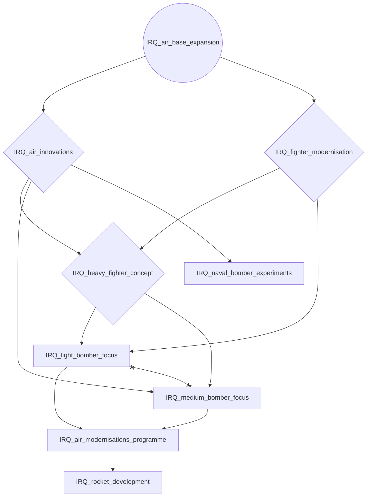
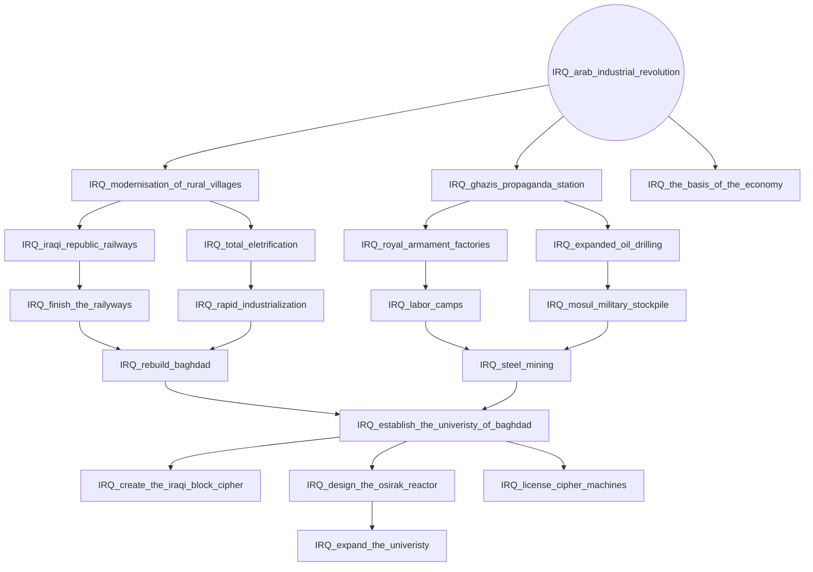
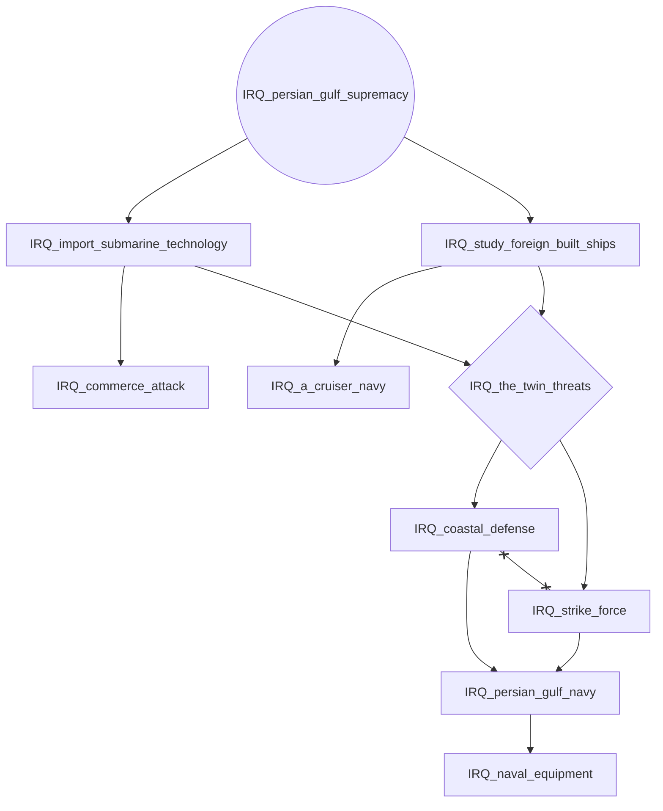
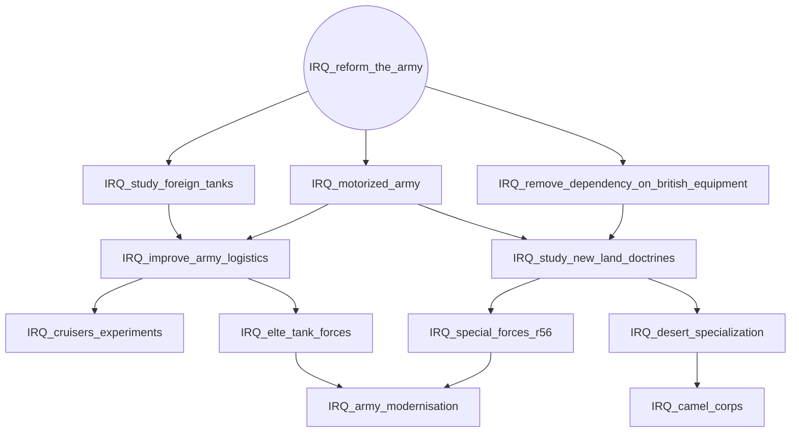
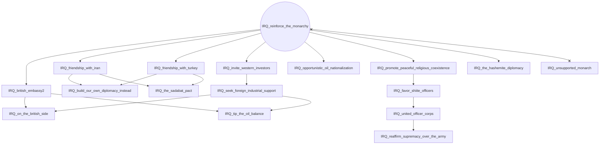
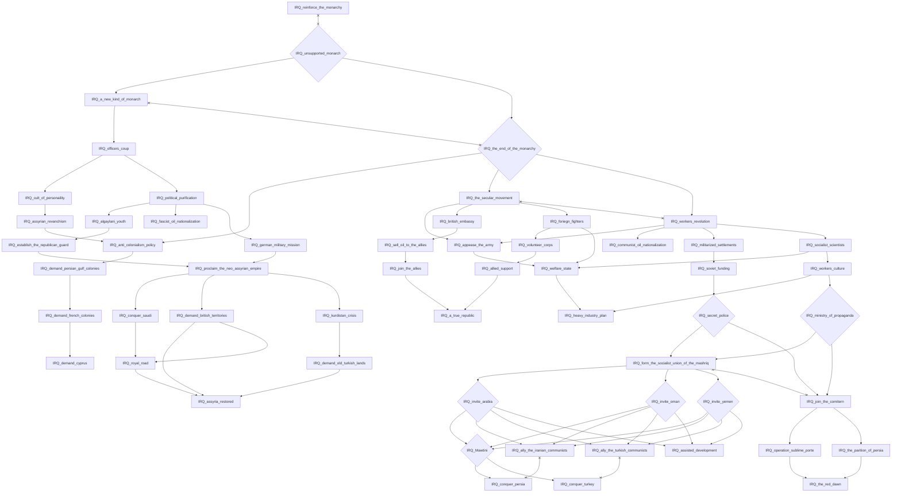

# IRQ_air_base_expansion

```mermaid
flowchart TD
    n1(("IRQ_air_base_expansion"))
    n2{"IRQ_air_innovations"}
    n3["IRQ_air_modernisations_programme"]
    n4{"IRQ_fighter_modernisation"}
    n5{"IRQ_heavy_fighter_concept"}
    n6["IRQ_light_bomber_focus"]
    n7["IRQ_medium_bomber_focus"]
    n8["IRQ_naval_bomber_experiments"]
    n9["IRQ_rocket_development"]
    n1 --> n2
    n6 --> n3
    n7 --> n3
    n1 --> n4
    n2 --> n5
    n4 --> n5
    n5 --> n6
    n4 --> n6
    n5 --> n7
    n2 --> n7
    n2 --> n8
    n3 --> n9
    n6 x--x n7
```

# IRQ_arab_industrial_revolution

```mermaid
flowchart TD
    n10(("IRQ_arab_industrial_revolution"))
    n11["IRQ_create_the_iraqi_block_cipher"]
    n12["IRQ_design_the_osirak_reactor"]
    n13["IRQ_establish_the_univeristy_of_baghdad"]
    n14["IRQ_expand_the_univeristy"]
    n15["IRQ_expanded_oil_drilling"]
    n16["IRQ_finish_the_railyways"]
    n17["IRQ_ghazis_propaganda_station"]
    n18["IRQ_iraqi_republic_railways"]
    n19["IRQ_labor_camps"]
    n20["IRQ_license_cipher_machines"]
    n21["IRQ_modernisation_of_rural_villages"]
    n22["IRQ_mosul_military_stockpile"]
    n23["IRQ_rapid_industrialization"]
    n24["IRQ_rebuild_baghdad"]
    n25["IRQ_royal_armament_factories"]
    n26["IRQ_steel_mining"]
    n27["IRQ_the_basis_of_the_economy"]
    n28["IRQ_total_eletrification"]
    n13 --> n11
    n13 --> n12
    n24 --> n13
    n26 --> n13
    n12 --> n14
    n17 --> n15
    n18 --> n16
    n10 --> n17
    n21 --> n18
    n25 --> n19
    n13 --> n20
    n10 --> n21
    n15 --> n22
    n28 --> n23
    n16 --> n24
    n23 --> n24
    n17 --> n25
    n19 --> n26
    n22 --> n26
    n10 --> n27
    n21 --> n28
```

# IRQ_persian_gulf_supremacy

```mermaid
flowchart TD
    n29["IRQ_a_cruiser_navy"]
    n30["IRQ_coastal_defense"]
    n31["IRQ_commerce_attack"]
    n32["IRQ_import_submarine_technology"]
    n33["IRQ_naval_equipment"]
    n34["IRQ_persian_gulf_navy"]
    n35(("IRQ_persian_gulf_supremacy"))
    n36["IRQ_strike_force"]
    n37["IRQ_study_foreign_built_ships"]
    n38{"IRQ_the_twin_threats"}
    n37 --> n29
    n38 --> n30
    n32 --> n31
    n35 --> n32
    n34 --> n33
    n36 --> n34
    n30 --> n34
    n38 --> n36
    n35 --> n37
    n32 --> n38
    n37 --> n38
    n30 x--x n36
```

# IRQ_reform_the_army

```mermaid
flowchart TD
    n39["IRQ_army_modernisation"]
    n40["IRQ_camel_corps"]
    n41["IRQ_cruisers_experiments"]
    n42["IRQ_desert_specialization"]
    n43["IRQ_elte_tank_forces"]
    n44["IRQ_improve_army_logistics"]
    n45["IRQ_motorized_army"]
    n46(("IRQ_reform_the_army"))
    n47["IRQ_remove_dependency_on_british_equipment"]
    n48["IRQ_special_forces_r56"]
    n49["IRQ_study_foreign_tanks"]
    n50["IRQ_study_new_land_doctrines"]
    n43 --> n39
    n48 --> n39
    n42 --> n40
    n44 --> n41
    n50 --> n42
    n44 --> n43
    n49 --> n44
    n45 --> n44
    n46 --> n45
    n46 --> n47
    n50 --> n48
    n46 --> n49
    n45 --> n50
    n47 --> n50
```

# IRQ_reinforce_the_monarchy

```mermaid
flowchart TD
    n51["IRQ_british_embassy2"]
    n52["IRQ_build_our_own_diplomacy_instead"]
    n53["IRQ_favor_shiite_officers"]
    n54["IRQ_friendship_with_iran"]
    n55["IRQ_friendship_with_turkey"]
    n56["IRQ_invite_western_investors"]
    n57["IRQ_on_the_british_side"]
    n58["IRQ_opportunistic_oil_nationalization"]
    n59["IRQ_promote_peaceful_religious_coexistence"]
    n60["IRQ_reaffirm_supremacy_over_the_army"]
    n61(("IRQ_reinforce_the_monarchy"))
    n62["IRQ_seek_foreign_industrial_support"]
    n63["IRQ_the_hashemite_diplomacy"]
    n64["IRQ_the_sadabat_pact"]
    n65["IRQ_tip_the_oil_balance"]
    n66["IRQ_united_officer_corps"]
    n67["IRQ_unsupported_monarch"]
    n61 --> n51
    n54 --> n52
    n55 --> n52
    n59 --> n53
    n61 --> n54
    n61 --> n55
    n61 --> n56
    n51 --> n57
    n62 --> n57
    n61 --> n58
    n61 --> n59
    n66 --> n60
    n56 --> n62
    n61 --> n63
    n54 --> n64
    n55 --> n64
    n51 --> n65
    n62 --> n65
    n53 --> n66
    n61 x--x n67
```

# IRQ_unsupported_monarch

```mermaid
flowchart TD
    n68{"IRQ_Mawtini"}
    n69["IRQ_a_new_kind_of_monarch"]
    n70["IRQ_a_true_republic"]
    n71["IRQ_algaylani_youth"]
    n72["IRQ_allied_support"]
    n73["IRQ_ally_the_iranian_communists"]
    n74["IRQ_ally_the_turkish_communists"]
    n75["IRQ_anti_colonialism_policy"]
    n76["IRQ_appease_the_army"]
    n77["IRQ_assisted_development"]
    n78["IRQ_assyria_restored"]
    n79["IRQ_assyrian_revanchism"]
    n80["IRQ_british_embassy"]
    n81["IRQ_communist_oil_nationalization"]
    n82["IRQ_conquer_persia"]
    n83["IRQ_conquer_saudi"]
    n84["IRQ_conquer_turkey"]
    n85["IRQ_cult_of_personaility"]
    n86["IRQ_demand_british_territories"]
    n87["IRQ_demand_cyprus"]
    n88["IRQ_demand_french_colonies"]
    n89["IRQ_demand_old_turkish_lands"]
    n90["IRQ_demand_persian_gulf_colonies"]
    n91["IRQ_establish_the_republican_guard"]
    n92["IRQ_fascist_oil_nationalization"]
    n93["IRQ_foriegn_fighters"]
    n94["IRQ_form_the_socialist_union_of_the_mashriq"]
    n95["IRQ_german_military_mission"]
    n96["IRQ_heavy_industry_plan"]
    n97{"IRQ_invite_arabia"}
    n98{"IRQ_invite_oman"}
    n99{"IRQ_invite_yemen"}
    n100["IRQ_join_the_allies"]
    n101["IRQ_join_the_comitern"]
    n102["IRQ_kurdistan_crisis"]
    n103["IRQ_militarized_settlements"]
    n104{"IRQ_ministry_of_propaganda"}
    n105["IRQ_officers_coup"]
    n106["IRQ_operation_sublime_porte"]
    n107["IRQ_political_purification"]
    n108["IRQ_proclaim_the_neo_assyrian_empire"]
    n61["IRQ_reinforce_the_monarchy"]
    n109["IRQ_royal_road"]
    n110{"IRQ_secret_police"}
    n111["IRQ_sell_oil_to_the_allies"]
    n112["IRQ_socialist_scientists"]
    n113["IRQ_soviet_funding"]
    n114{"IRQ_the_end_of_the_monarchy"}
    n115["IRQ_the_parition_of_persia"]
    n116["IRQ_the_red_dawn"]
    n117["IRQ_the_secular_movement"]
    n67{"IRQ_unsupported_monarch"}
    n118["IRQ_volunteer_corps"]
    n119["IRQ_welfare_state"]
    n120["IRQ_workers_culture"]
    n121["IRQ_workers_revolution"]
    n98 --> n68
    n97 --> n68
    n99 --> n68
    n67 --> n69
    n72 --> n70
    n100 --> n70
    n107 --> n71
    n118 --> n72
    n98 --> n73
    n97 --> n73
    n99 --> n73
    n98 --> n74
    n97 --> n74
    n99 --> n74
    n79 --> n75
    n114 --> n75
    n121 --> n76
    n117 --> n76
    n98 --> n77
    n99 --> n77
    n97 --> n77
    n89 --> n78
    n86 --> n78
    n109 --> n78
    n85 --> n79
    n117 --> n80
    n121 --> n81
    n68 --> n82
    n108 --> n83
    n68 --> n84
    n105 --> n85
    n108 --> n86
    n88 --> n87
    n90 --> n88
    n102 --> n89
    n75 --> n90
    n71 --> n91
    n107 --> n92
    n117 --> n93
    n110 --> n94
    n104 --> n94
    n107 --> n95
    n120 --> n96
    n119 --> n96
    n94 --> n97
    n94 --> n98
    n94 --> n99
    n111 --> n100
    n110 --> n101
    n104 --> n101
    n108 --> n102
    n121 --> n103
    n120 --> n104
    n69 --> n105
    n101 --> n106
    n105 --> n107
    n91 --> n108
    n95 --> n108
    n86 --> n109
    n83 --> n109
    n113 --> n110
    n80 --> n111
    n121 --> n112
    n103 --> n113
    n67 --> n114
    n101 --> n115
    n106 --> n116
    n115 --> n116
    n114 --> n117
    n93 --> n118
    n93 --> n119
    n112 --> n119
    n76 --> n119
    n112 --> n120
    n114 --> n121
    n69 x--x n114
    n73 x--x n82
    n74 x--x n84
    n94 x--x n101
    n61 x--x n67
    n117 x--x n121
```
