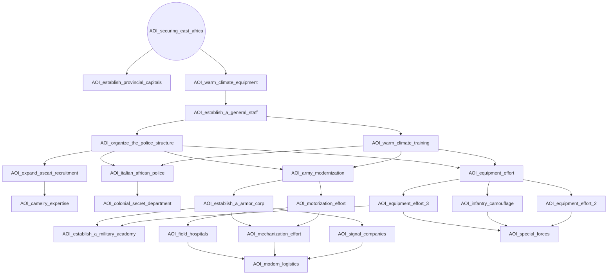

# AOI_securing_east_africa

```mermaid
flowchart TD
    n1["AOI_army_modernization"]
    n2["AOI_camelry_expertise"]
    n3["AOI_colonial_secret_department"]
    n4["AOI_equipment_effort"]
    n5["AOI_equipment_effort_2"]
    n6["AOI_equipment_effort_3"]
    n7["AOI_establish_a_armor_corp"]
    n8["AOI_establish_a_general_staff"]
    n9["AOI_establish_a_military_academy"]
    n10["AOI_establish_provincial_capitals"]
    n11["AOI_expand_ascari_recruitment"]
    n12["AOI_field_hospitals"]
    n13["AOI_infantry_camouflage"]
    n14["AOI_italian_african_police"]
    n15["AOI_mechanization_effort"]
    n16["AOI_modern_logistics"]
    n17["AOI_motorization_effort"]
    n18["AOI_organize_the_police_structure"]
    n19(("AOI_securing_east_africa"))
    n20["AOI_signal_companies"]
    n21["AOI_special_forces"]
    n22["AOI_warm_climate_equipment"]
    n23["AOI_warm_climate_training"]
    n18 --> n1
    n23 --> n1
    n11 --> n2
    n14 --> n3
    n18 --> n4
    n23 --> n4
    n4 --> n5
    n4 --> n6
    n1 --> n7
    n22 --> n8
    n7 --> n9
    n6 --> n9
    n19 --> n10
    n18 --> n11
    n17 --> n12
    n4 --> n13
    n18 --> n14
    n23 --> n14
    n7 --> n15
    n17 --> n15
    n12 --> n16
    n15 --> n16
    n20 --> n16
    n1 --> n17
    n8 --> n18
    n7 --> n20
    n6 --> n21
    n13 --> n21
    n5 --> n21
    n19 --> n22
    n8 --> n23
```
