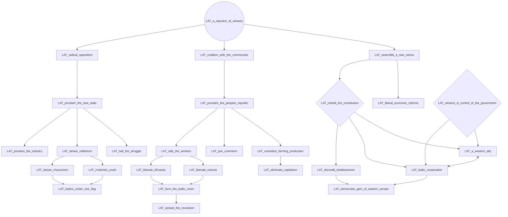
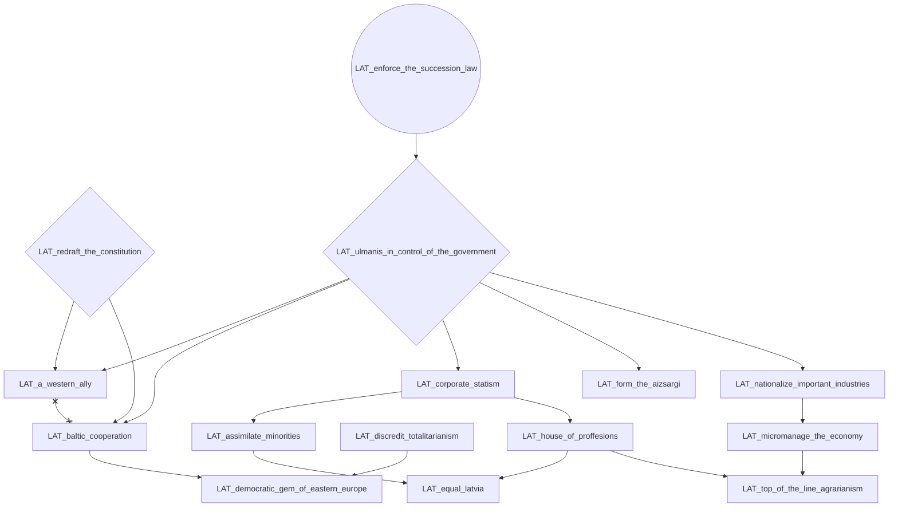

# LAT_a_rejection_of_ulmanis

```mermaid
flowchart TD
    n1(("LAT_a_rejection_of_ulmanis"))
    n2["LAT_a_western_ally"]
    n3["LAT_assemble_a_new_seima"]
    n4["LAT_baltic_cooperation"]
    n5["LAT_baltics_under_one_flag"]
    n6["LAT_centralize_farming_production"]
    n7["LAT_coalition_with_the_communists"]
    n8["LAT_democratic_gem_of_eastern_europe"]
    n9["LAT_discredit_totalitarianism"]
    n10["LAT_eliminate_capitalism"]
    n11["LAT_form_the_baltic_union"]
    n12["LAT_hail_the_struggle"]
    n13["LAT_irridentist_youth"]
    n14["LAT_join_comintern"]
    n15["LAT_latvian_chauvinism"]
    n16["LAT_latvian_militarism"]
    n17["LAT_liberal_economic_reforms"]
    n18["LAT_liberate_estonia"]
    n19["LAT_liberate_lithuania"]
    n20["LAT_privatize_the_industry"]
    n21["LAT_proclaim_the_new_state"]
    n22["LAT_proclaim_the_peoples_republic"]
    n23["LAT_radical_opposition"]
    n24["LAT_rally_the_workers"]
    n25{"LAT_redraft_the_constitution"}
    n26["LAT_spread_the_revolution"]
    n27{"LAT_ulmanis_in_control_of_the_government"}
    n25 --> n2
    n27 --> n2
    n1 --> n3
    n25 --> n4
    n27 --> n4
    n15 --> n5
    n13 --> n5
    n22 --> n6
    n1 --> n7
    n4 --> n8
    n9 --> n8
    n25 --> n9
    n6 --> n10
    n18 --> n11
    n19 --> n11
    n21 --> n12
    n16 --> n13
    n22 --> n14
    n16 --> n15
    n21 --> n16
    n3 --> n17
    n24 --> n18
    n24 --> n19
    n21 --> n20
    n23 --> n21
    n7 --> n22
    n1 --> n23
    n22 --> n24
    n3 --> n25
    n11 --> n26
    n2 x--x n4
```

# LAT_enforce_the_succession_law

```mermaid
flowchart TD
    n2["LAT_a_western_ally"]
    n28["LAT_assimilate_minorities"]
    n4["LAT_baltic_cooperation"]
    n29["LAT_corporate_statism"]
    n8["LAT_democratic_gem_of_eastern_europe"]
    n9["LAT_discredit_totalitarianism"]
    n30(("LAT_enforce_the_succession_law"))
    n31["LAT_equal_latvia"]
    n32["LAT_form_the_aizsargi"]
    n33["LAT_house_of_proffesions"]
    n34["LAT_micromanage_the_economy"]
    n35["LAT_nationalize_important_industries"]
    n25{"LAT_redraft_the_constitution"}
    n36["LAT_top_of_the_line_agrarianism"]
    n27{"LAT_ulmanis_in_control_of_the_government"}
    n25 --> n2
    n27 --> n2
    n29 --> n28
    n25 --> n4
    n27 --> n4
    n27 --> n29
    n4 --> n8
    n9 --> n8
    n33 --> n31
    n28 --> n31
    n27 --> n32
    n29 --> n33
    n35 --> n34
    n27 --> n35
    n34 --> n36
    n33 --> n36
    n30 --> n27
    n2 x--x n4
```
