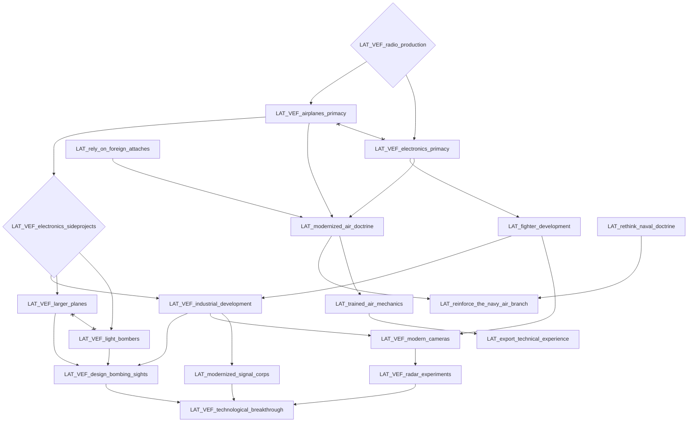
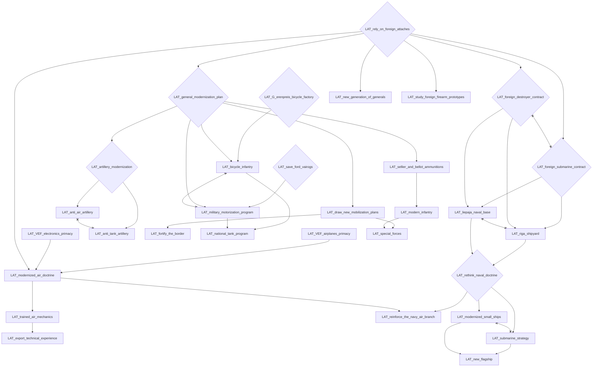
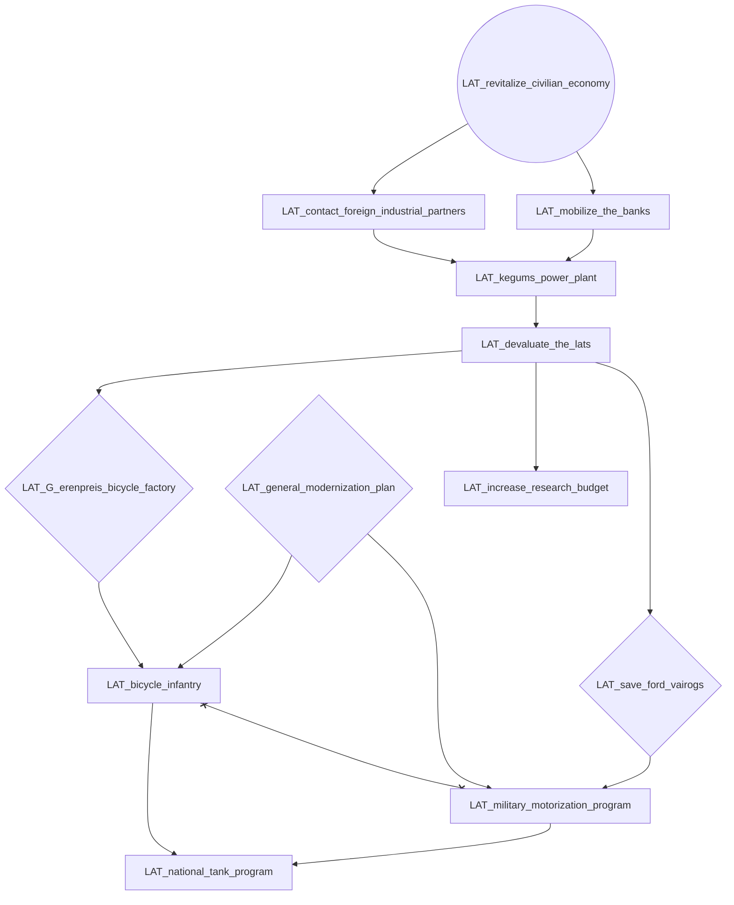

# LAT_VEF_radio_production

```mermaid
flowchart TD
    n1["LAT_VEF_airplanes_primacy"]
    n2["LAT_VEF_design_bombing_sights"]
    n3["LAT_VEF_electronics_primacy"]
    n4{"LAT_VEF_electronics_sideprojects"}
    n5["LAT_VEF_industrial_development"]
    n6["LAT_VEF_larger_planes"]
    n7["LAT_VEF_light_bombers"]
    n8["LAT_VEF_modern_cameras"]
    n9["LAT_VEF_radar_experiments"]
    n10{"LAT_VEF_radio_production"}
    n11["LAT_VEF_technological_breakthrough"]
    n12["LAT_export_technical_experience"]
    n13["LAT_fighter_development"]
    n14["LAT_modernized_air_doctrine"]
    n15["LAT_modernized_signal_corps"]
    n16["LAT_reinforce_the_navy_air_branch"]
    n17["LAT_rely_on_foreign_attaches"]
    n18["LAT_rethink_naval_doctrine"]
    n19["LAT_trained_air_mechanics"]
    n10 --> n1
    n5 --> n2
    n6 --> n2
    n7 --> n2
    n10 --> n3
    n1 --> n4
    n13 --> n5
    n4 --> n5
    n4 --> n6
    n4 --> n7
    n13 --> n8
    n5 --> n8
    n8 --> n9
    n9 --> n11
    n2 --> n11
    n15 --> n11
    n19 --> n12
    n3 --> n13
    n1 --> n14
    n3 --> n14
    n17 --> n14
    n5 --> n15
    n18 --> n16
    n14 --> n16
    n14 --> n19
    n1 x--x n3
    n6 x--x n7
```

# LAT_rely_on_foreign_attaches

```mermaid
flowchart TD
    n20{"LAT_G_erenpreis_bicycle_factory"}
    n1["LAT_VEF_airplanes_primacy"]
    n3["LAT_VEF_electronics_primacy"]
    n21["LAT_anti_air_artillery"]
    n22["LAT_anti_tank_artillery"]
    n23{"LAT_artillery_modernization"}
    n24["LAT_bicycle_infantry"]
    n25["LAT_draw_new_mobilization_plans"]
    n12["LAT_export_technical_experience"]
    n26{"LAT_foreign_destroyer_contract"}
    n27{"LAT_foreign_submarine_contract"}
    n28["LAT_fortify_the_border"]
    n29{"LAT_general_modernization_plan"}
    n30["LAT_liepaja_naval_base"]
    n31["LAT_military_motorization_program"]
    n32["LAT_modern_infantry"]
    n14["LAT_modernized_air_doctrine"]
    n33["LAT_modernized_small_ships"]
    n34["LAT_national_tank_program"]
    n35["LAT_new_flagship"]
    n36["LAT_new_generation_of_generals"]
    n16["LAT_reinforce_the_navy_air_branch"]
    n17{"LAT_rely_on_foreign_attaches"}
    n18{"LAT_rethink_naval_doctrine"}
    n37["LAT_riga_shipyard"]
    n38{"LAT_save_ford_vairogs"}
    n39["LAT_sellier_and_bellot_ammunitions"]
    n40["LAT_special_forces"]
    n41["LAT_study_foreign_firearm_prototypes"]
    n42["LAT_submarine_strategy"]
    n19["LAT_trained_air_mechanics"]
    n23 --> n21
    n23 --> n22
    n29 --> n23
    n20 --> n24
    n29 --> n24
    n29 --> n25
    n19 --> n12
    n17 --> n26
    n17 --> n27
    n25 --> n28
    n17 --> n29
    n27 --> n30
    n26 --> n30
    n38 --> n31
    n29 --> n31
    n39 --> n32
    n1 --> n14
    n3 --> n14
    n17 --> n14
    n18 --> n33
    n24 --> n34
    n31 --> n34
    n42 --> n35
    n33 --> n35
    n17 --> n36
    n18 --> n16
    n14 --> n16
    n37 --> n18
    n30 --> n18
    n27 --> n37
    n26 --> n37
    n29 --> n39
    n25 --> n40
    n32 --> n40
    n17 --> n41
    n18 --> n42
    n14 --> n19
    n21 x--x n22
    n24 x--x n31
    n26 x--x n27
    n30 x--x n37
    n33 x--x n42
```

# LAT_revitalize_civilian_economy

```mermaid
flowchart TD
    n20{"LAT_G_erenpreis_bicycle_factory"}
    n24["LAT_bicycle_infantry"]
    n43["LAT_contact_foreign_industrial_partners"]
    n44["LAT_devaluate_the_lats"]
    n29{"LAT_general_modernization_plan"}
    n45["LAT_increase_research_budget"]
    n46["LAT_kegums_power_plant"]
    n31["LAT_military_motorization_program"]
    n47["LAT_mobilize_the_banks"]
    n34["LAT_national_tank_program"]
    n48(("LAT_revitalize_civilian_economy"))
    n38{"LAT_save_ford_vairogs"}
    n44 --> n20
    n20 --> n24
    n29 --> n24
    n48 --> n43
    n46 --> n44
    n44 --> n45
    n43 --> n46
    n47 --> n46
    n38 --> n31
    n29 --> n31
    n48 --> n47
    n24 --> n34
    n31 --> n34
    n44 --> n38
    n24 x--x n31
```
