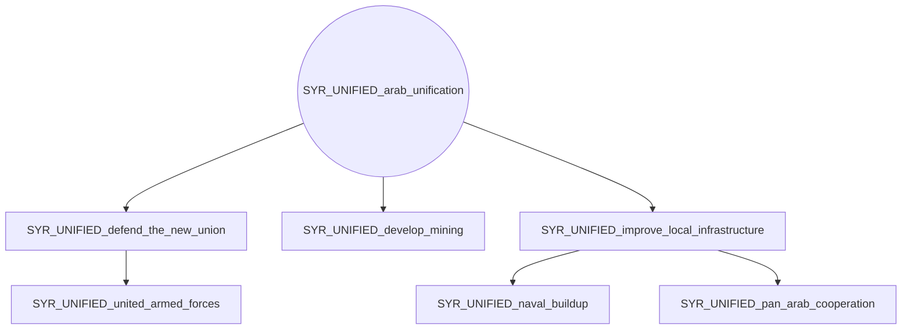

# SYR_UNIFIED_arab_unification

```mermaid
flowchart TD
    n1(("SYR_UNIFIED_arab_unification"))
    n2["SYR_UNIFIED_defend_the_new_union"]
    n3["SYR_UNIFIED_develop_mining"]
    n4["SYR_UNIFIED_improve_local_infrastructure"]
    n5["SYR_UNIFIED_naval_buildup"]
    n6["SYR_UNIFIED_pan_arab_cooperation"]
    n7["SYR_UNIFIED_united_armed_forces"]
    n1 --> n2
    n1 --> n3
    n1 --> n4
    n4 --> n5
    n4 --> n6
    n2 --> n7
```
