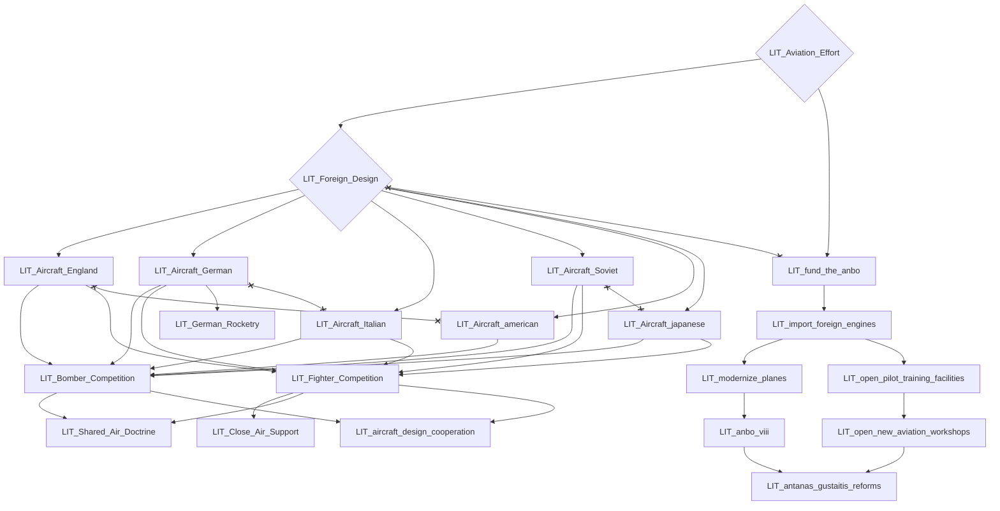
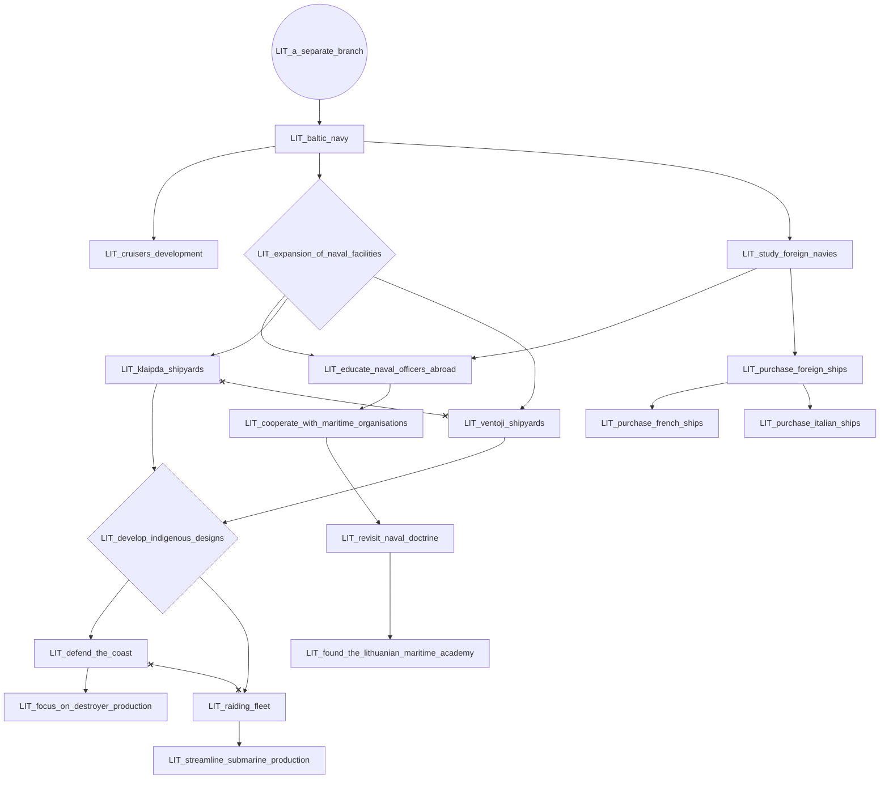
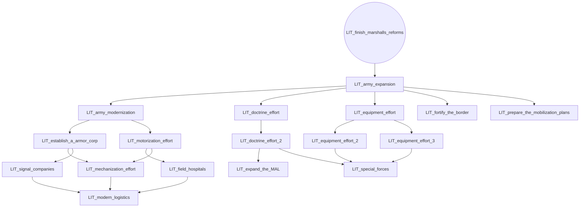
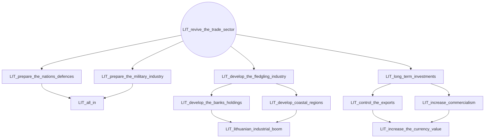

# LIT_Aviation_Effort

```mermaid
flowchart TD
    n1["LIT_Aircraft_England"]
    n2["LIT_Aircraft_German"]
    n3["LIT_Aircraft_Italian"]
    n4["LIT_Aircraft_Soviet"]
    n5["LIT_Aircraft_american"]
    n6["LIT_Aircraft_japanese"]
    n7{"LIT_Aviation_Effort"}
    n8["LIT_Bomber_Competition"]
    n9["LIT_Close_Air_Support"]
    n10["LIT_Fighter_Competition"]
    n11{"LIT_Foreign_Design"}
    n12["LIT_German_Rocketry"]
    n13["LIT_Shared_Air_Doctrine"]
    n14["LIT_aircraft_design_cooperation"]
    n15["LIT_anbo_viii"]
    n16["LIT_antanas_gustaitis_reforms"]
    n17["LIT_fund_the_anbo"]
    n18["LIT_import_foreign_engines"]
    n19["LIT_modernize_planes"]
    n20["LIT_open_new_aviation_workshops"]
    n21["LIT_open_pilot_training_facilities"]
    n11 --> n1
    n11 --> n2
    n11 --> n3
    n11 --> n4
    n11 --> n5
    n11 --> n6
    n2 --> n8
    n1 --> n8
    n5 --> n8
    n4 --> n8
    n3 --> n8
    n6 --> n8
    n10 --> n9
    n1 --> n10
    n2 --> n10
    n4 --> n10
    n3 --> n10
    n6 --> n10
    n7 --> n11
    n2 --> n12
    n10 --> n13
    n8 --> n13
    n10 --> n14
    n8 --> n14
    n19 --> n15
    n15 --> n16
    n20 --> n16
    n7 --> n17
    n17 --> n18
    n18 --> n19
    n21 --> n20
    n18 --> n21
    n1 x--x n5
    n2 x--x n3
    n4 x--x n6
    n11 x--x n17
```

# LIT_a_separate_branch

```mermaid
flowchart TD
    n22(("LIT_a_separate_branch"))
    n23["LIT_baltic_navy"]
    n24["LIT_cooperate_with_maritime_organisations"]
    n25["LIT_cruisers_development"]
    n26["LIT_defend_the_coast"]
    n27{"LIT_develop_indigenous_designs"}
    n28["LIT_educate_naval_officers_abroad"]
    n29{"LIT_expansion_of_naval_facilities"}
    n30["LIT_focus_on_destroyer_production"]
    n31["LIT_found_the_lithuanian_maritime_academy"]
    n32["LIT_klaipda_shipyards"]
    n33["LIT_purchase_foreign_ships"]
    n34["LIT_purchase_french_ships"]
    n35["LIT_purchase_italian_ships"]
    n36["LIT_raiding_fleet"]
    n37["LIT_revisit_naval_doctrine"]
    n38["LIT_streamline_submarine_production"]
    n39["LIT_study_foreign_navies"]
    n40["LIT_ventoji_shipyards"]
    n22 --> n23
    n28 --> n24
    n23 --> n25
    n27 --> n26
    n32 --> n27
    n40 --> n27
    n39 --> n28
    n29 --> n28
    n23 --> n29
    n26 --> n30
    n37 --> n31
    n29 --> n32
    n39 --> n33
    n33 --> n34
    n33 --> n35
    n27 --> n36
    n24 --> n37
    n36 --> n38
    n23 --> n39
    n29 --> n40
    n26 x--x n36
    n32 x--x n40
```

# LIT_announce_upcoming_elections

```mermaid
flowchart TD
    n41["LIT_academy_of_sciences"]
    n42["LIT_accept_opposition_in_the_government"]
    n43["LIT_adopt_a_new_constitution"]
    n44["LIT_ally_france"]
    n45["LIT_ally_italy"]
    n46["LIT_amend_the_electoral_law"]
    n47["LIT_amnesty_to_political_prisoners"]
    n48{"LIT_announce_upcoming_elections"}
    n49{"LIT_arrest_nazi_sympathizers"}
    n50["LIT_banish_smetonists"]
    n51["LIT_battle_for_lithuania"]
    n52["LIT_break_nationalist_union"]
    n53["LIT_collectivisation"]
    n54["LIT_contact_the_aurininkai"]
    n55{"LIT_contain_german_agression"}
    n56["LIT_continue_griniuss_presidency"]
    n57["LIT_cooperate_with_the_conservatives"]
    n58["LIT_cult_of_vytautas_the_great"]
    n59["LIT_db_six_hundred"]
    n60["LIT_decrease_representation"]
    n61["LIT_dissolve_the_klaipda_directorate"]
    n62["LIT_dissolve_the_seimas"]
    n63["LIT_draw_closer_to_finland"]
    n64{"LIT_draw_closer_to_sweden"}
    n65["LIT_elect_the_fourth_seimas"]
    n66["LIT_empower_litvak_community"]
    n67["LIT_empower_patriots"]
    n68["LIT_empower_radicals"]
    n69["LIT_empower_smetona"]
    n70["LIT_enforce_lithuaniazation"]
    n71["LIT_ensure_german_support"]
    n72["LIT_exile_voldemaras"]
    n73["LIT_expand_riflemans_union"]
    n74["LIT_expand_to_markets"]
    n75["LIT_force_parties_to_reregister"]
    n76["LIT_form_a_baltic_alliance"]
    n77["LIT_form_the_lithuanian_security_police"]
    n78["LIT_form_the_youth_branch"]
    n79["LIT_fortify_klaipda"]
    n80["LIT_gediminas_heritage"]
    n81{"LIT_german_capital"}
    n82["LIT_german_industrial_aid"]
    n83["LIT_germanlithuanian_credit_agreement"]
    n84["LIT_germanlithuanian_mutual_assistance_treaty"]
    n85["LIT_greater_lithuania"]
    n86{"LIT_hold_fair_elections"}
    n87{"LIT_hold_the_lnp_commission"}
    n88["LIT_industrialisation"]
    n89["LIT_integrate_lithuanian_rail_network"]
    n90["LIT_intervene_in_the_german_civil_war"]
    n91["LIT_invest_in_public_education"]
    n92["LIT_join_allies"]
    n93["LIT_join_axis"]
    n94["LIT_join_central_powers"]
    n95["LIT_join_comintern"]
    n96["LIT_join_northern_lights"]
    n97["LIT_join_ussr"]
    n98{"LIT_kaunas_conference"}
    n99["LIT_kings_party"]
    n100["LIT_launch_the_revolution"]
    n101["LIT_lcp_resurgence"]
    n102["LIT_lead_by_example"]
    n103["LIT_legacy_of_mindaugas"]
    n104["LIT_liberalization_of_trade_policies"]
    n105["LIT_lithuanian_antibolshevik_legions"]
    n106["LIT_lithuanian_autarky"]
    n107{"LIT_lithuanian_irridentism"}
    n108{"LIT_mercedes_benz_engine_plant"}
    n109["LIT_militarise_the_iron_wolf"]
    n110["LIT_model_capitalist_society"]
    n111["LIT_nationalist_education"]
    n112["LIT_new_lithuania"]
    n113["LIT_new_noble_class"]
    n114["LIT_northern_intervention"]
    n115{"LIT_offer_our_enemies_support"}
    n116{"LIT_operation_mindaugas"}
    n117["LIT_peoples_army"]
    n118["LIT_preparing_for_the_inevitable"]
    n119["LIT_preparing_for_the_uprising"]
    n120["LIT_privatise_lithuanian_railroads"]
    n121["LIT_promote_lithuanian_aryanism"]
    n122["LIT_propose_a_baltic_union"]
    n123{"LIT_r56_demand_vilnius"}
    n124{"LIT_reconvene_the_council_of_lithuania"}
    n125["LIT_red_estonia"]
    n126["LIT_red_latvia"]
    n127["LIT_red_volunteers"]
    n128["LIT_redraft_the_twelve_point_proposal"]
    n129["LIT_reform_the_iron_wolf"]
    n130["LIT_rehabilitate_organisers_of_the_1934_coup"]
    n131["LIT_reinforce_czechoslovak_ties"]
    n132["LIT_reinforce_kaunas_fortress"]
    n133["LIT_reintegrate_lit_minor"]
    n134["LIT_remove_cencorship"]
    n135["LIT_remove_martial_law"]
    n136["LIT_research_cooperative"]
    n137["LIT_restore_constitutionalism"]
    n138["LIT_restore_the_gdl"]
    n139["LIT_return_of_voldemaras"]
    n140["LIT_roman_recognition"]
    n141{"LIT_root_out_communists"}
    n142["LIT_royal_adress"]
    n143{"LIT_royal_legacy"}
    n144["LIT_seek_accommodation_with_germany"]
    n145["LIT_seize_minority_assets"]
    n146["LIT_skirpas_coup"]
    n147["LIT_social_welfare_focus"]
    n148["LIT_socialist_science"]
    n149{"LIT_solicit_ratikiss_support"}
    n150["LIT_sovietlithuanian_mutual_assistance_treaty"]
    n151["LIT_spread_the_revolution"]
    n152["LIT_subsidize_farmers"]
    n153["LIT_subsidize_food_industry"]
    n154["LIT_support_domestic_entrepreneurs"]
    n155["LIT_support_the_lkma"]
    n156["LIT_syndicalize_agriculture"]
    n157["LIT_the_4th_president"]
    n158["LIT_three_thousand"]
    n159["LIT_unify_baltics_communist"]
    n160["LIT_unify_baltics_fascist"]
    n161["LIT_urbanisation"]
    n162["LIT_vilnius_procession"]
    n163["LIT_voldemarininkai_coup"]
    n164{"LIT_vote_on_monarchy"}
    n112 --> n41
    n141 --> n42
    n65 --> n43
    n78 --> n43
    n55 --> n44
    n55 --> n45
    n75 --> n46
    n157 --> n47
    n56 --> n47
    n69 --> n49
    n124 --> n50
    n70 --> n51
    n156 --> n51
    n124 --> n52
    n112 --> n53
    n56 --> n54
    n107 --> n55
    n86 --> n56
    n164 --> n57
    n143 --> n58
    n108 --> n59
    n75 --> n60
    n49 --> n61
    n149 --> n62
    n152 --> n63
    n152 --> n64
    n46 --> n65
    n112 --> n66
    n87 --> n67
    n87 --> n68
    n72 --> n69
    n43 --> n69
    n67 --> n70
    n124 --> n71
    n65 --> n72
    n78 --> n72
    n78 --> n73
    n81 --> n74
    n48 --> n75
    n64 --> n76
    n129 --> n77
    n60 --> n78
    n61 --> n79
    n143 --> n80
    n104 --> n81
    n99 --> n81
    n57 --> n81
    n137 --> n81
    n83 --> n82
    n121 --> n83
    n145 --> n83
    n115 --> n84
    n123 --> n85
    n116 --> n85
    n149 --> n86
    n139 --> n87
    n130 --> n87
    n129 --> n87
    n53 --> n88
    n81 --> n89
    n124 --> n90
    n47 --> n91
    n134 --> n91
    n64 --> n92
    n144 --> n93
    n99 --> n94
    n57 --> n94
    n112 --> n95
    n117 --> n95
    n64 --> n96
    n95 --> n97
    n142 --> n98
    n94 --> n98
    n164 --> n99
    n119 --> n100
    n48 --> n101
    n111 --> n102
    n143 --> n103
    n157 --> n104
    n109 --> n105
    n94 --> n105
    n51 --> n106
    n109 --> n107
    n89 --> n108
    n68 --> n109
    n67 --> n109
    n154 --> n110
    n120 --> n110
    n65 --> n111
    n87 --> n111
    n100 --> n112
    n128 --> n113
    n107 --> n114
    n42 --> n115
    n61 --> n115
    n107 --> n116
    n98 --> n116
    n100 --> n117
    n64 --> n118
    n131 --> n118
    n101 --> n119
    n104 --> n120
    n68 --> n121
    n131 --> n122
    n107 --> n123
    n98 --> n123
    n62 --> n124
    n151 --> n125
    n151 --> n126
    n117 --> n127
    n142 --> n128
    n140 --> n128
    n163 --> n129
    n163 --> n130
    n157 --> n131
    n42 --> n132
    n151 --> n133
    n157 --> n134
    n56 --> n134
    n157 --> n135
    n56 --> n135
    n92 --> n136
    n76 --> n136
    n96 --> n136
    n164 --> n137
    n123 --> n138
    n116 --> n138
    n163 --> n139
    n99 --> n140
    n57 --> n140
    n137 --> n140
    n69 --> n141
    n99 --> n142
    n57 --> n142
    n137 --> n142
    n162 --> n143
    n113 --> n143
    n107 --> n144
    n68 --> n145
    n84 --> n146
    n56 --> n147
    n41 --> n148
    n48 --> n149
    n115 --> n150
    n117 --> n151
    n56 --> n152
    n46 --> n153
    n60 --> n153
    n74 --> n154
    n99 --> n155
    n57 --> n155
    n137 --> n155
    n67 --> n156
    n86 --> n157
    n108 --> n158
    n125 --> n159
    n126 --> n159
    n123 --> n160
    n116 --> n160
    n53 --> n161
    n98 --> n162
    n48 --> n163
    n52 --> n164
    n50 --> n164
    n42 x--x n61
    n44 x--x n45
    n50 x--x n52
    n55 x--x n144
    n56 x--x n157
    n57 x--x n99
    n57 x--x n137
    n58 x--x n80
    n58 x--x n103
    n59 x--x n158
    n62 x--x n86
    n67 x--x n68
    n74 x--x n89
    n75 x--x n101
    n75 x--x n149
    n75 x--x n163
    n76 x--x n92
    n76 x--x n96
    n80 x--x n103
    n84 x--x n150
    n85 x--x n138
    n85 x--x n160
    n92 x--x n96
    n99 x--x n137
    n101 x--x n149
    n101 x--x n163
    n116 x--x n123
    n138 x--x n160
    n149 x--x n163
```

# LIT_finish_marshalls_reforms

```mermaid
flowchart TD
    n165["LIT_army_expansion"]
    n166["LIT_army_modernization"]
    n167["LIT_doctrine_effort"]
    n168["LIT_doctrine_effort_2"]
    n169["LIT_equipment_effort"]
    n170["LIT_equipment_effort_2"]
    n171["LIT_equipment_effort_3"]
    n172["LIT_establish_a_armor_corp"]
    n173["LIT_expand_the_MAL"]
    n174["LIT_field_hospitals"]
    n175(("LIT_finish_marshalls_reforms"))
    n176["LIT_fortify_the_border"]
    n177["LIT_mechanization_effort"]
    n178["LIT_modern_logistics"]
    n179["LIT_motorization_effort"]
    n180["LIT_prepare_the_mobilization_plans"]
    n181["LIT_signal_companies"]
    n182["LIT_special_forces"]
    n175 --> n165
    n165 --> n166
    n165 --> n167
    n167 --> n168
    n165 --> n169
    n169 --> n170
    n169 --> n171
    n166 --> n172
    n168 --> n173
    n179 --> n174
    n165 --> n176
    n172 --> n177
    n179 --> n177
    n174 --> n178
    n177 --> n178
    n181 --> n178
    n166 --> n179
    n165 --> n180
    n172 --> n181
    n171 --> n182
    n168 --> n182
    n170 --> n182
```

# LIT_revive_the_trade_sector

```mermaid
flowchart TD
    n183["LIT_all_in"]
    n184["LIT_control_the_exports"]
    n185["LIT_develop_coastal_regions"]
    n186["LIT_develop_the_banks_holdings"]
    n187["LIT_develop_the_fledgling_industry"]
    n188["LIT_increase_commercialism"]
    n189["LIT_increase_the_currency_value"]
    n190["LIT_lithuanian_industrial_boom"]
    n191["LIT_long_term_investments"]
    n192["LIT_prepare_the_military_industry"]
    n193["LIT_prepare_the_nations_defences"]
    n194(("LIT_revive_the_trade_sector"))
    n193 --> n183
    n192 --> n183
    n191 --> n184
    n187 --> n185
    n187 --> n186
    n194 --> n187
    n191 --> n188
    n184 --> n189
    n188 --> n189
    n186 --> n190
    n185 --> n190
    n194 --> n191
    n194 --> n192
    n194 --> n193
```
