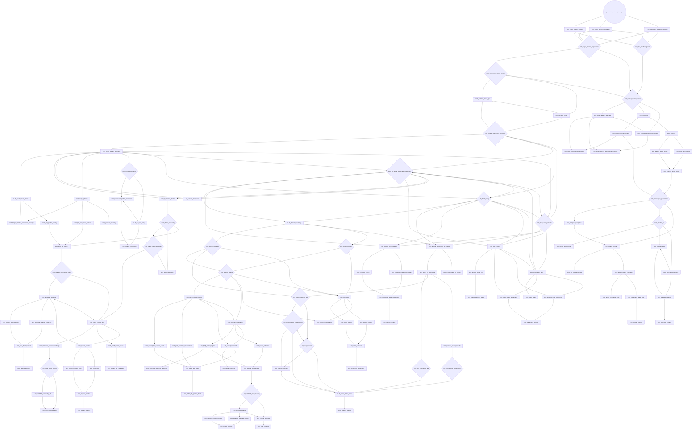

# LUX_establish_national_labour_council

```mermaid
flowchart TD
    n1["LUX_abandon_neutrality"]
    n2{"LUX_abandon_the_foolish_policy"}
    n3{"LUX_abolish_monarchy"}
    n4["LUX_academy_of_science"]
    n5{"LUX_adopt_soviet_policies"}
    n6["LUX_agressive_stance"]
    n7["LUX_aid_the_warmachine"]
    n8["LUX_annex_conquered_lands"]
    n9["LUX_announce_colonial_claims"]
    n10["LUX_another_declaration_of_neutrality"]
    n11{"LUX_appoint_new_prime_minister"}
    n12["LUX_arms_purchases"]
    n13["LUX_arrest_dennemeyer"]
    n14["LUX_attack_alliance_francaise"]
    n15{"LUX_ban_international_aid"}
    n16["LUX_bastion_of_antifascism"]
    n17["LUX_begin_collective_ownership_campaign"]
    n18{"LUX_begin_election_preparations"}
    n19{"LUX_begin_rearmament"}
    n20["LUX_begin_workers_revolution"]
    n21{"LUX_benelux_alliance"}
    n22["LUX_bring_revolution_south"]
    n23["LUX_british_funding"]
    n24["LUX_comintern_research_exchange"]
    n25{"LUX_commemorate_independence"}
    n26["LUX_complete_integration"]
    n27{"LUX_contest_election_results"}
    n28["LUX_continue_the_fight"]
    n29{"LUX_control_radio_transmissions"}
    n30["LUX_decentralised_alliance"]
    n31{"LUX_demonstrate_our_will"}
    n32["LUX_destroy_stalinism"]
    n33["LUX_dreams_of_federation"]
    n34["LUX_elevate_trade_unions"]
    n35["LUX_ensure_minimum_wage"]
    n36{"LUX_erase_monarchist_legacy"}
    n37["LUX_establish_european_claims"]
    n38{"LUX_establish_free_university"}
    n39(("LUX_establish_national_labour_council"))
    n40["LUX_establish_personality_cult"]
    n41{"LUX_establish_ss"}
    n42["LUX_european_revolution"]
    n43["LUX_expand_benelux"]
    n44["LUX_expand_conscription"]
    n45["LUX_expand_farm_subsidies"]
    n46["LUX_expand_social_net"]
    n47["LUX_expand_the_customs_union"]
    n48["LUX_expand_the_gau"]
    n49["LUX_expand_via_capabilities"]
    n50["LUX_extend_maginot"]
    n51["LUX_fair_economy"]
    n52{"LUX_finalise_government_formation"}
    n53["LUX_find_new_trade_partners"]
    n54{"LUX_first_social_democratic_government"}
    n55["LUX_follow_destalinisation"]
    n56["LUX_follow_moscow_line"]
    n57["LUX_fortify_border_regions"]
    n58["LUX_found_lnp"]
    n59["LUX_found_secret_service"]
    n60["LUX_fully_counter_french_influence"]
    n61["LUX_future_of_europe"]
    n62["LUX_german_intellect"]
    n63["LUX_grant_citizenship"]
    n64["LUX_greater_benelux"]
    n65["LUX_head_east"]
    n66["LUX_incorporate_political_comissars"]
    n67["LUX_increase_border_security"]
    n68["LUX_increase_defense_production"]
    n69["LUX_industrialise_west_rhine"]
    n70["LUX_integrate_french_organisations"]
    n71["LUX_integrated_defensive_networks"]
    n72["LUX_invade_benelux"]
    n73["LUX_invigorate_mining"]
    n74["LUX_join_allies"]
    n75["LUX_joint_economic_development"]
    n76["LUX_lead_the_opposition"]
    n77["LUX_legislative_reforms"]
    n78["LUX_lessons_from_spain"]
    n79{"LUX_liberal_victory"}
    n80["LUX_liberate_lowlands"]
    n81["LUX_lower_taxes"]
    n82["LUX_maintain_status_quo"]
    n83["LUX_maneuver_warfare"]
    n84["LUX_merge_industries"]
    n85["LUX_open_border_agreements"]
    n86["LUX_organise_street_rallies"]
    n87["LUX_oust_capitalists"]
    n88{"LUX_oust_socialists"}
    n89["LUX_peace_in_our_times"]
    n90["LUX_peoples_university"]
    n91["LUX_policy_of_free_hands"]
    n92["LUX_politicise_army"]
    n93["LUX_preventive_intervention"]
    n94["LUX_privatisation_drive"]
    n95["LUX_professionalise_army"]
    n96["LUX_promote_small_businesses"]
    n97["LUX_reaffirm_treaty_of_london"]
    n98["LUX_regional_development"]
    n99["LUX_rejuvenate_the_luxembourgish_identity"]
    n100["LUX_renegotiate_trade_agreements"]
    n101["LUX_repair_belgian_relations"]
    n102{"LUX_replace_the_government"}
    n103["LUX_request_further_expansion"]
    n104["LUX_request_german_funding"]
    n105["LUX_research_cooperation"]
    n106["LUX_restore_neutrality"]
    n107["LUX_revert_worker_immigration"]
    n108{"LUX_revolutionise_army"}
    n109["LUX_science_funding"]
    n110{"LUX_seek_protection"}
    n111["LUX_socialist_science"]
    n112["LUX_socialist_victory"]
    n113["LUX_strengthen_agricultural_industry"]
    n114["LUX_strengthen_rural_communities"]
    n115["LUX_strike_the_german_threat"]
    n116["LUX_struggle_for_equality"]
    n117["LUX_subvert_armed_forces"]
    n118{"LUX_the_dupong_ministry"}
    n119{"LUX_the_maulkuerfgesetz"}
    n120["LUX_total_neutrality"]
    n121["LUX_true_red_army"]
    n122["LUX_unbeaten_in_battle"]
    n123["LUX_unified_command"]
    n124["LUX_unite_the_country"]
    n125["LUX_united_and_ready"]
    n126["LUX_utilise_dennemeyer"]
    n127["LUX_utilise_lvj"]
    n79 --> n1
    n54 --> n1
    n124 --> n2
    n77 --> n3
    n85 --> n4
    n96 --> n4
    n24 --> n5
    n38 --> n6
    n48 --> n7
    n103 --> n8
    n6 --> n9
    n118 --> n10
    n79 --> n10
    n18 --> n11
    n50 --> n12
    n23 --> n12
    n41 --> n13
    n27 --> n14
    n91 --> n15
    n42 --> n16
    n87 --> n17
    n34 --> n17
    n107 --> n18
    n113 --> n18
    n101 --> n18
    n1 --> n19
    n52 --> n20
    n110 --> n21
    n19 --> n21
    n72 --> n22
    n74 --> n23
    n56 --> n24
    n31 --> n25
    n102 --> n26
    n119 --> n27
    n18 --> n27
    n88 --> n28
    n25 --> n28
    n67 --> n29
    n21 --> n30
    n91 --> n31
    n19 --> n31
    n76 --> n32
    n21 --> n33
    n20 --> n34
    n46 --> n35
    n3 --> n36
    n6 --> n37
    n98 --> n38
    n5 --> n40
    n102 --> n41
    n2 --> n42
    n22 --> n43
    n65 --> n43
    n66 --> n44
    n121 --> n44
    n54 --> n45
    n79 --> n45
    n118 --> n45
    n51 --> n46
    n30 --> n47
    n102 --> n48
    n59 --> n49
    n74 --> n50
    n54 --> n51
    n79 --> n51
    n118 --> n51
    n82 --> n52
    n112 --> n52
    n87 --> n53
    n52 --> n54
    n5 --> n55
    n2 --> n56
    n36 --> n56
    n33 --> n57
    n27 --> n58
    n56 --> n59
    n14 --> n60
    n104 --> n60
    n89 --> n61
    n69 --> n62
    n3 --> n63
    n37 --> n64
    n9 --> n64
    n72 --> n65
    n108 --> n66
    n91 --> n67
    n42 --> n68
    n103 --> n69
    n27 --> n70
    n57 --> n71
    n56 --> n72
    n42 --> n72
    n45 --> n73
    n110 --> n74
    n19 --> n74
    n30 --> n75
    n68 --> n76
    n16 --> n76
    n54 --> n77
    n20 --> n77
    n20 --> n78
    n54 --> n78
    n52 --> n79
    n123 --> n80
    n94 --> n81
    n11 --> n82
    n95 --> n83
    n92 --> n83
    n33 --> n84
    n94 --> n85
    n51 --> n85
    n117 --> n86
    n126 --> n86
    n20 --> n87
    n31 --> n88
    n88 --> n89
    n25 --> n89
    n29 --> n89
    n15 --> n89
    n87 --> n90
    n10 --> n91
    n41 --> n92
    n12 --> n93
    n54 --> n94
    n79 --> n94
    n118 --> n94
    n41 --> n95
    n51 --> n96
    n94 --> n96
    n10 --> n97
    n57 --> n98
    n84 --> n98
    n14 --> n99
    n70 --> n99
    n114 --> n100
    n73 --> n100
    n39 --> n101
    n86 --> n102
    n104 --> n102
    n48 --> n103
    n58 --> n104
    n21 --> n105
    n74 --> n105
    n38 --> n106
    n39 --> n107
    n20 --> n108
    n100 --> n109
    n1 --> n110
    n43 --> n111
    n11 --> n112
    n39 --> n113
    n45 --> n114
    n125 --> n115
    n34 --> n116
    n127 --> n117
    n52 --> n118
    n107 --> n119
    n113 --> n119
    n101 --> n119
    n106 --> n120
    n108 --> n121
    n83 --> n122
    n33 --> n123
    n30 --> n123
    n116 --> n124
    n53 --> n124
    n3 --> n124
    n123 --> n125
    n47 --> n125
    n75 --> n125
    n127 --> n126
    n58 --> n127
    n1 x--x n10
    n6 x--x n106
    n11 x--x n27
    n14 x--x n70
    n20 x--x n54
    n20 x--x n79
    n20 x--x n118
    n21 x--x n74
    n25 x--x n88
    n26 x--x n48
    n28 x--x n89
    n30 x--x n33
    n36 x--x n63
    n40 x--x n55
    n42 x--x n56
    n51 x--x n94
    n54 x--x n79
    n54 x--x n118
    n66 x--x n121
    n79 x--x n118
    n82 x--x n112
    n92 x--x n95
```
