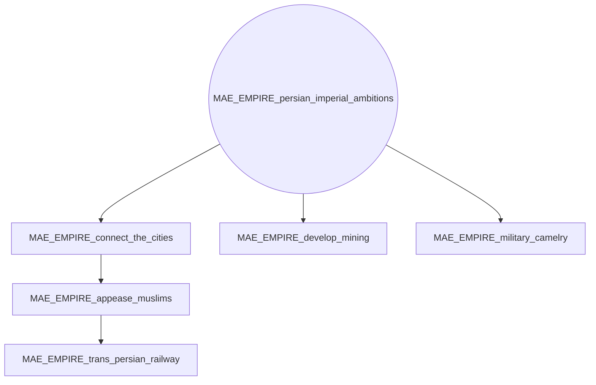

# MAE_EMPIRE_persian_imperial_ambitions

```mermaid
flowchart TD
    n1["MAE_EMPIRE_appease_muslims"]
    n2["MAE_EMPIRE_connect_the_cities"]
    n3["MAE_EMPIRE_develop_mining"]
    n4["MAE_EMPIRE_military_camelry"]
    n5(("MAE_EMPIRE_persian_imperial_ambitions"))
    n6["MAE_EMPIRE_trans_persian_railway"]
    n2 --> n1
    n5 --> n2
    n5 --> n3
    n5 --> n4
    n1 --> n6
```
