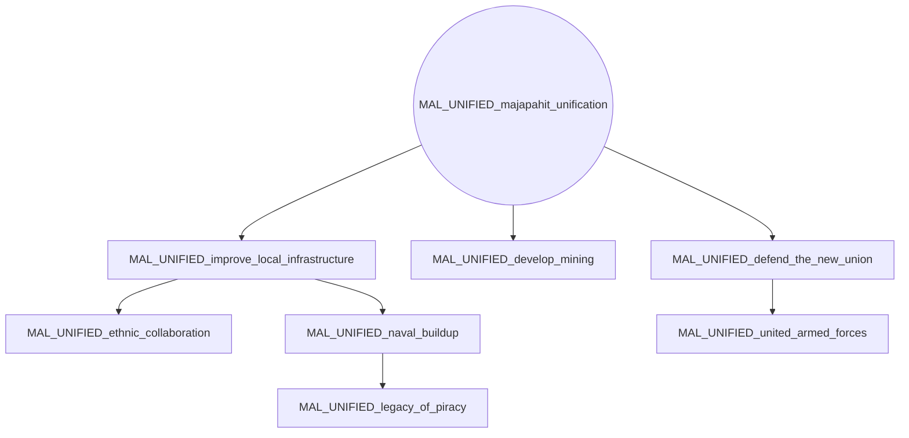

# MAL_UNIFIED_majapahit_unification

```mermaid
flowchart TD
    n1["MAL_UNIFIED_defend_the_new_union"]
    n2["MAL_UNIFIED_develop_mining"]
    n3["MAL_UNIFIED_ethnic_collaboration"]
    n4["MAL_UNIFIED_improve_local_infrastructure"]
    n5["MAL_UNIFIED_legacy_of_piracy"]
    n6(("MAL_UNIFIED_majapahit_unification"))
    n7["MAL_UNIFIED_naval_buildup"]
    n8["MAL_UNIFIED_united_armed_forces"]
    n6 --> n1
    n6 --> n2
    n4 --> n3
    n6 --> n4
    n7 --> n5
    n4 --> n7
    n1 --> n8
```
