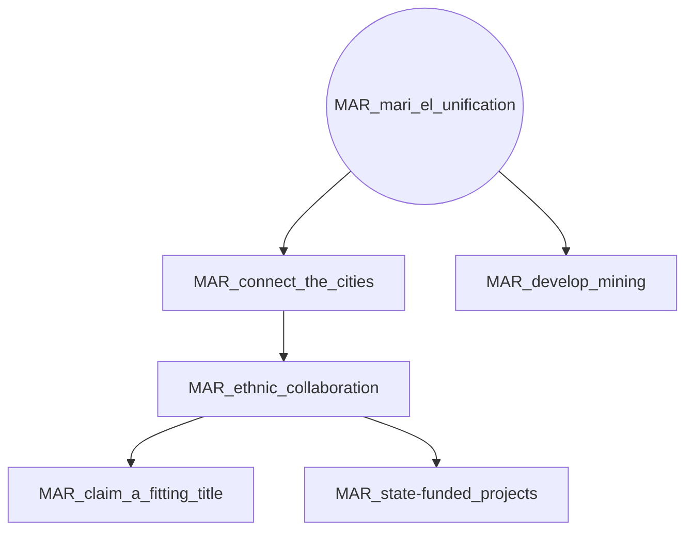

# MAR_mari_el_unification

```mermaid
flowchart TD
    n1["MAR_claim_a_fitting_title"]
    n2["MAR_connect_the_cities"]
    n3["MAR_develop_mining"]
    n4["MAR_ethnic_collaboration"]
    n5(("MAR_mari_el_unification"))
    n6["MAR_state-funded_projects"]
    n4 --> n1
    n5 --> n2
    n5 --> n3
    n2 --> n4
    n4 --> n6
```
