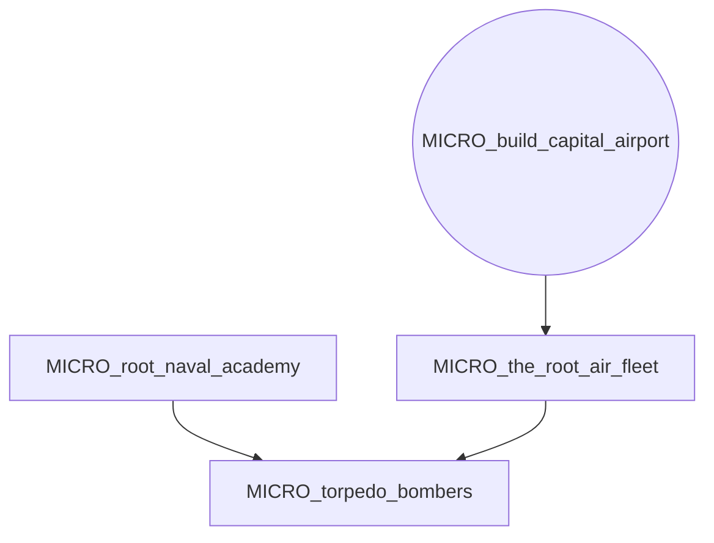
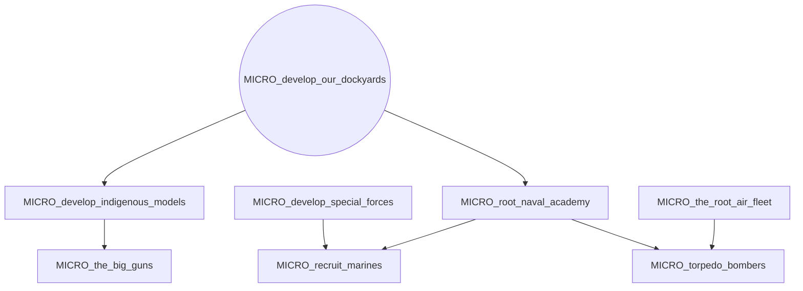
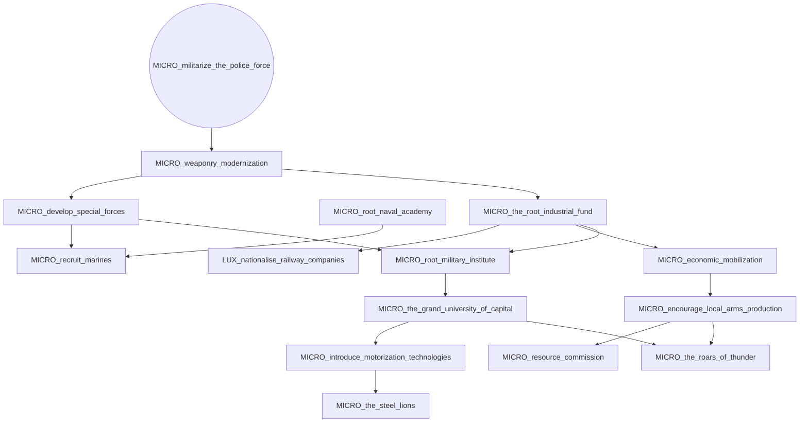

# MICRO_build_capital_airport

```mermaid
flowchart TD
    n1(("MICRO_build_capital_airport"))
    n2["MICRO_root_naval_academy"]
    n3["MICRO_the_root_air_fleet"]
    n4["MICRO_torpedo_bombers"]
    n1 --> n3
    n2 --> n4
    n3 --> n4
```

# MICRO_develop_our_dockyards

```mermaid
flowchart TD
    n5["MICRO_develop_indigenous_models"]
    n6(("MICRO_develop_our_dockyards"))
    n7["MICRO_develop_special_forces"]
    n8["MICRO_recruit_marines"]
    n2["MICRO_root_naval_academy"]
    n9["MICRO_the_big_guns"]
    n3["MICRO_the_root_air_fleet"]
    n4["MICRO_torpedo_bombers"]
    n6 --> n5
    n2 --> n8
    n7 --> n8
    n6 --> n2
    n5 --> n9
    n2 --> n4
    n3 --> n4
```

# MICRO_militarize_the_police_force

```mermaid
flowchart TD
    n10["LUX_nationalise_railway_companies"]
    n7["MICRO_develop_special_forces"]
    n11["MICRO_economic_mobilization"]
    n12["MICRO_encourage_local_arms_production"]
    n13["MICRO_introduce_motorization_technologies"]
    n14(("MICRO_militarize_the_police_force"))
    n8["MICRO_recruit_marines"]
    n15["MICRO_resource_commission"]
    n16["MICRO_root_military_institute"]
    n2["MICRO_root_naval_academy"]
    n17["MICRO_the_grand_university_of_capital"]
    n18["MICRO_the_roars_of_thunder"]
    n19["MICRO_the_root_industrial_fund"]
    n20["MICRO_the_steel_lions"]
    n21["MICRO_weaponry_modernization"]
    n19 --> n10
    n21 --> n7
    n19 --> n11
    n11 --> n12
    n17 --> n13
    n2 --> n8
    n7 --> n8
    n12 --> n15
    n7 --> n16
    n19 --> n16
    n16 --> n17
    n17 --> n18
    n12 --> n18
    n21 --> n19
    n13 --> n20
    n14 --> n21
```
