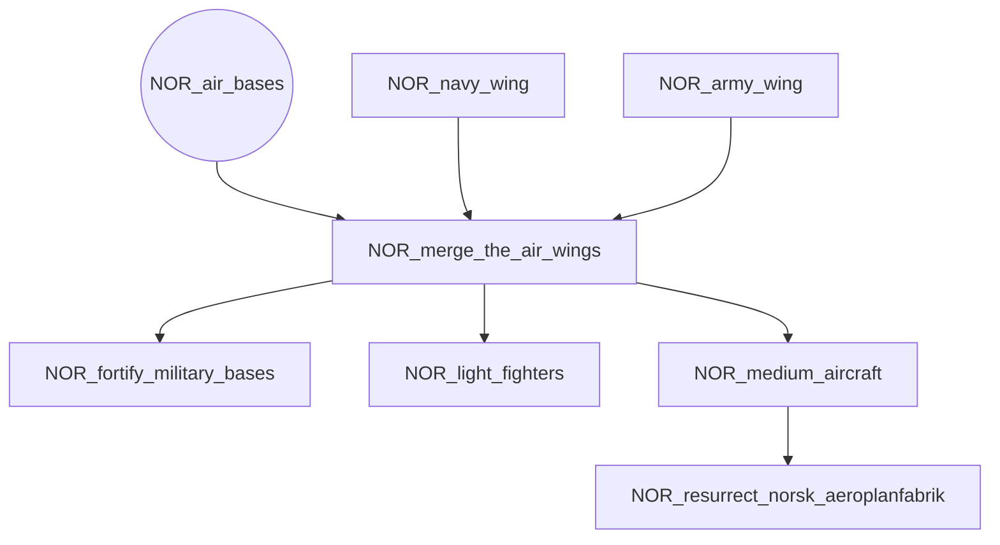
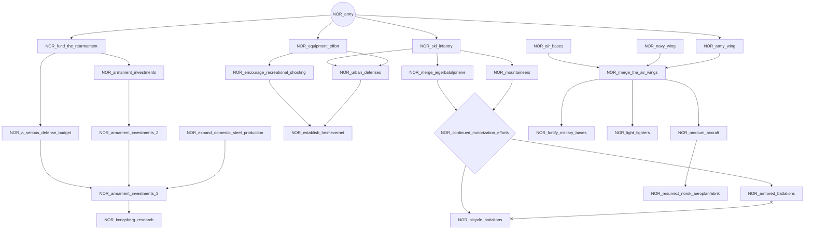
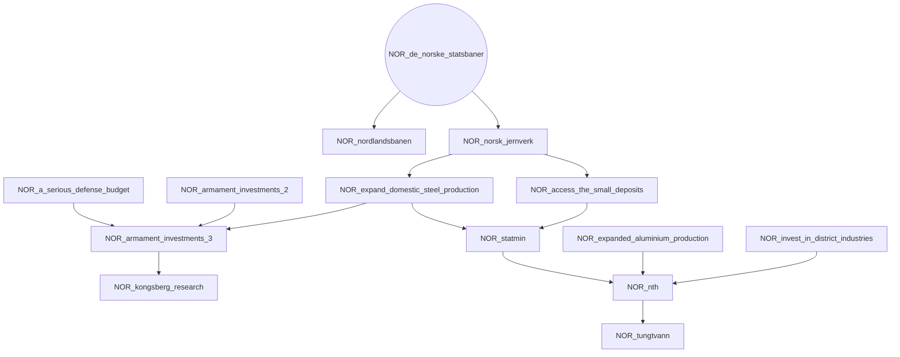
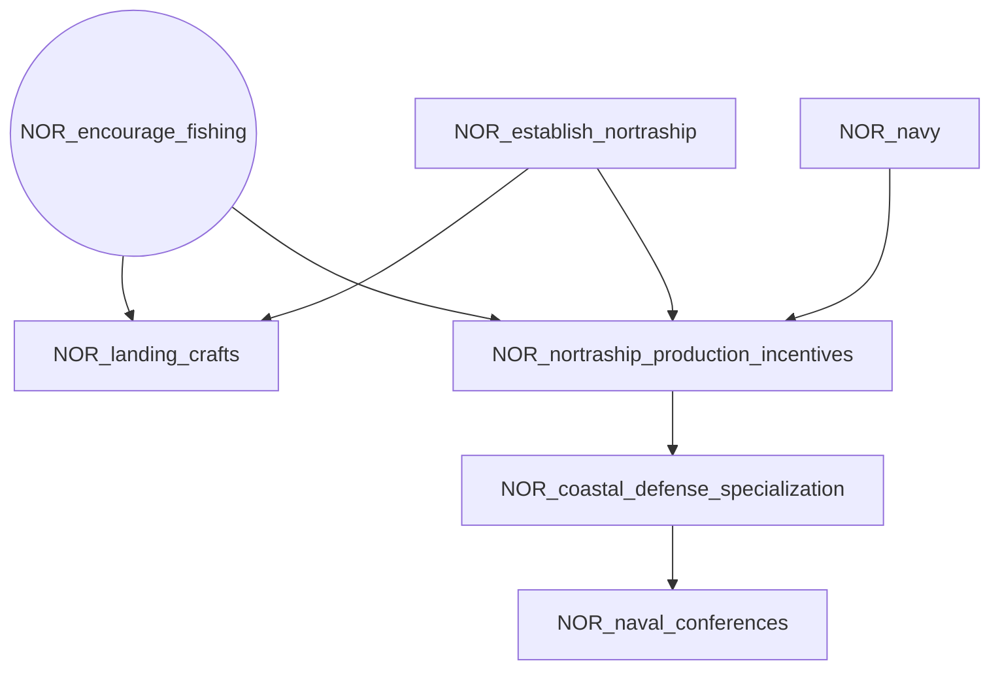
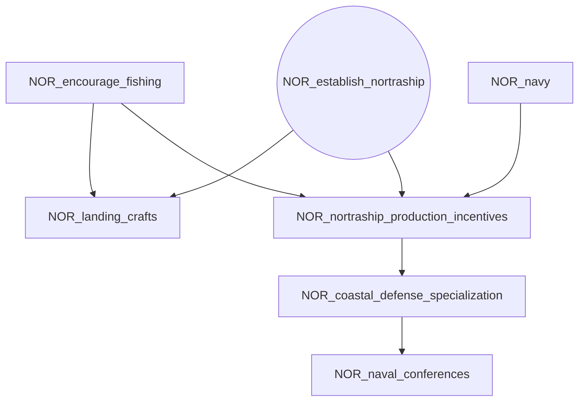
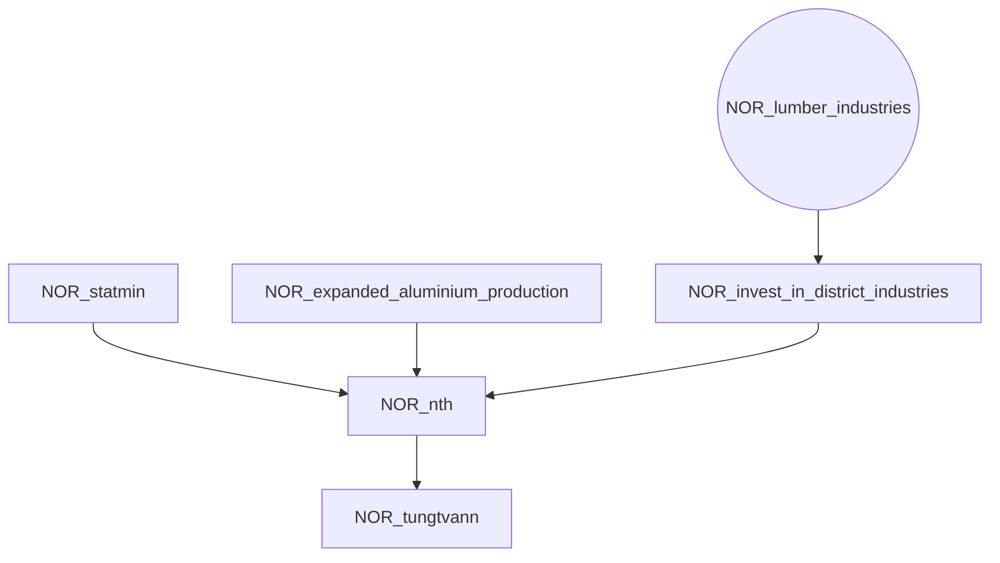
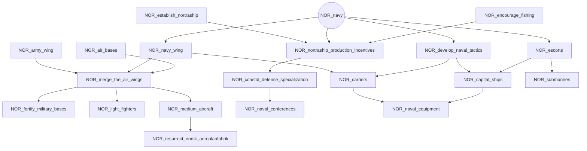
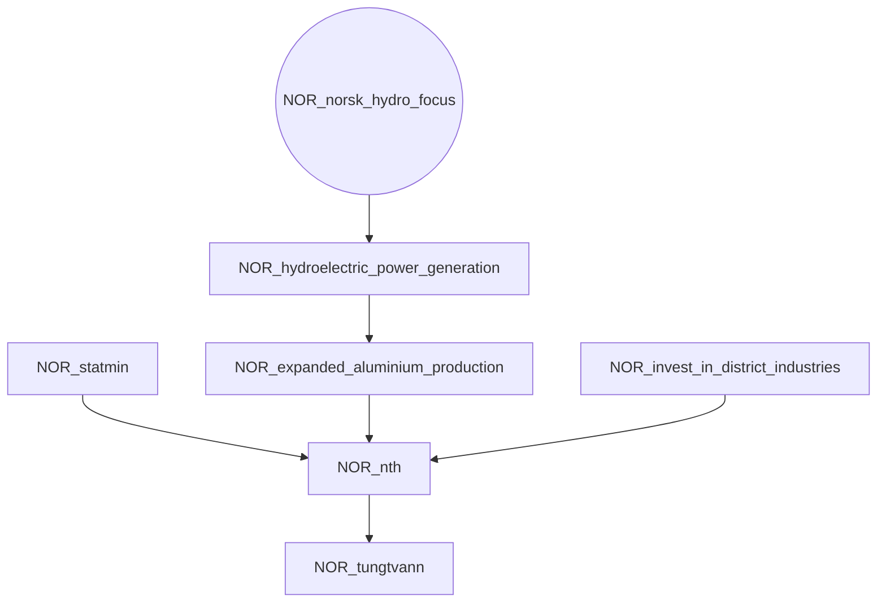
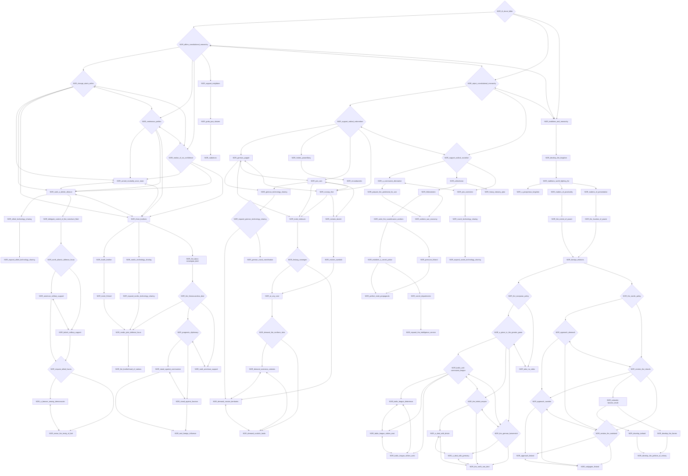

# NOR_air_bases

# NOR_army

# NOR_de_norske_statsbaner

# NOR_encourage_fishing

# NOR_establish_nortraship

# NOR_lumber_industries

# NOR_navy

# NOR_norsk_hydro_focus

# NOR_til_dovre_faller

