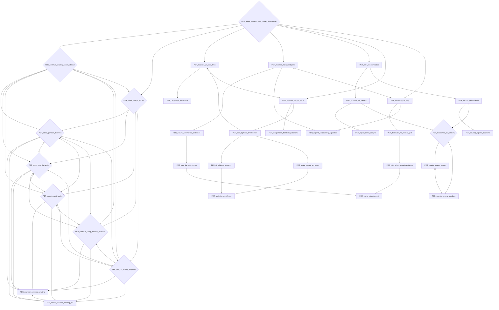
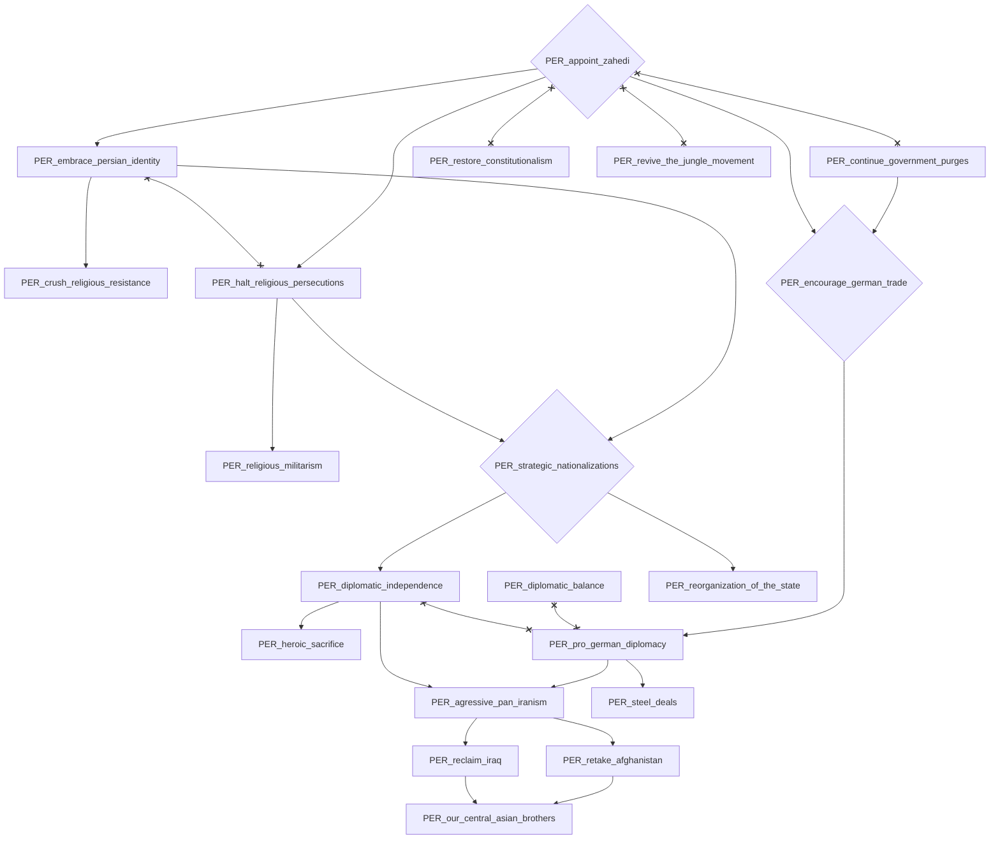
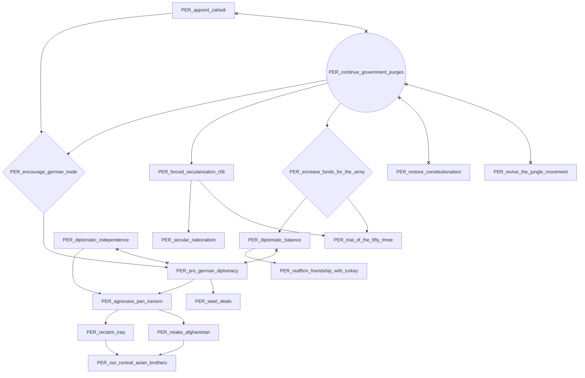
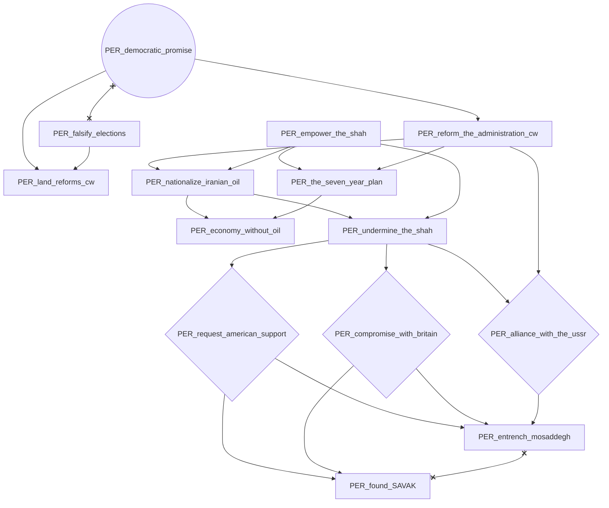
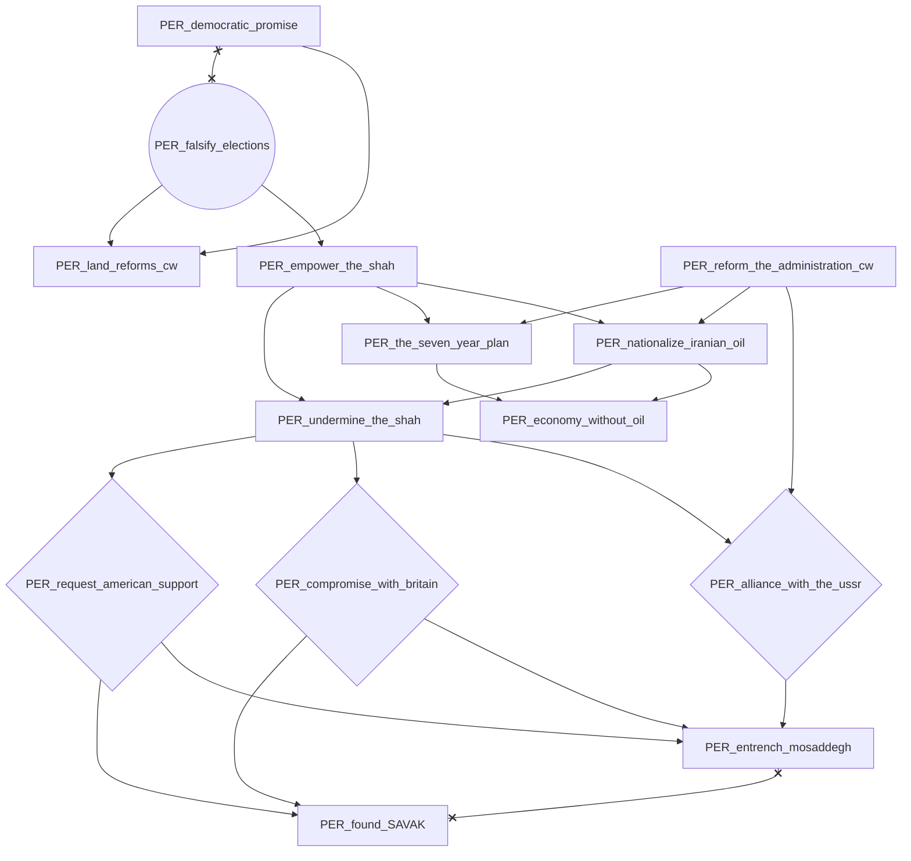
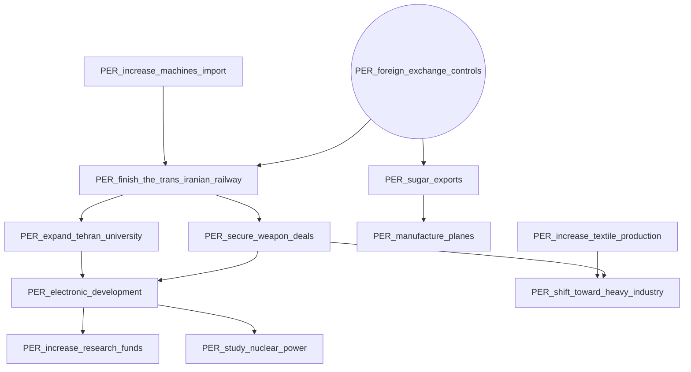
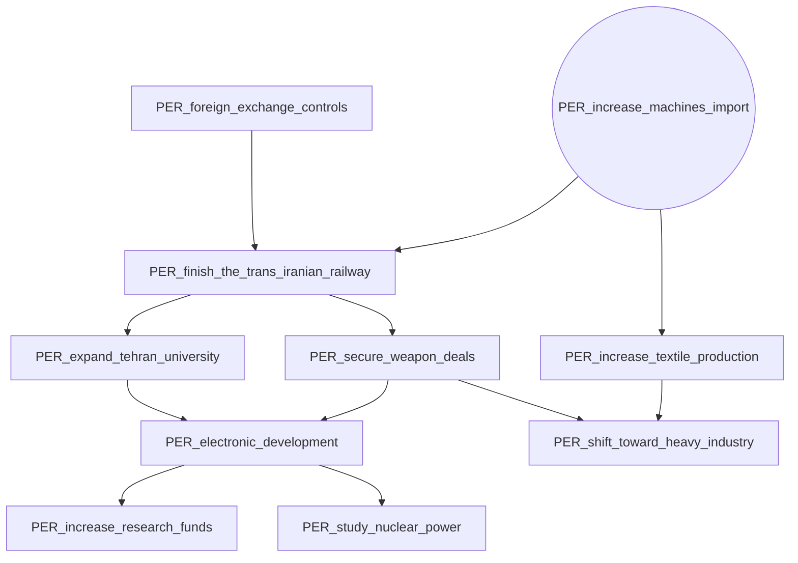
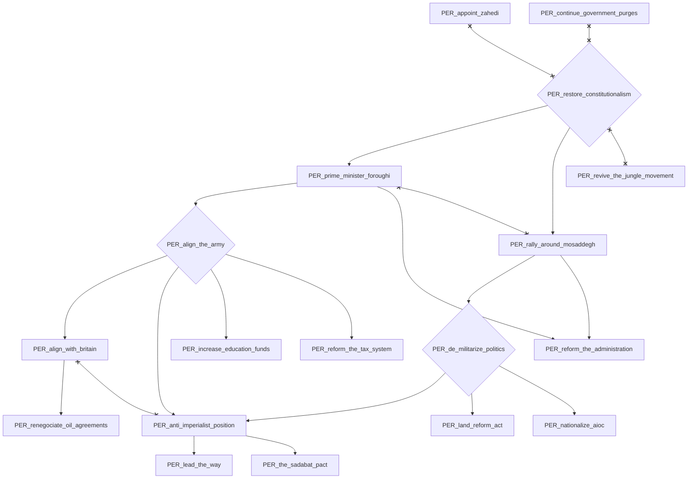
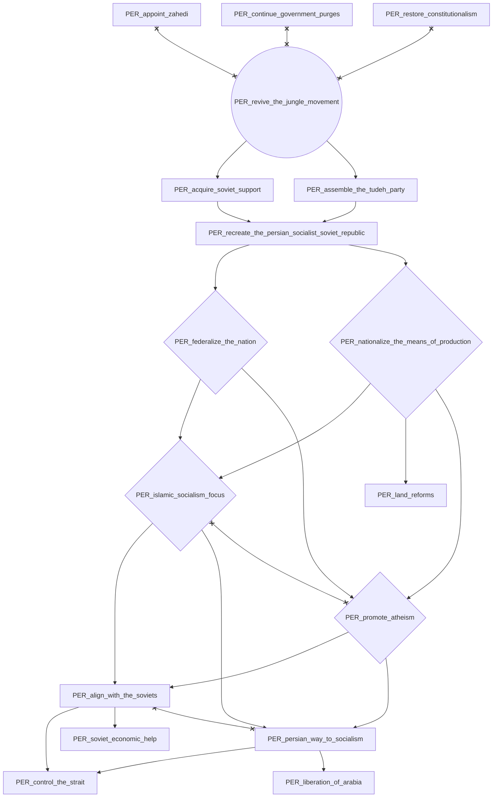

# PER_adopt_western_style_military_bureaucracy

# PER_appoint_zahedi

# PER_continue_government_purges

# PER_democratic_promise

# PER_falsify_elections

# PER_foreign_exchange_controls

# PER_increase_machines_import

# PER_restore_constitutionalism

# PER_revive_the_jungle_movement

