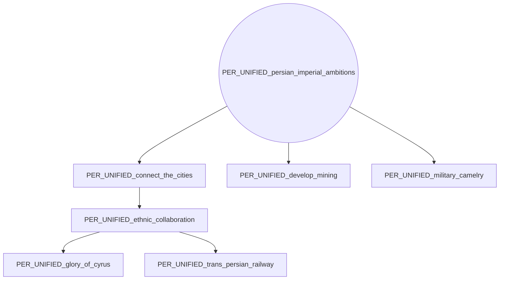

# PER_UNIFIED_persian_imperial_ambitions

```mermaid
flowchart TD
    n1["PER_UNIFIED_connect_the_cities"]
    n2["PER_UNIFIED_develop_mining"]
    n3["PER_UNIFIED_ethnic_collaboration"]
    n4["PER_UNIFIED_glory_of_cyrus"]
    n5["PER_UNIFIED_military_camelry"]
    n6(("PER_UNIFIED_persian_imperial_ambitions"))
    n7["PER_UNIFIED_trans_persian_railway"]
    n6 --> n1
    n6 --> n2
    n1 --> n3
    n3 --> n4
    n6 --> n5
    n3 --> n7
```
