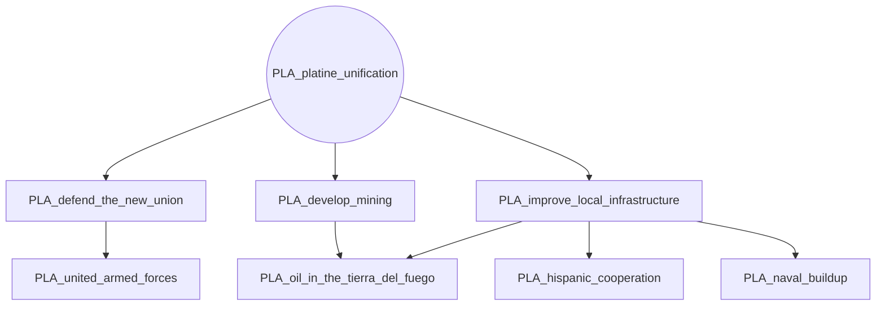

# PLA_platine_unification

```mermaid
flowchart TD
    n1["PLA_defend_the_new_union"]
    n2["PLA_develop_mining"]
    n3["PLA_hispanic_cooperation"]
    n4["PLA_improve_local_infrastructure"]
    n5["PLA_naval_buildup"]
    n6["PLA_oil_in_the_tierra_del_fuego"]
    n7(("PLA_platine_unification"))
    n8["PLA_united_armed_forces"]
    n7 --> n1
    n7 --> n2
    n4 --> n3
    n7 --> n4
    n4 --> n5
    n2 --> n6
    n4 --> n6
    n1 --> n8
```
