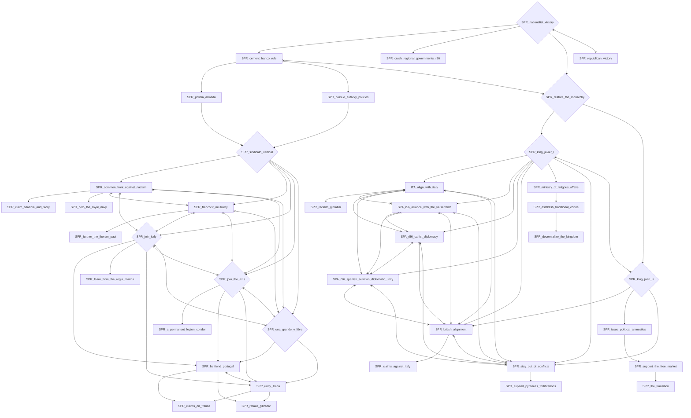

# SPR_nationalist_victory

```mermaid
flowchart TD
    n1["ITA_align_with_italy"]
    n2["SPA_r56_alliance_with_the_kaiserreich"]
    n3["SPA_r56_carlist_diplomacy"]
    n4["SPA_r56_spanish_austrian_diplomatic_unity"]
    n5["SPR_a_permanent_legion_condor"]
    n6["SPR_befriend_portugal"]
    n7["SPR_british_alignment"]
    n8["SPR_cement_franco_rule"]
    n9["SPR_claim_sardinia_and_sicily"]
    n10["SPR_claims_against_italy"]
    n11["SPR_claims_on_france"]
    n12["SPR_common_front_against_nazism"]
    n13["SPR_crush_regional_governments_r56"]
    n14["SPR_decentralize_the_kingdom"]
    n15["SPR_establish_traditional_cortes"]
    n16["SPR_expand_pyrenees_fortifications"]
    n17["SPR_francoist_neutrality"]
    n18["SPR_further_the_iberian_pact"]
    n19["SPR_help_the_royal_navy"]
    n20["SPR_issue_political_amnesties"]
    n21{"SPR_join_italy"}
    n22{"SPR_join_the_axis"}
    n23{"SPR_king_javier_I"}
    n24{"SPR_king_juan_iii"}
    n25["SPR_learn_from_the_regia_marina"]
    n26["SPR_ministry_of_religous_affairs"]
    n27{"SPR_nationalist_victory"}
    n28["SPR_policia_armada"]
    n29["SPR_pursue_autarky_policies"]
    n30["SPR_reclaim_gibraltar"]
    n31["SPR_republican_victory"]
    n32{"SPR_restore_the_monarchy"}
    n33["SPR_retake_gibraltar"]
    n34{"SPR_sindicato_vertical"}
    n35["SPR_stay_out_of_conflicts"]
    n36["SPR_support_the_free_market"]
    n37["SPR_the_transition"]
    n38{"SPR_una_grande_y_libre"}
    n39["SPR_unify_iberia"]
    n23 --> n1
    n23 --> n2
    n23 --> n3
    n23 --> n4
    n22 --> n5
    n21 --> n6
    n22 --> n6
    n38 --> n6
    n24 --> n7
    n23 --> n7
    n27 --> n8
    n12 --> n9
    n7 --> n10
    n39 --> n11
    n6 --> n11
    n34 --> n12
    n27 --> n13
    n15 --> n14
    n26 --> n15
    n35 --> n16
    n34 --> n17
    n17 --> n18
    n12 --> n19
    n24 --> n20
    n34 --> n21
    n34 --> n22
    n32 --> n23
    n32 --> n24
    n21 --> n25
    n23 --> n26
    n8 --> n28
    n8 --> n29
    n1 --> n30
    n27 --> n32
    n39 --> n33
    n6 --> n33
    n29 --> n34
    n28 --> n34
    n24 --> n35
    n23 --> n35
    n20 --> n36
    n36 --> n37
    n34 --> n38
    n21 --> n39
    n22 --> n39
    n38 --> n39
    n1 x--x n2
    n1 x--x n3
    n1 x--x n4
    n1 x--x n7
    n1 x--x n35
    n2 x--x n3
    n2 x--x n4
    n2 x--x n7
    n2 x--x n35
    n3 x--x n4
    n3 x--x n7
    n3 x--x n35
    n4 x--x n7
    n4 x--x n35
    n6 x--x n39
    n7 x--x n35
    n8 x--x n32
    n12 x--x n17
    n12 x--x n21
    n12 x--x n22
    n12 x--x n38
    n17 x--x n21
    n17 x--x n22
    n17 x--x n38
    n21 x--x n22
    n21 x--x n38
    n22 x--x n38
    n23 x--x n24
    n27 x--x n31
```
