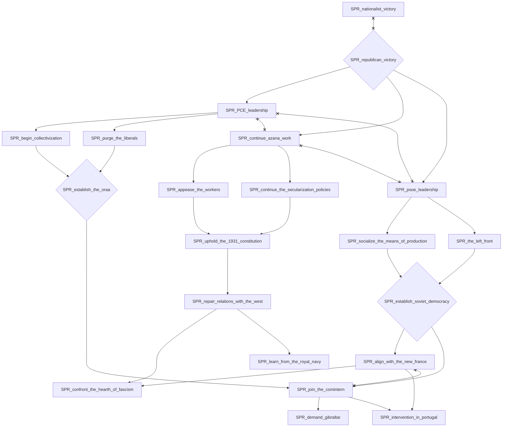

# SPR_republican_victory

```mermaid
flowchart TD
    n1["SPR_PCE_leadership"]
    n2["SPR_align_with_the_new_france"]
    n3["SPR_appease_the_workers"]
    n4["SPR_begin_collectivization"]
    n5["SPR_confront_the_hearth_of_fascism"]
    n6["SPR_continue_azana_work"]
    n7["SPR_continue_the_secularization_policies"]
    n8["SPR_demand_gibraltar"]
    n9{"SPR_establish_soviet_democracy"}
    n10{"SPR_establish_the_oraa"}
    n11["SPR_intervention_in_portugal"]
    n12["SPR_join_the_comintern"]
    n13["SPR_learn_from_the_royal_navy"]
    n14["SPR_nationalist_victory"]
    n15["SPR_psoe_leadership"]
    n16["SPR_purge_the_liberals"]
    n17["SPR_repair_relations_with_the_west"]
    n18{"SPR_republican_victory"}
    n19["SPR_socialize_the_means_of_production"]
    n20["SPR_the_left_front"]
    n21["SPR_uphold_the_1931_constitution"]
    n18 --> n1
    n9 --> n2
    n6 --> n3
    n1 --> n4
    n17 --> n5
    n2 --> n5
    n18 --> n6
    n6 --> n7
    n12 --> n8
    n20 --> n9
    n19 --> n9
    n16 --> n10
    n4 --> n10
    n2 --> n11
    n12 --> n11
    n10 --> n12
    n9 --> n12
    n17 --> n13
    n18 --> n15
    n1 --> n16
    n21 --> n17
    n15 --> n19
    n15 --> n20
    n7 --> n21
    n3 --> n21
    n1 x--x n6
    n1 x--x n15
    n2 x--x n12
    n6 x--x n15
    n14 x--x n18
```
