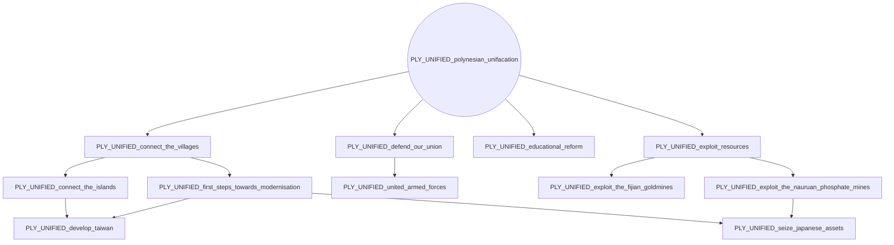
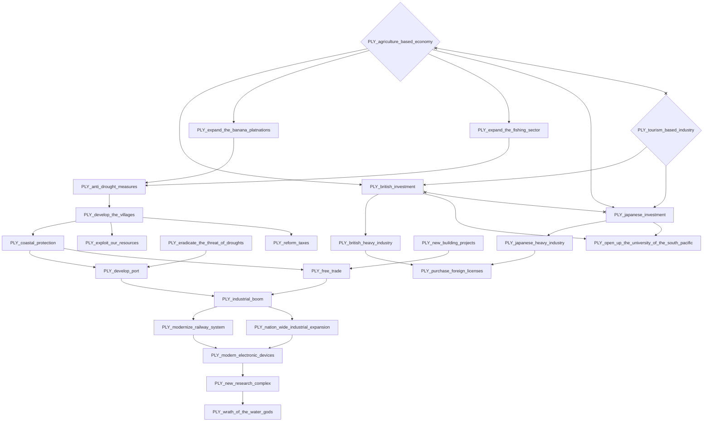
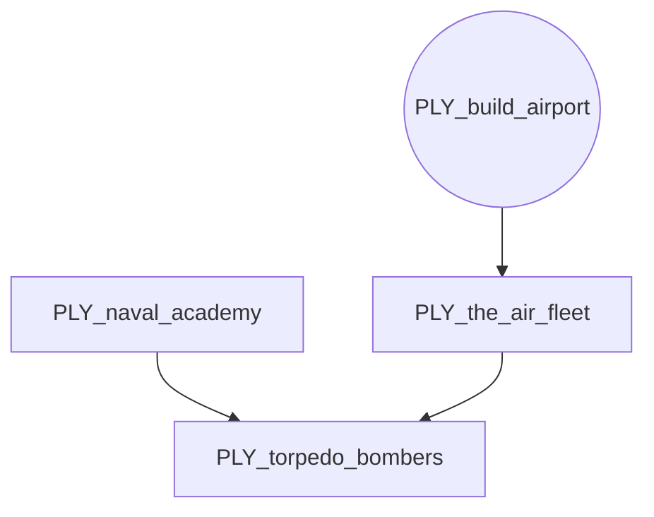
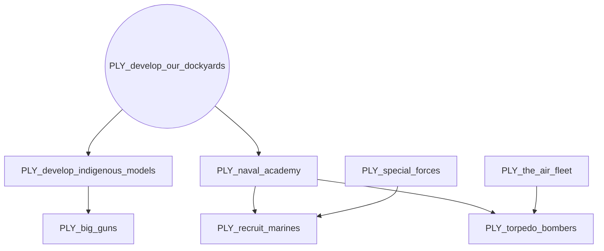
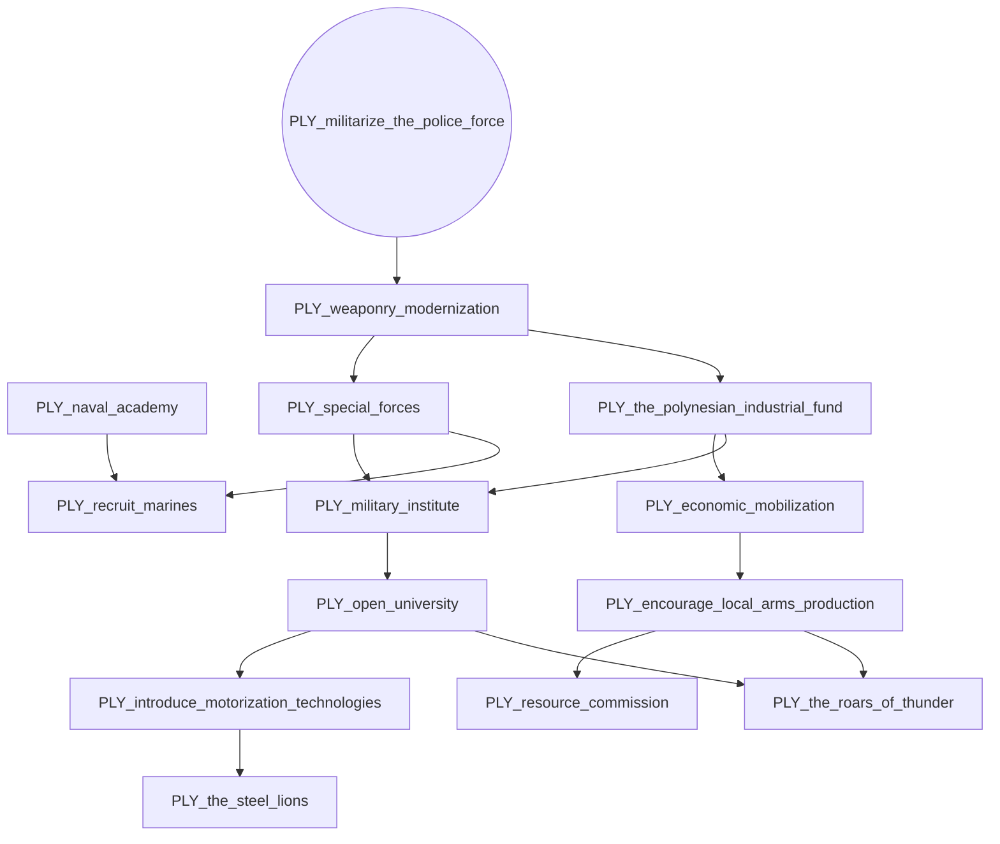
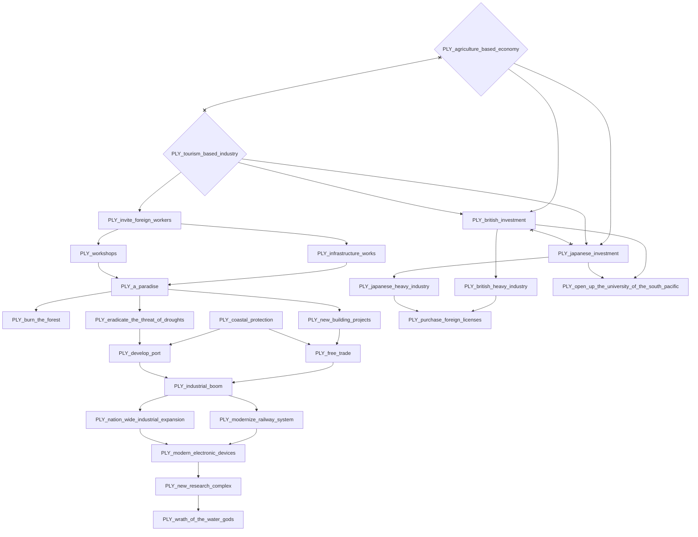

# PLY_UNIFIED_polynesian_unifacation

```mermaid
flowchart TD
    n1["PLY_UNIFIED_connect_the_islands"]
    n2["PLY_UNIFIED_connect_the_villages"]
    n3["PLY_UNIFIED_defend_our_union"]
    n4["PLY_UNIFIED_develop_taiwan"]
    n5["PLY_UNIFIED_educational_reform"]
    n6["PLY_UNIFIED_exploit_resources"]
    n7["PLY_UNIFIED_exploit_the_fijian_goldmines"]
    n8["PLY_UNIFIED_exploit_the_nauruan_phosphate_mines"]
    n9["PLY_UNIFIED_first_steps_towards_modernisation"]
    n10(("PLY_UNIFIED_polynesian_unifacation"))
    n11["PLY_UNIFIED_seize_japanese_assets"]
    n12["PLY_UNIFIED_united_armed_forces"]
    n2 --> n1
    n10 --> n2
    n10 --> n3
    n1 --> n4
    n9 --> n4
    n10 --> n5
    n10 --> n6
    n6 --> n7
    n6 --> n8
    n2 --> n9
    n9 --> n11
    n8 --> n11
    n3 --> n12
```

# PLY_agriculture_based_economy

```mermaid
flowchart TD
    n13{"PLY_agriculture_based_economy"}
    n14["PLY_anti_drought_measures"]
    n15["PLY_british_heavy_industry"]
    n16["PLY_british_investment"]
    n17["PLY_coastal_protection"]
    n18["PLY_develop_port"]
    n19["PLY_develop_the_villages"]
    n20["PLY_eradicate_the_threat_of_droughts"]
    n21["PLY_expand_the_banana_platnations"]
    n22["PLY_expand_the_fishing_sector"]
    n23["PLY_exploit_our_resources"]
    n24["PLY_free_trade"]
    n25["PLY_industrial_boom"]
    n26["PLY_japanese_heavy_industry"]
    n27["PLY_japanese_investment"]
    n28["PLY_modern_electronic_devices"]
    n29["PLY_modernize_railway_system"]
    n30["PLY_nation_wide_industrial_expansion"]
    n31["PLY_new_building_projects"]
    n32["PLY_new_research_complex"]
    n33["PLY_open_up_the_university_of_the_south_pacific"]
    n34["PLY_purchase_foreign_licenses"]
    n35["PLY_reform_taxes"]
    n36{"PLY_tourism_based_industry"}
    n37["PLY_wrath_of_the_water_gods"]
    n21 --> n14
    n22 --> n14
    n16 --> n15
    n13 --> n16
    n36 --> n16
    n19 --> n17
    n17 --> n18
    n20 --> n18
    n14 --> n19
    n13 --> n21
    n13 --> n22
    n19 --> n23
    n31 --> n24
    n17 --> n24
    n24 --> n25
    n18 --> n25
    n27 --> n26
    n13 --> n27
    n36 --> n27
    n29 --> n28
    n30 --> n28
    n25 --> n29
    n25 --> n30
    n28 --> n32
    n16 --> n33
    n27 --> n33
    n15 --> n34
    n26 --> n34
    n19 --> n35
    n32 --> n37
    n13 x--x n36
    n16 x--x n27
```

# PLY_build_airport

```mermaid
flowchart TD
    n38(("PLY_build_airport"))
    n39["PLY_naval_academy"]
    n40["PLY_the_air_fleet"]
    n41["PLY_torpedo_bombers"]
    n38 --> n40
    n39 --> n41
    n40 --> n41
```

# PLY_develop_our_dockyards

```mermaid
flowchart TD
    n42["PLY_big_guns"]
    n43["PLY_develop_indigenous_models"]
    n44(("PLY_develop_our_dockyards"))
    n39["PLY_naval_academy"]
    n45["PLY_recruit_marines"]
    n46["PLY_special_forces"]
    n40["PLY_the_air_fleet"]
    n41["PLY_torpedo_bombers"]
    n43 --> n42
    n44 --> n43
    n44 --> n39
    n39 --> n45
    n46 --> n45
    n39 --> n41
    n40 --> n41
```

# PLY_militarize_the_police_force

```mermaid
flowchart TD
    n47["PLY_economic_mobilization"]
    n48["PLY_encourage_local_arms_production"]
    n49["PLY_introduce_motorization_technologies"]
    n50(("PLY_militarize_the_police_force"))
    n51["PLY_military_institute"]
    n39["PLY_naval_academy"]
    n52["PLY_open_university"]
    n45["PLY_recruit_marines"]
    n53["PLY_resource_commission"]
    n46["PLY_special_forces"]
    n54["PLY_the_polynesian_industrial_fund"]
    n55["PLY_the_roars_of_thunder"]
    n56["PLY_the_steel_lions"]
    n57["PLY_weaponry_modernization"]
    n54 --> n47
    n47 --> n48
    n52 --> n49
    n46 --> n51
    n54 --> n51
    n51 --> n52
    n39 --> n45
    n46 --> n45
    n48 --> n53
    n57 --> n46
    n57 --> n54
    n52 --> n55
    n48 --> n55
    n49 --> n56
    n50 --> n57
```

# PLY_tourism_based_industry

```mermaid
flowchart TD
    n58["PLY_a_paradise"]
    n13{"PLY_agriculture_based_economy"}
    n15["PLY_british_heavy_industry"]
    n16["PLY_british_investment"]
    n59["PLY_burn_the_forest"]
    n17["PLY_coastal_protection"]
    n18["PLY_develop_port"]
    n20["PLY_eradicate_the_threat_of_droughts"]
    n24["PLY_free_trade"]
    n25["PLY_industrial_boom"]
    n60["PLY_infrastructure_works"]
    n61["PLY_invite_foreign_workers"]
    n26["PLY_japanese_heavy_industry"]
    n27["PLY_japanese_investment"]
    n28["PLY_modern_electronic_devices"]
    n29["PLY_modernize_railway_system"]
    n30["PLY_nation_wide_industrial_expansion"]
    n31["PLY_new_building_projects"]
    n32["PLY_new_research_complex"]
    n33["PLY_open_up_the_university_of_the_south_pacific"]
    n34["PLY_purchase_foreign_licenses"]
    n36{"PLY_tourism_based_industry"}
    n62["PLY_workshops"]
    n37["PLY_wrath_of_the_water_gods"]
    n60 --> n58
    n62 --> n58
    n16 --> n15
    n13 --> n16
    n36 --> n16
    n58 --> n59
    n17 --> n18
    n20 --> n18
    n58 --> n20
    n31 --> n24
    n17 --> n24
    n24 --> n25
    n18 --> n25
    n61 --> n60
    n36 --> n61
    n27 --> n26
    n13 --> n27
    n36 --> n27
    n29 --> n28
    n30 --> n28
    n25 --> n29
    n25 --> n30
    n58 --> n31
    n28 --> n32
    n16 --> n33
    n27 --> n33
    n15 --> n34
    n26 --> n34
    n61 --> n62
    n32 --> n37
    n13 x--x n36
    n16 x--x n27
```
