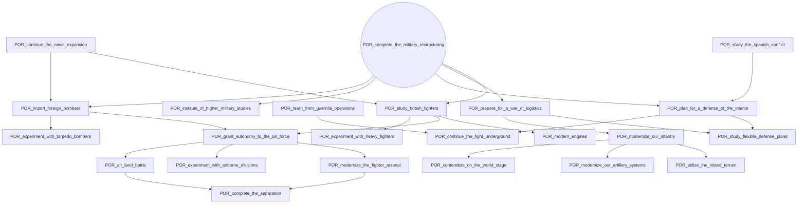
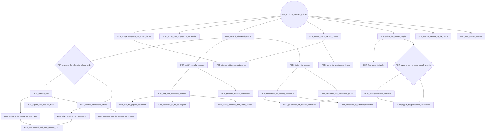
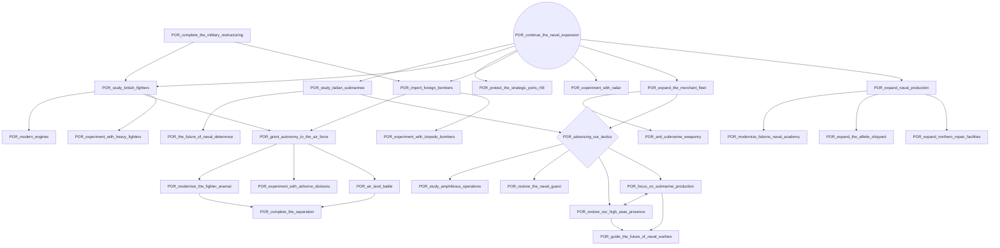
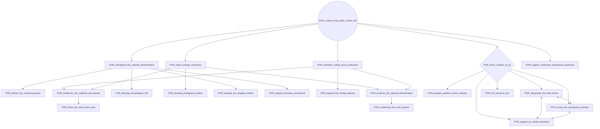
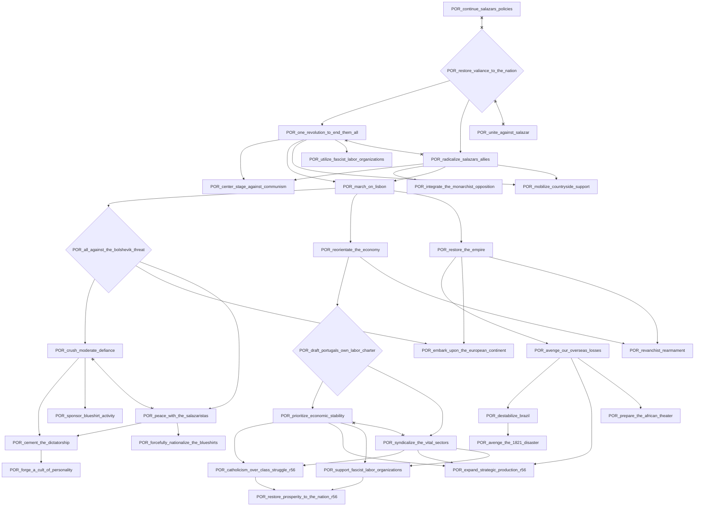
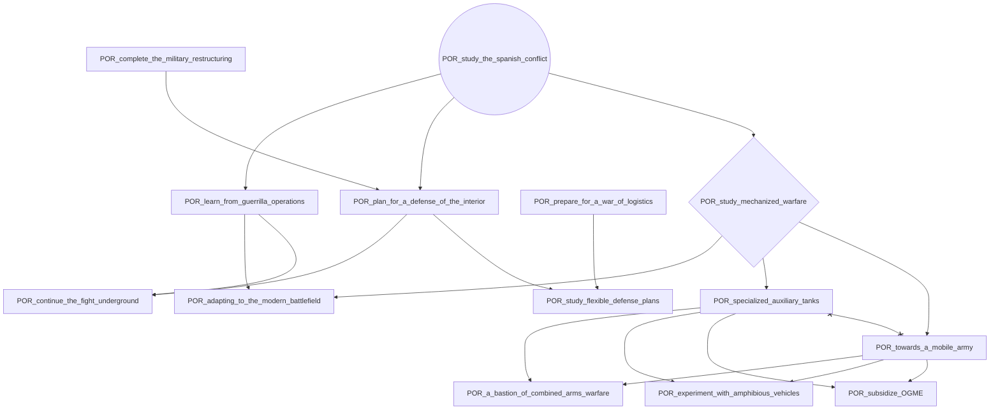
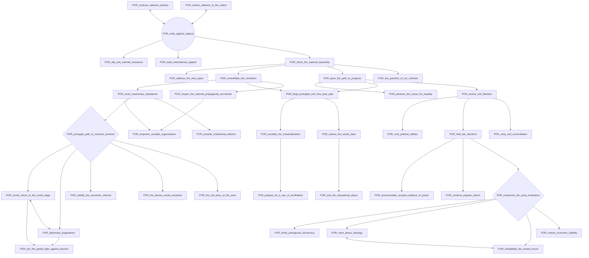

# POR_complete_the_military_restructuring

# POR_continue_salazars_policies

# POR_continue_the_naval_expansion

# POR_continue_the_public_works_r56

# POR_restore_valiance_to_the_nation

# POR_study_the_spanish_conflict

# POR_unite_against_salazar

