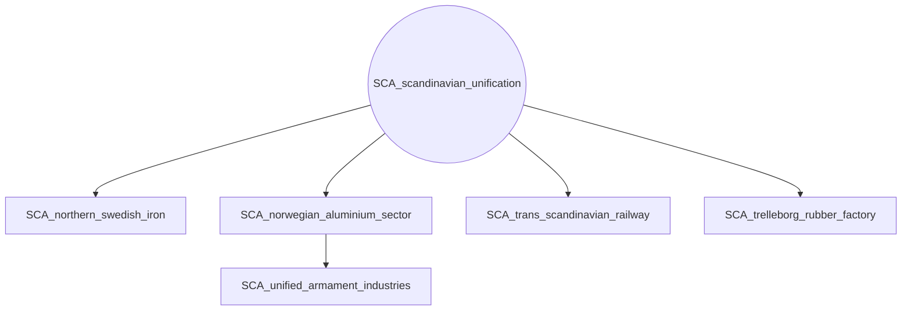

# SCA_scandinavian_unification

```mermaid
flowchart TD
    n1["SCA_northern_swedish_iron"]
    n2["SCA_norwegian_aluminium_sector"]
    n3(("SCA_scandinavian_unification"))
    n4["SCA_trans_scandinavian_railway"]
    n5["SCA_trelleborg_rubber_factory"]
    n6["SCA_unified_armament_industries"]
    n3 --> n1
    n3 --> n2
    n3 --> n4
    n3 --> n5
    n2 --> n6
```
