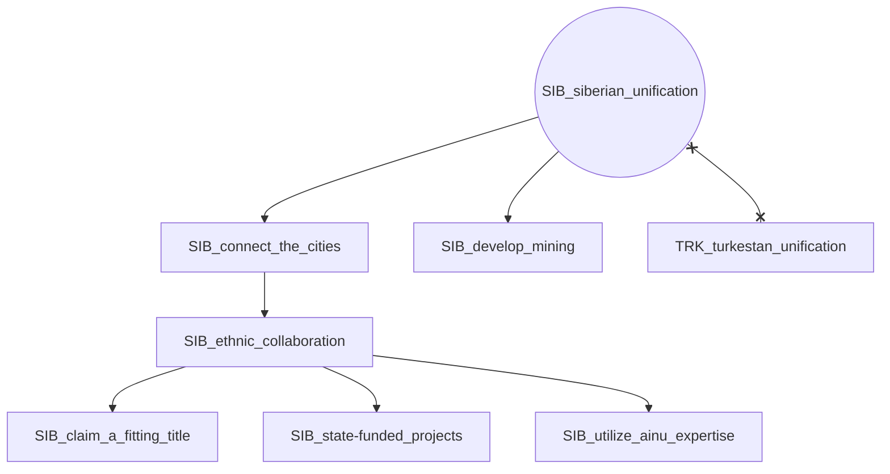

# SIB_siberian_unification

```mermaid
flowchart TD
    n1["SIB_claim_a_fitting_title"]
    n2["SIB_connect_the_cities"]
    n3["SIB_develop_mining"]
    n4["SIB_ethnic_collaboration"]
    n5(("SIB_siberian_unification"))
    n6["SIB_state-funded_projects"]
    n7["SIB_utilize_ainu_expertise"]
    n8["TRK_turkestan_unification"]
    n4 --> n1
    n5 --> n2
    n5 --> n3
    n2 --> n4
    n4 --> n6
    n4 --> n7
    n5 x--x n8
```
