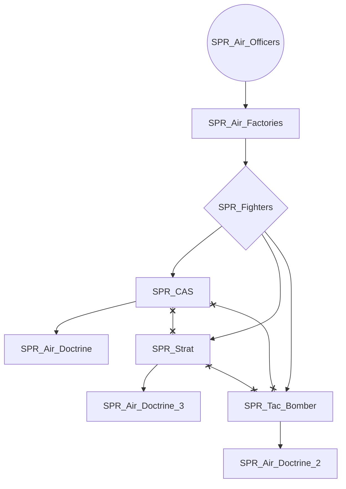
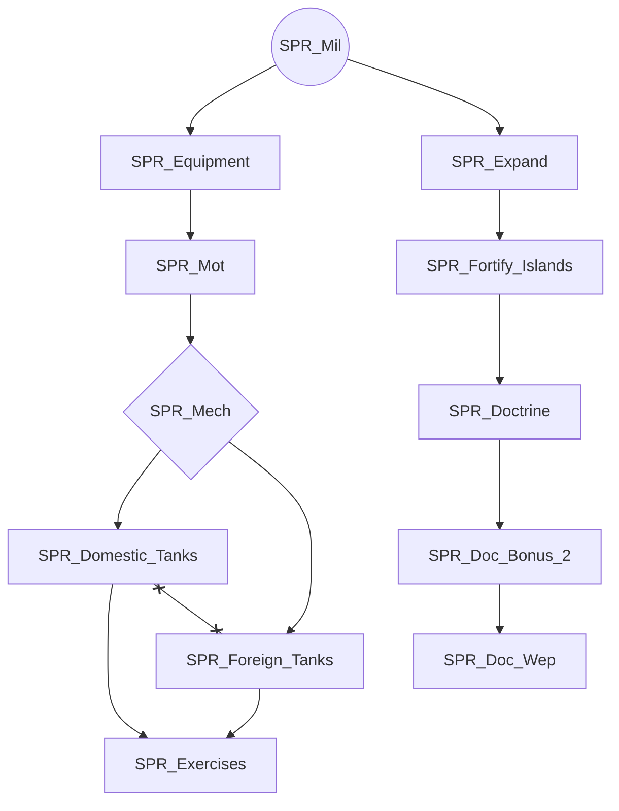
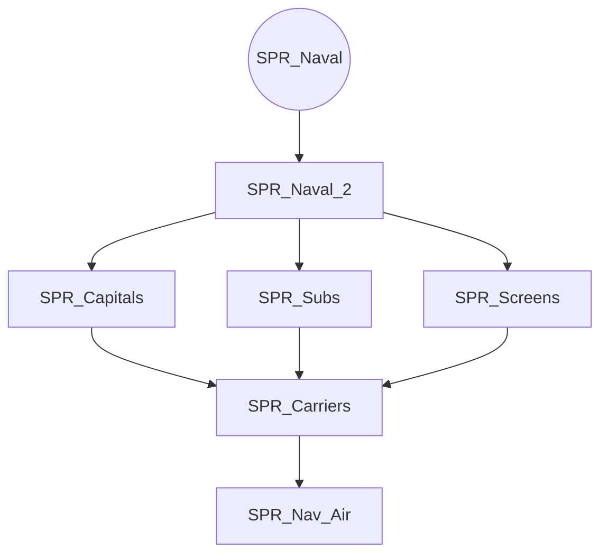
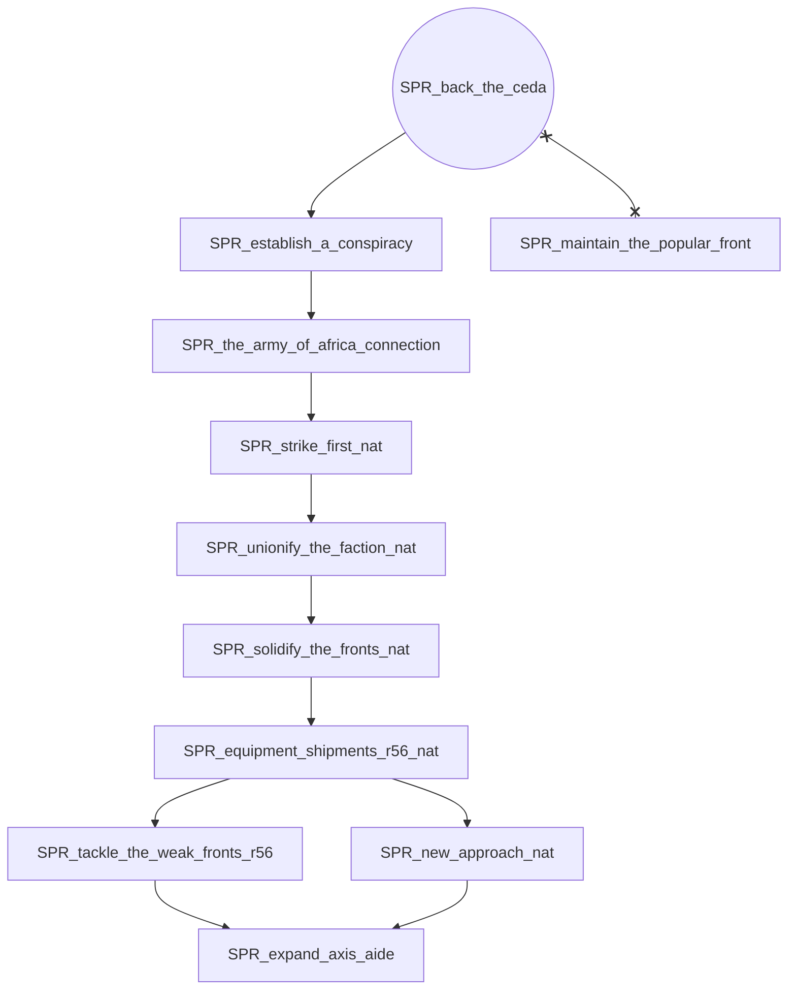
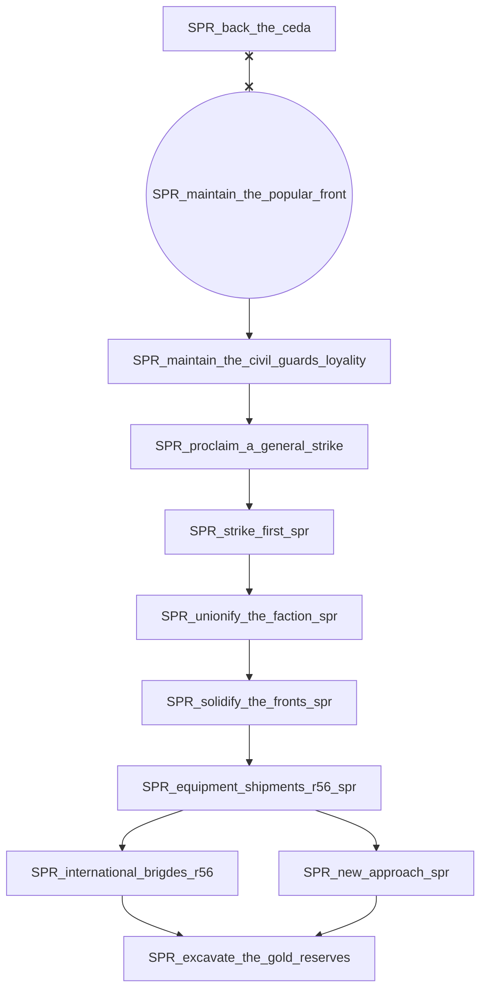
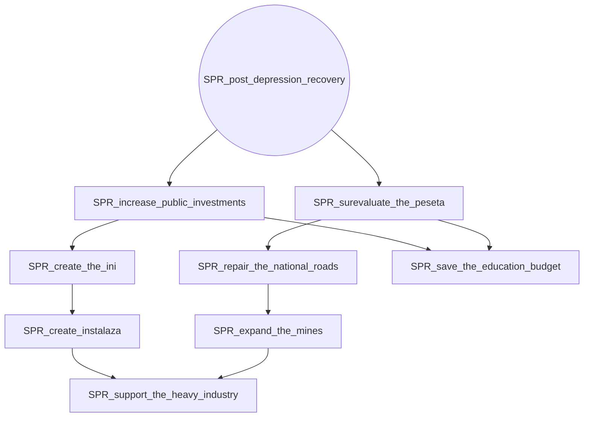

# SPR_Air_Officers

```mermaid
flowchart TD
    n1["SPR_Air_Doctrine"]
    n2["SPR_Air_Doctrine_2"]
    n3["SPR_Air_Doctrine_3"]
    n4["SPR_Air_Factories"]
    n5(("SPR_Air_Officers"))
    n6["SPR_CAS"]
    n7{"SPR_Fighters"}
    n8["SPR_Strat"]
    n9["SPR_Tac_Bomber"]
    n6 --> n1
    n9 --> n2
    n8 --> n3
    n5 --> n4
    n7 --> n6
    n4 --> n7
    n7 --> n8
    n7 --> n9
    n6 x--x n8
    n6 x--x n9
    n8 x--x n9
```

# SPR_Mil

```mermaid
flowchart TD
    n10["SPR_Doc_Bonus_2"]
    n11["SPR_Doc_Wep"]
    n12["SPR_Doctrine"]
    n13["SPR_Domestic_Tanks"]
    n14["SPR_Equipment"]
    n15["SPR_Exercises"]
    n16["SPR_Expand"]
    n17["SPR_Foreign_Tanks"]
    n18["SPR_Fortify_Islands"]
    n19{"SPR_Mech"}
    n20(("SPR_Mil"))
    n21["SPR_Mot"]
    n12 --> n10
    n10 --> n11
    n18 --> n12
    n19 --> n13
    n20 --> n14
    n13 --> n15
    n17 --> n15
    n20 --> n16
    n19 --> n17
    n16 --> n18
    n21 --> n19
    n14 --> n21
    n13 x--x n17
```

# SPR_Naval

```mermaid
flowchart TD
    n22["SPR_Capitals"]
    n23["SPR_Carriers"]
    n24["SPR_Nav_Air"]
    n25(("SPR_Naval"))
    n26["SPR_Naval_2"]
    n27["SPR_Screens"]
    n28["SPR_Subs"]
    n26 --> n22
    n22 --> n23
    n28 --> n23
    n27 --> n23
    n23 --> n24
    n25 --> n26
    n26 --> n27
    n26 --> n28
```

# SPR_back_the_ceda

```mermaid
flowchart TD
    n29(("SPR_back_the_ceda"))
    n30["SPR_equipment_shipments_r56_nat"]
    n31["SPR_establish_a_conspiracy"]
    n32["SPR_expand_axis_aide"]
    n33["SPR_maintain_the_popular_front"]
    n34["SPR_new_approach_nat"]
    n35["SPR_solidify_the_fronts_nat"]
    n36["SPR_strike_first_nat"]
    n37["SPR_tackle_the_weak_fronts_r56"]
    n38["SPR_the_army_of_africa_connection"]
    n39["SPR_unionify_the_faction_nat"]
    n35 --> n30
    n29 --> n31
    n37 --> n32
    n34 --> n32
    n30 --> n34
    n39 --> n35
    n38 --> n36
    n30 --> n37
    n31 --> n38
    n36 --> n39
    n29 x--x n33
```

# SPR_maintain_the_popular_front

```mermaid
flowchart TD
    n29["SPR_back_the_ceda"]
    n40["SPR_equipment_shipments_r56_spr"]
    n41["SPR_excavate_the_gold_reserves"]
    n42["SPR_international_brigdes_r56"]
    n43["SPR_maintain_the_civil_guards_loyality"]
    n33(("SPR_maintain_the_popular_front"))
    n44["SPR_new_approach_spr"]
    n45["SPR_proclaim_a_general_strike"]
    n46["SPR_solidify_the_fronts_spr"]
    n47["SPR_strike_first_spr"]
    n48["SPR_unionify_the_faction_spr"]
    n46 --> n40
    n42 --> n41
    n44 --> n41
    n40 --> n42
    n33 --> n43
    n40 --> n44
    n43 --> n45
    n48 --> n46
    n45 --> n47
    n47 --> n48
    n29 x--x n33
```

# SPR_post_depression_recovery

```mermaid
flowchart TD
    n49["SPR_create_instalaza"]
    n50["SPR_create_the_ini"]
    n51["SPR_expand_the_mines"]
    n52["SPR_increase_public_investments"]
    n53(("SPR_post_depression_recovery"))
    n54["SPR_repair_the_national_roads"]
    n55["SPR_save_the_education_budget"]
    n56["SPR_support_the_heavy_industry"]
    n57["SPR_surevaluate_the_peseta"]
    n50 --> n49
    n52 --> n50
    n54 --> n51
    n53 --> n52
    n57 --> n54
    n52 --> n55
    n57 --> n55
    n49 --> n56
    n51 --> n56
    n53 --> n57
```
