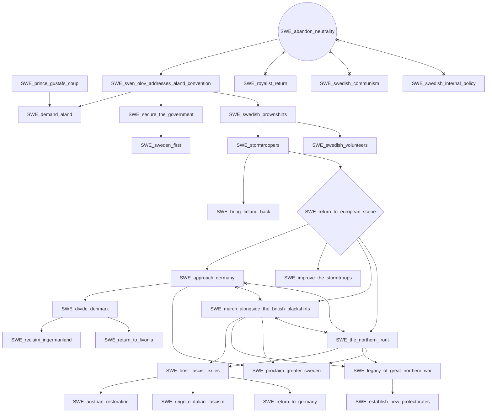
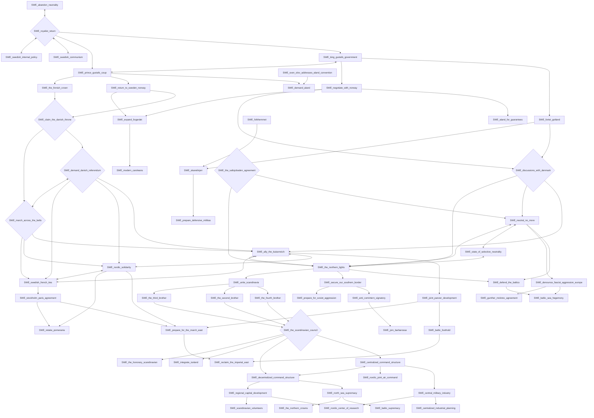
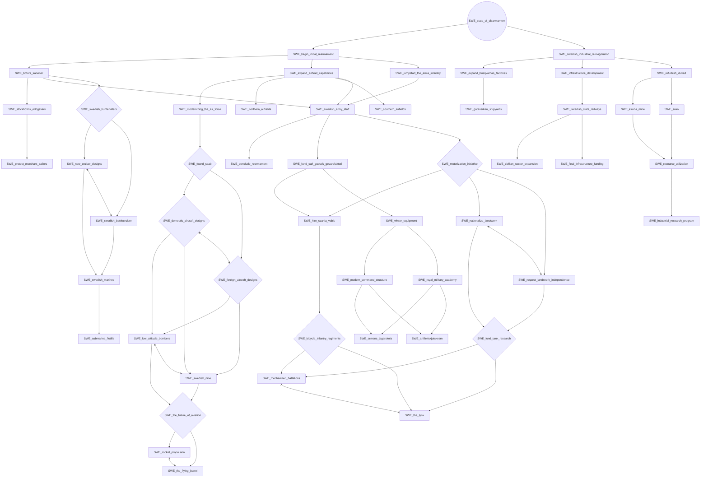
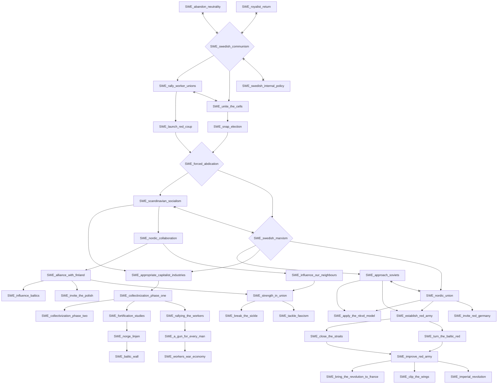
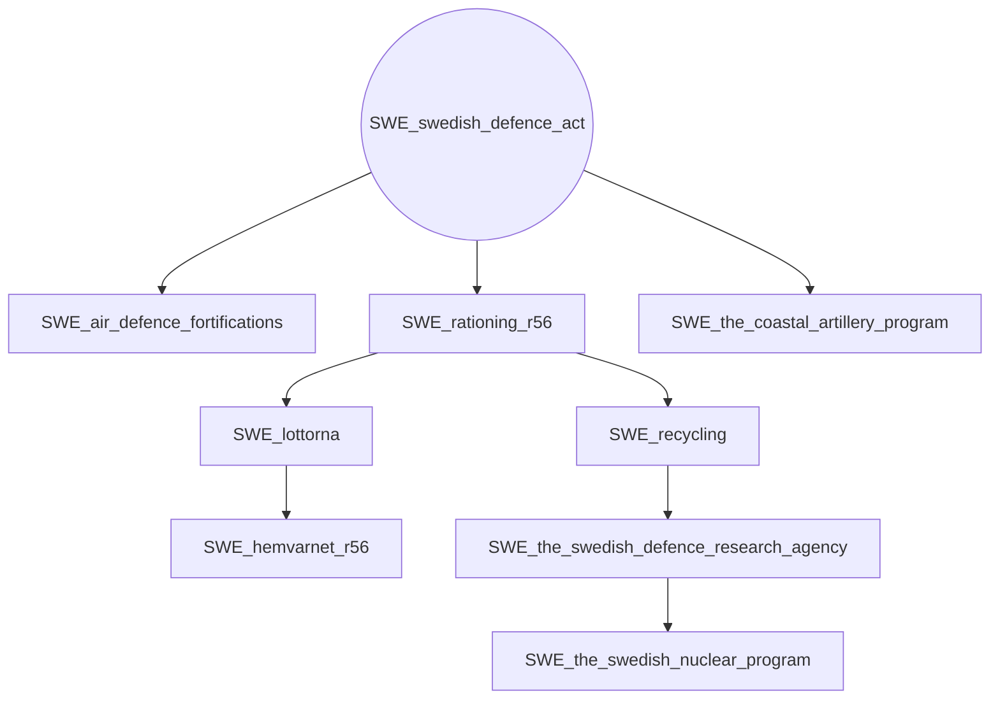
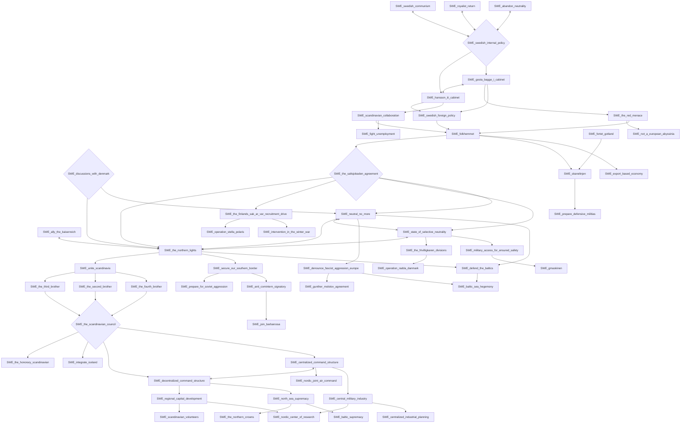

# SWE_abandon_neutrality

```mermaid
flowchart TD
    n1(("SWE_abandon_neutrality"))
    n2["SWE_approach_germany"]
    n3["SWE_austrian_restoration"]
    n4["SWE_bring_finland_back"]
    n5["SWE_demand_aland"]
    n6["SWE_divide_denmark"]
    n7["SWE_establish_new_protectorates"]
    n8["SWE_host_fascist_exiles"]
    n9["SWE_improve_the_stormtroops"]
    n10["SWE_legacy_of_great_northern_war"]
    n11["SWE_march_alongside_the_british_blackshirts"]
    n12["SWE_prince_gustafs_coup"]
    n13["SWE_proclaim_greater_sweden"]
    n14["SWE_reclaim_ingermanland"]
    n15["SWE_reignite_italian_fascism"]
    n16{"SWE_return_to_european_scene"}
    n17["SWE_return_to_germany"]
    n18["SWE_return_to_livonia"]
    n19["SWE_royalist_return"]
    n20["SWE_secure_the_government"]
    n21["SWE_stormtroopers"]
    n22["SWE_sven_olov_addresses_aland_convention"]
    n23["SWE_sweden_first"]
    n24["SWE_swedish_brownshirts"]
    n25["SWE_swedish_communism"]
    n26["SWE_swedish_internal_policy"]
    n27["SWE_swedish_volunteers"]
    n28["SWE_the_northern_front"]
    n16 --> n2
    n8 --> n3
    n21 --> n4
    n22 --> n5
    n12 --> n5
    n2 --> n6
    n10 --> n7
    n28 --> n8
    n11 --> n8
    n16 --> n9
    n11 --> n10
    n28 --> n10
    n16 --> n11
    n11 --> n13
    n28 --> n13
    n2 --> n13
    n6 --> n14
    n8 --> n15
    n21 --> n16
    n8 --> n17
    n6 --> n18
    n22 --> n20
    n24 --> n21
    n1 --> n22
    n20 --> n23
    n22 --> n24
    n24 --> n27
    n16 --> n28
    n1 x--x n19
    n1 x--x n25
    n1 x--x n26
    n2 x--x n11
    n2 x--x n28
    n11 x--x n28
```

# SWE_royalist_return

```mermaid
flowchart TD
    n1["SWE_abandon_neutrality"]
    n29["SWE_aland_for_guarantees"]
    n30["SWE_ally_the_kaiserreich"]
    n31["SWE_anti_comintern_signatory"]
    n32["SWE_baltic_foothold"]
    n33["SWE_baltic_sea_hegemony"]
    n34["SWE_baltic_supremacy"]
    n35["SWE_central_military_industry"]
    n36["SWE_centralized_command_structure"]
    n37["SWE_centralized_industrial_planning"]
    n38{"SWE_claim_the_danish_throne"}
    n39["SWE_decentralized_command_structure"]
    n40["SWE_defend_the_baltics"]
    n5["SWE_demand_aland"]
    n41{"SWE_demand_danish_referendum"}
    n42["SWE_denounce_fascist_aggression_europe"]
    n43{"SWE_discussions_with_denmark"}
    n44["SWE_expand_livgardet"]
    n45["SWE_folkhemmet"]
    n46["SWE_fortet_gotland"]
    n47["SWE_gunther_molotov_agreement"]
    n48["SWE_integrate_iceland"]
    n49["SWE_join_barbarossa"]
    n50["SWE_joint_panzer_development"]
    n51["SWE_king_gustafs_government"]
    n52{"SWE_march_across_the_belts"}
    n53["SWE_modern_caroleans"]
    n54["SWE_negotiate_with_norway"]
    n55["SWE_neutral_no_more"]
    n56["SWE_nordic_center_of_research"]
    n57["SWE_nordic_joint_air_command"]
    n58["SWE_nordic_solidarity"]
    n59["SWE_north_sea_supremacy"]
    n60["SWE_prepare_defensive_militias"]
    n61["SWE_prepare_for_soviet_aggression"]
    n62["SWE_prepare_for_the_march_east"]
    n12["SWE_prince_gustafs_coup"]
    n63["SWE_reclaim_the_imperial_east"]
    n64["SWE_regional_capital_development"]
    n65["SWE_retake_pomerania"]
    n66["SWE_return_to_sweden_norway"]
    n19{"SWE_royalist_return"}
    n67["SWE_scandinavian_volunteers"]
    n68["SWE_secure_our_southern_border"]
    n69["SWE_skanelinjen"]
    n70["SWE_state_of_selective_neutrality"]
    n71["SWE_stockholm_paris_agreement"]
    n22["SWE_sven_olov_addresses_aland_convention"]
    n25["SWE_swedish_communism"]
    n72["SWE_swedish_french_ties"]
    n26["SWE_swedish_internal_policy"]
    n73["SWE_the_finnish_crown"]
    n74["SWE_the_fourth_brother"]
    n75["SWE_the_honorary_scandinavian"]
    n76["SWE_the_northern_crowns"]
    n77["SWE_the_northern_lights"]
    n78{"SWE_the_saltsjobaden_agreement"}
    n79{"SWE_the_scandinavian_council"}
    n80["SWE_the_second_brother"]
    n81["SWE_the_third_brother"]
    n82["SWE_unite_scandinavia"]
    n54 --> n29
    n41 --> n30
    n43 --> n30
    n52 --> n30
    n68 --> n31
    n50 --> n32
    n42 --> n33
    n40 --> n33
    n59 --> n34
    n36 --> n35
    n79 --> n36
    n35 --> n37
    n73 --> n38
    n66 --> n38
    n79 --> n39
    n77 --> n40
    n55 --> n40
    n22 --> n5
    n12 --> n5
    n38 --> n41
    n55 --> n42
    n46 --> n43
    n54 --> n43
    n66 --> n44
    n54 --> n44
    n51 --> n46
    n42 --> n47
    n79 --> n48
    n31 --> n49
    n30 --> n50
    n19 --> n51
    n38 --> n52
    n44 --> n53
    n51 --> n54
    n78 --> n55
    n43 --> n55
    n64 --> n56
    n35 --> n56
    n36 --> n57
    n41 --> n58
    n52 --> n58
    n39 --> n59
    n69 --> n60
    n68 --> n61
    n50 --> n62
    n71 --> n62
    n58 --> n62
    n19 --> n12
    n32 --> n63
    n62 --> n63
    n39 --> n64
    n71 --> n65
    n58 --> n65
    n12 --> n66
    n64 --> n67
    n77 --> n68
    n45 --> n69
    n46 --> n69
    n72 --> n71
    n41 --> n72
    n52 --> n72
    n12 --> n73
    n82 --> n74
    n79 --> n75
    n59 --> n76
    n43 --> n77
    n78 --> n77
    n80 --> n79
    n81 --> n79
    n74 --> n79
    n82 --> n80
    n82 --> n81
    n77 --> n82
    n1 x--x n19
    n30 x--x n58
    n30 x--x n72
    n30 x--x n77
    n36 x--x n39
    n41 x--x n52
    n51 x--x n12
    n55 x--x n70
    n55 x--x n77
    n58 x--x n72
    n19 x--x n25
    n19 x--x n26
    n70 x--x n77
```

# SWE_state_of_disarmament

```mermaid
flowchart TD
    n83["SWE_armens_jagarskola"]
    n84["SWE_artilleriskjutskolan"]
    n85["SWE_begin_initial_rearmament"]
    n86{"SWE_bicycle_infantry_regiments"}
    n87["SWE_bofors_kanoner"]
    n88["SWE_civilian_sector_expansion"]
    n89["SWE_conclude_rearmament"]
    n90{"SWE_domestic_aircraft_designs"}
    n91["SWE_expand_airfleet_capabilities"]
    n92["SWE_expand_husqvarnas_factories"]
    n93["SWE_final_infrastructure_funding"]
    n94{"SWE_foreign_aircraft_designs"}
    n95{"SWE_found_saab"}
    n96["SWE_fund_carl_gustafs_gevarsfaktori"]
    n97{"SWE_fund_tank_research"}
    n98["SWE_gotaverken_shipyards"]
    n99["SWE_hire_scania_vabis"]
    n100["SWE_industrial_research_program"]
    n101["SWE_infrastructure_development"]
    n102["SWE_jumpstart_the_arms_industry"]
    n103["SWE_kiruna_mine"]
    n104["SWE_low_altitude_bombers"]
    n105["SWE_mechanized_battalions"]
    n106["SWE_modern_command_structure"]
    n107["SWE_modernizing_the_air_force"]
    n108{"SWE_motorization_initiative"}
    n109["SWE_nationalize_landsverk"]
    n110["SWE_new_cruiser_designs"]
    n111["SWE_northern_airfields"]
    n112["SWE_protect_merchant_sailors"]
    n113["SWE_refurbish_duved"]
    n114["SWE_resource_utilization"]
    n115["SWE_respect_landsverk_independence"]
    n116["SWE_rocket_propulsion"]
    n117["SWE_royal_military_academy"]
    n118["SWE_sako"]
    n119["SWE_southern_airfields"]
    n120(("SWE_state_of_disarmament"))
    n121["SWE_stockholms_orlogsvarv"]
    n122["SWE_submarine_flotilla"]
    n123["SWE_swedish_army_staff"]
    n124["SWE_swedish_battlecruiser"]
    n125{"SWE_swedish_hunterkillers"}
    n126["SWE_swedish_industrial_reinvigoration"]
    n127["SWE_swedish_marines"]
    n128["SWE_swedish_nine"]
    n129["SWE_swedish_state_railways"]
    n130["SWE_the_flying_barrel"]
    n131{"SWE_the_future_of_aviation"}
    n132["SWE_the_lynx"]
    n133["SWE_winter_equipment"]
    n106 --> n83
    n117 --> n83
    n106 --> n84
    n117 --> n84
    n120 --> n85
    n99 --> n86
    n85 --> n87
    n129 --> n88
    n123 --> n89
    n95 --> n90
    n85 --> n91
    n126 --> n92
    n129 --> n93
    n95 --> n94
    n107 --> n95
    n123 --> n96
    n109 --> n97
    n115 --> n97
    n92 --> n98
    n96 --> n99
    n108 --> n99
    n114 --> n100
    n126 --> n101
    n85 --> n102
    n113 --> n103
    n90 --> n104
    n94 --> n104
    n97 --> n105
    n86 --> n105
    n133 --> n106
    n91 --> n107
    n123 --> n108
    n108 --> n109
    n125 --> n110
    n91 --> n111
    n121 --> n112
    n126 --> n113
    n103 --> n114
    n118 --> n114
    n108 --> n115
    n131 --> n116
    n133 --> n117
    n113 --> n118
    n91 --> n119
    n87 --> n121
    n127 --> n122
    n102 --> n123
    n87 --> n123
    n91 --> n123
    n125 --> n124
    n87 --> n125
    n120 --> n126
    n110 --> n127
    n124 --> n127
    n90 --> n128
    n94 --> n128
    n101 --> n129
    n131 --> n130
    n128 --> n131
    n104 --> n131
    n97 --> n132
    n86 --> n132
    n96 --> n133
    n90 x--x n94
    n104 x--x n128
    n105 x--x n132
    n109 x--x n115
    n110 x--x n124
    n116 x--x n130
```

# SWE_swedish_communism

```mermaid
flowchart TD
    n134["SWE_a_gun_for_every_man"]
    n1["SWE_abandon_neutrality"]
    n135["SWE_alliance_with_finland"]
    n136["SWE_apply_the_nkvd_model"]
    n137["SWE_approach_soviets"]
    n138["SWE_appropriate_capitalist_industries"]
    n139["SWE_baltic_wall"]
    n140["SWE_break_the_sickle"]
    n141["SWE_bring_the_revolution_to_france"]
    n142["SWE_clip_the_wings"]
    n143["SWE_close_the_straits"]
    n144["SWE_collectivization_phase_one"]
    n145["SWE_collectivization_phase_two"]
    n146["SWE_establish_red_army"]
    n147{"SWE_forced_abdication"}
    n148["SWE_fortification_studies"]
    n149["SWE_imperial_revolution"]
    n150["SWE_improve_red_army"]
    n151["SWE_influence_baltics"]
    n152["SWE_influence_our_neighbours"]
    n153["SWE_invite_red_germany"]
    n154["SWE_invite_the_polish"]
    n155["SWE_launch_red_coup"]
    n156["SWE_nordic_collaboration"]
    n157["SWE_nordic_union"]
    n158["SWE_norge_linjen"]
    n159["SWE_rally_worker_unions"]
    n160["SWE_rallying_the_workers"]
    n19["SWE_royalist_return"]
    n161["SWE_scandinavian_socialism"]
    n162["SWE_snap_election"]
    n163["SWE_strength_in_union"]
    n25{"SWE_swedish_communism"}
    n26["SWE_swedish_internal_policy"]
    n164{"SWE_swedish_marxism"}
    n165["SWE_tackle_fascism"]
    n166["SWE_turn_the_baltic_red"]
    n167["SWE_unite_the_cells"]
    n168["SWE_workers_war_economy"]
    n160 --> n134
    n156 --> n135
    n137 --> n136
    n157 --> n136
    n164 --> n137
    n161 --> n138
    n164 --> n138
    n158 --> n139
    n163 --> n140
    n150 --> n141
    n150 --> n142
    n146 --> n143
    n138 --> n144
    n144 --> n145
    n157 --> n146
    n137 --> n146
    n162 --> n147
    n155 --> n147
    n144 --> n148
    n150 --> n149
    n143 --> n150
    n166 --> n150
    n135 --> n151
    n156 --> n152
    n157 --> n153
    n135 --> n154
    n159 --> n155
    n161 --> n156
    n164 --> n157
    n148 --> n158
    n25 --> n159
    n144 --> n160
    n147 --> n161
    n167 --> n162
    n135 --> n163
    n152 --> n163
    n147 --> n164
    n163 --> n165
    n146 --> n166
    n25 --> n167
    n134 --> n168
    n1 x--x n25
    n137 x--x n157
    n159 x--x n167
    n19 x--x n25
    n161 x--x n164
    n25 x--x n26
```

# SWE_swedish_defence_act

```mermaid
flowchart TD
    n169["SWE_air_defence_fortifications"]
    n170["SWE_hemvarnet_r56"]
    n171["SWE_lottorna"]
    n172["SWE_rationing_r56"]
    n173["SWE_recycling"]
    n174(("SWE_swedish_defence_act"))
    n175["SWE_the_coastal_artillery_program"]
    n176["SWE_the_swedish_defence_research_agency"]
    n177["SWE_the_swedish_nuclear_program"]
    n174 --> n169
    n171 --> n170
    n172 --> n171
    n174 --> n172
    n172 --> n173
    n174 --> n175
    n173 --> n176
    n176 --> n177
```

# SWE_swedish_internal_policy

```mermaid
flowchart TD
    n1["SWE_abandon_neutrality"]
    n30["SWE_ally_the_kaiserreich"]
    n31["SWE_anti_comintern_signatory"]
    n33["SWE_baltic_sea_hegemony"]
    n34["SWE_baltic_supremacy"]
    n35["SWE_central_military_industry"]
    n36["SWE_centralized_command_structure"]
    n37["SWE_centralized_industrial_planning"]
    n39["SWE_decentralized_command_structure"]
    n40["SWE_defend_the_baltics"]
    n42["SWE_denounce_fascist_aggression_europe"]
    n43{"SWE_discussions_with_denmark"}
    n178["SWE_export_based_economy"]
    n179["SWE_fight_unemployment"]
    n45["SWE_folkhemmet"]
    n46["SWE_fortet_gotland"]
    n180["SWE_gmaskinen"]
    n181["SWE_gosta_bagge_i_cabinet"]
    n47["SWE_gunther_molotov_agreement"]
    n182["SWE_hansson_iii_cabinet"]
    n48["SWE_integrate_iceland"]
    n183["SWE_intervention_in_the_winter_war"]
    n49["SWE_join_barbarossa"]
    n184["SWE_military_access_for_ensured_safety"]
    n55["SWE_neutral_no_more"]
    n56["SWE_nordic_center_of_research"]
    n57["SWE_nordic_joint_air_command"]
    n59["SWE_north_sea_supremacy"]
    n185["SWE_not_a_european_abyssinia"]
    n186["SWE_operation_radda_danmark"]
    n187["SWE_operation_stella_polaris"]
    n60["SWE_prepare_defensive_militias"]
    n61["SWE_prepare_for_soviet_aggression"]
    n64["SWE_regional_capital_development"]
    n19["SWE_royalist_return"]
    n188["SWE_scandinavian_collaboration"]
    n67["SWE_scandinavian_volunteers"]
    n68["SWE_secure_our_southern_border"]
    n69["SWE_skanelinjen"]
    n70["SWE_state_of_selective_neutrality"]
    n25["SWE_swedish_communism"]
    n189["SWE_swedish_foreign_policy"]
    n26{"SWE_swedish_internal_policy"}
    n190["SWE_the_finlands_sak_ar_var_recruitment_drive"]
    n74["SWE_the_fourth_brother"]
    n191["SWE_the_frivilligkaren_divisions"]
    n75["SWE_the_honorary_scandinavian"]
    n76["SWE_the_northern_crowns"]
    n77["SWE_the_northern_lights"]
    n192["SWE_the_red_menace"]
    n78{"SWE_the_saltsjobaden_agreement"}
    n79{"SWE_the_scandinavian_council"}
    n80["SWE_the_second_brother"]
    n81["SWE_the_third_brother"]
    n82["SWE_unite_scandinavia"]
    n68 --> n31
    n42 --> n33
    n40 --> n33
    n59 --> n34
    n36 --> n35
    n79 --> n36
    n35 --> n37
    n79 --> n39
    n77 --> n40
    n55 --> n40
    n55 --> n42
    n45 --> n178
    n188 --> n179
    n189 --> n45
    n188 --> n45
    n192 --> n45
    n184 --> n180
    n26 --> n181
    n42 --> n47
    n26 --> n182
    n79 --> n48
    n190 --> n183
    n31 --> n49
    n70 --> n184
    n78 --> n55
    n43 --> n55
    n64 --> n56
    n35 --> n56
    n36 --> n57
    n39 --> n59
    n192 --> n185
    n191 --> n186
    n190 --> n187
    n69 --> n60
    n68 --> n61
    n39 --> n64
    n182 --> n188
    n64 --> n67
    n77 --> n68
    n45 --> n69
    n46 --> n69
    n78 --> n70
    n182 --> n189
    n181 --> n189
    n78 --> n190
    n82 --> n74
    n70 --> n191
    n79 --> n75
    n59 --> n76
    n43 --> n77
    n78 --> n77
    n181 --> n192
    n45 --> n78
    n80 --> n79
    n81 --> n79
    n74 --> n79
    n82 --> n80
    n82 --> n81
    n77 --> n82
    n1 x--x n26
    n30 x--x n77
    n36 x--x n39
    n181 x--x n182
    n55 x--x n70
    n55 x--x n77
    n19 x--x n26
    n70 x--x n77
    n25 x--x n26
```
