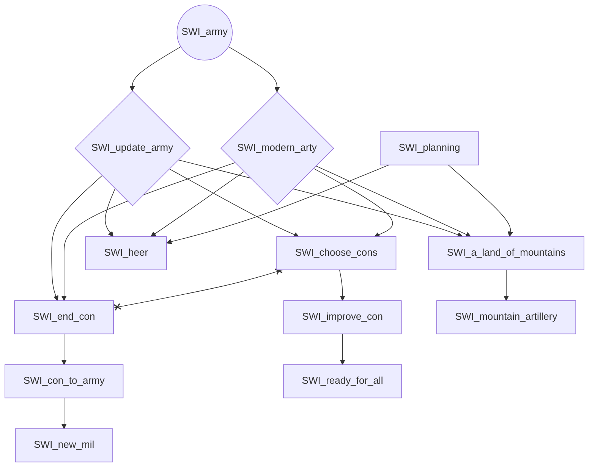
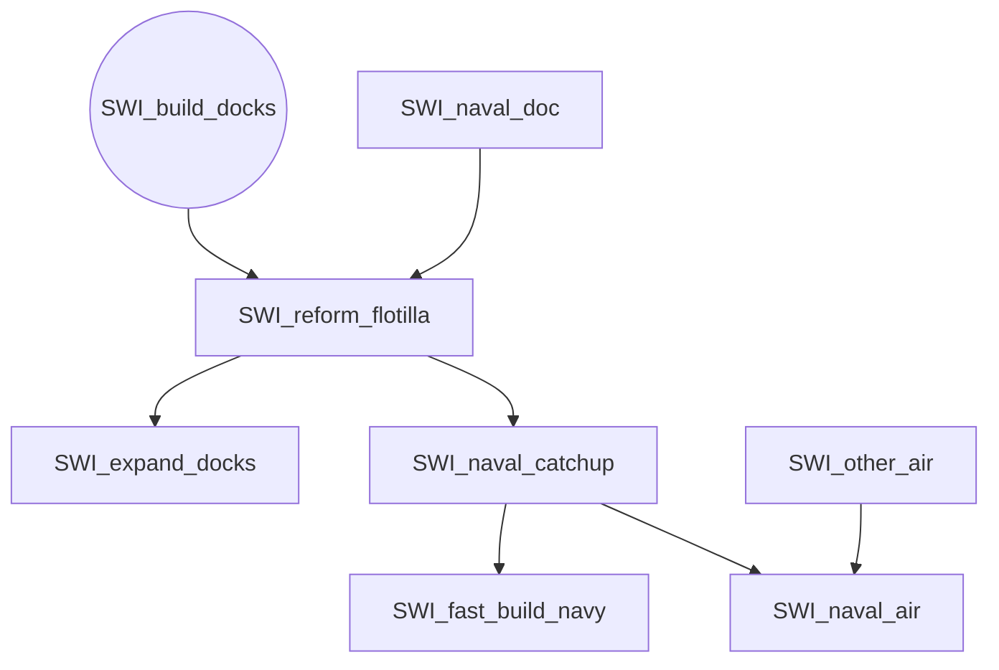
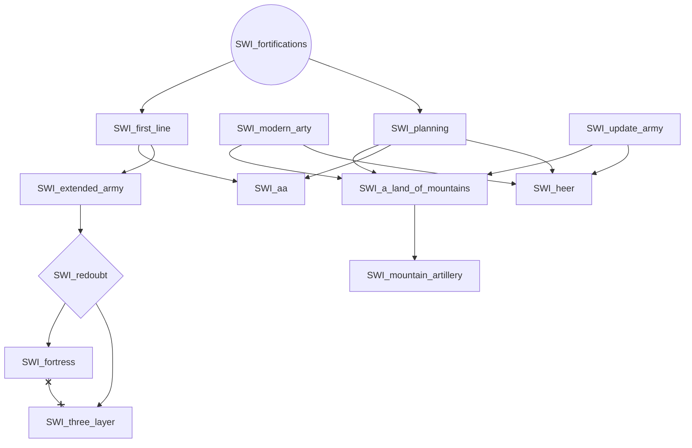
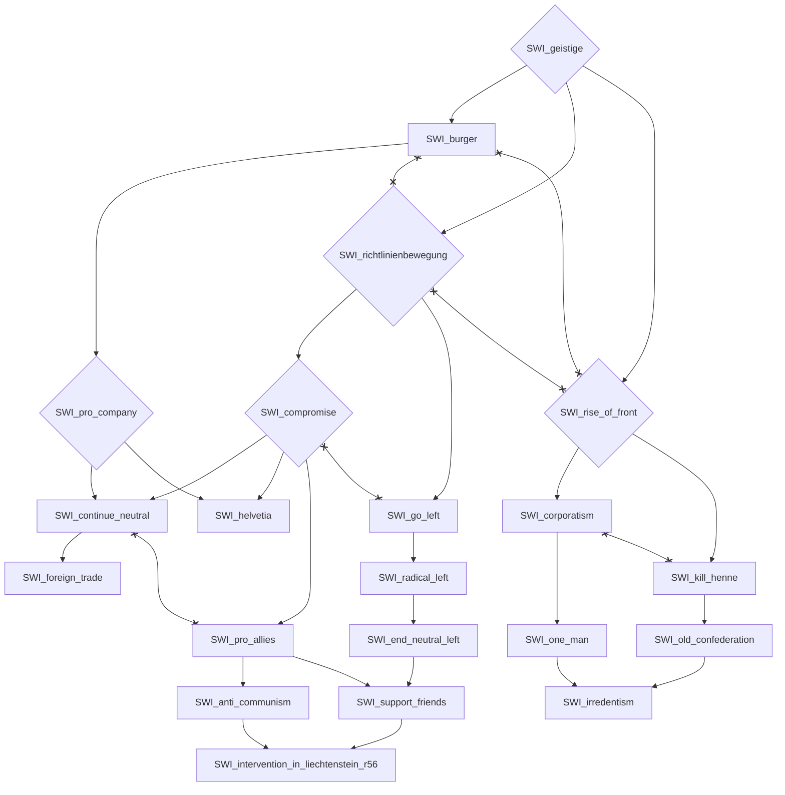
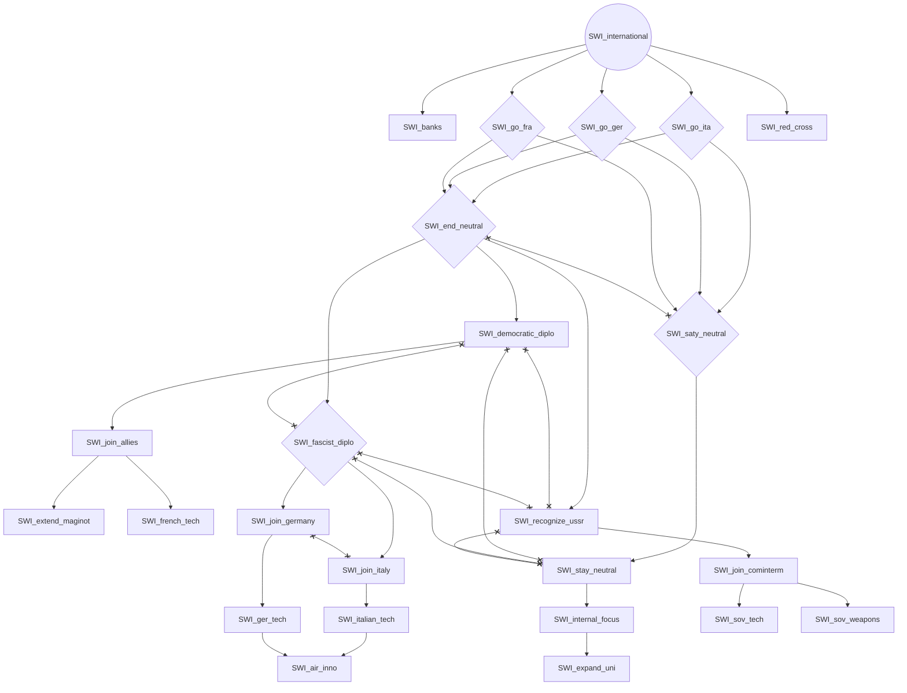
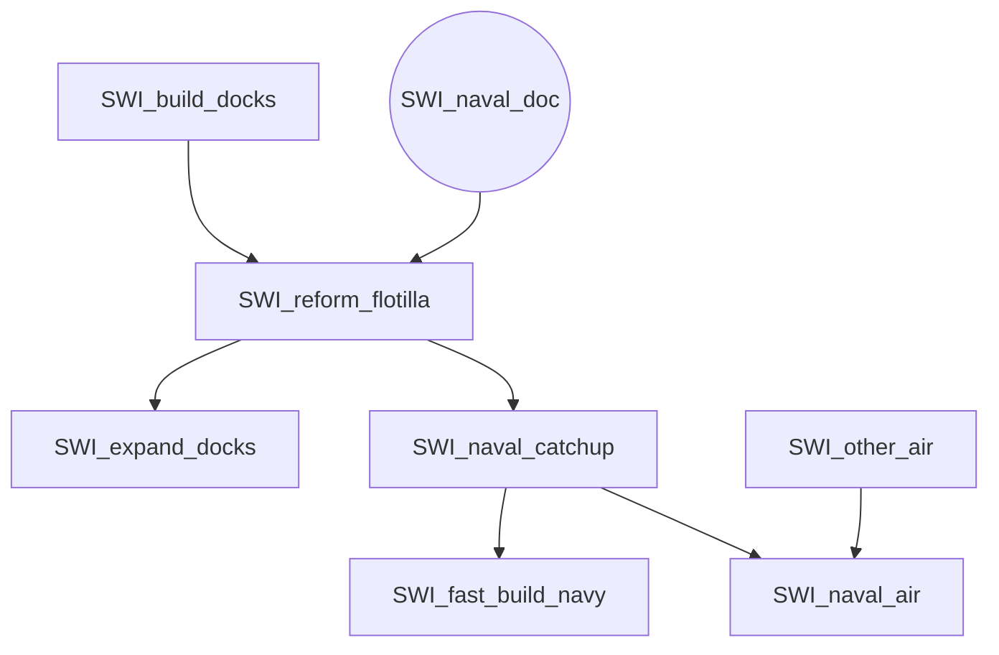
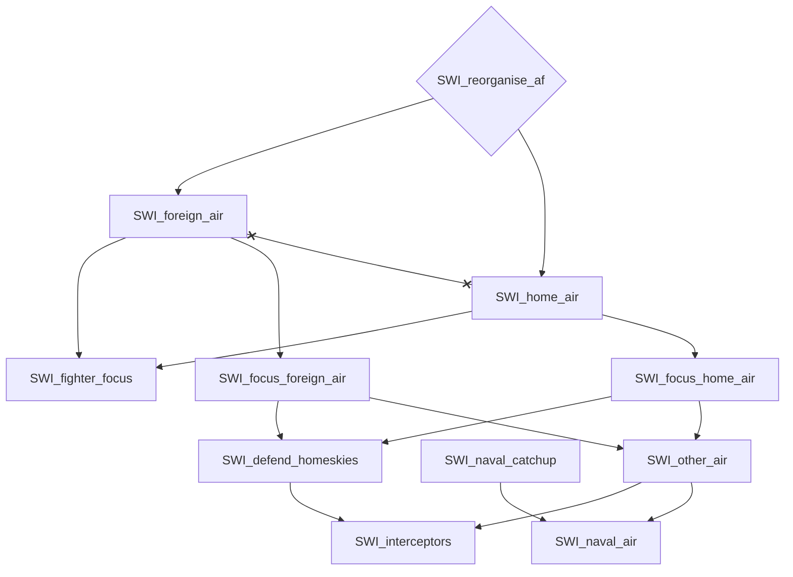
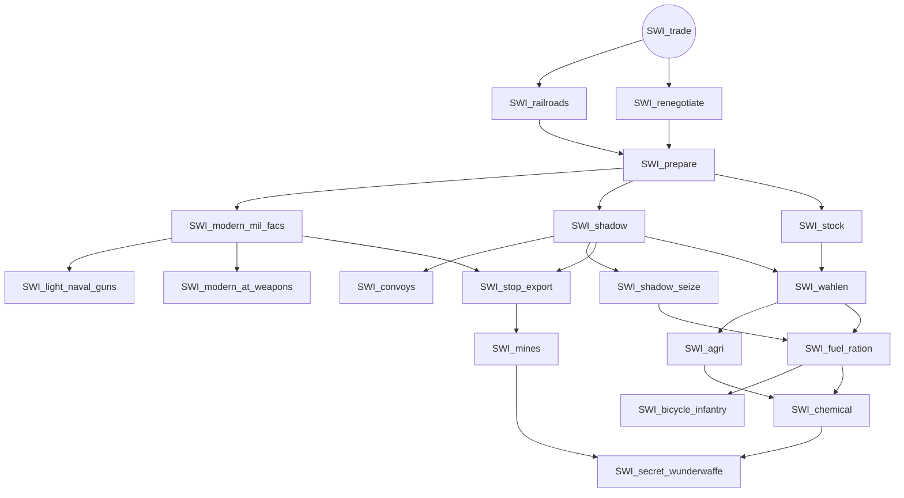

# SWI_army

```mermaid
flowchart TD
    n1["SWI_a_land_of_mountains"]
    n2(("SWI_army"))
    n3["SWI_choose_cons"]
    n4["SWI_con_to_army"]
    n5["SWI_end_con"]
    n6["SWI_heer"]
    n7["SWI_improve_con"]
    n8{"SWI_modern_arty"}
    n9["SWI_mountain_artillery"]
    n10["SWI_new_mil"]
    n11["SWI_planning"]
    n12["SWI_ready_for_all"]
    n13{"SWI_update_army"}
    n13 --> n1
    n8 --> n1
    n11 --> n1
    n13 --> n3
    n8 --> n3
    n5 --> n4
    n13 --> n5
    n8 --> n5
    n13 --> n6
    n8 --> n6
    n11 --> n6
    n3 --> n7
    n2 --> n8
    n1 --> n9
    n4 --> n10
    n7 --> n12
    n2 --> n13
    n3 x--x n5
```

# SWI_build_docks

```mermaid
flowchart TD
    n14(("SWI_build_docks"))
    n15["SWI_expand_docks"]
    n16["SWI_fast_build_navy"]
    n17["SWI_naval_air"]
    n18["SWI_naval_catchup"]
    n19["SWI_naval_doc"]
    n20["SWI_other_air"]
    n21["SWI_reform_flotilla"]
    n21 --> n15
    n18 --> n16
    n18 --> n17
    n20 --> n17
    n21 --> n18
    n14 --> n21
    n19 --> n21
```

# SWI_fortifications

```mermaid
flowchart TD
    n1["SWI_a_land_of_mountains"]
    n22["SWI_aa"]
    n23["SWI_extended_army"]
    n24["SWI_first_line"]
    n25(("SWI_fortifications"))
    n26["SWI_fortress"]
    n6["SWI_heer"]
    n8["SWI_modern_arty"]
    n9["SWI_mountain_artillery"]
    n11["SWI_planning"]
    n27{"SWI_redoubt"}
    n28["SWI_three_layer"]
    n13["SWI_update_army"]
    n13 --> n1
    n8 --> n1
    n11 --> n1
    n11 --> n22
    n24 --> n22
    n24 --> n23
    n25 --> n24
    n27 --> n26
    n13 --> n6
    n8 --> n6
    n11 --> n6
    n1 --> n9
    n25 --> n11
    n23 --> n27
    n27 --> n28
    n26 x--x n28
```

# SWI_geistige

```mermaid
flowchart TD
    n29["SWI_anti_communism"]
    n30["SWI_burger"]
    n31{"SWI_compromise"}
    n32["SWI_continue_neutral"]
    n33["SWI_corporatism"]
    n34["SWI_end_neutral_left"]
    n35["SWI_foreign_trade"]
    n36{"SWI_geistige"}
    n37["SWI_go_left"]
    n38["SWI_helvetia"]
    n39["SWI_intervention_in_liechtenstein_r56"]
    n40["SWI_irredentism"]
    n41["SWI_kill_henne"]
    n42["SWI_old_confederation"]
    n43["SWI_one_man"]
    n44["SWI_pro_allies"]
    n45{"SWI_pro_company"}
    n46["SWI_radical_left"]
    n47{"SWI_richtlinienbewegung"}
    n48{"SWI_rise_of_front"}
    n49["SWI_support_friends"]
    n44 --> n29
    n36 --> n30
    n47 --> n31
    n31 --> n32
    n45 --> n32
    n48 --> n33
    n46 --> n34
    n32 --> n35
    n47 --> n37
    n31 --> n38
    n45 --> n38
    n49 --> n39
    n29 --> n39
    n42 --> n40
    n43 --> n40
    n48 --> n41
    n41 --> n42
    n33 --> n43
    n31 --> n44
    n30 --> n45
    n37 --> n46
    n36 --> n47
    n36 --> n48
    n34 --> n49
    n44 --> n49
    n30 x--x n47
    n30 x--x n48
    n31 x--x n37
    n32 x--x n44
    n33 x--x n41
    n47 x--x n48
```

# SWI_international

```mermaid
flowchart TD
    n50["SWI_air_inno"]
    n51["SWI_banks"]
    n52["SWI_democratic_diplo"]
    n53{"SWI_end_neutral"}
    n54["SWI_expand_uni"]
    n55["SWI_extend_maginot"]
    n56{"SWI_fascist_diplo"}
    n57["SWI_french_tech"]
    n58["SWI_ger_tech"]
    n59{"SWI_go_fra"}
    n60{"SWI_go_ger"}
    n61{"SWI_go_ita"}
    n62["SWI_internal_focus"]
    n63(("SWI_international"))
    n64["SWI_italian_tech"]
    n65["SWI_join_allies"]
    n66["SWI_join_cominterm"]
    n67["SWI_join_germany"]
    n68["SWI_join_italy"]
    n69["SWI_recognize_ussr"]
    n70["SWI_red_cross"]
    n71{"SWI_saty_neutral"}
    n72["SWI_sov_tech"]
    n73["SWI_sov_weapons"]
    n74["SWI_stay_neutral"]
    n64 --> n50
    n58 --> n50
    n63 --> n51
    n53 --> n52
    n61 --> n53
    n60 --> n53
    n59 --> n53
    n62 --> n54
    n65 --> n55
    n53 --> n56
    n65 --> n57
    n67 --> n58
    n63 --> n59
    n63 --> n60
    n63 --> n61
    n74 --> n62
    n68 --> n64
    n52 --> n65
    n69 --> n66
    n56 --> n67
    n56 --> n68
    n53 --> n69
    n63 --> n70
    n61 --> n71
    n60 --> n71
    n59 --> n71
    n66 --> n72
    n66 --> n73
    n71 --> n74
    n52 x--x n56
    n52 x--x n69
    n52 x--x n74
    n53 x--x n71
    n56 x--x n69
    n56 x--x n74
    n67 x--x n68
    n69 x--x n74
```

# SWI_naval_doc

```mermaid
flowchart TD
    n14["SWI_build_docks"]
    n15["SWI_expand_docks"]
    n16["SWI_fast_build_navy"]
    n17["SWI_naval_air"]
    n18["SWI_naval_catchup"]
    n19(("SWI_naval_doc"))
    n20["SWI_other_air"]
    n21["SWI_reform_flotilla"]
    n21 --> n15
    n18 --> n16
    n18 --> n17
    n20 --> n17
    n21 --> n18
    n14 --> n21
    n19 --> n21
```

# SWI_reorganise_af

```mermaid
flowchart TD
    n75["SWI_defend_homeskies"]
    n76["SWI_fighter_focus"]
    n77["SWI_focus_foreign_air"]
    n78["SWI_focus_home_air"]
    n79["SWI_foreign_air"]
    n80["SWI_home_air"]
    n81["SWI_interceptors"]
    n17["SWI_naval_air"]
    n18["SWI_naval_catchup"]
    n20["SWI_other_air"]
    n82{"SWI_reorganise_af"}
    n77 --> n75
    n78 --> n75
    n79 --> n76
    n80 --> n76
    n79 --> n77
    n80 --> n78
    n82 --> n79
    n82 --> n80
    n75 --> n81
    n20 --> n81
    n18 --> n17
    n20 --> n17
    n77 --> n20
    n78 --> n20
    n79 x--x n80
```

# SWI_trade

```mermaid
flowchart TD
    n83["SWI_agri"]
    n84["SWI_bicycle_infantry"]
    n85["SWI_chemical"]
    n86["SWI_convoys"]
    n87["SWI_fuel_ration"]
    n88["SWI_light_naval_guns"]
    n89["SWI_mines"]
    n90["SWI_modern_at_weapons"]
    n91["SWI_modern_mil_facs"]
    n92["SWI_prepare"]
    n93["SWI_railroads"]
    n94["SWI_renegotiate"]
    n95["SWI_secret_wunderwaffe"]
    n96["SWI_shadow"]
    n97["SWI_shadow_seize"]
    n98["SWI_stock"]
    n99["SWI_stop_export"]
    n100(("SWI_trade"))
    n101["SWI_wahlen"]
    n101 --> n83
    n87 --> n84
    n83 --> n85
    n87 --> n85
    n96 --> n86
    n97 --> n87
    n101 --> n87
    n91 --> n88
    n99 --> n89
    n91 --> n90
    n92 --> n91
    n94 --> n92
    n93 --> n92
    n100 --> n93
    n100 --> n94
    n85 --> n95
    n89 --> n95
    n92 --> n96
    n96 --> n97
    n92 --> n98
    n96 --> n99
    n91 --> n99
    n96 --> n101
    n98 --> n101
```
