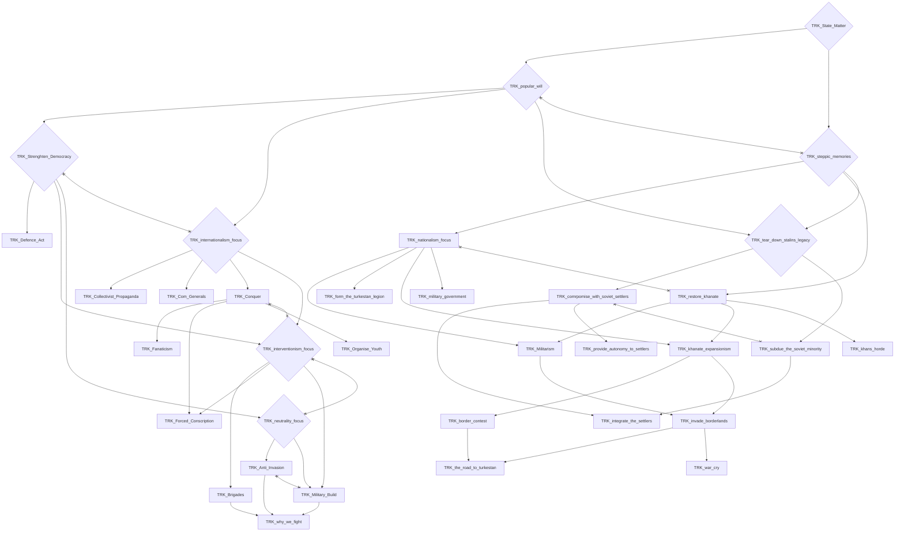
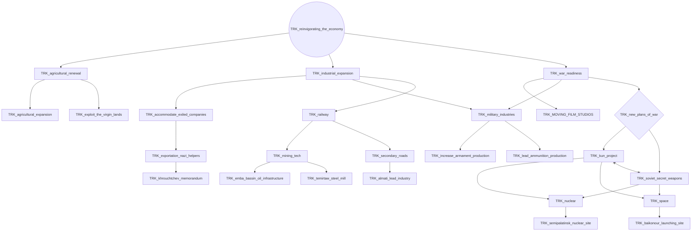
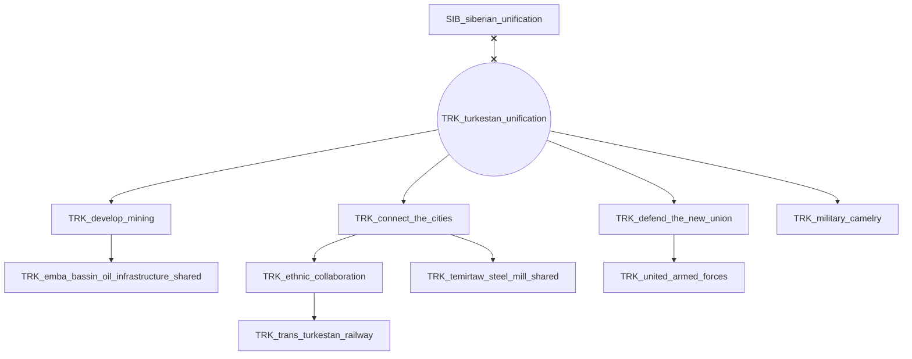

# TRK_State_Matter

```mermaid
flowchart TD
    n1["TRK_Anti_Invasion"]
    n2["TRK_Brigades"]
    n3["TRK_Collectivist_Propaganda"]
    n4["TRK_Com_Generals"]
    n5["TRK_Conquer"]
    n6["TRK_Defence_Act"]
    n7["TRK_Fanaticism"]
    n8["TRK_Forced_Conscription"]
    n9["TRK_Militarism"]
    n10["TRK_Military_Build"]
    n11["TRK_Organise_Youth"]
    n12{"TRK_State_Matter"}
    n13{"TRK_Strenghten_Democracy"}
    n14["TRK_border_contest"]
    n15["TRK_comrpomise_with_soviet_settlers"]
    n16["TRK_form_the_turkestan_legion"]
    n17["TRK_integrate_the_settlers"]
    n18{"TRK_internationalism_focus"}
    n19{"TRK_interventionism_focus"}
    n20["TRK_invade_borderlands"]
    n21["TRK_khanate_expansionism"]
    n22["TRK_khans_horde"]
    n23["TRK_military_government"]
    n24["TRK_nationalism_focus"]
    n25{"TRK_neutrality_focus"}
    n26{"TRK_popular_will"}
    n27["TRK_provide_autonomy_to_settlers"]
    n28["TRK_restore_khanate"]
    n29{"TRK_steppic_memories"}
    n30["TRK_subdue_the_soviet_minority"]
    n31{"TRK_tear_down_stalins_legacy"}
    n32["TRK_the_road_to_turkestan"]
    n33["TRK_war_cry"]
    n34["TRK_why_we_fight"]
    n25 --> n1
    n19 --> n2
    n18 --> n3
    n18 --> n4
    n18 --> n5
    n13 --> n6
    n5 --> n7
    n5 --> n8
    n19 --> n8
    n24 --> n9
    n28 --> n9
    n25 --> n10
    n19 --> n10
    n5 --> n11
    n26 --> n13
    n21 --> n14
    n31 --> n15
    n24 --> n16
    n30 --> n17
    n15 --> n17
    n26 --> n18
    n13 --> n19
    n18 --> n19
    n21 --> n20
    n9 --> n20
    n28 --> n21
    n24 --> n21
    n28 --> n22
    n24 --> n23
    n29 --> n24
    n13 --> n25
    n12 --> n26
    n15 --> n27
    n29 --> n28
    n12 --> n29
    n31 --> n30
    n29 --> n31
    n26 --> n31
    n14 --> n32
    n20 --> n32
    n20 --> n33
    n1 --> n34
    n10 --> n34
    n2 --> n34
    n1 x--x n10
    n5 x--x n19
    n13 x--x n18
    n15 x--x n30
    n19 x--x n25
    n24 x--x n28
    n26 x--x n29
```

# TRK_reinvigorating_the_economy

```mermaid
flowchart TD
    n35["TRK_MOVING_FILM_STUDIOS"]
    n36["TRK_accommodate_exiled_companies"]
    n37["TRK_agricultural_expansion"]
    n38["TRK_agricultural_renewal"]
    n39["TRK_almati_lead_industry"]
    n40["TRK_baikonour_launching_site"]
    n41["TRK_emba_bassin_oil_infrastructure"]
    n42["TRK_exploit_the_virgin_lands"]
    n43["TRK_exportation_nazi_helpers"]
    n44["TRK_increase_armament_production"]
    n45["TRK_industrial_expansion"]
    n46["TRK_khrouchtchev_memorandum"]
    n47["TRK_kun_project"]
    n48["TRK_lead_ammunition_production"]
    n49["TRK_military_industries"]
    n50["TRK_mining_tech"]
    n51{"TRK_new_plans_of_war"}
    n52["TRK_nuclear"]
    n53["TRK_railway"]
    n54(("TRK_reinvigorating_the_economy"))
    n55["TRK_secondary_roads"]
    n56["TRK_semipalatinsk_nuclear_site"]
    n57["TRK_soviet_secret_weapons"]
    n58["TRK_space"]
    n59["TRK_temirtaw_steel_mill"]
    n60["TRK_war_readiness"]
    n60 --> n35
    n45 --> n36
    n38 --> n37
    n54 --> n38
    n55 --> n39
    n58 --> n40
    n50 --> n41
    n38 --> n42
    n36 --> n43
    n49 --> n44
    n54 --> n45
    n43 --> n46
    n51 --> n47
    n49 --> n48
    n45 --> n49
    n60 --> n49
    n53 --> n50
    n60 --> n51
    n57 --> n52
    n47 --> n52
    n45 --> n53
    n53 --> n55
    n52 --> n56
    n51 --> n57
    n57 --> n58
    n47 --> n58
    n50 --> n59
    n54 --> n60
    n47 x--x n57
```

# TRK_turkestan_unification

```mermaid
flowchart TD
    n61["SIB_siberian_unification"]
    n62["TRK_connect_the_cities"]
    n63["TRK_defend_the_new_union"]
    n64["TRK_develop_mining"]
    n65["TRK_emba_bassin_oil_infrastructure_shared"]
    n66["TRK_ethnic_collaboration"]
    n67["TRK_military_camelry"]
    n68["TRK_temirtaw_steel_mill_shared"]
    n69["TRK_trans_turkestan_railway"]
    n70(("TRK_turkestan_unification"))
    n71["TRK_united_armed_forces"]
    n70 --> n62
    n70 --> n63
    n70 --> n64
    n64 --> n65
    n62 --> n66
    n70 --> n67
    n62 --> n68
    n66 --> n69
    n63 --> n71
    n61 x--x n70
```
